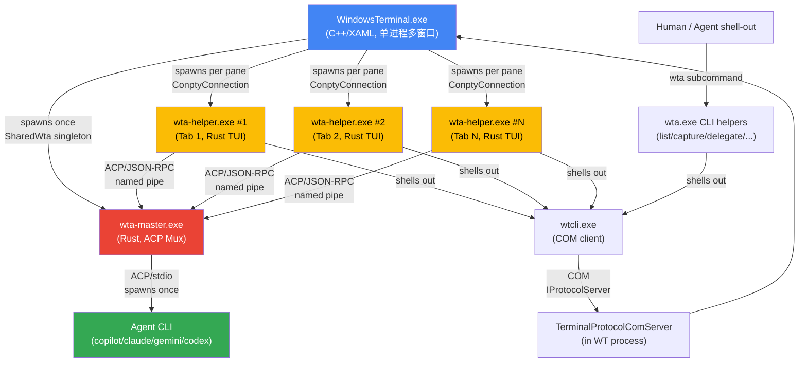
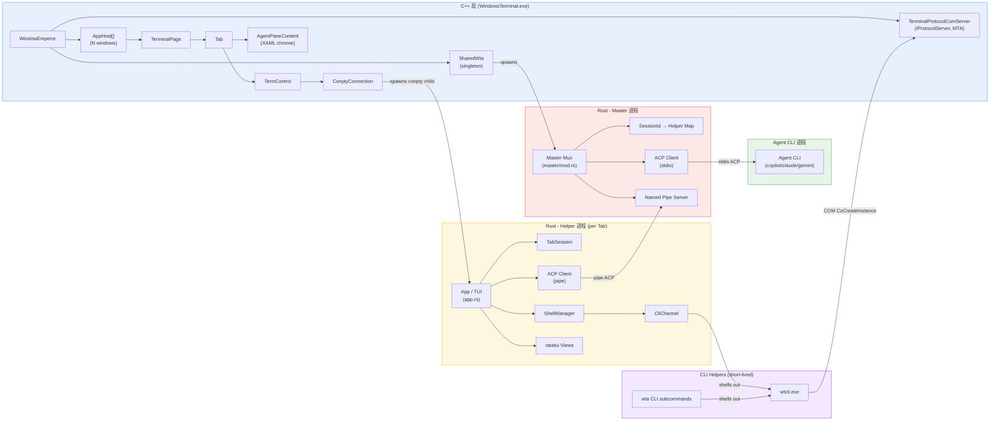
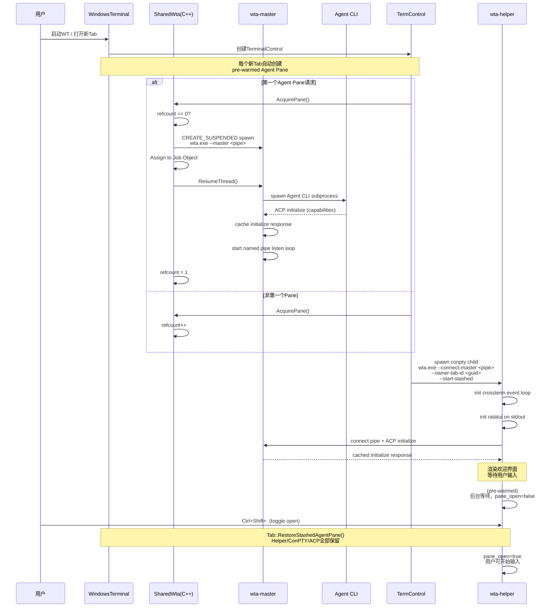
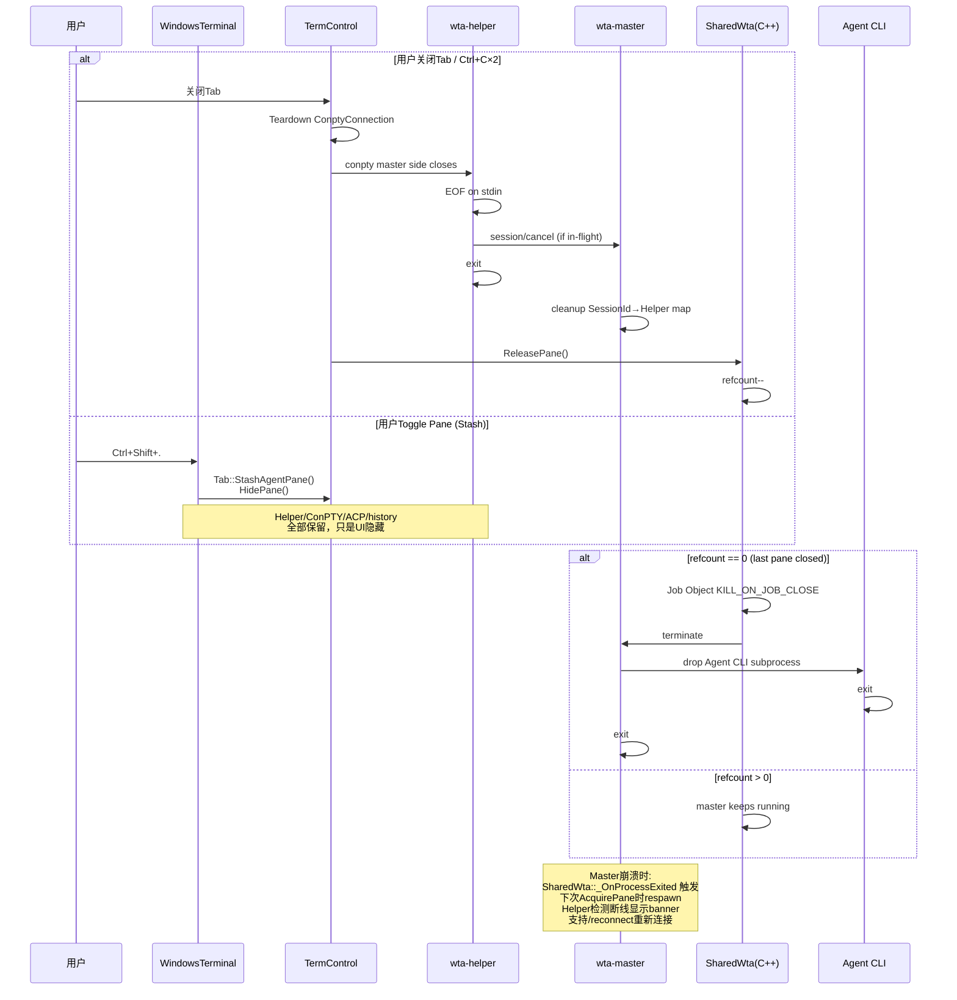

# 第2章 整体架构设计

## 2.1 架构总览（R阶段事实）

Intelligent Terminal（Windows Terminal Fork）是一个 **AI-native** 的终端应用，采用 **Helper+Master 多进程架构**，实现了 AI Agent（Copilot、Claude、Gemini、自定义Agent）与终端工作流的深度集成。

> **R阶段事实来源**：架构基于以下设计文档与源码实现：
> - [external/libs/intelligent-terminal/AGENTS.md](../../../../../../external/libs/intelligent-terminal/AGENTS.md#L47-L92)
> - [external/libs/intelligent-terminal/tools/wta/OVERVIEW.md](../../../../../../external/libs/intelligent-terminal/tools/wta/OVERVIEW.md#L25-L130)
> - [external/libs/intelligent-terminal/doc/specs/Multi-window-agent-pane.md](../../../../../../external/libs/intelligent-terminal/doc/specs/Multi-window-agent-pane.md#L12-L39)

**核心设计原则**：
- **单进程多窗口**：一个 `WindowsTerminal.exe` 进程承载 N 个窗口（`WindowEmperor → AppHost[] → TerminalWindow → TerminalPage`）
- **Master 单例**：每个 Terminal 进程有一个 `wta-master.exe` 单例，负责维护与单个 Agent CLI 的连接
- **Helper  per Tab**：每个 Agent Pane（每个Tab）有一个独立的 `wta-helper.exe` 进程，负责 TUI 渲染和用户交互
- **无自定义协议**：所有通信均采用标准协议（ConPTY、ACP JSON-RPC、COM），不发明自定义二进制格式

**进程数量公式**：`N 个 Agent Pane ⇒ N 个 wta-helper + 1 个 wta-master + 1 个 Agent CLI`

---

## 2.2 Helper+Master 多进程模型深度解析

### 进程清单

| 进程名 | 实现语言 | 主要职责 | 生命周期 |
|--------|----------|----------|----------|
| **WindowsTerminal.exe** | C++/XAML | 窗口管理、UI渲染、COM服务器、进程调度 | 用户启动，长期运行 |
| **wta-master.exe** | Rust | ACP多路复用器、Agent CLI生命周期管理、命名管道服务、Session路由 | SharedWta单例延迟spawn，最后一个Pane关闭时销毁 |
| **wta-helper.exe** | Rust | Ratatui TUI渲染、TabSession状态管理、用户交互、权限提示、ShellManager | 每个Agent Pane一个，Tab创建时pre-warm，Tab关闭时销毁 |
| **Agent CLI** | Node.js/其他 | AI"大脑"：Copilot/Claude/Gemini/Codex等，ACP协议服务端 | wta-master启动时spawn一次，所有Helper共享 |
| **wtcli.exe** | C++ | COM客户端：连接IProtocolServer，执行WT操作（列Pane、捕获输出、创建Tab等） | 每次调用（短生命周期），`listen`模式长期运行 |
| **Shell命令** | 各种 | pwsh、cargo、git等实际执行工具的进程 | 用户/Agent spawn，执行完成退出 |

> **来源**：[tools/wta/OVERVIEW.md 进程清单](../../../../../../external/libs/intelligent-terminal/tools/wta/OVERVIEW.md#L233-L257)

### 进程关系图



> **来源**：架构图改编自 [AGENTS.md 架构段](../../../../../../external/libs/intelligent-terminal/AGENTS.md#L49-L62) 和 [OVERVIEW.md 架构图](../../../../../../external/libs/intelligent-terminal/tools/wta/OVERVIEW.md#L104-L130)

**进程拓扑说明**：
- WindowsTerminal 是根进程，内部运行 `WindowEmperor` 管理多窗口
- `SharedWta` 是 C++ 端单例，负责 spawn 和管理 `wta-master` 生命周期（Job Object + 引用计数）
- 每个 `TerminalControl` 通过 `ConptyConnection` spawn 一个 `wta-helper` 作为 conpty 子进程
- Helper 通过命名管道 `\\.\pipe\wta-master-<GUID>` 连接到 Master
- Master 是所有 Helper 和 Agent CLI 之间的唯一桥梁
- WT 操作统一通过 `wtcli.exe → COM` 路径，无其他直接通信

---

## 2.3 技术栈总览

| 技术 | 使用位置 | 主要用途 |
|------|----------|----------|
| **C++** | WindowsTerminal 主体、TerminalProtocolComServer、wtcli.exe | 核心终端渲染、COM服务器实现、Win32 API交互、ConPTY管理 |
| **Rust** | wta-master、wta-helper、wta CLI helpers | WTA业务逻辑、异步运行时（tokio）、ACP协议实现、TUI渲染 |
| **XAML** | Terminal UI层、AgentPaneContent chrome | 声明式UI框架、WinUI 3控件、数据绑定 |
| **COM** | TerminalProtocolComServer、IProtocolServer | 跨进程通信（Local Server）、WinRT IDL定义接口、MBM marshaling |
| **ACP** (Agent Client Protocol) | helper ↔ master、master ↔ Agent CLI | JSON-RPC 2.0 标准Agent通信协议，版本1.3.0 |
| **ConPTY** (Pseudo Console) | TerminalControl ↔ wta-helper | Windows伪控制台，提供完整控制台输入语义（键盘、鼠标、IME、Bracketed Paste） |
| **Ratatui + Crossterm** | wta-helper TUI | Rust终端UI框架、终端输入输出抽象 |
| **Tokio** | wta Rust 侧 | 异步运行时，处理命名管道、stdio、并发任务 |
| **Named Pipe** | Windows | `\\.\pipe\wta-master-<GUID>` 本地跨进程通信 |
| **WinRT IDL** | TerminalProtocol.idl | COM接口定义，生成WinRT投影 |

> **来源**：
> - [tools/wta/OVERVIEW.md 技术栈](../../../../../../external/libs/intelligent-terminal/tools/wta/OVERVIEW.md#L175-L186)
> - [AGENTS.md 核心组件](../../../../../../external/libs/intelligent-terminal/AGENTS.md#L7-L14)

---

## 2.4 核心组件关系图



> **来源**：组件划分基于 [AGENTS.md 关键文件表](../../../../../../external/libs/intelligent-terminal/AGENTS.md#L94-L109) 和 [OVERVIEW.md 核心模块](../../../../../../external/libs/intelligent-terminal/tools/wta/OVERVIEW.md#L134-L149)

**核心组件职责**：

| 组件 | 文件位置 | 核心职责 |
|------|----------|----------|
| WindowEmperor | `src/cascadia/WindowsTerminal/WindowEmperor.cpp` | 多窗口管理、Monarch模式、跨窗口Tab拖拽 |
| SharedWta | `src/cascadia/TerminalApp/SharedWta.cpp` | Master进程单例管理、引用计数、Job Object、崩溃检测 |
| TerminalProtocolComServer | `src/cascadia/WindowsTerminal/TerminalProtocolComServer.cpp` | COM进程外服务器、MTA线程、事件分发 |
| Master Mux | `tools/wta/src/master/mod.rs` | ACP多路复用、Session路由、Agent CLI生命周期 |
| App/TUI | `tools/wta/src/app.rs` | TUI状态机、事件循环、会话管理、Autofix状态机 |
| CliChannel | `tools/wta/src/shell/wt_channel/cli_channel.rs` | wtcli.exe封装、所有WT操作的唯一出口 |
| ACP Client | `tools/wta/src/protocol/acp/client.rs` | Agent CLI客户端、Helper端WtaClient、Prompt模板 |

---

## 2.5 进程生命周期

### 启动流程时序图



> **来源**：生命周期描述基于 [Multi-window-agent-pane.md §6 生命周期](../../../../../../external/libs/intelligent-terminal/doc/specs/Multi-window-agent-pane.md#L330-L412) 和 [AGENTS.md Pre-warming](../../../../../../external/libs/intelligent-terminal/AGENTS.md#L74-L92)

### 关闭流程时序图



> **来源**：关闭流程和崩溃恢复基于 [Multi-window-agent-pane.md §6 Pane close](../../../../../../external/libs/intelligent-terminal/doc/specs/Multi-window-agent-pane.md#L391-L472)

---

## 2.6 为什么选择 Helper+Master 架构（I阶段洞察）

> **🔍 I阶段洞察 - 设计决策分析**
> 本章节为基于源码事实的设计决策推演，明确标注为分析结论而非直接的文档陈述。

### 问题背景：单 Agent 多 Tab 共享的挑战

在 Helper+Master 架构（方案Z）之前，早期架构面临以下核心问题：

**问题1：Tab拖拽丢失Agent状态**
- 跨窗口拖拽Tab时，源窗口Agent Pane销毁，wta进程被杀
- 目标窗口Tab丢失所有Agent上下文、对话历史

**问题2：架构不对称**
- `TerminalProtocolComServer` 是per-process单例，多窗口共享
- 但wta是per-window单例，两个窗口各开Agent Pane会产生两个独立wta进程
- 两个wta都收到ComServer事件，必须通过`tab_sessions`成员过滤，PR #50专门为此添加窗口过滤逻辑

**问题3：资源开销线性增长**
- 每个wta是完整Rust进程（Tokio runtime、tracing、ACP client、Ratatui渲染循环）
- 每个wta还spawn自己的Agent CLI子进程
- 3个Pane ≈ 6个进程 ≈ 100MB+ 内存占用

**问题4：M3-M6实现遇到根本技术障碍**
- M3-M6尝试"单例wta + 匿名管道"方案，通过`DuplicateHandle`编组per-pipe句柄
- 关键障碍：**跨进程ConPTY输入不可行**
  - `CreatePseudoConsole` 不向conpty子进程外暴露slave HANDLE
  - 对端进程只能`ReadFile`原始VT字节，无法获得结构化`INPUT_RECORD`
  - crossterm的`ReadConsoleInputW`解析器无法工作
  - 需要手写VT→KeyEvent解析器，无法支持方向键、Ctrl组合、Tab、IME、Bracketed Paste、鼠标

> **来源**：问题陈述见 [Multi-window-agent-pane.md §问题背景](../../../../../../external/libs/intelligent-terminal/doc/specs/Multi-window-agent-pane.md#L108-L140)，M3-M6技术障碍见 [§设计历史](../../../../../../external/libs/intelligent-terminal/doc/specs/Multi-window-agent-pane.md#L41-L106)

### 方案对比

| 方案 | 描述 | 评估结论 |
|------|------|----------|
| **方案A：跨进程ConPTY输入** | 单例wta通过DuplicateHandle的conpty slave HANDLE调用ReadConsoleInputW | **❌ 不可行**。CreatePseudoConsole不暴露slave HANDLE给子进程外，经MSDN、Windows源码、EchoCon样本、Alacritty/Wezterm/conpty-rs多方验证，无项目实现过跨进程conpty输入 |
| **方案B：单例+匿名管道+手写VT解析** | 单例wta + 匿名管道 + vte级手写VT解析器 | **⚠️ 可行但技术债高**。~3-5天交付可用解析器，但需要持续扩展才能支持IME/Bracketed Paste/鼠标；自定义事件协议、自定义解析器、自定义per-pane writer任务、自定义resize消息，持续累积维护成本 |
| **方案Z：Helper+Master（选中）** | per-pane wta-helper作为conpty子进程 + per-process wta-master单例多路复用 | **✅ 选中**。复用90%现有wta代码；丢弃~1500 LOC M3-M6自定义层；~11-16天交付 |

> **来源**：方案对比见 [Multi-window-agent-pane.md §方案评估表](../../../../../../external/libs/intelligent-terminal/doc/specs/Multi-window-agent-pane.md#L59-L66)

### 设计决策理由（I阶段洞察）

**1. 崩溃隔离**
> Helper是独立进程，一个Helper崩溃只影响单个Tab的Pane，其他Pane继续正常工作。这是"故障域隔离"原则的典型应用——进程边界是最可靠的故障隔离边界。Master崩溃时所有Helper受影响，但Master是无UI的简单多路复用器，崩溃面远小于带TUI的完整wta。

**2. 资源共享**
> Agent CLI（尤其是Claude/Copilot等npx冷启动的适配器）启动开销大（30s+）。Master单例spawn一次Agent CLI，所有Helper共享一个ACP连接，通过SessionId多路复用。这将Agent CLI冷启动成本从per-pane摊销到per-process，典型用户场景（≤5个Pane）下节省显著资源。

**3. 会话独立**
> 每个Helper拥有独立`TabSession`（聊天历史、turn状态、autofix状态、输入编辑器），状态完全隔离不共享。这天然匹配Tab的独立语义——每个Tab一个对话，互不干扰。Master无状态（只做路由），无聊天历史、无渲染状态，简单可靠。

**4. 延迟优化：Pre-warming机制**
> 每个Tab创建时立即spawn一个`--start-stashed`的Helper（后台pre-warm），ACP握手在后台完成，用户首次打开Pane时无需等待Helper启动和Agent连接。这是"延迟隐藏"的经典优化——将用户不可感知的等待移到后台。Toggle操作是stash/restore而非destroy/create，Helper+ConPTY+ACP+chat history全部保留，零延迟切换。

**5. Win32抽象复用**
> Helper作为conpty子进程是WT已有模式（所有其他Pane都这样做），免费获得几十年控制台生态积累：crossterm按键解析、IME、Bracketed Paste、鼠标SGR。无需手写解析器，无新协议设计——Helper↔Master直接用双方已支持的ACP JSON-RPC。

**6. 架构可演进性**
> 未来扩展（per-pane不同Agent、per-pane沙箱、per-pane资源限制）都自然支持——无非是"给Helper不同cmdline参数"或"Master spawn第二个Agent CLI"。线协议已具备扩展性。

> **🔍 I阶段洞察来源**：选择理由基于 [Multi-window-agent-pane.md §Z选择理由](../../../../../../external/libs/intelligent-terminal/doc/specs/Multi-window-agent-pane.md#L67-L88) 的事实陈述，结合分布式系统设计原则推演。

---

## 2.7 架构演进历史

Intelligent Terminal的Agent架构经历了从单进程到Helper+Master的清晰演进路径：

| 里程碑 | 阶段 | 架构特征 | 关键变化 |
|--------|------|----------|----------|
| **初始版本** | Pre-M3 | per-window单wta进程 | 每个窗口一个wta，独立spawn Agent CLI；多窗口时多wta进程互相干扰 |
| **M3-M6** | 单例wta尝试 | SharedWta单例 + 匿名管道 + per-pane writer task | 引入SharedWta单例、Job Object、崩溃检测、引用计数；尝试通过DuplicateHandle实现跨Pane共享；最终因ConPTY输入障碍转向Z方案 |
| **Z-M1** | Master模式实现 | wta-master命名管道服务、ACP muxer | 新增`src/master/mod.rs`，实现named pipe listener、SessionId路由、initialize缓存 |
| **Z-M2** | Helper模式实现 | wta-helper连接master | ACP client支持pipe传输，复用现有TUI/App/TabSession代码 |
| **Z-M3** | C++侧迁移 | SharedWta spawn master，ConptyConnection spawn helper | 删除AgentPipeConnection，Helper成为标准conpty子进程 |
| **Z-M4** | 代码清理 | 删除M3-M6废弃层 | 删除~1500 LOC：AgentPipeConnection、internal_control事件族、pane_registry、BufferedWriter、conpty_handle等 |
| **Z-M6 (Ship)** | Helper+Master成为唯一架构 | 删除legacy路径，默认启用 | 删除`aiIntegration.sharedWtaProcess`设置，删除legacy spawn路径，Helper+Master成为唯一运行时模型 |
| **Post-Z (B12-B20)** | 多窗口路由硬化 | per-tab + per-window严格事件路由 | 实现`owner_tab_id`/`window_id`路由键、switch_tab_session owner-lock、tab_renamed跨窗口拖拽rekey |
| **Post-Z (B4-B11)** | Stash/Restore替代Destroy | Agent Pane toggle = stash而非destroy | Tab::StashAgentPane/RestoreStashedAgentPane，Helper/ConPTY/ACP/history跨toggle保留 |

> **来源**：演进历史基于 [Multi-window-agent-pane.md §设计历史](../../../../../../external/libs/intelligent-terminal/doc/specs/Multi-window-agent-pane.md#L41-L106) 和 [§实现计划](../../../../../../external/libs/intelligent-terminal/doc/specs/Multi-window-agent-pane.md#L694-L818)

**架构演进中的保留资产**：
M3-M6的工作并非全部浪费，以下组件直接复用于Z方案：
- `SharedWta` 单例 + Job Object  containment + 崩溃检测 + 引用计数（从spawn headless改为spawn master）
- `TerminalProtocolComServer` 多窗口事件注册
- GPO `AllowedAgents` 策略检查、设置通过cmdline传播
- Closed-handler引用计数纪律
- 所有wta TUI代码（ui/*、event.rs、app.rs渲染和聊天状态机）在Helper中原样保留

---

## 2.8 数据流总览

### 高层数据流（用户提示端到端）

```mermaid
flowchart LR
    A[用户输入提示<br/>Enter] --> B[wta-helper<br/>TabSession]
    B --> C{已有SessionId?}
    C -->|No| D[ACP session/new<br/>→ master]
    D --> E[master forward<br/>→ Agent CLI]
    E --> F[Agent CLI返回<br/>新SessionId]
    F --> G[master记录<br/>SessionId→Helper map]
    G --> H[响应返回Helper]
    C -->|Yes| I
    H --> I[ACP session/prompt<br/>SessionId + text → master]
    I --> J[master forward<br/>→ Agent CLI on shared connection]
    J --> K[Agent CLI处理<br/>LLM推理/工具调用]
    K --> L[ACP session/update chunks<br/>stream to master]
    L --> M[master按SessionId<br/>lookup owning Helper]
    M --> N[chunk route → Helper pipe]
    N --> O[Helper更新<br/>TabSession.messages]
    O --> P[ratatui re-render<br/>TUI更新]
    
    K --> Q{Agent需要<br/>执行终端操作?}
    Q -->|Yes| R[Agent shells out<br/>wta/wtcli subcommand]
    R --> S[wtcli.exe<br/>COM IProtocolServer]
    S --> T[TerminalProtocolComServer<br/>in WT process]
    T --> U[WT执行操作<br/>create_tab/send_input/...]
    U --> V[操作结果返回wtcli]
    V --> W[结果返回Agent CLI]
    Q -->|No| X[继续streaming response]
    W --> K
    X --> L
    
    style A fill:#4285F4,color:#fff
    style K fill:#34A853,color:#fff
    style T fill:#EA4335,color:#fff
    style P fill:#FBBC05,color:#000
```



> **来源**：数据流基于 [Multi-window-agent-pane.md §Per-tab session creation](../../../../../../external/libs/intelligent-terminal/doc/specs/Multi-window-agent-pane.md#L374-L389) 和 [AGENTS.md Autofix pipeline](../../../../../../external/libs/intelligent-terminal/AGENTS.md#L111-L128)

### Autofix数据流（被动检测）

```
Shell (pwsh)
    ↓ OSC 133;D;<exit_code>  (shell integration marks)
TerminalPage
    ↓ ProtocolVtSequenceReceived event
TerminalProtocolComServer
    ↓ COM event forward
wta-helper (via wtcli listen --json)
    ↓ classify_wt_event()
    ↓ maybe_trigger_autofix()
    ↓ state == Connected? (pre-warmed session ready?)
    ├─ Yes → ACP prompt with failure context → Agent → 修复建议
    └─ No → drop (cold start race, banner still shows)
```

### 关键数据边界

| 数据类型 | 存储位置 | 生命周期 |
|----------|----------|----------|
| 聊天历史/对话状态 | Helper进程内存（TabSession） | Helper进程生命周期（Tab创建→Tab关闭，跨stash保留） |
| SessionId→Helper映射 | Master进程内存 | Master进程生命周期 |
| Agent能力缓存 | Master进程内存 | Master启动时initialize一次，缓存响应给所有Helper |
| Agent CLI历史/会话 | Agent CLI自身进程/磁盘 | Agent CLI生命周期（Master进程生命周期） |
| WT COM事件 | 无状态，即时路由 | 即发即弃 |
| 日志（结构化tracing） | `%LocalCache%\IntelligentTerminal\logs\<pkgver>\` | per-version目录，3天轮转 |

> **日志布局来源**：[AGENTS.md 日志与运行时数据布局](../../../../../../external/libs/intelligent-terminal/AGENTS.md#L178-L288)

---

## 章节导航

- [上一章：项目概述与快速开始](01-overview.md)
- [返回目录](README.md)
- [下一章：WTA Master 多路复用器](03-wta-master.md)
