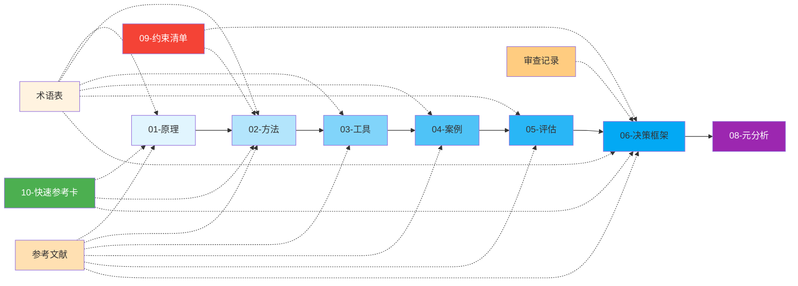

# LLM Token 优化

> 本目录系统化整理大语言模型 Token 优化的理论基础、实践方法、工具链、案例研究、评估体系与决策框架，帮助开发者在成本、性能、效果之间找到最佳平衡点。

<!-- README_INDEX_START -->
## 📄 文档索引

### 01-原理
| 文件 | 说明 |
|------|------|
| [01-principles/00-facts.md](01-principles/00-facts.md) | Token优化核心事实与数据 |
| [01-principles/01-first-principles.md](01-principles/01-first-principles.md) | Token优化第一性原理分析 |
| [01-principles/README.md](01-principles/README.md) | 原理模块概览 |

### 02-方法
| 文件 | 说明 |
|------|------|
| [02-methods/00-methods-overview.md](02-methods/00-methods-overview.md) | Token优化方法全景概览 |
| [02-methods/01-prompt-engineering.md](02-methods/01-prompt-engineering.md) | 提示词工程优化方法 |
| [02-methods/02-context-compression.md](02-methods/02-context-compression.md) | 上下文压缩技术 |
| [02-methods/03-fine-tuning-distillation.md](02-methods/03-fine-tuning-distillation.md) | 微调与知识蒸馏 |
| [02-methods/04-inference-caching.md](02-methods/04-inference-caching.md) | 推理缓存技术 |
| [02-methods/05-dialog-management.md](02-methods/05-dialog-management.md) | 对话历史管理策略 |
| [02-methods/README.md](02-methods/README.md) | 方法模块概览 |

### 03-工具
| 文件 | 说明 |
|------|------|
| [03-tools/01-tool-survey.md](03-tools/01-tool-survey.md) | Token优化工具链调研 |
| [03-tools/README.md](03-tools/README.md) | 工具模块概览 |

### 04-案例
| 文件 | 说明 |
|------|------|
| [04-cases/01-case-studies.md](04-cases/01-case-studies.md) | 真实场景Token优化案例 |
| [04-cases/README.md](04-cases/README.md) | 案例模块概览 |

### 05-评估
| 文件 | 说明 |
|------|------|
| [05-evaluation/01-metrics-framework.md](05-evaluation/01-metrics-framework.md) | Token优化效果评估指标体系 |
| [05-evaluation/README.md](05-evaluation/README.md) | 评估模块概览 |

### 06-决策框架
| 文件 | 说明 |
|------|------|
| [06-decision-framework/00-framework-overview.md](06-decision-framework/00-framework-overview.md) | 决策框架概览 |
| [06-decision-framework/01-decision-tree.md](06-decision-framework/01-decision-tree.md) | Token优化决策树 |
| [06-decision-framework/02-selection-matrix.md](06-decision-framework/02-selection-matrix.md) | 技术选型矩阵 |
| [06-decision-framework/03-patterns.md](06-decision-framework/03-patterns.md) | Token优化最佳实践模式 |
| [06-decision-framework/04-anti-patterns.md](06-decision-framework/04-anti-patterns.md) | 反模式与常见陷阱 |
| [06-decision-framework/05-quick-checklist.md](06-decision-framework/05-quick-checklist.md) | 快速检查清单 |
| [06-decision-framework/README.md](06-decision-framework/README.md) | 决策框架模块概览 |

### 07-审查记录
| 文件 | 说明 |
|------|------|
| [07-adversarial-review.md](07-adversarial-review.md) | 对抗性审查记录 |

### 08-元分析（新增）
| 文件 | 说明 |
|------|------|
| [08-meta-analysis.md](08-meta-analysis.md) | 知识体系元分析（分类学/演化阶段/核心锚点/阅读策略） |

### 09-约束清单（新增）
| 文件 | 说明 |
|------|------|
| [09-constraints.md](09-constraints.md) | Token优化禁止事项清单（27条禁令，P0-P3分级，约束驱动设计） |

### 附录
| 文件 | 说明 |
|------|------|
| [10-quick-reference.md](10-quick-reference.md) | 快速参考卡（前台视图，3分钟速查） |
| [glossary.md](glossary.md) | 术语表（关键术语解释） |
| [references.md](references.md) | 参考文献汇总（论文/文档/博客/项目） |

<!-- README_INDEX_END -->

## 🧭 知识体系导航

---

## 🎯 三层递进学习路径（概念操作化）

参考竹简悟道项目的"概念操作化三层递进"方法论，将学习路径分为三个层次：

| 层级 | 目标 | 识别信号 | 预计时间 | 核心产出 |
|------|------|---------|---------|---------|
| **第一层：入门（识别问题）** | 理解Token优化基本概念，识别常见浪费点 | 知道O(n²)复杂度是什么，能说出三大路径名称 | 30分钟-2小时 | 能识别明显的token浪费，知道从哪入手 |
| **第二层：深入（掌握方法）** | 系统掌握优化技术，能独立实施优化 | 能根据场景选择合适技术组合，能评估ROI，知道常见陷阱 | 1-2周 | 能完成80%场景的Token优化，成本降低50-70% |
| **第三层：精通（内化为直觉）** | 形成优化直觉，能做架构决策，建立持续优化体系 | 看到系统设计就能预判token瓶颈，能建立完整的监控-优化-验证闭环 | 1-3月 | 能建立企业级Token优化体系，成本降低85-95% |

---

## 🚀 快速入门

### 第一层：入门路径（30分钟-2小时，识别问题）
1. [10-quick-reference.md](10-quick-reference.md) → **3分钟速查卡**（先看这个）
2. [08-meta-analysis.md](08-meta-analysis.md)「三、核心锚点识别法」→ 理解5个核心锚点
3. [01-principles/00-facts.md](01-principles/00-facts.md) → 了解Token优化基本事实
4. [glossary.md](glossary.md) → 查阅关键术语
5. [09-constraints.md](09-constraints.md)「P0级禁令」→ 知道什么绝对不能做

### 第二层：深入路径（1-2周，掌握方法）
1. [01-principles/01-first-principles.md](01-principles/01-first-principles.md) → 掌握第一性原理
2. [02-methods/00-methods-overview.md](02-methods/00-methods-overview.md) → 了解35种方法全景
3. [06-decision-framework/03-patterns.md](06-decision-framework/03-patterns.md) → 学习5个最佳实践模式
4. 按需阅读5个方法文档（提示词/缓存/压缩/微调/对话管理）
5. [06-decision-framework/05-quick-checklist.md](06-decision-framework/05-quick-checklist.md) → 按检查清单实施

### 第三层：精通路径（1-3月，内化为直觉）
1. [03-tools/01-tool-survey.md](03-tools/01-tool-survey.md) → 调研工具链
2. [04-cases/01-case-studies.md](04-cases/01-case-studies.md) → 参考9个跨行业案例
3. [05-evaluation/01-metrics-framework.md](05-evaluation/01-metrics-framework.md) → 建立评估体系
4. [06-decision-framework/01-decision-tree.md](06-decision-framework/01-decision-tree.md) + [02-selection-matrix.md](06-decision-framework/02-selection-matrix.md) → 技术选型
5. [08-meta-analysis.md](08-meta-analysis.md)全文 → 理解知识体系元结构
6. [09-constraints.md](09-constraints.md)全文 → 建立约束意识
7. [references.md](references.md) → 深入阅读原始论文和文档
8. 建立持续监控-优化-验证闭环（参考模式P-001步骤5）

---

## 📋 按角色快速导航

### 架构师/技术负责人路径（技术选型与设计）
1. [08-meta-analysis.md](08-meta-analysis.md)「五、快速理解知识库的阅读策略」
2. [06-decision-framework/00-framework-overview.md](06-decision-framework/00-framework-overview.md) → 理解决策框架
3. [06-decision-framework/01-decision-tree.md](06-decision-framework/01-decision-tree.md) → 使用决策树
4. [06-decision-framework/02-selection-matrix.md](06-decision-framework/02-selection-matrix.md) → 参考选型矩阵
5. [03-tools/01-tool-survey.md](03-tools/01-tool-survey.md) → 调研工具链
6. [09-constraints.md](09-constraints.md) → 建立架构约束

### CTO/技术决策者路径（成本与收益平衡）
1. [01-principles/01-first-principles.md](01-principles/01-first-principles.md) → 理解成本本质
2. [05-evaluation/01-metrics-framework.md](05-evaluation/01-metrics-framework.md) → 建立评估体系
3. [04-cases/01-case-studies.md](04-cases/01-case-studies.md) → 参考行业案例
4. [09-constraints.md](09-constraints.md)「P0/P1级禁令」→ 规避重大风险
5. [07-adversarial-review.md](07-adversarial-review.md) → 审阅对抗性审查

### 实施工程师快速上线路径（立即落地实践）
1. [10-quick-reference.md](10-quick-reference.md) → 快速参考卡
2. [06-decision-framework/05-quick-checklist.md](06-decision-framework/05-quick-checklist.md) → P0检查清单
3. [02-methods/01-prompt-engineering.md](02-methods/01-prompt-engineering.md) → 从提示词优化入手
4. [02-methods/04-inference-caching.md](02-methods/04-inference-caching.md) → 部署缓存策略
5. [09-constraints.md](09-constraints.md)「自查清单」→ 优化前检查

## 🔗 相关资源

- [🏠 返回上级：Learning 知识库](../README.md)
- [📚 文档首页](../../../../README.md)
- [📖 术语表](glossary.md)
- [📚 参考文献](references.md)

---

<!-- created manually on 2026-08-01 -->
