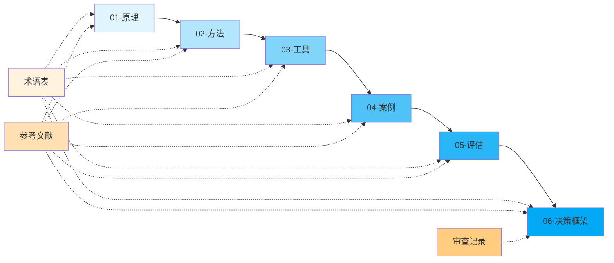

# LLM Token 优化

> 本目录系统化整理大语言模型 Token 优化的理论基础、实践方法、工具链、案例研究、评估体系与决策框架，帮助开发者在成本、性能、效果之间找到最佳平衡点。

<!-- README_INDEX_START -->
## 📄 文档索引

### 01-原理
| 文件 | 说明 |
|------|------|
| [01-principles/00-facts.md](01-principles/00-facts.md) | Token优化核心事实与数据 |
| [01-principles/01-first-principles.md](01-principles/01-first-principles.md) | Token优化第一性原理分析 |
| [01-principles/README.md](01-principles/README.md) | 原理模块概览 |

### 02-方法
| 文件 | 说明 |
|------|------|
| [02-methods/00-methods-overview.md](02-methods/00-methods-overview.md) | Token优化方法全景概览 |
| [02-methods/01-prompt-engineering.md](02-methods/01-prompt-engineering.md) | 提示词工程优化方法 |
| [02-methods/02-context-compression.md](02-methods/02-context-compression.md) | 上下文压缩技术 |
| [02-methods/03-fine-tuning-distillation.md](02-methods/03-fine-tuning-distillation.md) | 微调与知识蒸馏 |
| [02-methods/04-inference-caching.md](02-methods/04-inference-caching.md) | 推理缓存技术 |
| [02-methods/05-dialog-management.md](02-methods/05-dialog-management.md) | 对话历史管理策略 |
| [02-methods/README.md](02-methods/README.md) | 方法模块概览 |

### 03-工具
| 文件 | 说明 |
|------|------|
| [03-tools/01-tool-survey.md](03-tools/01-tool-survey.md) | Token优化工具链调研 |
| [03-tools/README.md](03-tools/README.md) | 工具模块概览 |

### 04-案例
| 文件 | 说明 |
|------|------|
| [04-cases/01-case-studies.md](04-cases/01-case-studies.md) | 真实场景Token优化案例 |
| [04-cases/README.md](04-cases/README.md) | 案例模块概览 |

### 05-评估
| 文件 | 说明 |
|------|------|
| [05-evaluation/01-metrics-framework.md](05-evaluation/01-metrics-framework.md) | Token优化效果评估指标体系 |
| [05-evaluation/README.md](05-evaluation/README.md) | 评估模块概览 |

### 06-决策框架
| 文件 | 说明 |
|------|------|
| [06-decision-framework/00-framework-overview.md](06-decision-framework/00-framework-overview.md) | 决策框架概览 |
| [06-decision-framework/01-decision-tree.md](06-decision-framework/01-decision-tree.md) | Token优化决策树 |
| [06-decision-framework/02-selection-matrix.md](06-decision-framework/02-selection-matrix.md) | 技术选型矩阵 |
| [06-decision-framework/03-patterns.md](06-decision-framework/03-patterns.md) | Token优化最佳实践模式 |
| [06-decision-framework/04-anti-patterns.md](06-decision-framework/04-anti-patterns.md) | 反模式与常见陷阱 |
| [06-decision-framework/05-quick-checklist.md](06-decision-framework/05-quick-checklist.md) | 快速检查清单 |
| [06-decision-framework/README.md](06-decision-framework/README.md) | 决策框架模块概览 |

### 07-审查记录
| 文件 | 说明 |
|------|------|
| [07-adversarial-review.md](07-adversarial-review.md) | 对抗性审查记录 |

### 附录
| 文件 | 说明 |
|------|------|
| [glossary.md](glossary.md) | 术语表（31个关键术语） |
| [references.md](references.md) | 参考文献汇总（论文/文档/博客/项目） |

<!-- README_INDEX_END -->

## 🧭 知识体系导航

## 🚀 快速入门

### 新手入门路径（理解基础概念）
1. [01-principles/00-facts.md](01-principles/00-facts.md) → 了解Token优化基本事实
2. [01-principles/01-first-principles.md](01-principles/01-first-principles.md) → 掌握第一性原理
3. [glossary.md](glossary.md) → 查阅关键术语
4. [02-methods/00-methods-overview.md](02-methods/00-methods-overview.md) → 了解方法全景

### 架构师路径（技术选型与设计）
1. [06-decision-framework/00-framework-overview.md](06-decision-framework/00-framework-overview.md) → 理解决策框架
2. [06-decision-framework/01-decision-tree.md](06-decision-framework/01-decision-tree.md) → 使用决策树
3. [06-decision-framework/02-selection-matrix.md](06-decision-framework/02-selection-matrix.md) → 参考选型矩阵
4. [03-tools/01-tool-survey.md](03-tools/01-tool-survey.md) → 调研工具链
5. [references.md](references.md) → 深入阅读参考文献

### CTO/技术决策者路径（成本与收益平衡）
1. [01-principles/01-first-principles.md](01-principles/01-first-principles.md) → 理解成本本质
2. [05-evaluation/01-metrics-framework.md](05-evaluation/01-metrics-framework.md) → 建立评估体系
3. [04-cases/01-case-studies.md](04-cases/01-case-studies.md) → 参考行业案例
4. [06-decision-framework/04-anti-patterns.md](06-decision-framework/04-anti-patterns.md) → 规避常见陷阱
5. [07-adversarial-review.md](07-adversarial-review.md) → 审阅对抗性审查

### 快速上线路径（立即落地实践）
1. [06-decision-framework/05-quick-checklist.md](06-decision-framework/05-quick-checklist.md) → 使用快速检查清单
2. [02-methods/01-prompt-engineering.md](02-methods/01-prompt-engineering.md) → 从提示词优化入手
3. [02-methods/04-inference-caching.md](02-methods/04-inference-caching.md) → 部署缓存策略
4. [02-methods/05-dialog-management.md](02-methods/05-dialog-management.md) → 优化对话历史
5. [03-tools/01-tool-survey.md](03-tools/01-tool-survey.md) → 选择开箱即用工具

## 🔗 相关资源

- [🏠 返回上级：Learning 知识库](../README.md)
- [📚 文档首页](../../../../README.md)
- [📖 术语表](glossary.md)
- [📚 参考文献](references.md)

---

<!-- created manually on 2026-08-01 -->
