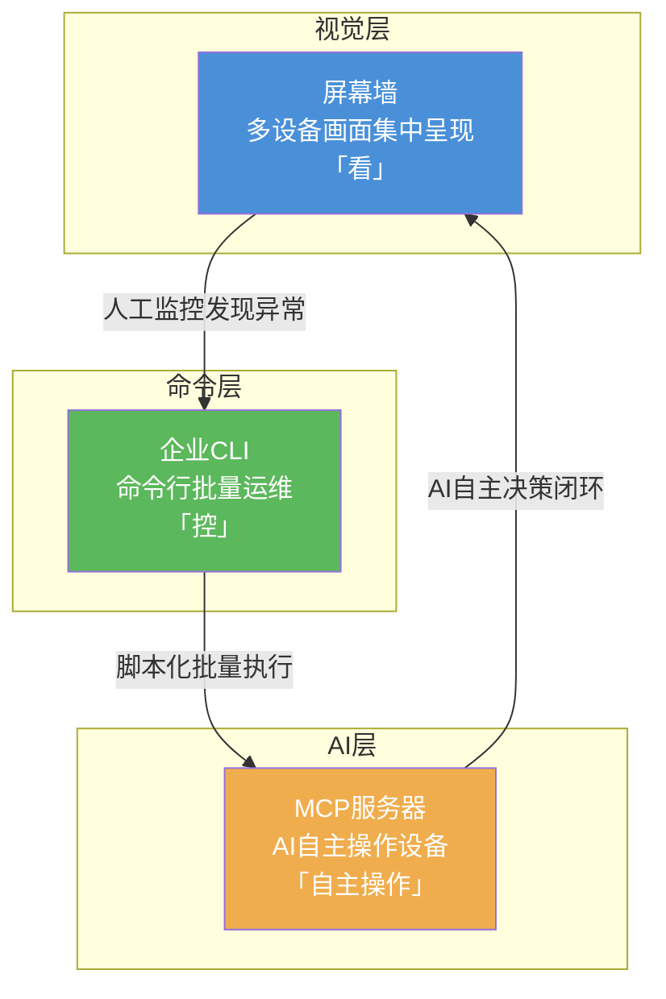
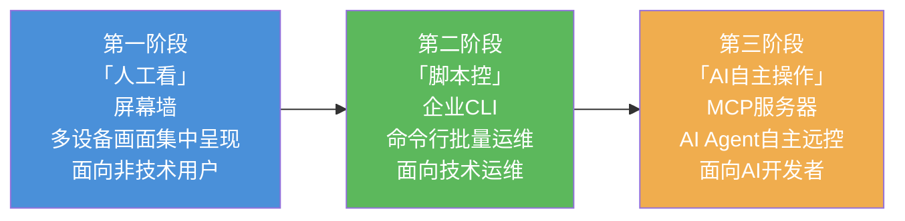

# 向日葵三个服务页面系统性学习与深度洞察分析报告

> **页面1（屏幕墙）**: https://service.oray.com/question/47622.html
> **页面2（企业CLI）**: https://activity.sunlogin.oray.com/cli
> **页面3（MCP配置指南）**: https://service.oray.com/question/50091.html

---

## 📋 目录导航

- [一、报告概述](#一报告概述)
- [二、屏幕墙页面深度分析](#二屏幕墙页面深度分析)
- [三、企业CLI页面深度分析](#三企业cli页面深度分析)
- [四、MCP配置指南页面深度分析](#四mcp配置指南页面深度分析)
- [五、横向对比分析](#五横向对比分析)
- [六、业务逻辑与市场定位洞察](#六业务逻辑与市场定位洞察)
- [七、可借鉴设计理念与用户体验策略](#七可借鉴设计理念与用户体验策略)
- [八、关键发现总结](#八关键发现总结)
- [九、可行性建议](#九可行性建议)
- [十、参考资源](#十参考资源)

---

## 一、报告概述

### 1.1 研究背景

向日葵（Sunlogin）是贝锐（Oray）旗下核心远程控制产品，经过十余年发展已从单一远程桌面工具演进为覆盖个人用户、企业运维、开发者生态的多层次产品矩阵。2026年，随着AI Agent技术的快速发展，向日葵加速向"AI执行基础设施"转型，陆续推出屏幕墙监控、企业CLI命令行工具、AweSun MCP服务器等创新功能，构建了从"人工看"到"脚本控"再到"AI自主操作"的完整能力链路。

### 1.2 三个页面简介

| 页面 | 定位 | 核心受众 | 关键能力 |
|------|------|----------|----------|
| 屏幕墙使用指南 | 可视化多设备监控 | 个人用户/小运维团队 | 多设备画面集中呈现、免密授权、自定义布局 |
| 企业CLI产品页 | 命令行批量运维 | 技术运维/开发者 | 一行指令操控万千设备、npm分发、Agent集成 |
| MCP配置指南 | AI Agent远程执行 | AI开发者/技术团队 | AI自主操作设备、视觉识别驱动、标准协议集成 |

### 1.3 报告结构说明

本报告采用"逐一深度分析→横向对比→洞察提炼→建议输出"的四层结构。首先对三个页面分别进行内容结构、核心功能、业务逻辑和用户体验四个维度的深度分析；随后通过横向对比揭示三者在产品矩阵中的定位关系与功能互补性；最后提炼关键发现并提出可行性建议。

---

## 二、屏幕墙页面深度分析

### 2.1 页面基本信息

| 属性 | 内容 |
|------|------|
| URL | https://service.oray.com/question/47622.html |
| 更新日期 | 2026-06-17 |
| 所属分类 | 个人用户 |
| 页面类型 | 帮助中心教程文档 |

### 2.2 内容结构梳理

页面采用经典的帮助文档五段式结构：

- **适用范围**：明确目标用户画像——个人用户，并列举三类典型场景（小运维团队作战大屏、设计/影视工作室渲染监控、家长守护孩子学习画面），以场景化叙事替代功能罗列
- **前置条件**：Windows V16.5.0+、设备在线、购买【屏幕墙监控】工具包，层层递进降低用户认知门槛
- **操作步骤**：创建屏幕墙→查看监控→自定义布局，三步流程配合截图，操作引导清晰
- **近期活动**：免费试用福利（个人免费用户3天5台设备、付费用户7天5台设备、企业用户咨询客服），每个账号仅可领取一次
- **限制说明**：同浏览器最多5个屏幕墙分组

### 2.3 核心功能解析

**创建屏幕墙**：通过管理平台（console.sunlogin.oray.com）→设备管理→屏幕墙→添加→命名→勾选设备→保存的标准流程，用户可在数分钟内完成配置。

**三种校验方式**：免密授权（最便捷）、系统账号密码（标准安全）、独立访问密码（最高安全），提供阶梯式安全选项以适应不同场景需求。

**自定义布局**：支持拖拽排列设备画面位置，满足不同屏幕尺寸与监控优先级需求。

**刷新频率**：最快5秒刷新间隔，在实时性与带宽消耗之间取得平衡。

### 2.4 业务逻辑分析

**"免费试用→付费转化"漏斗策略**：通过差异化试用权益（免费用户3天、付费用户7天、企业用户专属通道）精准匹配不同价值用户的试用需求，既是用户获取手段，也是付费转化引擎。试用结束后的购买决策点设计自然，不突兀。

**按用户价值分层运营**：免费用户获得基础体验（3天5台），付费用户获得更长体验期（7天）作为增值权益，企业用户走专属客服通道——三个层级对应三种转化路径。

**场景化营销替代功能列表**：页面不罗列技术参数，而是用"作战大屏""渲染监控""家长守护"三个具体场景让用户自行代入，降低理解成本，提升转化意愿。

### 2.5 用户体验点评

**图文并茂的操作指引**：每个操作步骤均配有平台界面截图，即使是技术基础薄弱的个人用户也能按图索骥完成配置。

**文末福利引导机制**：操作教程结束后以独立区块呈现免费试用活动，符合"先学后用再得福利"的自然阅读流，不打断用户的学习节奏。

**差异化权益设计**：免费用户与付费用户试用期不同（3天 vs 7天），既体现了对付费用户的尊重，也形成了隐性的付费激励。

---

## 三、企业CLI页面深度分析

### 3.1 页面基本信息与产品定位

| 属性 | 内容 |
|------|------|
| URL | https://activity.sunlogin.oray.com/cli |
| 页面类型 | 营销落地页 |
| 产品定位 | 面向技术运维与开发者的命令行远控工具 |
| 核心卖点 | "仅需一行指令，在任意Agent远程操作万千设备" |

该页面定位为营销型落地页，视觉风格区别于帮助文档的教程属性，采用大标题、核心卖点、能力卡片、代码示例等营销元素，目标明确——吸引技术用户尝试CLI工具。

### 3.2 内容结构梳理

页面采用营销落地页的标准信息架构：

- **核心卖点**：一句话提炼产品价值——"仅需一行指令，在任意Agent远程操作万千设备"
- **安装方式**：`npm install -g @aweray/awesun-cli`，支持手动安装和通过AI Agent安装，双路径覆盖
- **Agent生态**：列举支持的AI Agent（Cursor、Claude Code、Codex、OpenCode、GitHub Copilot、OrayClaw及所有支持MCP协议的AI助手），展示生态兼容性
- **五大核心能力**：全平台全系统支持（含信创）、千台设备一行指令、开箱即用无需更新被控端、安全可追溯、轻量仅20MB
- **命令示例**：device ls、session connect、file transfer、forward config，展示核心操作
- **常见问题**：与标准桌面版互通、当前仅企业超管可用、无图形界面、被控端系统支持、日志审计

### 3.3 核心功能解析

**设备管理（device ls）**：列出所有可管理设备，提供设备状态概览，是批量运维的入口命令。

**远程会话（session connect）**：建立远程连接，取代传统桌面端的"点击连接"操作，实现命令行级远程控制。

**文件操作（file transfer）**：支持文件传输，将文件管理能力从GUI下沉到命令行，便于脚本化批处理。

**端口映射（forward config）**：配置端口转发，打通网络层能力，使CLI不仅是远控工具，更是网络管理工具。

### 3.4 业务逻辑分析

**npm分发降低技术用户获取门槛**：选择npm而非传统Windows安装包作为分发渠道，精准命中目标用户（开发者/运维）的日常工具链习惯，`npm install -g` 一行命令即可完成安装，消除下载→解压→安装→配置的传统软件安装摩擦。

**Agent生态兼容性展示开放平台策略**：页面显著位置列出所有主流AI Agent的名称和Logo，传达"我们不是封闭工具，而是开放平台"的信号，吸引关注AI Agent趋势的技术决策者。

**当前仅企业超管的种子用户验证期**：常见问题中明确说明"当前仅企业超管可使用"，表明产品处于早期验证阶段，以企业客户为种子用户群体，通过高价值场景验证产品方向后再逐步开放。

### 3.5 用户体验点评

**"一行指令"的极简操作体验**：从安装到使用，所有操作均以命令行形式呈现，契合目标用户（技术型）的认知习惯。`npm install -g` 一行安装，`device ls` 一行管理，将远控从"打开客户端→登录→双击设备→等待连接"的多步GUI操作压缩为单行命令。

**"所有主流Agent"生态展示的信任建立**：页面罗列Cursor、Claude Code、GitHub Copilot等业界知名Agent，利用其品牌背书降低用户对新产品的不信任感。

**FAQ预判用户疑虑**：常见问题覆盖了"与桌面版是否互通""是否支持无图形界面""被控端需要什么系统"等用户最可能关心的技术问题，减少用户决策前的信息检索成本。

---

## 四、MCP配置指南页面深度分析

### 4.1 页面基本信息与产品理念

| 属性 | 内容 |
|------|------|
| URL | https://service.oray.com/question/50091.html |
| 更新日期 | 2026-06-01 |
| 所属分类 | 电脑端应用 |
| 页面类型 | 帮助中心配置教程 |
| 核心叙事 | "AI最后一米"——从"动口不能动手"到"感知+干预" |

页面以"AI最后一米"为核心叙事框架，将向日葵AweSun MCP定位为"让AI同时拥有感知世界的眼睛和干预世界的手"，这一叙事巧妙地将传统远程控制工具升维为AI执行基础设施，赋予产品全新的战略意义。

### 4.2 内容结构梳理

页面采用"理念→能力→操作→扩展"的四段递进结构：

- **核心能力**：四大能力模块（专业远程控制、可视化自动化运维、对话式多设备管理、跨平台协同）
- **前置条件**：向日葵客户端 V16.2.3+、安装支持MCP的AI客户端
- **三种AI客户端配置教程**：OpenCode（推荐）→Claude Code（标准）→Cherry Studio（备选），分层推荐
- **Q&A**：远控失败处理、桌面操作对大模型能力的要求
- **高级玩法**：GitHub开源Skill示例、渐进式披露工具调用
- **附录**：MCP工具文档链接

### 4.3 核心功能解析

**AweSun MCP四大能力**：

1. **专业远程控制**：封装向日葵十余年积累的成熟远控体系，将桌面控制、文件传输、系统信息获取等能力标准化为MCP工具
2. **可视化自动化运维**："看到什么就操作什么"——截屏识别→解析状态→自动操作，通过视觉识别+键鼠模拟实现通用自动化，不依赖任何被控端API
3. **对话式多设备管理**：自然语言操控设备，如"帮我查看所有在线Windows服务器"即可完成设备筛选与状态查询
4. **跨平台无缝协同**：支持Windows/macOS，统一AI操作接口屏蔽底层平台差异

**三种AI客户端配置流程对比**：

| 维度 | OpenCode（推荐） | Claude Code（标准） | Cherry Studio（备选） |
|------|-----------------|-------------------|---------------------|
| 配置复杂度 | 中等（需创建工作区、配置AGENTS.md和opencode.json） | 中等（需配置环境变量ANTHROPIC_BASE_URL和ANTHROPIC_API_KEY） | 低（简单体验） |
| 推荐场景 | 深度开发集成 | 标准Claude Code用户 | 快速体验 |
| 功能完整度 | 最高 | 高 | 基础 |

### 4.4 业务逻辑分析

**定位升维：远程控制工具→AI执行基础设施**：页面开篇以"传统AI动口不能动手"的张力叙事，将MCP服务器定位为填补"AI最后一米"的关键基础设施。这一策略将向日葵从"远程桌面软件"重新定义为"AI与现实世界交互的操作系统级接口"，大幅提升了产品战略价值。

**"视觉识别+桌面操作"的通用自动化路线**：MCP工具不依赖被控端API，而是通过截屏→视觉识别→键鼠模拟的路径实现自动化。这意味着任何有图形界面的应用都可以被AI操作，无需等待厂商提供API。这是一条"绕过API依赖"的通用自动化路线，具有极高的灵活性和场景覆盖度。

**GitHub开源+Skill示例的开放生态策略**：页面末尾提供两个GitHub仓库链接（Skill示例和渐进式披露工具调用），将配置教程延伸为开发者生态入口，引导用户从"配置使用"走向"二次开发"。

### 4.5 用户体验点评

**三种客户端分层推荐策略**：OpenCode（推荐）→Claude Code（标准）→Cherry Studio（备选）的三层推荐，既照顾了不同技术水平的用户，又通过"推荐/标准/备选"的标签引导用户选择最优方案。

**详细步骤截图降低配置门槛**：每个配置步骤均配有终端截图和配置文件示例，即使对MCP协议不熟悉的用户也能按步骤完成配置。

**GitHub开源生态构建开发者社区**：通过Skill示例和工具文档将帮助文档用户引导至GitHub，形成"教程→代码→社区"的开发者增长飞轮。

---

## 五、横向对比分析

### 5.1 三页面定位关系层次

三个页面分别对应向日葵产品矩阵的三个层次——从"看"到"控"再到"自主操作"，构成完整的能力金字塔：



**三层架构解读**：

- **视觉层（屏幕墙）**：解决"感知"问题——将分散在多台设备上的画面集中呈现，让用户"看到"全局状态。这是最基础的能力层，面向非技术用户。
- **命令层（企业CLI）**：解决"执行"问题——将远程控制操作从GUI下沉为命令行指令，实现批量化和脚本化。这是效率工具层，面向技术运维。
- **AI层（MCP服务器）**：解决"智能"问题——让AI Agent通过标准化协议自主调用远控能力，实现从"人操作"到"AI自主操作"的跨越。这是基础设施层，面向AI开发者。

### 5.2 功能互补性分析

三层能力并非独立存在，而是形成"状态感知→批量执行→智能决策"的完整闭环：

| 闭环环节 | 对应页面 | 能力 | 典型场景 |
|----------|----------|------|----------|
| 状态感知 | 屏幕墙 | 多设备画面集中监控 | 运维人员在大屏上发现某台服务器CPU异常 |
| 批量执行 | 企业CLI | 命令行批量操作 | 通过CLI批量重启受影响的服务节点 |
| 智能决策 | MCP服务器 | AI自主分析+操作 | AI自动识别异常→分析根因→执行修复→验证恢复 |

### 5.3 目标受众分层分析

三个页面精准覆盖了从"非技术用户"到"AI开发者"的完整用户光谱：

| 页面 | 目标受众 | 技术门槛 | 使用场景 | 产品策略 |
|------|----------|----------|----------|----------|
| 屏幕墙 | 非技术型个人用户 | 低（图形化操作） | 家庭监控、小团队管理 | 人人可用 |
| 企业CLI | 技术型运维/开发者 | 中（命令行操作） | 批量运维、脚本集成 | 专业工具 |
| MCP服务器 | AI开发者/技术团队 | 高（协议配置/开发） | AI Agent集成、自动化 | 基础设施 |

这一分层策略体现了"从人人可用到专业工具再到基础设施"的产品演进逻辑，每个层级既独立服务其目标用户，又为更高层级积累用户和场景验证。

### 5.4 产品演进逻辑

从三个页面的推出时间线和能力层次，可以清晰梳理出向日葵的产品演进路径：



**三阶段演进**：

1. **第一阶段——"人工看"**：屏幕墙将多设备画面集中呈现，解决"一眼看到所有设备"的需求，降低多设备管理的心智负担。这一阶段的核心价值是"信息聚合"。
2. **第二阶段——"脚本控"**：CLI将远程控制能力命令行化，使批量操作和脚本集成成为可能。这一阶段的核心价值是"效率提升"。
3. **第三阶段——"AI自主操作"**：MCP服务器将远控能力标准化为AI可调用的工具接口，实现从"人操作"到"AI操作"的范式转移。这一阶段的核心价值是"智能替代"。

---

## 六、业务逻辑与市场定位洞察

### 6.1 分层运营策略

向日葵在三个页面中展现了精细的分层运营思路：

- **屏幕墙的差异化试用权益**：免费用户3天/付费用户7天/企业用户专属通道，三个层级对应三种转化路径。免费用户以"试用"促进付费转化，付费用户以"更长试用"作为增值权益，企业用户以"专属服务"锁定高价值客户。
- **CLI的种子用户验证**：当前仅企业超管可用，以企业客户为种子用户群体，在受控场景下验证产品方向，降低早期产品风险。
- **MCP的开发者生态**：通过GitHub开源、Skill示例、工具文档等开放策略，吸引开发者参与生态共建，降低获客成本。

### 6.2 漏斗转化设计

三个页面展示了两种不同的转化漏斗：

**屏幕墙的"免费试用→购买转化"漏斗**：
```
页面访问 → 阅读教程 → 领取免费试用 → 体验产品 → 试用结束 → 购买转化
```

**CLI的"npm安装→企业服务转化"漏斗**：
```
页面访问 → npm安装 → 个人使用 → 企业场景 → 企业服务购买
```

两种漏斗对应不同的用户决策周期：屏幕墙面向个人用户，决策周期短，试用→购买路径直接；CLI面向企业用户，决策周期长，需要经过个人验证→团队推广→企业采购的多阶段转化。

### 6.3 生态开放策略

向日葵在三个页面中展现了系统性的开放生态策略：

| 开放维度 | 具体措施 | 对应页面 |
|----------|----------|----------|
| 标准协议 | 采用MCP（Model Context Protocol）标准协议 | MCP配置指南 |
| 包管理分发 | npm包（`@aweray/awesun-cli`） | 企业CLI |
| 开源生态 | GitHub开源仓库（Skill示例、工具文档） | MCP配置指南 |
| Agent兼容性 | 支持Cursor、Claude Code、GitHub Copilot等所有主流Agent | 企业CLI、MCP配置指南 |

这四项开放策略形成合力：标准协议保证互操作性，npm分发降低获取门槛，GitHub开源构建社区信任，Agent兼容性扩大生态覆盖。

### 6.4 定位升维路径

从三个页面的叙事框架变化，可以观察到向日葵产品的定位升维路径：

```
远程控制工具 → 运维效率工具 → AI执行基础设施
   （屏幕墙）      （企业CLI）       （MCP服务器）
```

这一升维路径的核心逻辑是：将同一套远控能力封装为不同层级的接口，面向不同用户群体提供不同抽象层次的交互方式。从"点击按钮控制一台电脑"到"一行命令控制千台设备"再到"AI自主调用远控能力"，每一次升维都扩大了产品的战略价值和市场空间。

---

## 七、可借鉴设计理念与用户体验策略

### 7.1 设计理念（6条）

**1. 场景化营销——用具体场景描述替代功能列表**

屏幕墙页面不罗列"支持X分辨率、Y帧率、Z协议"等技术参数，而是用"作战大屏""渲染监控""家长守护"三个具体场景让用户自行代入。这一策略的核心优势在于：用户在阅读场景描述时已经在脑中完成了"这个功能对我有什么用"的价值判断，无需额外解释。

**2. 渐进式复杂度——覆盖不同技术水平用户**

三个页面从屏幕墙（图形化操作）到CLI（命令行操作）到MCP（协议配置），形成了从低到高的技术门槛梯度。每个层级的用户都能找到适合自己的交互方式，不会因技术门槛过高而流失，也不会因功能过于简单而无法满足高级用户需求。

**3. 开放生态策略——npm分发/GitHub开源/MCP标准协议**

通过npm分发降低技术用户获取门槛，通过GitHub开源构建社区信任，通过MCP标准协议保证互操作性，三项策略形成"获取→信任→集成"的完整开放生态闭环。

**4. "免费试用→付费转化"漏斗模型**

屏幕墙的差异化试用权益（免费用户3天 vs 付费用户7天）是典型的漏斗转化设计。试用期的差异化不仅是用户体验策略，更是精准的付费激励——让免费用户看到付费后的"更好体验"，形成自然的升级动力。

**5. "视觉+键鼠模拟"的通用自动化路线**

MCP服务器不依赖被控端API，而是通过截屏→视觉识别→键鼠模拟实现自动化。这一路线具有极高的通用性——任何有图形界面的应用都可以被AI操作，无需等待厂商提供API，是"绕过API依赖"的巧妙设计。

**6. 一句话核心卖点提炼**

CLI页面的"仅需一行指令，在任意Agent远程操作万千设备"是经典的一句话卖点——同时覆盖了"操作简单"（一行指令）、"生态兼容"（任意Agent）、"规模能力"（万千设备）三个核心价值维度。

### 7.2 用户体验策略（3条）

**1. 多客户端配置教程的分层推荐**

MCP配置指南中OpenCode（推荐）→Claude Code（标准）→Cherry Studio（备选）的三层推荐，通过标签引导用户选择最优方案，同时为不同技术水平的用户提供备选路径。这种"推荐+备选"的设计既减少了用户的选择困难，又保证了不同用户都能完成配置。

**2. "一行指令"的极简操作体验**

CLI页面从安装（`npm install -g`）到使用（`device ls`）全程保持"一行命令"的极简体验。这种设计理念的核心是：将产品的核心价值浓缩为一条命令的长度，让用户在三秒内完成从"这是什么东西"到"我知道怎么用了"的认知跨越。

**3. 文末福利引导的页面内转化机制**

屏幕墙页面的操作教程结束后以独立区块呈现免费试用活动，不打断用户的学习节奏，在用户完成"学习"后自然进入"行动"阶段。这种"先教后用再得福利"的信息架构设计，比"页首弹窗促销"的打断式转化更符合用户心理预期。

---

## 八、关键发现总结

| # | 关键发现 | 涉及页面 | 重要性 |
|---|----------|----------|--------|
| 1 | **三层能力架构形成完整闭环**：屏幕墙（看）→CLI（控）→MCP（自主操作），覆盖从人工监控到AI自主运维的完整链路 | 全部 | ★★★★★ |
| 2 | **"视觉+键鼠模拟"实现通用自动化**：不依赖被控端API，通过截屏识别和键鼠模拟操作任何有GUI的应用，是极具战略价值的技术路线 | MCP配置指南 | ★★★★★ |
| 3 | **产品定位从"工具"升维为"基础设施"**：三个页面展示了从远程控制工具→运维效率工具→AI执行基础设施的定位跃迁 | 全部 | ★★★★ |
| 4 | **npm分发策略精准命中技术用户**：选择npm而非传统安装包，体现了对目标用户工具链习惯的深刻理解 | 企业CLI | ★★★★ |
| 5 | **场景化营销替代功能列表**：用"作战大屏""渲染监控""家长守护"等具体场景代替技术参数罗列，降低用户理解成本 | 屏幕墙 | ★★★★ |
| 6 | **差异化试用权益驱动付费转化**：免费用户3天/付费用户7天的差异化试用设计，既体现用户价值分层，也形成自然付费激励 | 屏幕墙 | ★★★ |
| 7 | **开放生态策略形成"获取→信任→集成"闭环**：npm分发降低获取门槛，GitHub开源构建信任，MCP协议保证集成 | 全部 | ★★★ |

---

## 九、可行性建议

### 9.1 面向产品的建议

**建议：构建三页面之间的显性导航链接，形成"能力发现→深度学习→行动转化"的完整用户旅程。**

当前三个页面相对独立，用户无法在浏览屏幕墙教程时发现CLI或MCP的能力。建议在每个页面底部增加"相关能力"区块，引导用户发现更高层级的能力。例如，屏幕墙页面底部可增加"进阶：批量管理多台设备？试试企业CLI"，CLI页面底部可增加"进阶：让AI替你操作设备？试试AweSun MCP"，形成"能力升级"的产品内推荐链路。

### 9.2 面向技术的建议

**建议：将CLI与MCP的能力打通，使CLI成为MCP的一个子集接口。**

当前CLI和MCP是两条独立的产品线，但底层能力高度重叠（均为远控操作）。建议在MCP工具集中封装CLI的核心命令（device ls、session connect、file transfer、forward config），使AI Agent可以通过MCP直接调用CLI能力，同时保持CLI的独立命令行接口。这将实现"人用CLI，AI用MCP调用同一套能力"的统一架构，减少维护成本。

### 9.3 面向设计的建议

**建议：在屏幕墙活动中增加"分享即延长试用"的社交裂变机制。**

当前屏幕墙的免费试用是"每个账号仅可领取一次"的一次性福利，缺乏社交传播动力。建议增加"邀请好友注册→双方各延长1天试用期"的裂变机制，将用户从"被动领取福利"转变为"主动传播产品"，降低获客成本的同时提升用户粘性。

---

## 十、参考资源

| 资源 | 链接 |
|------|------|
| 屏幕墙使用指南 | https://service.oray.com/question/47622.html |
| 企业CLI产品页 | https://activity.sunlogin.oray.com/cli |
| MCP服务器配置指南 | https://service.oray.com/question/50091.html |
| 屏幕墙领取入口 | https://console.sunlogin.oray.com/personal/remote/screen-wall |
| CLI操作指南 | https://service.oray.com/question/51527.html |
| AweSun MCP工具文档 | https://github.com/OrayDev/awesun-mcp/blob/main/docs/mcp_tools.md |
| AweSun Skill使用示例 | https://github.com/OrayDev/awesun-usecase-skill-example |
| AweSun渐进式披露工具 | https://github.com/OrayDev/awesun-skill |
| 向日葵官方网站 | https://sunlogin.oray.com/ |
| 贝锐官方网站 | https://www.oray.com/ |

---

> **报告生成日期**：2026-07-06
> **分析方法**：基于三个服务页面的完整内容进行结构化深度分析，涵盖产品功能、业务逻辑、用户体验、市场定位、设计理念等多个维度。