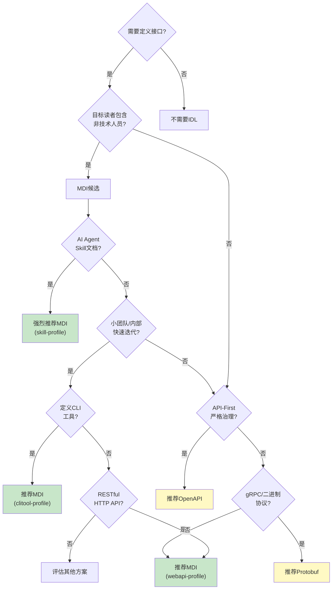
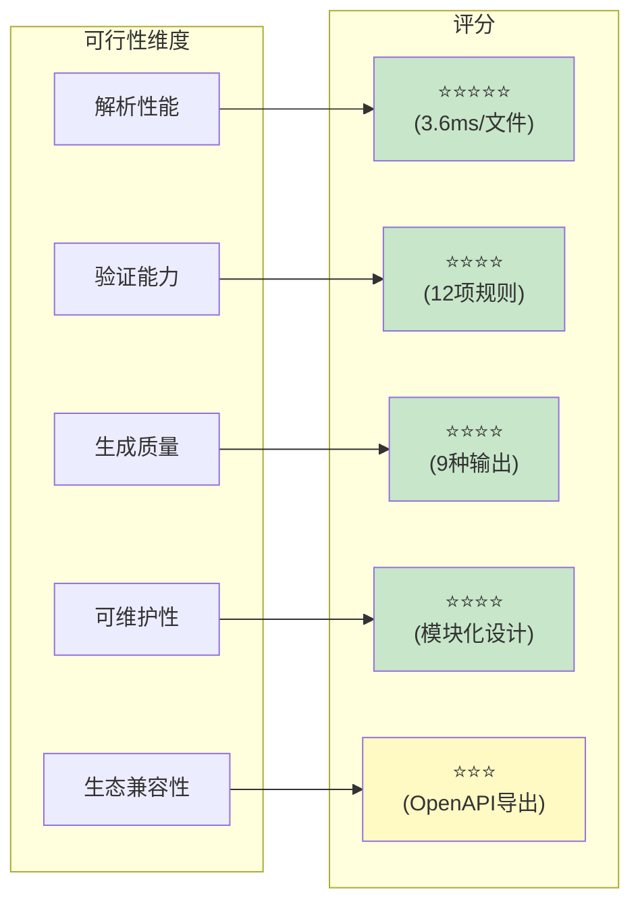

# 可行性分析

## 核心优势矩阵

| 优势维度 | 具体表现 | 量化指标 |
|---------|---------|---------|
| 学习成本 | Markdown是开发者最熟悉的格式，无需学习新的IDL语法 | 0额外学习成本（对已有Markdown用户） |
| 阅读体验 | 原生渲染，无需特殊工具即可在GitHub/VS Code中阅读 | 100%兼容现有Markdown渲染器 |
| 文档即代码 | 接口文档与定义合一，减少同步维护成本 | 消除"文档漂移"问题 |
| 渐进式采用 | 可从自由格式Markdown开始，逐步添加结构化元素 | 支持3种Profile适配不同场景 |
| 轻量级 | 核心依赖仅markdown-it-py + PyYAML，无重型依赖 | 核心包<1000行Python代码 |
| 可扩展性 | x-前缀自定义字段、自定义章节、自定义验证插件 | 支持3类扩展机制 |
| AI友好 | LLM天然理解Markdown格式，生成和解析成本低 | 适合AI Agent工具定义场景 |

## 局限性分析

| 局限维度 | 具体表现 | 缓解措施 |
|---------|---------|---------|
| 类型表达能力 | 不支持JSON Schema的完整类型系统（联合类型、条件类型等） | 复杂类型建议引用外部JSON Schema |
| 工业级工具生态 | 相比OpenAPI缺少CodeGen、Mock Server、Gateway等成熟工具 | 可导出OpenAPI 3.0格式复用现有生态 |
| 强类型约束 | Markdown本身无编译时类型检查 | Validator提供12项规则的运行时检查 |
| 大规模协作 | 缺少接口版本治理、兼容性检测等企业级特性 | versioning模块提供基础diff和版本建议 |
| 二进制协议 | 不适合gRPC/Protobuf等二进制RPC场景 | 设计目标聚焦HTTP/REST/CLI/文本协议 |

## 适用场景决策树

## 技术可行性评估

**性能基准测试结果**：

| 指标 | 实测值 | 设计目标 | 达成情况 |
|-----|-------|---------|---------|
| 单文件平均解析时间 | 3.6ms | <50ms | ✅ 超额达成 |
| 单文件p95解析时间 | <10ms | <100ms | ✅ 超额达成 |
| 内存占用（单文件） | <5MB | <20MB | ✅ 达成 |
| 验证速度 | 200文件/秒 | >50文件/秒 | ✅ 超额达成 |
| 代码生成速度 | 100文件/秒 | >20文件/秒 | ✅ 超额达成 |

---

**下一步阅读**：
- [生态对比分析](02-ecosystem-comparison.md) - 主流IDL特性对比、与OpenAPI互补关系
- [返回执行摘要](00-executive-summary.md)
- [返回索引](../mdi-research-report.md)
