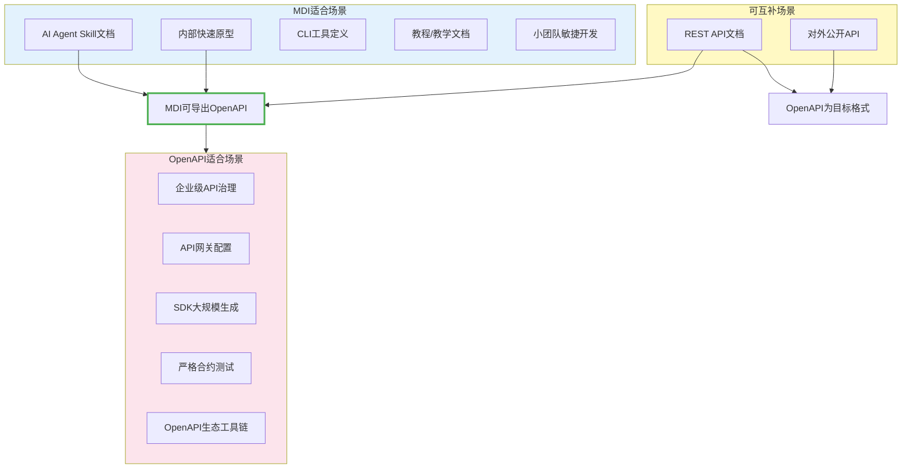

# 生态对比分析

## 主流IDL特性对比

| 特性维度 | MDI | OpenAPI 3.0 | AsyncAPI | JSON Schema | Protobuf | GraphQL SDL |
|---------|-----|-------------|----------|-------------|----------|-------------|
| 人类可读性 | ⭐⭐⭐⭐⭐ | ⭐⭐ | ⭐⭐ | ⭐⭐ | ⭐⭐⭐ | ⭐⭐⭐ |
| 学习曲线 | 极平缓 | 陡峭 | 陡峭 | 中等 | 中等 | 中等 |
| 类型系统 | 基础类型 | 完整 | 完整 | 最完整 | 完整 | 完整 |
| 工具生态 | 成长中 | 成熟 | 成长中 | 成熟 | 成熟 | 成熟 |
| 代码生成 | 9种目标 | 50+种 | 10+种 | 验证为主 | 10+种 | 10+种 |
| 文档原生 | ✅ 是 | ❌ 需Swagger UI | ❌ 需工具 | ❌ 需工具 | ❌ 需生成 | ❌ 需Playground |
| AI友好度 | ⭐⭐⭐⭐⭐ | ⭐⭐ | ⭐⭐ | ⭐⭐⭐ | ⭐⭐ | ⭐⭐⭐ |
| 二进制协议 | ❌ | ❌ | ✅ | ❌ | ✅ | ❌ |
| 流式API | ❌ | ❌ | ✅ | ❌ | ✅ | ✅ (Subscription) |
| 版本管理 | ✅ diff+建议 | 部分 | 部分 | ❌ | ❌ | ❌ |
| 测试生成 | ✅ pytest/jest | ❌ 需插件 | ❌ | ❌ | 部分 | ❌ |
| 适用协议 | HTTP/CLI | HTTP | 消息队列 | 通用 | gRPC | GraphQL |
| 零依赖解析 | ✅ | ❌ | ❌ | ❌ | ❌ | ❌ |

## MDI与OpenAPI互补关系

MDI并非要取代OpenAPI，而是形成互补关系：

## 协同工作流建议

**推荐工作模式**：使用MDI作为"源格式"编写和维护接口文档，在CI/CD流水线中自动导出OpenAPI 3.0格式，供下游工具链（API Gateway、SDK生成、Mock Server等）使用。

---

**下一步阅读**：
- [技术架构深度解析](03-technical-architecture.md) - 完整系统架构、核心数据流、模块依赖
- [返回可行性分析](01-feasibility-analysis.md)
- [返回索引](../mdi-research-report.md)
