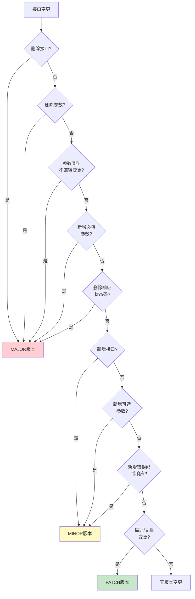
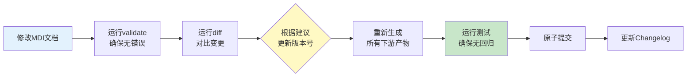

# 版本控制与变更管理最佳实践

## 语义化版本规范

MDI文档遵循SemVer 2.0语义化版本规范，版本号格式为`MAJOR.MINOR.PATCH`：

| 版本层级 | 触发条件 | 示例场景 |
|---------|---------|---------|
| **MAJOR** | 破坏性变更 | 删除接口、删除参数、参数类型不兼容变更、必填参数新增 |
| **MINOR** | 向后兼容功能新增 | 新增接口、新增可选参数、新增响应状态码、新增错误码 |
| **PATCH** | 向后兼容问题修复 | 描述文本修正、示例更新、错别字修复、文档格式调整 |

## 变更严重性判定规则



## 推荐工作流



## Commit Message规范

遵循Conventional Commits规范，结合MDI变更类型：

| Commit类型 | 对应版本变更 | 示例 |
|-----------|-------------|------|
| `feat(api):` | MINOR版本 | `feat(api): 添加用户搜索接口` |
| `fix(api):` | PATCH版本 | `fix(api): 修正用户名字段描述` |
| `refactor(api)!:` | MAJOR版本 | `refactor(api)!: 删除旧版认证接口` |
| `docs:` | PATCH版本 | `docs: 更新API使用示例` |
| `test:` | 无版本变更 | `test: 添加登录接口测试用例` |

## Changelog自动生成

使用`mdi diff --json`命令可以自动生成结构化的变更日志，建议在CI/CD流水线中集成：

```bash
# 生成当前版本与上一版本的diff报告
python -m mdi diff docs/api-v1.0.0.md docs/api-v1.1.0.md --json --bump > changelog/v1.1.0.json
```

---

**下一步阅读**：
- [未来演进方向](06-future-evolution.md) - 短期/中期/长期规划
- [返回工具链指南](04-toolchain-guide.md)
- [返回索引](../mdi-research-report.md)
