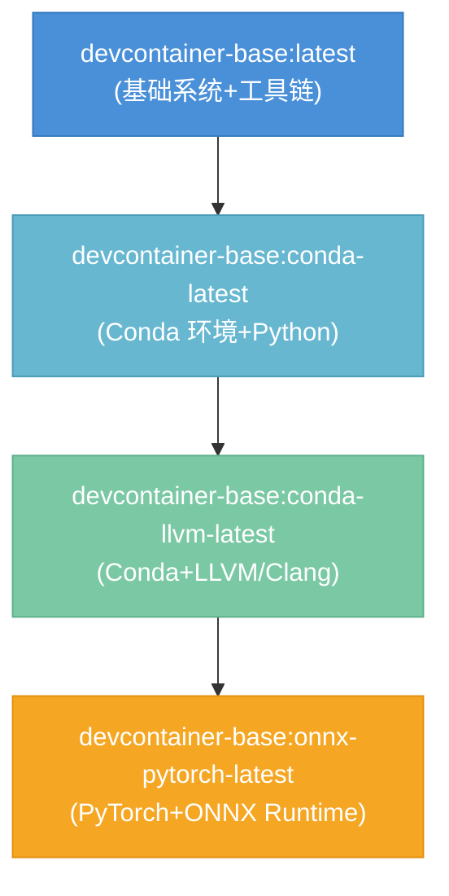
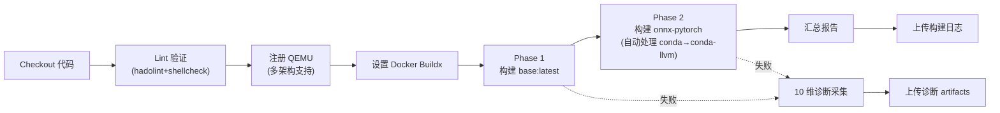

# DevContainer 变体构建与 CI 流水线操作手册

> 最后验证日期：2026-08-07
> 验证环境：WSL2 Ubuntu 26.04 + Docker Engine 29.1.3 + Buildx v0.36.1
> CI 状态：单 Job 顺序构建架构，10 维失败诊断采集
> 覆盖变体：base → conda → conda-llvm → onnx-pytorch

## 一、架构概览

### 1.1 镜像依赖拓扑



### 1.2 文件结构

```
apps/docker-images/devcontainer-base/
├── Dockerfile                          # 基础镜像 Dockerfile（7 阶段构建）
├── scripts/
│   ├── build.sh                        # 基础镜像构建脚本
│   └── lib/logging.sh                  # 统一日志库
├── variants/
│   ├── Dockerfile                      # 变体基础模板
│   ├── conda/Dockerfile                # Conda 变体
│   ├── conda-llvm/Dockerfile           # Conda+LLVM 变体
│   ├── onnx-pytorch/Dockerfile         # ONNX-PyTorch 变体
│   ├── scripts/
│   │   ├── build-onnx-pytorch.sh       # onnx-pytorch 一键构建脚本
│   │   └── shared/lib/logging.sh       # 变体共享日志库
│   └── shared/                         # 变体共享资源
└── tests/                              # 镜像验证测试
.github/workflows/
└── devcontainer-variants.yml           # CI 流水线配置
```

### 1.3 关键设计模式

**共享脚本 COPY + 环境变量驱动**模式：所有变体 Dockerfile 均基于 `devcontainer-base:${BASE_TAG}`，通过 `ARG VARIANT` 选择变体类型，COPY 共享脚本库到 `/tmp/devcontainer-variant-setup/` 目录，变体差异通过环境变量驱动。

## 二、本地构建（WSL2/Linux）

### 2.1 前置条件

| 条件 | 要求 | 检查命令 |
|------|------|---------|
| 操作系统 | WSL2 (Ubuntu 22.04+/26.04) 或原生 Linux | `grep -qi microsoft /proc/version && echo WSL2 \|\| uname -s` |
| Docker Engine | 24.0+，daemon 运行中 | `docker info` |
| Docker Buildx | 必需（BuildKit 功能依赖） | `docker buildx version` |
| 磁盘空间 | 构建目录 ≥ 30GB 可用 | `df -h /` |
| 内存 | ≥ 8GB（推荐 16GB） | `free -h` |
| 网络 | 可访问 Docker Hub / 阿里云镜像 | `curl -sI https://registry-1.docker.io/v2/` |

### 2.2 WSL2 Docker 安装（如未安装）

```bash
# Ubuntu/Debian 系
sudo apt-get update
sudo apt-get install -y docker.io

# 启动 Docker daemon（WSL2 无 systemd 时）
sudo dockerd &
# 或启用 systemd 后：sudo systemctl start docker

# 安装 Buildx 插件
BUILDX_VER=$(curl -s https://api.github.com/repos/docker/buildx/releases/latest | grep tag_name | cut -d'"' -f4)
curl -sLo /tmp/buildx "https://github.com/docker/buildx/releases/download/${BUILDX_VER}/buildx-${BUILDX_VER}.linux-amd64"
chmod +x /tmp/buildx
sudo mkdir -p /usr/libexec/docker/cli-plugins
sudo mv /tmp/buildx /usr/libexec/docker/cli-plugins/docker-buildx

# 配置非 root 用户访问
sudo usermod -aG docker $USER
sudo chmod 666 /var/run/docker.sock

# 验证
docker version && docker buildx version
```

### 2.3 一键构建 onnx-pytorch 变体（推荐）

```bash
cd apps/docker-images/devcontainer-base

# 国内镜像源构建（默认）
bash variants/scripts/build-onnx-pytorch.sh --cn --tag latest

# 官方镜像源构建
bash variants/scripts/build-onnx-pytorch.sh --official --tag latest

# 跳过构建仅测试
bash variants/scripts/build-onnx-pytorch.sh --skip-build --tag latest

# 禁用缓存重新构建
bash variants/scripts/build-onnx-pytorch.sh --no-cache --cn --tag latest
```

脚本自动处理依赖链：
- 检查 `devcontainer-base:latest` 是否存在，不存在则退出提示
- 检查 `conda` 变体，不存在则自动构建
- 检查 `conda-llvm` 变体，不存在则自动构建
- 构建 `onnx-pytorch` 变体
- 自动运行验证测试

### 2.4 分步构建（调试用）

```bash
cd apps/docker-images/devcontainer-base

# Step 1: 构建基础镜像
bash scripts/build.sh --cn --tag latest

# Step 2: 构建 conda 变体
VARIANT=conda TAG=latest bash variants/scripts/build-variant.sh --cn 2>/dev/null || \
  DOCKER_BUILDKIT=1 docker build \
    --build-arg BASE_TAG=latest \
    --build-arg APT_MIRROR=aliyun \
    --build-arg PIP_MIRROR=aliyun \
    -t devcontainer-base:conda-latest \
    -f variants/conda/Dockerfile .

# Step 3: 构建 conda-llvm 变体（基于 conda）
DOCKER_BUILDKIT=1 docker build \
  --build-arg BASE_TAG=conda-latest \
  --build-arg APT_MIRROR=aliyun \
  -t devcontainer-base:conda-llvm-latest \
  -f variants/conda-llvm/Dockerfile .

# Step 4: 构建 onnx-pytorch 变体（基于 conda-llvm）
DOCKER_BUILDKIT=1 docker build \
  --build-arg BASE_TAG=conda-llvm-latest \
  --build-arg APT_MIRROR=aliyun \
  --build-arg PIP_MIRROR=aliyun \
  -t devcontainer-base:onnx-pytorch-latest \
  -f variants/onnx-pytorch/Dockerfile .
```

### 2.5 构建验证

```bash
# 列出所有构建镜像
docker images devcontainer-base --format "table {{.Repository}}\t{{.Tag}}\t{{.Size}}"

# 运行容器验证
docker run --rm devcontainer-base:onnx-pytorch-latest python -c "
import torch; print(f'PyTorch: {torch.__version__}')
import onnxruntime; print(f'ONNX Runtime: {onnxruntime.__version__}')
"
```

### 2.6 构建时间参考

| 阶段 | 首次构建 | 缓存命中 |
|------|---------|---------|
| base:latest | 10-20 分钟 | 1-2 分钟 |
| conda:latest | 15-25 分钟 | 30 秒 |
| conda-llvm:latest | 10-20 分钟 | 30 秒 |
| onnx-pytorch:latest | 15-30 分钟 | 30 秒 |
| **全链合计** | **50-95 分钟** | **~3 分钟** |

> 注：构建时间受网络速度、CPU 性能、磁盘 IO 影响较大。WSL2 跨文件系统（/mnt/d/）IO 性能低于 WSL2 原生文件系统（~/）。

## 三、CI 流水线配置

### 3.1 触发条件

CI 流水线文件：`.github/workflows/devcontainer-variants.yml`

| 触发事件 | 路径过滤 | 说明 |
|---------|---------|------|
| `push` | `apps/docker-images/devcontainer-base/**`、`.github/workflows/devcontainer-variants.yml` | 代码推送自动构建 |
| `pull_request` | 同上 | PR 自动验证 |
| `workflow_dispatch` | — | 手动触发，支持镜像源选择 |

**手动触发参数**：

| 参数 | 类型 | 默认值 | 说明 |
|------|------|-------|------|
| `mirror_source` | choice | `china` | 镜像源：china（阿里云）/ official（官方） |

### 3.2 流水线架构

**单 Job 顺序构建**（关键设计决策）：

所有变体构建在同一个 Job（`build-and-test`）中顺序执行，原因：
- Docker 镜像层缓存仅在同一 VM 内有效
- 跨 Job 无法共享已构建的基础镜像（每个 Job 在独立 VM 上运行）
- 顺序构建可最大化利用 `--mount=type=cache` BuildKit 缓存



### 3.3 CI 环境变量

| 变量 | 值 | 说明 |
|------|---|------|
| `BUILD_LOG_DIR` | `/tmp/build-logs` | 构建日志目录 |
| `IMAGE_TAG` | 按 commit 或 manual | 镜像标签 |
| `MIRROR_SOURCE` | `china` / `official` | APT/PyPI 镜像源 |
| `DOCKER_BUILDKIT` | `1` | 启用 BuildKit |

### 3.4 Lint 阶段

```bash
# hadolint: Dockerfile 静态检查（warning 不阻断）
# shellcheck: Shell 脚本静态检查（severity=error 阻断）
```

## 四、构建脚本参考

### 4.1 scripts/build.sh（基础镜像）

```
Usage: bash scripts/build.sh [OPTIONS]

Options:
  -t, --tag TAG          镜像标签 (default: 1.0)
  -n, --name NAME        镜像名 (default: devcontainer-base)
  -r, --registry REG     Registry 前缀
  --no-cache             禁用 Docker 构建缓存
  --cn                   使用国内镜像源（aliyun apt + aliyun pip）
  --apt-mirror MIRROR    APT 镜像: official|aliyun|tuna (default: official)
  --pip-mirror MIRROR    PyPI 镜像: official|aliyun|tuna (default: official)
  --verify               构建后运行嵌入验证
  --verify-only          仅验证已有镜像（跳过构建）
  -h, --help             显示帮助

Examples:
  bash scripts/build.sh                          # 默认设置构建
  bash scripts/build.sh --tag latest --cn        # 国内源构建 :latest
  bash scripts/build.sh --no-cache -t dev        # 无缓存构建，标签 dev
```

### 4.2 variants/scripts/build-onnx-pytorch.sh（变体一键构建）

```
Usage: bash variants/scripts/build-onnx-pytorch.sh [OPTIONS]

Build dependency chain:
  devcontainer-base:latest → conda → conda-llvm → onnx-pytorch
  (脚本自动检查并构建缺失依赖)

Options:
  --cn                   使用国内镜像源（默认）
  --official             使用官方镜像源
  --no-cache             禁用 Docker 构建缓存
  --tag TAG              镜像标签后缀 (default: latest)
  --skip-build           跳过构建，仅运行测试
  -h, --help             显示帮助

Examples:
  bash variants/scripts/build-onnx-pytorch.sh                 # 国内源构建
  bash variants/scripts/build-onnx-pytorch.sh --official      # 官方源构建
  bash variants/scripts/build-onnx-pytorch.sh --skip-build    # 仅测试
```

## 五、失败诊断体系

### 5.1 本地诊断

构建失败时，按以下顺序排查：

1. **查看构建日志**：日志在 `$BUILD_LOG_DIR`（CI 中为 `/tmp/build-logs/`，本地脚本输出到 stdout）
2. **检查 Docker daemon 状态**：`docker info`
3. **检查磁盘空间**：`df -h`（Docker 缓存占满 `/var/lib/docker`）
4. **检查网络连通性**：`curl -sI https://registry-1.docker.io/v2/`
5. **清理构建缓存**：`docker builder prune -f` 或 `docker system prune -af`（极端情况）

### 5.2 CI 失败诊断（10 维采集）

CI 失败时自动执行 `Collect diagnostics on failure` 步骤，采集以下信息并保存为 artifact（保留 30 天）：

| 文件 | 内容 | 排查用途 |
|------|------|---------|
| `01-system.txt` | 时间/负载/内存/磁盘/CPU/内核 | 资源不足、磁盘满、OOM |
| `02-docker-daemon.txt` | Docker 版本/信息/配置/daemon日志/containerd日志 | Daemon 异常、版本不兼容 |
| `03-images.txt` | 所有镜像列表+层历史+dangling镜像 | 构建中断点、缓存层异常 |
| `04-buildkit.txt` | Buildx builder+缓存使用+worker信息 | BuildKit 缓存损坏、builder异常 |
| `05-containers.txt` | 容器列表+退出容器日志 | 构建中容器异常退出 |
| `06-network-volumes.txt` | 网络/卷/接口/DNS/Docker Hub连通性 | 网络不通、DNS 失败、代理问题 |
| `07-build-logs.txt` | 构建日志目录+日志最后80行 | 直接构建错误信息 |
| `08-errors.txt` | 自动提取 ERROR/FATAL/failed 等关键词行 | 快速定位错误 |
| `09-context.txt` | 环境变量/Git上下文/工作目录/Dockerfile列表 | 配置错误、文件缺失 |
| `10-packages.txt` | apt/pip缓存/运行进程 | 缓存损坏、资源占用 |

### 5.3 下载诊断 Artifact

CI 失败后：
1. 进入 GitHub Actions 运行页面
2. 滚动到 **Artifacts** 区域
3. 下载 `build-artifacts-<sha>` 压缩包
4. 解压后按文件名查看对应维度诊断信息
5. 优先查看 `08-errors.txt` 和构建日志中 ERROR 行

## 六、常见问题与解决方案

### 6.1 WSL2 环境问题

**问题：`Cannot connect to the Docker daemon at unix:///var/run/docker.sock`**
```bash
# 解决方案：启动 Docker daemon
sudo dockerd &
# 或（启用 systemd 后）
sudo systemctl start docker
sudo chmod 666 /var/run/docker.sock
```

**问题：`BuildKit is enabled but the buildx component is missing or broken`**
```bash
# 解决方案：安装 buildx 插件（见 2.2 节）
docker buildx version  # 验证安装
```

**问题：WSL2 中 Docker 组权限 `permission denied`**
```bash
sudo usermod -aG docker $USER
sudo chmod 666 /var/run/docker.sock
# 重新打开 WSL2 终端或执行：newgrp docker
```

**问题：`local: can only be used in a function`（bash 语法错误）**
- 原因：Shell 脚本中 `local` 关键字在函数外部使用
- 修复：移除函数外的 `local` 声明，改为全局变量
- 已修复：`build-onnx-pytorch.sh` line 267

### 6.2 构建缓存问题

**问题：缓存未命中，每次全量重建**
```bash
# 确认 BuildKit 启用
echo $DOCKER_BUILDKIT  # 应为 1

# 查看缓存使用
docker system df -v
docker buildx du -v
```

**问题：磁盘空间不足导致构建失败**
```bash
# 清理构建缓存
docker builder prune -f          # 清理构建缓存
docker image prune -f            # 清理 dangling 镜像
docker system prune -af --volumes  # 彻底清理（慎用！会删除所有缓存）
```

### 6.3 网络问题

**问题：apt/pip 包下载超时（国内环境）**
```bash
# 使用 --cn 参数启用国内镜像
bash scripts/build.sh --cn --tag latest
bash variants/scripts/build-onnx-pytorch.sh --cn
```

**问题：Docker Hub 拉取镜像限流**
```bash
# 配置镜像加速器（/etc/docker/daemon.json）
{
  "registry-mirrors": [
    "https://mirror.ccs.tencentyun.com",
    "https://registry.docker-cn.com"
  ]
}
sudo systemctl restart docker  # 重启生效
```

### 6.4 CI 特定问题

**问题：跨 Job 镜像找不到（已修复）**
- 原因：GitHub Actions 每个 Job 运行在独立 VM 上，Docker 镜像不共享
- 解决方案：合并为单 Job 顺序构建，利用 BuildKit 本地层缓存

**问题：ShellCheck 报错导致 CI 失败**
```bash
# 本地预检查
shellcheck scripts/build.sh variants/scripts/build-onnx-pytorch.sh
```

**问题：hadolint 警告（不阻断，但建议修复）**
```bash
# 本地预检查
docker run --rm -i hadolint/hadolint < Dockerfile
```

### 6.5 内存不足 (OOM)

**症状**：构建过程中被 killed，日志中出现 `Killed` 或 `OOM`
```bash
# 检查内存
free -h
dmesg | grep -i "oom\|killed"  # 查看 OOM killer 日志

# WSL2 解决方案：限制 Docker 内存或增加 WSL2 内存
# 编辑 %UserProfile%\.wslconfig
[wsl2]
memory=12GB
swap=8GB
# 然后 wsl --shutdown 重启
```

## 七、添加新变体指南

### 7.1 步骤

1. **创建 Dockerfile**：在 `variants/<variant-name>/Dockerfile` 下创建
   - `FROM devcontainer-base:${BASE_TAG}`
   - 依赖已有变体时指定正确的 BASE_TAG
   - 使用 `ARG APT_MIRROR/PIP_MIRROR` 支持镜像源配置

2. **创建构建脚本**（可选）：在 `variants/scripts/` 下创建 `build-<variant-name>.sh`
   - 参考 `build-onnx-pytorch.sh` 结构
   - 使用 `source variants/shared/lib/logging.sh` 日志库
   - 实现 `check_environment`、`check_*_image`、`build_variant_image`、`run_tests` 函数

3. **更新 CI 流水线**：在 `devcontainer-variants.yml` 中添加对应 Phase
   - 遵循顺序构建原则，确保依赖链正确
   - 添加镜像存在性检查

4. **添加测试**：在 `tests/` 目录下添加变体验证脚本

### 7.2 Dockerfile 规范

```dockerfile
# syntax=docker/dockerfile:1.7-labs
ARG BASE_TAG=latest
FROM devcontainer-base:${BASE_TAG}

ARG APT_MIRROR=official
ARG PIP_MIRROR=official

# 使用 BuildKit 缓存挂载
RUN --mount=type=cache,target=/var/cache/apt,sharing=locked \
    --mount=type=cache,target=/var/lib/apt/lists,sharing=locked \
    apt-get update && apt-get install -y --no-install-recommends \
    <packages> && rm -rf /var/lib/apt/lists/*

# 变体标识
LABEL devcontainer.variant="<variant-name>"
```

## 八、维护清单

| 维护项 | 频率 | 命令 |
|--------|------|------|
| 验证本地构建 | 修改后 | `bash variants/scripts/build-onnx-pytorch.sh --cn` |
| 本地 ShellCheck | 提交前 | `shellcheck scripts/*.sh variants/scripts/*.sh` |
| 本地 hadolint | 提交前 | `hadolint Dockerfile variants/*/Dockerfile` |
| 清理本地 Docker 缓存 | 磁盘不足时 | `docker builder prune -f` |
| 更新 buildx 版本 | 需要新特性时 | 重新下载最新 release |
| 检查 CI artifacts 保留 | 每月 | GitHub Actions → Artifacts 清理 |

## 九、参考资源

- 基础镜像构建脚本：[scripts/build.sh](../../../../apps/docker-images/devcontainer-base/scripts/build.sh)
- onnx-pytorch 构建脚本：[variants/scripts/build-onnx-pytorch.sh](../../../../apps/docker-images/devcontainer-base/variants/scripts/build-onnx-pytorch.sh)
- CI 流水线配置：[devcontainer-variants.yml](../../../../.github/workflows/devcontainer-variants.yml)
- 基础镜像 Dockerfile：[Dockerfile](file:///d:/spaces/SpecWeave/apps/docker-images/devcontainer-base/Dockerfile)
- onnx-pytorch Dockerfile：[variants/onnx-pytorch/Dockerfile](file:///d:/spaces/SpecWeave/apps/docker-images/devcontainer-base/variants/onnx-pytorch/Dockerfile)
