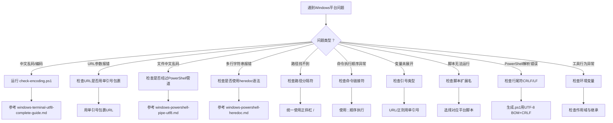

# Windows平台兼容性手册：AI智能体执行任务陷阱系统化指南

> **本手册起源**：2026-07-04 Open Code Review Wiki 教程创建任务复盘中识别到"Windows PowerShell URL处理陷阱需要系统化文档"（[洞察4](../../retrospective/reports/competitive-analysis/retrospective-open-code-review-wiki-20260704/insight-extraction.md)）。项目已有4个分散的 Windows 文档，但缺乏统一索引与新陷阱补充。本手册作为 Windows 平台兼容性问题的**统一入口**，整合现有资源并填补空白。
>
> **适用对象**：在 Windows 环境下执行任务的 AI 智能体与人类开发者
> **核心目标**：将分散的 Windows 平台修复记录系统化为可复用的平台知识库，避免重复踩坑

## 一、问题分类总览

Windows 平台兼容性问题可分为10类，每类陷阱的症状、根因、严重程度如下：

| # | 陷阱类型 | 核心症状 | 根本原因 | 严重程度 | 已有文档 |
|---|---------|---------|---------|---------|---------|
| 1 | **编码类** | 中文乱码、emoji 报错 | GBK默认编码 vs UTF-8工具链冲突 | 高 | [windows-terminal-utf8-complete-guide.md](windows-terminal-utf8-complete-guide.md) |
| 2 | **URL解析类** | URL参数被解析为命令 | PowerShell `&` 是命令分隔符 | 高 | 本手册（新增） |
| 3 | **管道污染类** | 文件中文乱码 | PowerShell管道转码 | 高 | [windows-powershell-pipe-utf8.md](windows-powershell-pipe-utf8.md) |
| 4 | **heredoc类** | 多行字符串语法报错 | PowerShell不支持`<<'EOF'` | 中 | [windows-powershell-heredoc.md](windows-powershell-heredoc.md) |
| 5 | **路径分隔符类** | 路径找不到 | `\` vs `/` 在不同工具中的行为差异 | 中 | 本手册（新增） |
| 6 | **命令链接类** | 命令执行顺序异常 | `&&`/`||` vs `;` 语义差异 | 中 | 本手册（新增） |
| 7 | **引号差异类** | 变量未展开或过度展开 | 单引号vs双引号在PowerShell中的行为 | 中 | 本手册（新增） |
| 8 | **脚本扩展类** | 跨平台脚本无法运行 | `.ps1` vs `.sh` 执行机制差异 | 低 | 本手册（新增） |
| 9 | **行尾符类** | 脚本解析错误 | CRLF vs LF 在PowerShell中的行为 | 低 | finding-06（复盘发现） |
| 10 | **环境变量类** | 工具行为异常 | 环境变量作用域与继承差异 | 低 | 本手册（新增） |

## 二、陷阱1：编码类（已有专文，此处仅索引）

### 问题概述
Windows 系统默认使用 GBK（代码页936）作为非 Unicode 程序的编码，而现代开发工具链（Git、Python、Node.js、Markdown）统一使用 UTF-8，导致中文显示乱码、emoji 报错。

### 详细文档
- **完整配置指南**：[windows-terminal-utf8-complete-guide.md](windows-terminal-utf8-complete-guide.md)（382行，涵盖系统级/用户级/项目级三层配置）
- **复盘发现**：[finding-06-powershell-encoding-trap.md](../../retrospective/reports/project-governance/tools-and-automation/retrospective-scripts-shared-lib-extraction-20260626/insights/finding-06-powershell-encoding-trap.md)（PowerShell 5.x 需要 UTF-8 BOM + CRLF）
- **Spec**：[fix-windows-terminal-chinese-encoding](../../../../.trae/specs/standards-tools/fix-windows-terminal-chinese-encoding/spec.md)

### 核心对策
```powershell
# 一键配置（推荐）
.\setup-utf8-env.ps1

# 诊断当前编码状态
. .\.agents\scripts\check-encoding.ps1

# 验证14项编码测试
. .\.agents\scripts\verify-encoding.ps1
```

### 关键脚本
| 脚本 | 路径 | 作用 |
|------|------|------|
| setup-utf8-env.ps1 | 项目根目录 | 一键配置主脚本 |
| check-encoding.ps1 | `.agents/scripts/` | 编码诊断 |
| verify-encoding.ps1 | `.agents/scripts/` | 14项验证测试 |
| setup-cmd-utf8.ps1 | `.agents/scripts/` | CMD AutoRun 配置 |
| profile.ps1 | `.agents/scripts/` | PowerShell UTF-8 配置 |
| Install-Profile.ps1 | `.agents/scripts/` | Profile 安装 |

## 三、陷阱2：URL解析类（新增）

### 问题现象
PowerShell 中执行带 URL 参数的命令时，URL 中的 `&param=value` 被解析为命令分隔符，`param` 被视为独立命令，报错 `'param' is not recognized as an internal or external command`。

### 根本原因
PowerShell 中 `&` 是**命令调用操作符**或**后台操作符**，与 Bash 中的 `&`（后台执行）和 `&&`（条件链接）语义不同。URL 中的 `&` 作为查询参数分隔符，会被 PowerShell 解释为命令分隔符。

### 复现案例

**案例1：Open Code Review 任务（2026-07-04）**
```powershell
# ❌ 错误写法：URL 中的 &color_scheme=light 被解析为独立命令
defuddle parse https://mp.weixin.qq.com/s/WSicyyMEIXnNVDoWuz0jrw?from=industrynews&color_scheme=light#rd --md
# 报错：'color_scheme' is not recognized as an internal or external command
```

### 解决方案

**方案A：单引号包裹URL（推荐）**
```powershell
# ✅ 单引号包裹，PowerShell 不解析单引号内的特殊字符
defuddle parse 'https://mp.weixin.qq.com/s/WSicyyMEIXnNVDoWuz0jrw?from=industrynews&color_scheme=light#rd' --md
```

**方案B：去除URL查询参数（如不需要）**
```powershell
# ✅ 去除 ?from=industrynews&color_scheme=light#rd 查询参数
defuddle parse 'https://mp.weixin.qq.com/s/WSicyyMEIXnNVDoWuz0jrw' --md -o output.md
```

**方案C：双引号包裹（需注意变量展开）**
```powershell
# ⚠️ 双引号会展开 $ 变量，URL 中含 $ 时慎用
defuddle parse "https://mp.weixin.qq.com/s/WSicyyMEIXnNVDoWuz0jrw?from=industrynews&color_scheme=light#rd" --md
```

### 通用规则
| 场景 | 推荐做法 |
|------|---------|
| URL 含 `&` 查询参数 | **必须**用单引号包裹整个 URL |
| URL 含 `$` 变量字符 | **必须**用单引号（双引号会尝试展开变量） |
| URL 含空格 | 用单引号或双引号均可 |
| URL 仅含字母数字 `/:-` | 可不加引号 |

### AI智能体执行规则
> **强制规则**：AI智能体在 Windows 环境下执行含 URL 的命令时，**必须始终用单引号包裹 URL**，避免 `&` 参数被解析为命令分隔符。这是 Windows 平台的特殊要求，Unix 环境无需此处理。

## 四、陷阱3：管道污染类（已有专文，此处仅索引）

### 问题概述
PowerShell 文本管道（`| Set-Content`、`| Out-File`）在处理中文内容时可能发生转码污染，导致文件中文乱码。

### 详细文档
- **完整文档**：[windows-powershell-pipe-utf8.md](windows-powershell-pipe-utf8.md)

### 核心对策
```powershell
# ❌ 危险写法：PowerShell 管道可能污染中文
python script.py | Set-Content output.md

# ✅ 推荐写法：Python 直接写文件
python -X utf8 -c "from pathlib import Path; Path('output.md').write_text(content, encoding='utf-8')"
```

## 五、陷阱4：heredoc类（已有专文，此处仅索引）

### 问题概述
PowerShell 不支持 Bash 的 heredoc 语法（`<<'EOF' ... EOF`），执行 `git commit -m "$(cat <<'EOF' ... EOF)"` 会报错。

### 详细文档
- **完整文档**：[windows-powershell-heredoc.md](windows-powershell-heredoc.md)

### 核心对策
```powershell
# ✅ 方案1：双 -m 参数（推荐，2-3段消息）
git commit -m "标题" -m "正文段落"

# ✅ 方案2：PowerShell Here-String
$msg = @"
标题

正文
"@
git commit -m $msg

# ✅ 方案3：从文件读取
git commit -F commit-msg.txt
```

## 六、陷阱5：路径分隔符类（新增）

### 问题现象
Windows 使用反斜杠 `\` 作为路径分隔符，而 Unix 工具和现代开发工具链使用正斜杠 `/`。不同工具对路径分隔符的处理不一致，可能导致路径找不到。

### 根本原因
- Windows 原生工具（CMD、PowerShell）优先识别 `\`
- Unix 移植工具（Git、Python、Node.js）通常同时支持 `\` 和 `/`
- 某些工具在特定上下文下对 `\` 有特殊语义（如正则表达式中的转义符）

### 复现案例

**案例1：PowerShell 路径处理**
```powershell
# ✅ PowerShell 优先识别反斜杠
Get-Content .agents\scripts\check-encoding.ps1

# ✅ PowerShell 也支持正斜杠（部分场景）
Get-Content .agents/scripts/check-encoding.ps1

# ⚠️ 混合使用可能出问题
Get-Content .agents\scripts/check-encoding.ps1
```

**案例2：Python 路径处理**
```python
# ✅ Python 同时支持两种分隔符
from pathlib import Path
Path(r'd:/AI/.agents/scripts')  # 原始字符串 + 正斜杠
Path('d:\\AI\\.agents\\scripts')  # 转义反斜杠
Path('d:/AI/.agents/scripts')  # 正斜杠（推荐，跨平台）
```

**案例3：正则表达式中的反斜杠**
```python
# ⚠️ 反斜杠在正则中是转义符
import re
# ❌ 错误：\s 被解释为空白字符
re.match(r'C:\Users', path)
# ✅ 正确：转义反斜杠
re.match(r'C:\\Users', path)
# ✅ 推荐：使用正斜杠避免转义
re.match(r'C:/Users', path.replace('\\', '/'))
```

### 解决方案

**通用规则：跨平台脚本统一使用正斜杠 `/`**
```python
# ✅ 推荐：跨平台兼容
path = 'd:/AI/.agents/scripts/check-encoding.ps1'
```

**PowerShell 中的路径处理**
```powershell
# ✅ 推荐：使用 Join-Path 构建路径
$path = Join-Path $PSScriptRoot 'scripts'
# ✅ 或使用 here-string 避免转义
$path = @'
d:\AI\.agents\scripts
'@
```

### AI智能体执行规则
> **强制规则**：AI智能体生成跨平台脚本时，**统一使用正斜杠 `/`** 作为路径分隔符。Python、Node.js、Git 等工具在 Windows 下均支持正斜杠，可避免反斜杠转义问题。仅在必须使用 PowerShell 原生命令时才使用反斜杠。

## 七、陷阱6：命令链接类（新增）

### 问题现象
PowerShell 与 Bash 的命令链接符语义不同，跨平台脚本直接复制可能导致命令执行顺序异常。

### 根本原因
| 操作符 | Bash 语义 | PowerShell 语义 |
|--------|----------|----------------|
| `;` | 顺序执行（不管前一个是否成功） | 顺序执行（不管前一个是否成功） |
| `&&` | 条件执行（前一个成功才执行下一个） | PowerShell 7+ 支持，5.1 不支持 |
| `||` | 条件执行（前一个失败才执行下一个） | PowerShell 7+ 支持，5.1 不支持 |
| `&` | 后台执行 | 命令调用操作符/后台执行 |

### 复现案例

**案例1：PowerShell 5.1 不支持 `&&`**
```powershell
# ❌ PowerShell 5.1 报错
git add . && git commit -m "msg"
# 报错：Unexpected token '&&'

# ✅ PowerShell 5.1 替代方案
git add .; git commit -m "msg"

# ✅ PowerShell 7+ 支持 &&
git add . && git commit -m "msg"
```

**案例2：条件执行跨平台差异**
```bash
# Bash 写法
./build.sh && ./test.sh || echo "失败"

# PowerShell 5.1 等价写法
if (./build.ps1) { if (./test.ps1) {} else { Write-Host "失败" } } else { Write-Host "失败" }

# PowerShell 7+ 等价写法
./build.ps1 && ./test.ps1 || Write-Host "失败"
```

### 解决方案

**跨平台脚本推荐写法**
```powershell
# ✅ 使用 ; 顺序执行（最兼容）
cd d:/AI; git status; git log --oneline -5

# ✅ 使用 if 条件判断（PowerShell 5.1 兼容）
if (Test-Path file.txt) { Remove-Item file.txt }
```

### AI智能体执行规则
> **强制规则**：AI智能体在 Windows 环境下生成命令链接时，**优先使用 `;` 顺序执行**（最兼容）。如需条件执行，使用 `if` 语句或确认 PowerShell 版本为 7+ 后再使用 `&&`/`||`。

## 八、陷阱7：引号差异类（新增）

### 问题现象
PowerShell 单引号和双引号的行为与 Bash 不同，导致变量展开行为异常。

### 根本原因
| 引号类型 | Bash 行为 | PowerShell 行为 |
|---------|----------|----------------|
| 单引号 `'...'` | 不展开任何变量 | 不展开任何变量 |
| 双引号 `"..."` | 展开 `$var` 和 `` ` `` 转义 | 展开 `$var` 和 `` ` `` 转义 |
| 反引号 `` ` `` | 命令替换 | 转义字符（类似 Bash 的 `\`） |
| 美元括号 `$(...)` | 命令替换 | 命令替换 |

### 复现案例

**案例1：变量展开**
```powershell
$name = "world"
# ✅ 双引号展开变量
Write-Host "Hello, $name"  # 输出: Hello, world

# ✅ 单引号不展开
Write-Host 'Hello, $name'  # 输出: Hello, $name
```

**案例2：URL 中的 `$` 字符**
```powershell
# ❌ 双引号会尝试展开 $color（变量不存在则为空）
$url = "https://example.com?color=$color_scheme"
Write-Host $url  # 输出: https://example.com?color=

# ✅ 单引号保留原样
$url = 'https://example.com?color=$color_scheme'
Write-Host $url  # 输出: https://example.com?color=$color_scheme
```

**案例3：PowerShell Here-String**
```powershell
# ✅ 双引号 Here-String（展开变量）
$msg = @"
Hello, $name
Today is $(Get-Date)
"@

# ✅ 单引号 Here-String（字面量，不展开）
$msg = @'
Hello, $name
Today is $(Get-Date)
'@
```

### 解决方案

**通用规则**
| 场景 | 推荐引号 |
|------|---------|
| URL、正则表达式、含 `$` 的字符串 | **单引号** |
| 需要展开变量的字符串 | **双引号** |
| 多行字符串（字面量） | `@'...'@` |
| 多行字符串（展开变量） | `@"..."@` |

### AI智能体执行规则
> **强制规则**：AI智能体在 Windows 环境下处理 URL、正则表达式、含特殊字符的字符串时，**必须使用单引号**避免变量意外展开。仅当明确需要展开变量时才使用双引号。

## 九、陷阱8：脚本扩展类（新增）

### 问题现象
跨平台项目中同时存在 `.ps1`（PowerShell）和 `.sh`（Bash）脚本，执行机制不同导致跨平台脚本选择困惑。

### 根本原因
- Windows 原生支持 `.ps1`，不原生支持 `.sh`（需 WSL 或 Git Bash）
- Linux/macOS 原生支持 `.sh`，不原生支持 `.ps1`（需安装 PowerShell Core）
- 项目 CI/CD 通常在 Linux 环境，但本地开发可能在 Windows

### 项目中的跨平台脚本对

| 功能 | Windows 脚本 | Linux/Mac 脚本 |
|------|-------------|---------------|
| CI检查 | `.agents/scripts/ci-check.ps1` | `.agents/scripts/ci-check.sh` |
| UTF-8配置 | `.agents/scripts/setup-cmd-utf8.ps1` | N/A（Linux默认UTF-8） |

### 解决方案

**跨平台脚本选择规则**
```powershell
# Windows 环境：优先执行 .ps1
. .\.agents\scripts\ci-check.ps1

# Linux/Mac 环境：优先执行 .sh
bash .agents/scripts/ci-check.sh
```

**跨平台兼容的 Python 脚本（推荐）**
```python
# ✅ 推荐：用 Python 编写跨平台脚本，避免 Shell 差异
import sys
import subprocess
from pathlib import Path

def run_command(cmd):
    """跨平台命令执行"""
    if sys.platform == 'win32':
        # Windows 环境特殊处理
        pass
    else:
        # Unix 环境特殊处理
        pass
```

### AI智能体执行规则
> **强制规则**：AI智能体执行项目脚本时，**先检查当前平台**（`sys.platform` 或 `$PSVersionTable`），选择对应扩展名的脚本。跨平台脚本优先用 Python 编写，避免 Shell 差异。

## 十、陷阱9：行尾符类（复盘发现）

### 问题现象
PowerShell 5.x 对脚本文件的换行符有要求，LF-only 换行可能导致块结构解析错误（花括号匹配失败）。

### 根本原因
- Windows 默认使用 CRLF（`\r\n`）换行
- Unix/Linux/macOS 默认使用 LF（`\n`）换行
- PowerShell 5.x 在解析含中文的脚本时，LF-only 可能导致解析错误
- Git 的 `core.autocrlf` 设置可能自动转换换行符

### 复盘发现
> 来源：[finding-06-powershell-encoding-trap.md](../../retrospective/reports/project-governance/tools-and-automation/retrospective-scripts-shared-lib-extraction-20260626/insights/finding-06-powershell-encoding-trap.md)
>
> `ci-check.ps1` 使用 UTF-8 无 BOM + LF 换行写入后，PowerShell 5.x 报语法错误"字符串缺少终止符"和"意外的}"。

### 解决方案

**PowerShell 脚本文件规范**
```python
# ✅ 生成 .ps1 文件时使用 UTF-8 BOM + CRLF
content = "# PowerShell 脚本\nWrite-Host '中文'"
Path('script.ps1').write_text(content, encoding='utf-8-sig', newline='\r\n')
```

**Git 配置**
```powershell
# 提交时保留原换行符，检出时不自动转换
git config --global core.autocrlf input
```

**.gitattributes 配置**
```
# .gitattributes
*.ps1 text eol=crlf
*.sh text eol=lf
*.py text eol=lf
```

### 对策表

| 方案 | 操作 | 适用场景 |
|------|------|---------|
| 显式写入 BOM+CRLF | 生成 `.ps1` 时使用 `encoding='utf-8-sig'` 并写 CRLF | 兼容 PS 5.x |
| 声明 PS7+ | 在脚本首行添加 `#requires -Version 7` | 项目统一使用 PS7+ |
| 避免中文输出 | 脚本中不使用中文/特殊字符 | 临时规避（不推荐） |

## 十一、陷阱10：环境变量类（新增）

### 问题现象
Windows 与 Unix 的环境变量作用域、继承机制、设置方式不同，导致工具行为异常。

### 根本原因
| 维度 | Windows | Unix/Linux |
|------|---------|-----------|
| 设置命令 | `set`（CMD）/ `$env:VAR=`（PS） | `export VAR=` |
| 作用域 | 进程/用户/系统 | 进程/用户（shell配置） |
| 继承 | 子进程继承父进程环境 | 子进程继承父进程环境 |
| 持久化 | 注册表 | `.bashrc`/`.zshrc` |

### 复现案例

**案例1：Python 环境变量设置**
```powershell
# ✅ PowerShell 设置环境变量（当前会话）
$env:PYTHONUTF8 = '1'
$env:PYTHONIOENCODING = 'utf-8'

# ✅ PowerShell 持久化设置（用户级）
[Environment]::SetEnvironmentVariable('PYTHONUTF8', '1', 'User')
[Environment]::SetEnvironmentVariable('PYTHONIOENCODING', 'utf-8', 'User')
```

**案例2：子进程继承**
```powershell
# ✅ 父进程设置后，子进程继承
$env:MY_VAR = 'value'
python script.py  # 子进程能访问 $MY_VAR
```

**案例3：PATH 环境变量差异**
```powershell
# Windows 使用 ; 分隔
$env:PATH -split ';'

# Unix 使用 : 分隔
# echo $PATH | tr ':' '\n'
```

### 解决方案

**跨平台环境变量设置（Python）**
```python
import os
import sys
from pathlib import Path

# ✅ 跨平台设置环境变量
os.environ['MY_VAR'] = 'value'

# ✅ 跨平台获取 PATH 分隔符
path_sep = os.pathsep  # Windows: ';', Unix: ':'
```

### AI智能体执行规则
> **强制规则**：AI智能体设置环境变量时，**区分作用域**（会话/用户/系统）。临时设置使用 `$env:VAR=`，持久化使用 `[Environment]::SetEnvironmentVariable(..., 'User')`。跨平台脚本使用 Python `os.environ` 避免 Shell 差异。

## 十二、快速诊断流程

当遇到 Windows 平台问题时，按以下流程快速诊断：



## 十三、工具脚本索引

| 脚本 | 路径 | 作用 | 关联陷阱 |
|------|------|------|---------|
| setup-utf8-env.ps1 | 项目根目录 | 一键UTF-8配置主脚本 | 陷阱1编码 |
| check-encoding.ps1 | `.agents/scripts/` | 编码诊断 | 陷阱1编码 |
| verify-encoding.ps1 | `.agents/scripts/` | 14项验证测试 | 陷阱1编码 |
| setup-cmd-utf8.ps1 | `.agents/scripts/` | CMD AutoRun配置 | 陷阱1编码 |
| profile.ps1 | `.agents/scripts/` | PowerShell UTF-8配置 | 陷阱1编码 |
| Install-Profile.ps1 | `.agents/scripts/` | Profile安装 | 陷阱1编码 |
| ci-check.ps1 | `.agents/scripts/` | CI检查（Windows版） | 陷阱8脚本扩展 |
| ci-check.sh | `.agents/scripts/` | CI检查（Linux版） | 陷阱8脚本扩展 |
| check-filename-convention.py | `.agents/scripts/` | 文件名规范检查 | 跨平台Python |
| check-links.py | `.agents/scripts/` | 链接有效性检查 | 跨平台Python |
| fix-x-toml-ref.py | `.agents/scripts/` | x-toml-ref路径修复 | 跨平台Python |

## 十四、关联资源

### 项目内文档
- [windows-terminal-utf8-complete-guide.md](windows-terminal-utf8-complete-guide.md) - 终端UTF-8编码完整配置（382行）
- [windows-powershell-pipe-utf8.md](windows-powershell-pipe-utf8.md) - PowerShell管道污染
- [windows-powershell-heredoc.md](windows-powershell-heredoc.md) - heredoc语法不支持
- [wechat-mp-content-extraction.md](wechat-mp-content-extraction.md) - 微信公众号文章提取（含PowerShell Invoke-WebRequest）

### 项目内Spec与复盘
- [fix-windows-terminal-chinese-encoding spec](../../../../.trae/specs/standards-tools/fix-windows-terminal-chinese-encoding/spec.md) - Windows终端编码修复Spec
- [finding-06-powershell-encoding-trap.md](../../retrospective/reports/project-governance/tools-and-automation/retrospective-scripts-shared-lib-extraction-20260626/insights/finding-06-powershell-encoding-trap.md) - PowerShell编码陷阱复盘发现
- [retrospective-open-code-review-wiki-20260704](../../retrospective/reports/competitive-analysis/retrospective-open-code-review-wiki-20260704/README.md) - 本手册起源的复盘报告

### 项目内模式
- [cross-platform-encoding-enforcement.md](../../retrospective/patterns/code-patterns/cross-platform-encoding-enforcement.md) - 跨平台编码强制模式

### 外部参考
- [PowerShell about_Quoting_Rules](https://learn.microsoft.com/zh-cn/powershell/module/microsoft.powershell.core/about/about_quoting_rules) - 官方引号规则
- [PowerShell about_Operators](https://learn.microsoft.com/zh-cn/powershell/module/microsoft.powershell.core/about/about_operators) - 官方操作符
- [Python `-X utf8`](https://docs.python.org/3/using/cmdline.html#cmdoption-X) - Python UTF-8模式

## 十五、AI智能体执行检查清单

AI智能体在 Windows 环境下执行任务前，快速检查以下事项：

- [ ] **URL处理**：含 `&` 或 `$` 的 URL 是否用单引号包裹？
- [ ] **编码配置**：是否运行过 `setup-utf8-env.ps1`？编码是否为 UTF-8？
- [ ] **文件写入**：写中文文件是否使用 Python `write_text(encoding='utf-8')` 而非 PowerShell 管道？
- [ ] **多行字符串**：是否避免了 heredoc 语法，改用 PowerShell Here-String 或双 `-m`？
- [ ] **路径分隔符**：跨平台脚本是否统一使用正斜杠 `/`？
- [ ] **命令链接**：是否使用 `;` 而非 `&&`（PowerShell 5.1 兼容）？
- [ ] **引号选择**：URL/正则/含 `$` 字符串是否使用单引号？
- [ ] **脚本扩展**：是否选择了对应平台的脚本（.ps1 vs .sh）？
- [ ] **行尾符**：生成 .ps1 文件是否使用 UTF-8 BOM + CRLF？
- [ ] **环境变量**：是否区分了会话/用户/系统作用域？

## 十六、Changelog

- **v1.0.0** (2026-07-06): 初始版本，系统化整理10类Windows平台陷阱，整合4个已有文档，补充6类新陷阱（URL解析、路径分隔符、命令链接、引号差异、脚本扩展、环境变量）。来源：[retrospective-open-code-review-wiki-20260704](../../retrospective/reports/competitive-analysis/retrospective-open-code-review-wiki-20260704/README.md) 洞察4的高优行动项。
