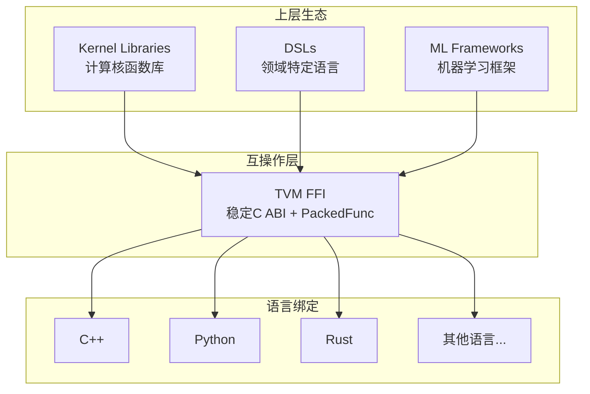

> 📚 **TVM FFI Wiki 教程导航**：
> [首页](00-overview.md) | [目录结构](01-project-structure.md) | [Any类型](02-any-type.md) | [Object系统](03-object-system.md) | [Function](04-function-registry.md) | [容器](05-containers.md) | [反射](06-reflection.md) | [Module](07-module-system.md) | [C++指南](08-cpp-guide.md) | [Python指南](09-python-guide.md) | [构建打包](10-build-packaging.md) | [实战案例](11-examples.md) | [FAQ](12-faq.md) | [源码解析](13-source-analysis.md)

---

# TVM FFI 教程总览

## 简介

Apache TVM FFI（Foreign Function Interface）是为机器学习系统设计的开放ABI（Application Binary Interface）和FFI库，是Apache TVM项目的核心组件之一。它为C++、Python、Rust等多种编程语言之间提供了高效、稳定、低开销的跨语言互操作能力。

### 核心特性

- **稳定C ABI**：提供版本化的稳定C应用二进制接口，确保跨编译器、跨版本兼容性
- **零拷贝DLPack互操作**：原生支持DLPack张量格式，实现跨框架零拷贝数据共享
- **多语言支持**：官方支持C++、Python，社区支持Rust、Go、Java等语言绑定
- **极低开销**：核心调用路径经过高度优化，接近原生函数调用性能
- **类型安全**：内置类型系统和反射机制，提供编译期和运行期类型检查
- **模块化设计**：可独立使用，无需依赖完整TVM栈

## 目标读者

本教程面向以下读者群体：

- **C++/Python ML系统开发者**：正在构建机器学习框架、编译器或运行时，需要跨语言互操作能力
- **需要编写跨语言扩展的工程师**：为现有C++库编写Python/Rust绑定，或反之
- **对FFI技术感兴趣的读者**：希望深入理解现代跨语言互操作机制和ABI设计
- **TVM生态贡献者**：计划为Apache TVM贡献代码或扩展功能

## 前置知识

阅读本教程前，建议具备以下基础知识：

- **C++17基础**：理解模板、智能指针、移动语义、命名空间等现代C++特性
- **Python基础**：熟悉Python对象模型、ctypes/cffi等绑定方式
- **FFI/ABI基本概念**：了解动态链接、符号可见性、调用约定等基础知识
  - 可参考：[FFI Wiki 教程](../learning/01-agent-protocols-interfaces/ffi-wiki/00-overview.md)

## 章节导航表

本教程共包含14个章节，系统覆盖TVM FFI的核心概念、API使用和最佳实践：

| 章节 | 文件名 | 标题 | 内容简介 |
|------|--------|------|----------|
| 00 | 00-overview.md | 教程总览 | TVM FFI简介、核心特性、阅读路径 |
| 01 | 01-project-structure.md | 项目结构说明 | TVM FFI目录组织、核心文件索引 |
| 02 | 02-any-type.md | Any/AnyView类型系统 | 类型擦除、内存布局、类型检查转换 |
| 03 | 03-object-system.md | Object对象系统 | 侵入式引用计数、双类设计模式 |
| 04 | 04-function-registry.md | Function函数与注册表 | PackedFunc、全局注册表、跨语言调用 |
| 05 | 05-containers.md | Container容器类型 | Array/Map/List/Dict/Tensor等容器 |
| 06 | 06-reflection.md | Reflection反射系统 | 静态注册、dataclass集成、stub生成 |
| 07 | 07-module-system.md | Module模块系统 | 动态库加载、inline_module即时编译 |
| 08 | 08-cpp-guide.md | C++开发指南 | 环境配置、CMake集成、API使用 |
| 09 | 09-python-guide.md | Python开发指南 | 环境配置、核心API、容器反射使用 |
| 10 | 10-build-packaging.md | 构建与打包 | CMake构建、Wheel打包、跨平台编译 |
| 11 | 11-examples.md | 实战案例 | Quickstart、CUDA Kernel、C ABI等示例 |
| 12 | 12-faq.md | 常见问题解答 | 编译、运行时、Python集成等FAQ |
| 13 | 13-source-analysis.md | 核心源码解析 | Any/Object/Function/反射底层实现 |

## TVM FFI在ML系统中的定位

TVM FFI作为机器学习系统的跨语言互操作层，连接了上层应用框架和底层计算库：

如上图所示，TVM FFI处于ML技术栈的中间层位置：
- 向上对接各类计算库、DSL和框架，提供统一的导出接口
- 向下提供多语言绑定，让不同语言都能调用底层功能
- 核心是稳定的C ABI和PackedFunc机制，确保二进制兼容性

## 阅读路径建议

根据你的背景和需求，可以选择不同的阅读路径：

### 路径一：初学者（按顺序阅读）

如果你是TVM FFI新手，建议按章节顺序阅读：

1. 先阅读**01-project-structure.md**了解项目结构
2. 然后学习**02-any-type.md**和**03-object-system.md**掌握核心类型系统
3. 接着依次阅读Function、容器、反射、Module等章节
4. 再学习C++/Python开发指南和构建打包
5. 最后通过实战案例和源码解析巩固知识
6. 遇到问题查阅FAQ

### 路径二：有经验者（按需查阅）

如果你已有FFI经验或正在解决特定问题，可以直接跳转到相关章节：

- **快速上手** → 直接看**11-examples.md**的代码示例
- **写Python绑定** → 重点看**09-python-guide.md**
- **性能优化** → 看**08-cpp-guide.md**和**13-source-analysis.md**
- **Tensor/DLPack** → 看**05-containers.md**
- **集成到项目** → 看**10-build-packaging.md**
- **排查问题** → 直接查**12-faq.md**

## 参考资源

### 官方资源

- **官方文档**：[https://tvm.apache.org/ffi/](https://tvm.apache.org/ffi/)
- **源码路径**：[file:///d:/spaces/SpecWeave/projects/xuanspace/vendor/tvm-ffi](file:///d:/spaces/SpecWeave/projects/xuanspace/vendor/tvm-ffi)

### 相关知识

- [FFI 基础概念 Wiki](../learning/01-agent-protocols-interfaces/ffi-wiki/00-overview.md)
- [DLPack 标准](https://github.com/dmlc/dlpack)
- [Apache TVM 官方网站](https://tvm.apache.org/)

---

下一页 → [项目结构说明](01-project-structure.md)
