> 📚 **TVM FFI Wiki 教程导航**：
> [首页](00-overview.md) | [目录结构](01-project-structure.md) | [Any类型](02-any-type.md) | [Object系统](03-object-system.md) | [Function](04-function-registry.md) | [容器](05-containers.md) | [反射](06-reflection.md) | [Module](07-module-system.md) | [C++指南](08-cpp-guide.md) | [Python指南](09-python-guide.md) | [构建打包](10-build-packaging.md) | [实战案例](11-examples.md) | [FAQ](12-faq.md) | [源码解析](13-source-analysis.md)

---

# 项目结构说明

## 概述

本章将帮助开发者快速了解 TVM FFI 项目的目录组织方式，理解各模块的职责划分，从而能够高效地导航代码库、查找相关实现，并在正确的位置添加新功能或修复问题。

TVM FFI 采用清晰的分层目录结构，将 C++ 核心实现、Python 绑定、Rust crate、测试、文档、示例等内容分离，便于多语言协同开发和维护。

## 顶层目录总览

TVM FFI 项目根目录位于 `tvm-ffi`（源项目归档路径），其顶层目录结构如下：

```mermaid
flowchart TD
    Root[tvm-ffi/] --> Include[include/]
    Root --> Src[src/]
    Root --> Python[python/]
    Root --> Rust[rust/]
    Root --> Tests[tests/]
    Root --> Docs[docs/]
    Root --> Examples[examples/]
    Root --> Cmake[cmake/]
    Root --> ThirdParty[3rdparty/]
    Root --> Addons[addons/]
    Root --> Licenses[licenses/]

    Include --> IncFFI[tvm/ffi/]
    Src --> SrcFFI[ffi/]
    Python --> PyFFI[tvm_ffi/]
    Rust --> RustCrates[Crate Workspace]
    Tests --> CppTests[cpp/]
    Tests --> PyTests[python/]
    Tests --> Lint[lint/]
    Docs --> Concepts[concepts/]
    Docs --> Guides[guides/]
    Docs --> GetStarted[get_started/]
    Docs --> Dev[dev/]
    Docs --> Packaging[packaging/]
    Docs --> Reference[reference/]
    Examples --> Quickstart[quickstart/]
    Examples --> PyPackaging[python_packaging/]
    Examples --> KernelLib[kernel_library/]
    Examples --> Cubin[cubin_launcher/]
    Examples --> InlineMod[inline_module/]
    Examples --> StableABI[stable_c_abi/]
    Examples --> ABIOverview[abi_overview/]
    Cmake --> CmakeUtils[Utils/]
    ThirdParty --> DLPack[dlpack/]
    ThirdParty --> Libbacktrace[libbacktrace/]
    Addons --> TorchExt[torch_c_dlpack_ext/]
    Addons --> OrcJIT[tvm_ffi_orcjit/]
```

## 各目录详细说明

### include/tvm/ffi/ — C++ 公共头文件

**路径**：`tvm-ffi/include/tvm/ffi`（源项目归档路径）

这是 TVM FFI 最核心的目录，包含所有对外暴露的 C++ 公共头文件，定义了 TVM FFI 的核心 API 和数据结构。用户项目集成 TVM FFI 时只需包含此目录。

核心子目录：

| 子目录 | 功能说明 |
|--------|----------|
| `container/` | 内置容器类型定义：Array、Map、Dict、List、Tuple、Shape、Tensor、Variant 等 |
| `extra/` | 扩展功能模块：CUDA 支持、base64、dataclass、JSON 序列化、模块加载、STL 兼容、结构相等/哈希等 |
| `reflection/` | 反射机制：访问路径、访问器、对象创建器、枚举定义、重载、注册表等 |

关键头文件：

| 文件 | 功能 |
|------|------|
| `tvm_ffi.h` | 主头文件，包含大部分常用 API |
| `c_api.h` | 稳定 C ABI 接口定义 |
| `any.h` | Any 动态类型 |
| `function.h` | PackedFunc 函数对象 |
| `object.h` | Object 基类与对象系统 |
| `string.h` | String 类型 |
| `error.h` | 异常与错误处理 |
| `module.h` | Module 动态模块加载 |
| `dtype.h` | 数据类型表示 |
| `device.h` | 设备表示 |
| `expected.h` | Expected 错误处理类型 |
| `memory.h` | 内存管理 |
| `optional.h` | Optional 可选类型 |
| `enum.h` | 枚举支持 |

### src/ffi/ — C++ 实现源码

**路径**：`tvm-ffi/src/ffi`（源项目归档路径）

包含 C++ 核心功能的实现代码，对应 `include/tvm/ffi/` 中声明的 API。主要子目录和文件：

- `extra/`：扩展功能实现（dataclass、JSON、序列化、模块加载、结构相等/哈希/访问等）
- `testing/`：测试辅助工具实现
- 核心源文件：`container.cc`、`error.cc`、`function.cc`、`object.cc`、`tensor.cc`、`dtype.cc`、`backtrace.cc` 等

### python/tvm_ffi/ — Python 包

**路径**：`tvm-ffi/python/tvm_ffi`（源项目归档路径）

TVM FFI 的 Python 绑定包，提供 Python 端 API 以及 Cython 加速实现。

主要模块：

| 模块/目录 | 功能说明 |
|-----------|----------|
| `__init__.py` | 包入口，导出公共 API |
| `_ffi_api.py` | 底层 C API 绑定 |
| `container.py` | Python 端容器类型 |
| `registry.py` | 全局函数注册表 |
| `module.py` | 动态模块加载 |
| `error.py` | 异常类型定义 |
| `config.py` | 配置管理 |
| `libinfo.py` | 编译时信息 |
| `serialization.py` | 序列化支持 |
| `structural.py` | 结构相等/哈希 |
| `access_path.py` | 反射访问路径 |
| `cython/` | Cython 加速核心（.pyx/.pxi 文件） |
| `dataclasses/` | dataclass 支持（C++ 类/Python 类、枚举、字段解析、ABI 代码生成） |
| `stub/` | Python 存根生成器（stubgen） |
| `testing/` | 测试辅助工具 |
| `utils/` | 工具函数（CUDA cubin 嵌入、kwargs 包装、锁文件、dataclass 解包等） |
| `cpp/` | C++ 扩展相关工具（dtype、extension、nvrtc） |

### rust/ — Rust crate 工作区

**路径**：`tvm-ffi/rust`（源项目归档路径）

TVM FFI 的 Rust 语言绑定，采用 Cargo workspace 组织多个 crate：

| Crate | 功能说明 |
|-------|----------|
| `tvm-ffi/` | 主 crate，提供安全的 Rust API |
| `tvm-ffi-macros/` | 过程宏 crate（派生宏、函数导出宏等） |
| `tvm-ffi-sys/` | 底层 FFI 绑定（unsafe C API 封装） |

主要子模块：`collections/`（Array/Map/Shape/Tensor）、`extra/`（模块加载等扩展功能），包含完整的单元测试。

### tests/ — 测试目录

**路径**：`tvm-ffi/tests`（源项目归档路径）

包含所有语言的测试用例和代码质量检查：

| 子目录 | 功能说明 |
|--------|----------|
| `cpp/` | C++ 单元测试（使用 Google Test），覆盖核心 API、容器、反射、序列化、extra 模块等 |
| `python/` | Python 单元测试，包含 C++ 测试扩展源码、工具测试、功能测试等 |
| `lint/` | 代码检查脚本（ASF 头检查、文件类型检查、版本检查、clang-tidy 等） |
| `scripts/` | 测试辅助脚本（基准测试、任务脚本等） |
| `docker/` | CI Docker 环境配置 |

### docs/ — Sphinx 文档

**路径**：`tvm-ffi/docs`（源项目归档路径）

使用 Sphinx 构建的官方文档源文件：

| 子目录 | 功能说明 |
|--------|----------|
| `concepts/` | 核心概念文档（ABI 概述、Any 类型、容器、异常处理、Function/Module、对象系统、结构相等/哈希、张量等） |
| `guides/` | 使用指南（C++/Python/Rust 语言指南、编译器集成、cubin 启动器、dataclass 反射、函数/类导出、核函数库等） |
| `get_started/` | 快速入门（quickstart、稳定 C ABI） |
| `dev/` | 开发者文档（CI/CD、文档构建、发布流程、源码构建） |
| `packaging/` | 打包指南（C++ 工具、Python 打包、stubgen） |
| `reference/` | API 参考（C++/Python/Rust） |

### examples/ — 可运行示例

**路径**：`tvm-ffi/examples`（源项目归档路径）

提供多种场景的完整可运行示例代码：

| 示例目录 | 功能说明 |
|----------|----------|
| `quickstart/` | 快速入门示例：编译 C++/CUDA 扩展，从 C++/CUDA/Python(NumPy/PyTorch/Paddle/CuPy) 加载调用 |
| `python_packaging/` | Python 扩展示例：如何打包基于 TVM FFI 的 Python 扩展 |
| `kernel_library/` | 核函数库示例：加载 CUDA 核函数并调用 |
| `cubin_launcher/` | CUDA cubin 启动器示例：动态加载和嵌入 cubin 两种方式，含 NVRTC/Triton 示例 |
| `inline_module/` | 内联模块示例：在 Python 中直接编译加载 C++ 代码 |
| `stable_c_abi/` | 稳定 C ABI 示例：纯 C 语言使用 TVM FFI ABI |
| `abi_overview/` | ABI 概述示例代码 |

### cmake/Utils/ — CMake 工具模块

**路径**：`tvm-ffi/cmake/Utils`（源项目归档路径）

包含 CMake 构建系统的工具模块：

- `AddGoogleTest.cmake`：Google Test 集成
- `AddLibbacktrace.cmake`：libbacktrace 集成（堆栈跟踪）
- `CxxWarning.cmake`：C++ 编译警告配置
- `DetectTargetTriple.cmake`：目标平台三元组检测
- `EmbedCubin.cmake`：CUDA cubin 嵌入工具
- `Library.cmake`：库构建辅助
- `ObjectCopyUtil.cmake`：目标文件复制工具
- `Sanitizer.cmake`： sanitizer（ASAN/UBSAN等）配置

根目录还有 `cmake/tvm_ffi-config.cmake` 用于 find_package 支持。

### 3rdparty/ — 第三方依赖

**路径**：`tvm-ffi/3rdparty`（源项目归档路径）

通过 git submodule 管理的第三方依赖：

| 依赖 | 说明 |
|------|------|
| `dlpack/` | DLPack 张量标准，用于零拷贝张量交换 |
| `libbacktrace/` | 堆栈回溯库，用于错误报告时生成可读的调用栈 |

### addons/ — 可选插件

**路径**：`tvm-ffi/addons`（源项目归档路径）

可选的扩展插件，非核心功能，但提供额外的集成能力：

| 插件 | 功能说明 |
|------|----------|
| `torch_c_dlpack_ext/` | PyTorch C DLPack 扩展，提供与 PyTorch 的零拷贝张量互操作 |
| `tvm_ffi_orcjit/` | LLVM ORC JIT 集成，支持运行时动态代码生成和加载，含示例和测试 |

### licenses/ — 许可证文件

**路径**：`tvm-ffi/licenses`（源项目归档路径）

包含第三方依赖的许可证文件：dlpack、libbacktrace、pytorch 等的 LICENSE 和 NOTICE。

## 核心文件索引表

以下是开发中最常接触的核心文件快速索引：

| 文件路径 | 功能说明 |
|----------|----------|
| `include/tvm/ffi/tvm_ffi.h` | C++ 主头文件，一站式包含常用 API |
| `include/tvm/ffi/c_api.h` | 稳定 C ABI 接口，跨语言互操作的基础 |
| `include/tvm/ffi/function.h` | PackedFunc 核心定义，函数调用抽象 |
| `include/tvm/ffi/object.h` | Object 基类，所有 FFI 对象的根 |
| `include/tvm/ffi/container/array.h` | Array 容器（类似 std::vector） |
| `include/tvm/ffi/container/map.h` | Map 容器（类似 std::unordered_map） |
| `include/tvm/ffi/container/string.h` | String 类型 |
| `include/tvm/ffi/container/tensor.h` | Tensor 张量类型，与 DLPack 兼容 |
| `include/tvm/ffi/extra/dataclass.h` | dataclass 反射支持 |
| `include/tvm/ffi/reflection/registry.h` | 全局注册表，函数/类型注册 |
| `python/tvm_ffi/__init__.py` | Python 包入口 |
| `python/tvm_ffi/_ffi_api.py` | Python 底层 C API 绑定 |
| `python/tvm_ffi/registry.py` | Python 端全局注册表 |
| `python/tvm_ffi/module.py` | Python 端模块加载 |
| `python/tvm_ffi/cython/core.pyx` | Cython 核心实现（性能关键路径） |
| `rust/tvm-ffi/src/lib.rs` | Rust 主 crate 入口 |
| `CMakeLists.txt` | 根 CMake 构建配置 |
| `pyproject.toml` | Python 包构建配置 |

## 编译产物说明

完成编译后，主要产物位置如下：

### C++ 库文件

- **构建目录**（通常为 `build/`）：
  - 静态库：`libtvm_ffi.a`（Linux/macOS）或 `tvm_ffi.lib`（Windows）
  - 动态库：`libtvm_ffi.so`（Linux）、`libtvm_ffi.dylib`（macOS）或 `tvm_ffi.dll`（Windows）
  - CMake 配置文件：`lib/cmake/tvm_ffi/` 目录下

### Python 包

- 开发模式安装（`pip install -e .`）：直接使用源码目录 `python/tvm_ffi/`
- 正常安装：安装到 Python site-packages 目录下的 `tvm_ffi/`
- 编译的 Cython 扩展：`_cython.*.pyd`（Windows）或 `_cython.*.so`（Linux/macOS）

## 在 xuanspace 中的位置

在 xuanspace 项目中，TVM FFI 作为 vendor 第三方依赖存在，路径为：

`tvm-ffi`（源项目归档路径）

作为 git submodule 管理，本地修改不会直接提交到上游 TVM FFI 仓库。如需修改 TVM FFI 本身，应向上游贡献或在 fork 中维护。

在 xuanspace 中集成 TVM FFI 时，通过 CMake 的 `add_subdirectory` 或 `find_package(tvm_ffi)` 方式引入，Python 端则通过 PYTHONPATH 或 pip 安装使用。

---

← 上一页：[教程总览](00-overview.md) | 下一页 → [Any/AnyView 类型系统](02-any-type.md)
