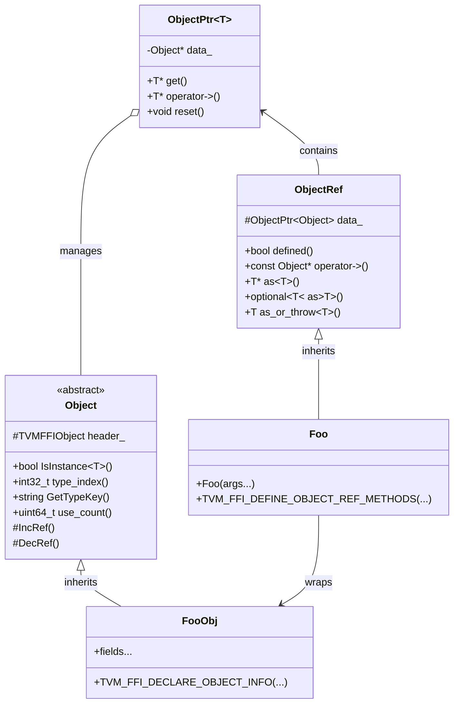
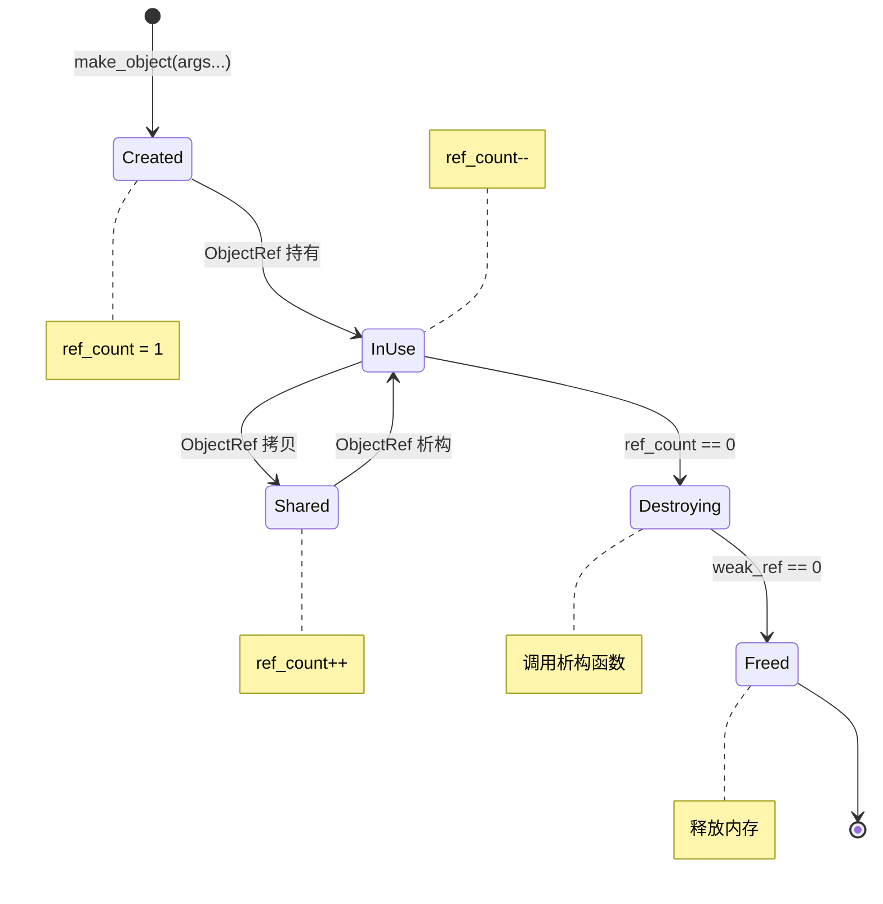

> 📚 **TVM FFI Wiki 教程导航**：
> [首页](00-overview.md) | [目录结构](01-project-structure.md) | [Any类型](02-any-type.md) | [Object系统](03-object-system.md) | [Function](04-function-registry.md) | [容器](05-containers.md) | [反射](06-reflection.md) | [Module](07-module-system.md) | [C++指南](08-cpp-guide.md) | [Python指南](09-python-guide.md) | [构建打包](10-build-packaging.md) | [实战案例](11-examples.md) | [FAQ](12-faq.md) | [源码解析](13-source-analysis.md)

---

# Object 对象系统

## 概述

在跨语言 FFI 场景中，内存管理是最核心的问题之一。C++ 使用智能指针，Python 使用垃圾回收，Rust 使用所有权系统——不同语言的内存管理机制差异巨大。TVM FFI 的 **Object 对象系统**通过**侵入式引用计数（Intrusive Reference Counting）**为 C++、Python、Rust 等多语言提供统一的对象生命周期管理。

为什么需要专门的对象系统？

1. **跨语言生命周期统一**：对象在 C++ 创建、传递到 Python、再传回 Rust，统一引用计数保证安全释放
2. **无 RTTI 的运行时类型信息**：不依赖 C++ RTTI，通过内置类型索引实现类型检查和向下转型
3. **反射支持**：通过类型注册表暴露字段、方法、构造函数给动态语言
4. **稳定 C ABI**：所有 Object 共享 24 字节公共头，可通过 C 接口跨语言传递

Object 系统的核心是两个基类：`Object`（数据对象）和 `ObjectRef`（引用包装器）。

**关键头文件**：[object.h](file:///d:/spaces/SpecWeave/projects/xuanspace/vendor/tvm-ffi/include/tvm/ffi/object.h)

## FooObj + Foo 双类设计模式

TVM FFI 采用经典的**双类设计模式**（Data Class + Reference Wrapper），这也是 LLVM 等现代 C++ 框架采用的设计。

### 两个类的角色

| 类 | 基类 | 职责 | 类比 |
|----|------|------|------|
| `FooObj` | `Object` | 数据存储类，定义字段、方法，堆分配 | `std::string` 内部数据 |
| `Foo` | `ObjectRef` | 引用包装器，类似智能指针，管理引用计数 | `std::shared_ptr<std::string>` |

### 设计动机

1. **分离数据与引用语义**：`Object` 子类只关心数据和业务逻辑；`ObjectRef` 子类负责引用计数和类型安全
2. **支持多态**：通过 `ObjectRef` 持有任意 `Object` 子类引用
3. **值语义**：`ObjectRef` 可以像值一样拷贝、赋值，自动管理引用计数
4. **空值表示**：`ObjectRef` 可以为 null，表示"无对象"

### 类继承关系图



## 定义自定义 Object

让我们通过定义一个二维坐标点 `Point` 对象来学习完整流程。

### 步骤 1：定义数据类（PointObj）

继承 `Object`，定义字段、构造函数，使用 `TVM_FFI_DECLARE_OBJECT_INFO` 宏声明类型信息：

```cpp
#include <tvm/ffi/tvm_ffi.h>

namespace ffi = tvm::ffi;

class PointObj : public ffi::Object {
 public:
  double x;
  double y;

  PointObj(double x, double y) : x(x), y(y) {}

  double DistanceTo(const PointObj& other) const {
    double dx = x - other.x;
    double dy = y - other.y;
    return std::sqrt(dx * dx + dy * dy);
  }

  TVM_FFI_DECLARE_OBJECT_INFO(
    "my_module.Point",  // type_key
    PointObj,           // 当前类
    ffi::Object);       // 父类
};
```

### 步骤 2：定义引用包装器（Point）

继承 `ObjectRef`，构造函数包装 `make_object`，使用宏定义引用方法：

```cpp
class Point : public ffi::ObjectRef {
 public:
  Point(double x, double y)
      : ObjectRef(ffi::make_object<PointObj>(x, y)) {}

  TVM_FFI_DEFINE_OBJECT_REF_METHODS_NOTNULLABLE(
    Point,           // 当前类
    ffi::ObjectRef,  // 父引用类
    PointObj);       // 对应Object类
};
```

### 步骤 3：使用对象

```cpp
Point p1(3.0, 4.0);
Point p2(0.0, 0.0);

std::cout << "distance = " << p1->DistanceTo(*p2) << std::endl;  // 5.0

Point p3 = p1;  // 拷贝，引用计数+1
p3->x = 10.0;   // p1 和 p3 指向同一对象
```

## 对象创建和生命周期

### make_object：创建堆对象

`make_object<T>(args...)` 是创建 Object 的标准方式：

- 堆上分配内存（支持自定义分配器）
- 调用构造函数初始化
- 设置引用计数初始值为 1（强引用 + 弱引用各 1）
- 设置运行时类型索引 `type_index` 和析构函数 `deleter`
- 返回 `ObjectPtr<T>`（内部智能指针）

### 三层指针结构

| 指针类型 | 用途 | 用户可见性 |
|----------|------|-----------|
| `Object*` | 原始裸指针 | 内部使用 |
| `ObjectPtr<T>` | 内部引用计数智能指针，实现 RAII | 内部使用 |
| `ObjectRef`/子类 | 用户侧引用包装器，类型安全 | 用户主要使用 |

### 引用计数规则

引用计数存储在 Object 头的 `combined_ref_count` 字段（64位整数）：
- **低 32 位**：强引用计数（strong ref）
- **高 32 位**：弱引用计数（weak ref）

| 操作 | 强引用计数变化 |
|------|---------------|
| `make_object` 创建 | 初始化为 1 |
| `ObjectPtr`/`ObjectRef` 拷贝 | +1 |
| `ObjectPtr`/`ObjectRef` 析构 | -1 |

当**强引用计数归零时**：调用析构函数
当**弱引用计数也归零时**：释放内存

### 对象生命周期图



## 类型转换和运行时类型检查

TVM FFI 不依赖 C++ RTTI，通过自己的类型系统实现类型检查和向下转型。

### 类型检查与转型 API

| API | 用途 | 失败行为 |
|-----|------|---------|
| `obj->IsInstance<T>()` | 检查是否是 T 或其子类实例 | 返回 `bool` |
| `obj.as<T>()` | 安全向下转型 | 返回 `nullptr`/`std::nullopt` |
| `obj.as_or_throw<T>()` | 严格向下转型 | 抛出异常 |

```cpp
// 类型检查
bool is_point = obj.defined() && obj->IsInstance<PointObj>();

// 安全转型
if (const PointObj* pt = obj.as<PointObj>()) {
  std::cout << "(" << pt->x << ", " << pt->y << ")" << std::endl;
}

// 转型到ObjectRef子类
if (auto opt_pt = obj.as<Point>()) {
  Point pt = opt_pt.value();
}

// 获取类型信息
int32_t tindex = obj.type_index();
std::string key = obj.GetTypeKey();  // "my_module.Point"
```

### 继承与多态示例

```cpp
class ShapeObj : public ffi::Object {
 public:
  virtual double Area() const = 0;
  TVM_FFI_DECLARE_OBJECT_INFO("my_module.Shape", ShapeObj, ffi::Object);
};

class CircleObj : public ShapeObj {
 public:
  double radius;
  CircleObj(double r) : radius(r) {}
  double Area() const override { return 3.14159 * radius * radius; }
  TVM_FFI_DECLARE_OBJECT_INFO_FINAL("my_module.Circle", CircleObj, ShapeObj);
};

// IsInstance 正确识别继承关系
Circle c(5.0);
ffi::ObjectRef ref = c;
ref->IsInstance<CircleObj>();   // true
ref->IsInstance<ShapeObj>();    // true
ref->IsInstance<ffi::Object>(); // true
```

## 宏详解

TVM FFI 提供宏来简化 Object 和 ObjectRef 的定义，避免样板代码。

### TVM_FFI_DECLARE_OBJECT_INFO(type_key, ObjType, ParentObjType)

声明非 final 对象类型的元信息（可被继承）。

**参数**：
- `type_key`：类型唯一字符串（如 `"my_module.Point"`），用于跨语言映射
- `ObjType`：当前类名
- `ParentObjType`：父类名

**主要变体**：
- `TVM_FFI_DECLARE_OBJECT_INFO_FINAL`：声明 final 类型，不可继承，类型检查更快
- `TVM_FFI_DECLARE_OBJECT_INFO_STATIC`：内置类型使用，静态分配类型索引

### TVM_FFI_DEFINE_OBJECT_REF_METHODS(RefType, ParentRefType, ObjType)

定义引用包装器的标准方法，有两个版本：

- `NULLABLE`：可空引用，允许默认构造为 null
- `NOTNULLABLE`：非空引用，必须通过构造函数初始化

**参数**：
- `RefType`：当前引用类名
- `ParentRefType`：父引用类名
- `ObjType`：对应的 Object 子类名

**展开后定义**：构造函数、拷贝/移动、`operator->()`、`get()`、`_type_is_nullable` 标记等。

### 反射注册

通过 `reflection::ObjectDef` 注册构造函数、字段、方法，用于 Python 绑定：

```cpp
TVM_FFI_STATIC_INIT_BLOCK() {
  namespace refl = tvm::ffi::reflection;
  refl::ObjectDef<PointObj>()
      .def(refl::init<double, double>())
      .def_rw("x", &PointObj::x, "X coordinate")
      .def_rw("y", &PointObj::y, "Y coordinate")
      .def("distance_to", &PointObj::DistanceTo);
}
```

## Python 端使用

C++ 对象通过反射注册后，Python 端可直接使用。

### @register_object 装饰器

```python
import tvm_ffi
from typing import TYPE_CHECKING

@tvm_ffi.register_object("my_module.Point")
class Point(tvm_ffi.Object):
    # tvm-ffi-stubgen(begin): object/my_module.Point
    x: float
    y: float
    if TYPE_CHECKING:
        def __init__(self, x: float, y: float) -> None: ...
        def distance_to(self, other: "Point") -> float: ...
    # tvm-ffi-stubgen(end)
```

> `tvm-ffi-stubgen` 工具可自动从 C++ 反射元数据生成 Python 类型存根。

### Python 端使用示例

```python
p1 = Point(3.0, 4.0)
p2 = Point(0.0, 0.0)

print(p1.distance_to(p2))  # 5.0

p3 = p1       # Python别名，C++引用计数不变
p3.x = 10.0
print(p1.x)   # 10.0，同一对象

del p1, p2, p3  # 最后一个引用消失，C++对象自动析构
```

### 跨语言生命周期

- Python 对象创建时：C++ 引用计数 +1
- Python 对象 GC 回收时：C++ 引用计数 -1
- C++ 引用计数归零时：对象自动析构释放

---

← 上一页：[Any/AnyView 类型系统](02-any-type.md) | 下一页 → [Function 函数与全局注册表](04-function-registry.md)
