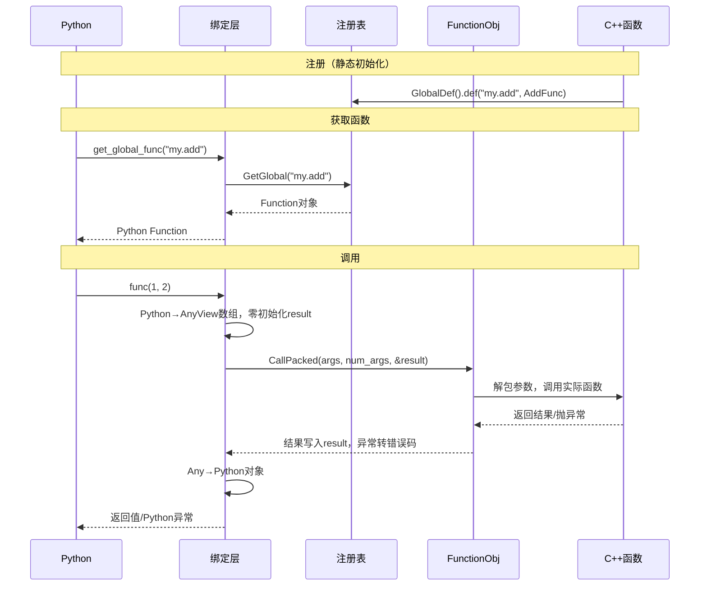
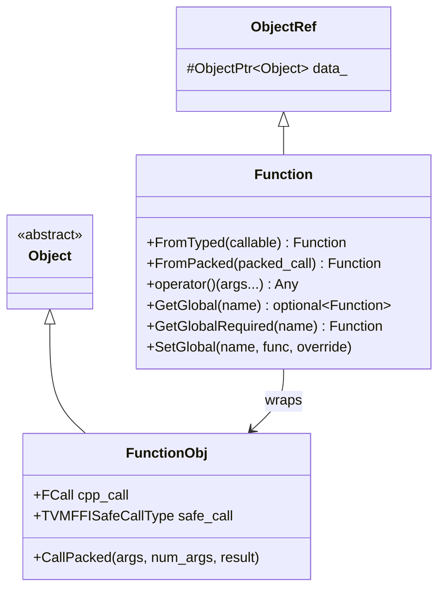
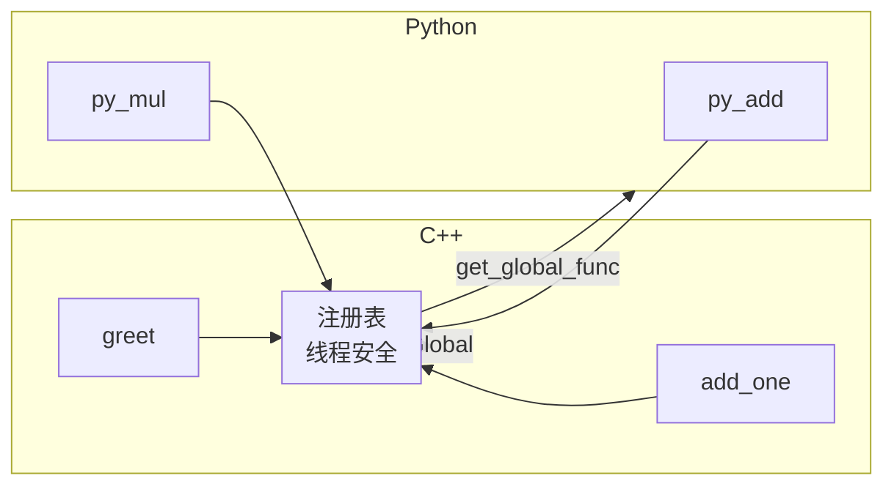

> 📚 **TVM FFI Wiki 教程导航**：
> [首页](00-overview.md) | [目录结构](01-project-structure.md) | [Any类型](02-any-type.md) | [Object系统](03-object-system.md) | [Function](04-function-registry.md) | [容器](05-containers.md) | [反射](06-reflection.md) | [Module](07-module-system.md) | [C++指南](08-cpp-guide.md) | [Python指南](09-python-guide.md) | [构建打包](10-build-packaging.md) | [实战案例](11-examples.md) | [FAQ](12-faq.md) | [源码解析](13-source-analysis.md)

---

# Function 函数与全局注册表

## 概述

**Packed Function（打包函数）**是 TVM FFI 的核心调用机制，是一种类型擦除的函数对象。通过统一的 C ABI，它实现了跨语言函数调用——C++ 注册的函数可在 Python/Rust 中直接调用，反之亦然。

核心特性：

1. **统一跨语言接口**：C++ 函数、Python lambda、Rust 闭包共享同一调用签名
2. **类型擦除**：无需为每个函数签名生成桥接代码，无需 JIT
3. **一等公民**：Function 本身是 Object，可作为参数/返回值/存入容器
4. **稳定 ABI**：C 调用约定保证跨编译器兼容

**关键头文件**：
- `function.h`（源项目归档路径）
- `c_api.h`（源项目归档路径）

## Packed Function 调用约定

### C ABI 签名

所有 Packed Function 在 ABI 边界遵循统一 C 签名：

```cpp
typedef int (*TVMFFISafeCallType)(
    void* handle,           // 资源句柄（闭包数据）
    const TVMFFIAny* args,  // 输入参数数组（非拥有，AnyView）
    int32_t num_args,       // 参数个数
    TVMFFIAny* result       // 输出返回值（拥有，调用方零初始化）
);
```

| 要素 | 说明 |
|------|------|
| 参数 | 打包为 `AnyView` 数组（类型擦除值视图） |
| 返回值 | 通过 `result` 指针写入，函数返回错误码（0=成功，-1=异常） |
| 异常 | C++ 异常存 TLS，错误码 -1 时通过 `TVMFFIErrorMoveFromRaised` 获取 |
| 所有权 | `args` 借用，`result` 由被调用方填充 |

### 调用流程时序图



### 双调用路径优化

`FunctionObj` 内部存储两个函数指针：

| 指针 | 场景 | 异常处理 |
|------|------|---------|
| `cpp_call` | 同一 DSO 内 C++ 调用 | 直接抛异常（快） |
| `safe_call` | 跨 ABI/跨语言调用 | 捕获异常存 TLS，返回错误码 |

`CallPacked` 自动选择路径：`cpp_call` 存在则用它（零异常开销），否则回退到 `safe_call`。

## Function 对象

Function 遵循双类设计：`FunctionObj`（继承 Object）+ `Function`（继承 ObjectRef 引用包装器）。



### 创建 Function

**方式1：FromTyped（推荐）**——从任意可调用对象创建，自动生成打包/解包：

```cpp
#include <tvm/ffi/tvm_ffi.h>
namespace ffi = tvm::ffi;

// 从 lambda
ffi::Function add = ffi::Function::FromTyped([](int x, int y) { return x + y; });

// 从普通函数
int Multiply(int x, int y) { return x * y; }
ffi::Function mul = ffi::Function::FromTyped(Multiply);

// 带 Object 参数
ffi::Function dist = ffi::Function::FromTyped([](ffi::Point p1, ffi::Point p2) {
    return p1->DistanceTo(*p2);
});
```

**方式2：FromPacked**——手写打包格式，用于泛型转发：

```cpp
ffi::Function echo = ffi::Function::FromPacked(
    [](const ffi::AnyView* args, int32_t n, ffi::Any* rv) {
        if (n > 0) *rv = args[0];
    }
);
```

### 调用 Function

```cpp
ffi::Function add = ffi::Function::FromTyped([](int x, int y) { return x + y; });

int sum = add(3, 4).cast<int>();  // 7

// 高阶函数：Function 作为参数
ffi::Function apply_twice = ffi::Function::FromTyped(
    [](ffi::Function f, int x) { return f(f(x).cast<int>()).cast<int>(); }
);
ffi::Function add_one = ffi::Function::FromTyped([](int x) { return x + 1; });
int r = apply_twice(add_one, 5).cast<int>();  // 7
```

`FromTyped` 自动类型转换支持：POD（int/double/bool）、String、ObjectRef 子类、Function、Optional<T>。

## 全局函数注册

全局注册表是线程安全的 `string → Function` 映射，支持跨语言按名查找调用。

### C++ 端注册：GlobalDef

使用 `reflection::GlobalDef` 在静态初始化块注册：

```cpp
static int AddOne(int x) { return x + 1; }
static std::string Greet(ffi::String name) { return "Hello, " + name; }
static int Apply(ffi::Function f, int x) { return f(x).cast<int>(); }

TVM_FFI_STATIC_INIT_BLOCK() {
    namespace refl = tvm::ffi::reflection;
    refl::GlobalDef()
        .def("my_demo.add_one", AddOne, "Add one to input")
        .def("my_demo.greet", Greet, "Greet by name")
        .def("my_demo.apply", Apply, "Apply function to int");
}
```

`TVM_FFI_STATIC_INIT_BLOCK()` 确保注册在库加载时完成（dlopen/程序启动）。

运行时动态注册可用 `Function::SetGlobal`：
```cpp
ffi::Function sub = ffi::Function::FromTyped([](int x, int y) { return x - y; });
ffi::Function::SetGlobal("my_demo.sub", sub, /*override=*/false);
```

### C++ 端获取函数

```cpp
// GetGlobal：可选返回
std::optional<ffi::Function> f = ffi::Function::GetGlobal("my_demo.add_one");
if (f) (*f)(41).cast<int>();  // 42

// GetGlobalRequired：必须存在，否则抛异常
ffi::Function greet = ffi::Function::GetGlobalRequired("my_demo.greet");
greet("World").cast<ffi::String>();  // "Hello, World"
```

### Python 端注册与调用

```python
import tvm_ffi

# 装饰器注册
@tvm_ffi.register_global_func("my_demo.py_add")
def py_add(x: int, y: int) -> int:
    return x + y

# 直接注册
tvm_ffi.register_global_func("my_demo.py_mul", lambda x, y: x * y)

# 获取并调用
add_one = tvm_ffi.get_global_func("my_demo.add_one")
add_one(41)  # 42（C++实现）

# allow_missing=True 找不到返回None
f = tvm_ffi.get_global_func("nonexistent", allow_missing=True)  # None

# 列出/删除函数
names = tvm_ffi.list_global_func_names()
tvm_ffi.remove_global_func("my_demo.temp")
```

### 跨语言互访



Python 可直接调用 C++ 注册的函数，C++ 也可通过 `GetGlobal` 调用 Python 函数。注册表线程安全：`SetGlobal`/`GetGlobal` 可并发调用。

## 回调函数：函数作参数

Function 是一等公民，支持高阶函数、回调、闭包。

### Python 回调传给 C++

```cpp
// C++：接受回调的函数
TVM_FFI_STATIC_INIT_BLOCK() {
    refl::GlobalDef().def("my_demo.times",
        ffi::Function::FromTyped([](int n, ffi::Function cb) {
            for (int i = 0; i < n; ++i) cb(i);
        }), "Call cb n times");
}
```

```python
# Python：传入 lambda
times = tvm_ffi.get_global_func("my_demo.times")
result = []
times(5, lambda i: result.append(i * i))
print(result)  # [0, 1, 4, 9, 16]
```

### C++ 返回闭包

```cpp
refl::GlobalDef().def("my_demo.make_adder",
    ffi::Function::FromTyped([](int x) {
        return ffi::Function::FromTyped([x](int y) { return x + y; });
    }), "Make adder function");
```

```python
make_adder = tvm_ffi.get_global_func("my_demo.make_adder")
add5 = make_adder(5)
add5(10)  # 15
add5(100) # 105
```

注意：Python 回调持有 GIL，C++ 调用 Python 函数时自动获取；Function 引用计数保证生命周期安全，支持嵌套递归调用。

## Python 端完整示例

```python
import tvm_ffi

# 调用 C++ 函数
add_one = tvm_ffi.get_global_func("my_demo.add_one")
print(add_one(41))  # 42

# Python 注册函数
@tvm_ffi.register_global_func("my_demo.factorial")
def factorial(n: int) -> int:
    return 1 if n <= 1 else n * factorial(n - 1)

print(tvm_ffi.get_global_func("my_demo.factorial")(5))  # 120

# 高阶函数
add10 = tvm_ffi.get_global_func("my_demo.make_adder")(10)
print(add10(32))  # 42

# 遍历注册表
my_funcs = [n for n in tvm_ffi.list_global_func_names()
            if n.startswith("my_demo.")]
print(my_funcs)
```

## 小结

| 概念 | 要点 |
|------|------|
| Packed Function | 类型擦除、统一 C ABI、跨语言基础 |
| Function 对象 | 引用计数，`FromTyped` 创建，`operator()` 调用 |
| C ABI | `(handle, args, num_args, result) → error_code` |
| 全局注册表 | `string→Function` 线程安全映射 |
| C++ 注册 | `TVM_FFI_STATIC_INIT_BLOCK()` + `GlobalDef().def()` |
| Python 注册 | `@tvm_ffi.register_global_func` 装饰器 |
| 获取函数 | C++ `GetGlobalRequired` / Python `get_global_func` |
| 一等公民 | Function 可作参数、返回值、存入容器 |

---

← 上一页：[Object 对象系统](03-object-system.md) | 下一页 → [Container 容器类型](05-containers.md)
