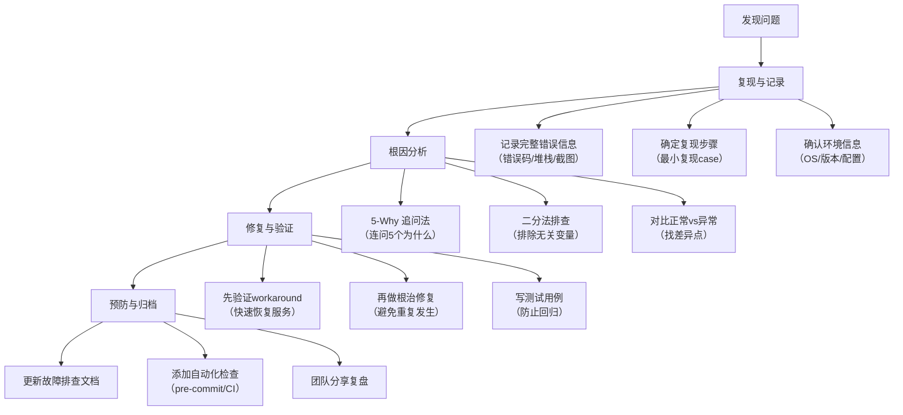

# 故障排查指南库

## 🎯 什么是故障排查指南

> **故障排查指南**记录项目实战中遇到的真实Bug及其完整排查过程。每个指南遵循"症状→根因→修复→预防"的结构化格式，不仅告诉你"怎么修"，更重要的是告诉你"为什么会发生"以及"如何避免下次再犯"。
>
> 与「运维操作指南」的区别：操作指南侧重"怎么做"（正向流程），故障排查侧重"出问题怎么办"（反向修复）。

### 故障严重度分级

| 级别 | 标识 | 说明 |
|------|------|------|
| 🔴 P0 阻断 | 阻断任务执行 | 任务完全无法继续，必须立即修复 |
| 🟠 P1 严重 | 功能严重受损 | 核心功能不可用或结果错误 |
| 🟡 P2 一般 | 局部问题 | 非核心功能异常，有workaround |
| 🟢 P3 轻微 | 体验问题 | 不影响功能，仅影响体验或效率 |

---

## 📋 问题索引表

共 4 篇故障排查记录：

| # | 问题 | 根因 | 解决方案 | 预防措施 | 严重度 |
|---|------|------|---------|---------|--------|
| 1 | [跳过 AGENTS.md 启动协议导致三重连锁输出错误](agents-md-startup-protocol-skipped.md) | 系统级Skill提示与AGENTS.md启动协议存在隐式优先级竞争，Skill提示因物理距离更近在注意力序列中胜出，导致AGENTS.md被跳过，缺失所有项目输出规范 | ① 强化AGENTS.md启动协议（PRIORITY ZERO声明+四步检查清单）；② 启动协议优先提升为全局核心规则第一条 | ① 纠错反馈先做根因诊断再修正；② Skill加载前语义去重检查；③ 产出物生成前合规自检 | 🟠 P1 |
| 2 | [Move-Item 目录重命名报 Access Denied 错误](move-item-access-denied.md) | Windows文件监视器响应延迟导致PowerShell误报：重命名实际已完成，但监视器回调时目录状态变化触发"进程占用"假警报 | ① 先用Test-Path验证实际状态；② 添加-Force参数；③ 用robocopy /MOVE或cmd rename替代；④ 关闭VS Code/资源管理器占用 | ① 执行文件操作后始终验证结果而非仅看错误信息；② Windows文件操作优先考虑robocopy等容错工具 | 🟡 P2 |
| 3 | [相对路径批量修复三类非直觉陷阱](relative-path-repair-pitfalls.md) | 三类陷阱：①replace_all子串级联（N级路径包含N-1级作为子串）；②归档目录深度心算误算；③跨目录前缀位置误判 | ① is_cascade_risky()检测+Grep定位+逐行Edit靶向替换；② compute_relative_depth()+resolve()自动计算验证；③ Glob确认目标目录+audit_cross_dir_links()审计 | ① 替换前检测old in new子串风险；② 用工具计算深度替代心算；③ Glob确认目录位置；④ 修复后立即运行check-links.py验证 | 🟠 P1 |
| 4 | [Git Submodule 显示 modified content 或 dirty 状态](submodule-modified-content.md) | 在submodule目录内创建主项目文件（如README.md元数据），Git将submodule视为外部仓库的独立工作树，主项目文件系统修改被检测为submodule本身的变更 | ① 删除误创建文件；② 元数据外置到vendor/根级（不进入flexloop/）；③ git -C vendor/flexloop status验证 | ① 遵循"不侵入"原则：永远不在submodule内创建/修改主项目文件；② 采用元数据外置模式；③ repo-check.py vendor --deep定期检查；④ .gitignore正确配置vendor/规则 | 🔴 P0 |

---

## 🔍 通用排查方法论

### 故障排查五步法

### 常见根因分类速查

| 根因类型 | 典型症状 | 排查方向 |
|---------|---------|---------|
| 🪟 **平台差异** | 跨平台脚本行为不一致 | Windows vs Linux/macOS 路径分隔符、编码、Shell语法差异 |
| 🔗 **路径问题** | 文件找不到、断链 | 相对路径层级计算错误、目标目录位置误判、replace_all子串级联 |
| 📦 **依赖/Submodule** | 版本不对、状态dirty | Submodule侵入修改、依赖版本未锁定、缓存污染 |
| 🤖 **Agent协议** | 输出格式/路径/结构错误 | 未读取AGENTS.md、Skill冲突、注意力竞争 |
| ⚙️ **工具陷阱** | 命令报错但实际已执行 | PowerShell/Shell的非直觉行为、假错误、延迟回调 |
| 🔤 **编码问题** | 中文乱码、emoji报错 | GBK vs UTF-8、管道转码、BOM问题、CRLF vs LF |

### 排查工具箱

| 工具 | 用途 |
|------|------|
| `Test-Path` | PowerShell中验证文件/目录是否真实存在 |
| `Resolve-Path` / `Path.resolve()` | 解析相对路径为绝对路径验证 |
| `git -C <submodule> status` | 检查submodule内部真实状态 |
| `python .agents/scripts/check-links.py --path <dir> --fix` | 批量检测并修复断链 |
| `python .agents/scripts/repo-check.py vendor --deep` | 深度检查vendor/submodule清洁度 |
| `handle.exe`（Sysinternals） | Windows下定位文件占用进程 |
| `robocopy` | Windows下容错性更高的文件复制/移动 |

---

## 🧭 阅读路径建议

### 快速定位问题
1. 先看上方「问题索引表」，按症状匹配最相似的问题
2. 点击对应文档阅读完整根因分析和修复步骤
3. 重点关注「预防措施」章节，避免同类问题复发

### 系统性学习
1. 按严重度顺序阅读：P0 → P1 → P2
2. 重点理解每个问题的「根因分析」链条，而非只记解决方案
3. 阅读「通用排查方法论」掌握可迁移的排查思维
4. 遇到新问题时按五步法流程执行排查

---

## 🔗 相关资源

- [🏠 知识库首页](../README.md) - 返回知识库总入口
- [📁 运维操作指南](../operations/README.md) - 正向操作流程手册（避免踩坑）
- [📁 架构决策记录](../decisions/README.md) - 理解设计决策背后的权衡
- [📁 团队最佳实践库](../best-practices/README.md) - 预防问题的方法论和Checklist
- [📁 复盘报告目录](../../retrospective/reports/README.md) - 故障的原始复盘来源
- [🔧 check-links.py](../../../scripts/check-links.py) - 链接检查与自动修复工具
