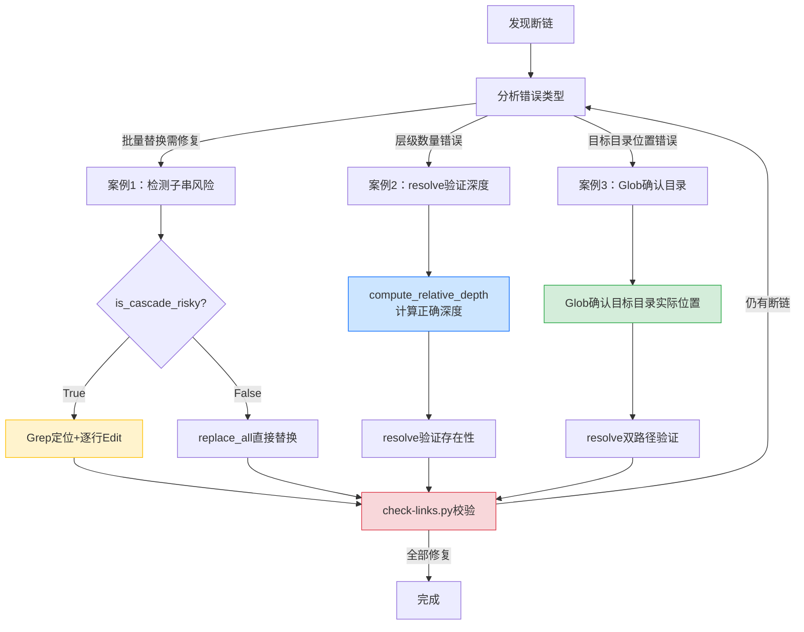

# 相对路径批量修复三类非直觉陷阱与修复方案

## 背景

在一次复盘报告批量断链修复任务中（共修复 481 个断链），表面看相对路径修复是机械操作：找到错误路径 → 替换为正确路径。但实际执行过程中出现了"越修越多"和"修完仍错"两类异常——错误不发生在计算层，而发生在**工具替换机制**和**目录定位层**。

本文档将这三类陷阱的修复逻辑整理为可操作的技术指南，配套 [relative-path-pitfalls.md](../../retrospective/patterns/methodology-patterns/tools-automation/relative-path-pitfalls.md) 模式文档使用：模式文档侧重方法论与可复用性，本文档侧重具体修复操作与验证流程。

## 问题/场景

### 共性表现

| 陷阱类型 | 表面症状 | 深层原因 |
|---------|---------|---------|
| 案例 1：replace_all 子串级联 | 替换后断链数 15 → 31（越修越多） | `replace_all` 子串匹配机制误伤已正确路径 |
| 案例 2：归档目录深度误算 | 归档后所有 `.agents/` 链接断链 | 心算少算一层 `external-learning/` |
| 案例 3：跨目录前缀误判 | `patterns/` 链接解析到不存在的 `docs/patterns/` | 误以为 `patterns/` 在 `docs/` 下而非 `docs/retrospective/` 下 |

### 案例 1：replace_all 子串级联

将 5 级 `../../../../../.agents/`（错误）替换为 6 级 `../../../../../../.agents/`（正确），使用 `replace_all=True` 后断链数从 15 增至 31——原本正确的 6 级路径被误伤为 7 级。

### 案例 2：归档目录深度误算

文件归档到 6 层深度目录后，所有 `.agents/` 引用使用 5 级 `../`，实际需要 6 级。心算漏算了 `external-learning/` 一层。

### 案例 3：跨目录前缀误判

`patterns/` 链接使用 5 级回退，解析到 `docs/patterns/`（不存在）；实际目标 `docs/retrospective/patterns/` 只需 4 级回退。

## 解决方案/经验

### 案例 1 修复：靶向替换替代 replace_all

#### 根因

`../` 重复模式存在数学性质：**N 级路径总是包含 N-1 级作为子串**（从第 3 个字符位置开始）。`replace_all` 搜索短路径时会命中长路径的后半部分。

```
6级: ../../../../../../.agents/   (正确，无需修改)
5级:   ../../../../../.agents/     (错误，需要修改)
        ↑ 6级字符串从位置3开始的子串恰好等于5级
```

#### 修复步骤

**第一步：检测子串风险**

```python
def is_cascade_risky(old: str, new: str) -> bool:
    """replace_all 子串级联风险检测：old 是 new 的子串则不安全。

    注意：只检查 old in new（不检查 new in old）。因为 replace_all
    只搜索 old，如果 old 比 new 长，不会匹配到 new（更短）。
    """
    return old in new

# 检测 5级→6级：old 是 new 的子串，replace_all 会级联
print(is_cascade_risky("../../../../../.agents/", "../../../../../../.agents/"))
# True — 危险，禁止 replace_all
```

**第二步：Grep 定位所有错误行**

```
Grep pattern="\.\./\.\./\.\./\.\./\.\./\.agents/" path="analysis-report.md" -n
# 返回行号：535, 637, 648, 649, 671, 673, 707, 708, ...
```

**第三步：逐行 Edit 靶向替换**

```python
# 用唯一上下文锚定，replace_all=False 逐个替换
Edit(
    file_path="analysis-report.md",
    old_string="[阶段守卫](../../../../../.agents/scripts/stage-guard.py)",
    new_string="[阶段守卫](../../../../../../.agents/scripts/stage-guard.py)",
    replace_all=False
)
```

**替代方案**：反向修复级联后再靶向修复（适用于级联已发生的情况）

```python
# Step 1: 反向替换——把被误伤的 7级 回退为 6级（7级包含6级子串，但6级短，不会级联）
Edit(
    file_path="analysis-report.md",
    old_string="../../../../../../../.agents/",   # 7级（被误伤的）
    new_string="../../../../../../.agents/",       # 6级
    replace_all=True  # 安全：6级短于7级，不会级联
)
# Step 2: 再逐行 Edit 修复原始的 5级→6级（同上）
```

#### 验证

```bash
python .agents/scripts/check-links.py --path "docs/retrospective/reports/insight-extraction/external-learning/retrospective-codex-article-analysis-20260706"
# 确认 .agents/ 相关断链数为 0
```

### 案例 2 修复：resolve() 验证替代心算

#### 根因

归档目录有 6 层深度，但心算时容易把 `reports/` 误认为顶层目录，从 `reports/` 开始数层级，漏掉 `docs/retrospective/` 两层。

```
docs/                                    ← 1层
  retrospective/                         ← 2层
    reports/                             ← 3层
      insight-extraction/                ← 4层
        external-learning/               ← 5层
          retrospective-codex-.../       ← 6层
            analysis-report.md           ← 文件在此
```

#### 修复步骤

**第一步：用 Python 自动计算正确深度**

```python
from pathlib import Path

def compute_relative_depth(source_file: Path, target_dir: Path, project_root: Path) -> int:
    """计算从源文件到目标目录需要的 ../ 层数。"""
    source_dir = source_file.parent.resolve()
    return len(source_dir.relative_to(project_root).parts)

source = Path("docs/retrospective/reports/insight-extraction/external-learning/"
              "retrospective-codex-article-analysis-20260706/analysis-report.md")
project_root = Path(".")
target = project_root / ".agents"

depth = compute_relative_depth(source, target, project_root)
print(f"需要 {depth} 层 ../")  # 输出: 需要 6 层 ../
print(f"正确路径: {'../' * depth}.agents/")
# 输出: 正确路径: ../../../../../../.agents/
```

**第二步：用 resolve() 验证路径存在**

```python
from pathlib import Path

source_file = Path("docs/retrospective/reports/insight-extraction/external-learning/"
                   "retrospective-codex-article-analysis-20260706/analysis-report.md")

# ❌ 错误路径（5级，少算一层）
wrong_path = "../../../../../.agents/scripts/stage-guard.py"
print(f"5级路径存在: {(source_file.parent / wrong_path).resolve().exists()}")  # False

# ✅ 正确路径（6级）
correct_path = "../../../../../../.agents/scripts/stage-guard.py"
print(f"6级路径存在: {(source_file.parent / correct_path).resolve().exists()}")  # True
```

**第三步：批量替换（已确认无子串风险，可使用 replace_all）**

```python
# 5级→6级：old(5级) 是 new(6级) 的子串 → 危险，必须用靶向替换
# 6级→5级：old(6级) 不是 new(5级) 的子串 → 安全，可 replace_all

# 本场景是 5级→6级，必须用案例1的靶向替换方法
```

**第四步：check-links.py 即时校验**

```bash
# 自动修复 file:/// 绝对路径和深度错误
python .agents/scripts/check-links.py \
  --path "docs/retrospective/reports/insight-extraction/external-learning/retrospective-codex-article-analysis-20260706" \
  --fix

# 预览修复内容（不写入文件）
python .agents/scripts/check-links.py \
  --path "docs/retrospective/reports/insight-extraction/external-learning/retrospective-codex-article-analysis-20260706" \
  --fix --dry-run
```

#### 验证

```python
# 一行验证法：路径写完后立即检查
assert (source_file.parent / relative_path).resolve().exists(), \
    f"断链: {relative_path} 解析到 {(source_file.parent / relative_path).resolve()}"
```

### 案例 3 修复：Glob 确认目标目录位置

#### 根因

错误不在层级数量，而在**目标目录实际位置判断错误**。编写者知道 `patterns/` 属于 `retrospective` 体系，但未确认它是 `docs/retrospective/patterns/` 而非 `docs/patterns/`。

```
文件: docs/retrospective/reports/insight-extraction/external-learning/retrospective-codex-.../analysis-report.md

5级回退: ../../../../../ → docs/
         + patterns/     → docs/patterns/  ❌ 不存在

4级回退: ../../../../    → docs/retrospective/
         + patterns/     → docs/retrospective/patterns/  ✅ 正确
```

#### 修复步骤

**第一步：Glob 确认目标目录实际位置**

```bash
# Glob pattern="docs/**/patterns/" → 返回匹配的目录
# 也可以用 Python 验证
python -c "from pathlib import Path; print([p for p in Path('docs').rglob('patterns') if p.is_dir()])"
# 输出: [PosixPath('docs/retrospective/patterns')]  ← 在 docs/retrospective/ 下，不是 docs/ 下
```

**第二步：resolve() 双路径验证**

```python
from pathlib import Path

source_file = Path("docs/retrospective/reports/insight-extraction/external-learning/"
                   "retrospective-codex-article-analysis-20260706/analysis-report.md")

# ❌ 错误路径（5级，解析到 docs/patterns/）
wrong_path = "../../../../../patterns/methodology-patterns/tools-automation/path-discipline.md"
resolved_wrong = (source_file.parent / wrong_path).resolve()
print(f"5级路径解析到: {resolved_wrong}")
# 输出: docs/patterns/methodology-patterns/tools-automation/path-discipline.md
print(f"5级路径存在: {resolved_wrong.exists()}")  # False — docs/patterns/ 不存在

# ✅ 正确路径（4级，解析到 docs/retrospective/patterns/）
correct_path = "../../../../patterns/methodology-patterns/tools-automation/path-discipline.md"
resolved_correct = (source_file.parent / correct_path).resolve()
print(f"4级路径解析到: {resolved_correct}")
# 输出: docs/retrospective/patterns/methodology-patterns/tools-automation/path-discipline.md
print(f"4级路径存在: {resolved_correct.exists()}")  # True
```

**第三步：检测子串风险后批量替换**

```python
# 先检测子串风险
old = "../../../../../patterns/"
new = "../../../../patterns/"
print(is_cascade_risky(old, new))  # False — 5级(old)不是4级(new)的子串

# ✅ 安全：可以直接 replace_all
# Edit(file_path="analysis-report.md", old_string=old, new_string=new, replace_all=True)
```

#### 验证

```python
# 路径前缀审计函数——归档后自动审计所有跨目录引用
import re
from pathlib import Path

def audit_cross_dir_links(source_file: Path, project_root: Path) -> list[dict]:
    """审计 Markdown 文件中所有跨目录引用，检测前缀误判。

    Returns:
        断链列表: [{line, text, url, resolved, candidates}]
    """
    LINK_RE = re.compile(r'\[([^\]]+)\]\(([^)]+)\)')
    content = source_file.read_text(encoding="utf-8")
    broken = []

    for i, line in enumerate(content.splitlines(), 1):
        for m in LINK_RE.finditer(line):
            text, url = m.group(1), m.group(2)
            if url.startswith(("http", "#", "mailto:")):
                continue
            clean_url = url.split("#")[0]
            if not clean_url:
                continue
            resolved = (source_file.parent / clean_url).resolve()
            if not resolved.exists():
                target_name = Path(clean_url).name
                candidates = list(project_root.glob(f"**/{target_name}"))[:3]
                broken.append({
                    "line": i,
                    "text": text,
                    "url": url,
                    "resolved": str(resolved),
                    "candidates": [str(c) for c in candidates]
                })
    return broken

# 运行审计
broken_links = audit_cross_dir_links(source_file, Path("."))
for b in broken_links:
    print(f"行 {b['line']}: [{b['text']}]({b['url']})")
    print(f"  解析到: {b['resolved']}")
    print(f"  候选: {b['candidates']}")
```

### 通用修复工作流



## 防范措施总结

| 陷阱类型 | 防范核心 | 工具/方法 |
|---------|---------|----------|
| replace_all 子串级联 | 替换前检测 `old in new` | `is_cascade_risky()` 函数 |
| 归档目录深度误算 | 用工具计算深度替代心算 | `compute_relative_depth()` + `resolve()` 验证 |
| 跨目录前缀误判 | 编写前 Glob 确认目标目录位置 | `find_target_dir()` + `audit_cross_dir_links()` |
| 通用 | 修复后立即运行链接检查 | `check-links.py --fix --dry-run` 预览 → `--fix` 执行 |

**共性教训**：相对路径修复的失败不在计算层，而在替换机制与目录定位层。永远用工具验证替代心算——工具会诚实地告诉你路径是否存在、子串是否会级联、目录实际在哪里。

## 参考

- [相对路径三类特殊踩坑案例（模式文档）](../../retrospective/patterns/methodology-patterns/tools-automation/relative-path-pitfalls.md) — 方法论视角的同源文档，包含成熟度评估与模式关系图
- [check-links.py 链接检查工具](../../../scripts/check-links.py) — 项目内置断链检测与自动修复工具
- [link-check-cmd Skill](../../../skills/link-check-cmd/SKILL.md) — 链接检查命令的 Skill 门面
- [Move-Item 目录重命名报 Access Denied 错误](move-item-access-denied.md) — 同类 Windows 路径操作故障排查文档
- [跳过 AGENTS.md 启动协议导致三重连锁输出错误](agents-md-startup-protocol-skipped.md) — 同类工具使用陷阱故障排查文档
