# Bus Factor = 1 团队建设改进计划（草案）

> **状态**：草案 v0.1，待 xinetzone 审阅后执行
> **目标问题**：核心问题 #4 — 97.8% 提交来自单一贡献者（xinetzone: 1473/1506 = 97.8%），项目巴士因子=1
> **时间范围**：分3个阶段，共12周（约3个月）

---

## 一、问题诊断

### 1.1 当前贡献分布

| 贡献者 | 提交数 | 占比 | 性质 |
|--------|--------|------|------|
| xinetzone | 1473 | 97.8% | BDFL（仁慈独裁者）+全栈核心维护者 |
| liuxinwei | 23 | 1.5% | 第二位人类贡献者，参与度极低 |
| github-actions[bot] | 5 | 0.3% | CI自动化（stats更新等） |
| Administrator | 4 | 0.3% | 环境/配置类提交 |
| flexloop | 1 | 0.1% | vendor子模块提交 |

### 1.2 根因分析（5-Whys）

**为什么Bus factor = 1？**
- 因为只有 xinetzone 一个人在持续提交代码。

**为什么其他人没有持续参与？**
- 因为 liuxinwei（第二贡献者，23次提交）参与后没有形成持续贡献节奏。

**为什么难以形成持续贡献？**
- 三个原因：
  1. **认知门槛高**：项目规范体系复杂（22个核心规范入口、18个Skill、133+规则），现有 [ONBOARDING.md](../../ONBOARDING.md) 是面向**AI智能体**的入职指南，不是面向人类贡献者的
  2. **缺少低门槛任务入口**：没有"good first issue"标签、没有分级任务体系，新贡献者不知道从哪开始
  3. **知识传递缺失**：架构决策过程、设计哲学、调试技巧等隐性知识只在xinetzone脑中，文档虽多但缺乏"为什么这样设计"的上下文

**为什么没有人类贡献者入职文档？**
- 因为项目从0到1的27天是xinetzone单人高速迭代期，[CONTRIBUTING.md](../../../../CONTRIBUTING.md) 只写了git操作流程（clone/branch/commit/PR），缺乏架构理解、开发环境配置、模块地图等新人必需信息。

**根因总结**：不是项目不欢迎贡献，而是**贡献者漏斗在"了解项目"和"找到第一个任务"两个环节断裂**——新人能看到代码但看不懂，想贡献但不知从何下手。

### 1.3 风险评估

| 风险场景 | 影响 | 可能性 | 风险等级 |
|---------|------|--------|---------|
| xinetzone 短期不可用（1-2周） | 项目停滞，PR无法review，issue无人响应 | 中 | 🔴 高 |
| xinetzone 长期不可用（>1月） | 项目事实上停摆，已建立的自动化体系无人维护 | 低 | 🔴 高 |
| 关键知识随人走（设计决策上下文丢失） | 即使有文档，后来人也不知道"为什么这样做"，重构风险高 | 高 | 🟡 中 |
| 社区想贡献但进不来 | 项目无法从开源社区获得外部贡献 | 高 | 🟡 中 |

---

## 二、改进目标

### 2.1 量化目标（12周内）

| 指标 | 当前值 | 目标值（12周末） | 衡量方式 |
|------|--------|-----------------|---------|
| Bus factor | 1 | **≥2**（至少1人能独立处理>50%核心模块） | git log 统计 |
| 活跃人类贡献者（月提交≥5） | 1 | **≥3** | `git shortlog -sn --since="X months ago"` |
| 第二位贡献者累计提交 | 23 | **≥100** | git log |
| good first issue 数量 | 0 | **≥10个**（且至少3个被外部领取） | GitHub Issues标签 |
| 新人入职文档完备度 | 面向AI | **面向人类，含架构地图+5个上手教程** | 文档审计 |

### 2.2 定性目标

1. **xinetzone 休假1周项目不瘫痪**：CI自动化继续运行，至少1人能处理日常PR和紧急bug
2. **外部新人能在2小时内完成第一个PR**：从阅读贡献指南到提交一个文档修复PR
3. **核心决策有记录可追溯**：架构决策记录（ADR）覆盖所有重大设计选择
4. **CODEOWNERS 有至少2个reviewer**：关键目录不只有一个人能审核

---

## 三、三阶段改进路线图

```mermaid
flowchart LR
    subgraph P1 ["阶段1：基础铺路（Week 1-4）"]
        P1A["人类贡献者Onboarding文档"]
        P1B["模块架构地图（ADR）"]
        P1C["good first issue 标签体系"]
        P1D["CODEOWNERS 补充"]
    end
    subgraph P2 ["阶段2：主动培养（Week 5-8）"]
        P2A["结对编程/Code Walkthrough"]
        P2B["任务分级体系（S/M/L）"]
        P2C["Reviewer权限下放"]
        P2D["定期同步机制"]
    end
    subgraph P3 ["阶段3：社区开放（Week 9-12）"]
        P3A["GitHub Discussions 启用"]
        P3B["贡献者认可机制"]
        P3C["外部分享/宣传"]
        P3D["治理文档完善"]
    end
    P1 --> P2 --> P3
```

### 阶段1：基础铺路（Week 1-4）—— 降低贡献门槛

**核心思路**：先修桥，再邀人。让项目变得"可接近"。

| # | 行动 | 具体内容 | 交付物 | 优先级 |
|---|------|---------|--------|--------|
| 1.1 | **人类贡献者Onboarding指南** | 区别于AI智能体的ONBOARDING.md，新增HUMAN_ONBOARDING.md（或扩展CONTRIBUTING.md），包含：开发环境搭建（Python版本/依赖/IDE配置）、核心概念图解（AGENTS.md/.agents/目录结构的角色）、5分钟快速体验（跑通一个脚本+一个测试）、常见陷阱 | HUMAN_ONBOARDING.md | 🔴 高 |
| 1.2 | **模块架构地图** | 新增 `docs/architecture/module-map.md`，用图+表说明各模块职责和依赖关系：哪些模块是核心（不能轻易改）、哪些是扩展（适合新人练手）、模块间的数据流 | module-map.md | 🔴 高 |
| 1.3 | **架构决策记录（ADR）** | 使用MADR格式（轻量ADR模板），为至少5个关键决策补写ADR：(a)为什么用Python标准库零依赖原则 (b)为什么采用AGENTS.md入口+容器架构 (c)三阶段递进原则的由来 (d)原子化设计哲学 (e)vendor子模块治理方案 | docs/adr/ADR-000~004.md | 🟡 中 |
| 1.4 | **good first issue 标签体系** | 在GitHub Issues中创建：`good first issue`（文档修复/简单测试/typo）、`help wanted`（功能需求，有一定复杂度）、`mentor available`（需要指导）三个标签；首批创建≥10个good first issue | GitHub Issues | 🔴 高 |
| 1.5 | **CODEOWNERS 补充第二reviewer** | 识别liuxinwei已熟悉的模块（看23次提交涉及哪些文件），在CODEOWNERS中将其设为对应目录的secondary reviewer；核心目录至少2人审核 | CODEOWNERS更新 | 🟡 中 |
| 1.6 | **开发环境一键脚本** | 新增 `scripts/setup-dev.ps1`（Windows）和 `scripts/setup-dev.sh`（跨平台），自动检查Python版本、安装pytest/pytest-cov、运行全量测试验证环境 | setup脚本 | 🟡 中 |

**阶段1验收标准**：
- [ ] 一个从未接触过项目的Python开发者，按HUMAN_ONBOARDING.md能在30分钟内跑通全量测试
- [ ] GitHub上有≥10个标记为good first issue的issue
- [ ] CODEOWNERS中核心目录（scripts/, .github/workflows/）至少2人

### 阶段2：主动培养（Week 5-8）—— 培养第二维护者

**核心思路**：重点培养liuxinwei（已有23次提交，是最接近能独立贡献的人）和任何在阶段1中领取good first issue的外部贡献者。

| # | 行动 | 具体内容 | 交付物 | 优先级 |
|---|------|---------|--------|--------|
| 2.1 | **Code Walkthrough 系列** | xinetzone录制/撰写3篇核心模块代码导读：(a)docgen.py的stats系统（含三防线） (b)check-links.py链接检查引擎 (c)AGENTS.md启动协议执行流程。格式可以是Markdown walkthrough文档（比视频更易检索） | docs/walkthroughs/ 3篇文档 | 🔴 高 |
| 2.2 | **任务分级与分配体系** | 将所有待办分为S/M/L三级：S（<1h，文档/typo/测试补充，适合新人）、M（1-4h，新功能小模块/bug修复，需reviewer指导）、L（>1天，架构级变更，需讨论）。每个M/L任务有明确的"前置知识"标注 | tasks.md或Issue模板 | 🟡 中 |
| 2.3 | **Reviewer权限下放** | 给liuxinwei添加PR review权限（write access），从S级任务开始独立review；xinetzone对liuxinwei的review做meta-review（审查review质量） | GitHub权限设置 | 🔴 高 |
| 2.4 | **定期同步机制** | 建立每周1次30分钟同步（可以是异步文字）：本周完成/下周计划/阻塞问题。不一定需要会议，GitHub Discussion线程即可 | 周同步Discussion帖 | 🟡 中 |
| 2.5 | **Pair Programming on Hard Tasks** | 选1-2个中等难度任务（M级），xinetzone和liuxinwei结对（共享屏幕或详细PR review对话），通过真实任务传递隐性知识 | 1-2个结对PR | 🟡 中 |
| 2.6 | **贡献者成长路径文档化** | 明确从"首次贡献者→活跃贡献者→reviewer→维护者"的路径和每个阶段的要求，让贡献者知道如何成长 | contributing-roles.md | 🟢 低 |

**阶段2验收标准**：
- [ ] liuxinwei 独立完成≥3个M级任务的review（xinetzone meta-review通过）
- [ ] liuxinwei 单周提交≥5次（至少持续2周）
- [ ] 至少1个外部贡献者（非xinetzone/liuxinwei）的PR被合并
- [ ] 3篇Code Walkthrough文档完成

### 阶段3：社区开放（Week 9-12）—— 对外扩展

**核心思路**：内部有第二维护者兜底后，开始对外开放，从外部社区引入贡献者。

| # | 行动 | 具体内容 | 交付物 | 优先级 |
|---|------|---------|--------|--------|
| 3.1 | **启用GitHub Discussions** | 开启Discussions功能，设置分类：Announcements（项目动态）、Q&A（使用问题）、Ideas（功能建议）、Showcase（使用SpecWeave的成果展示）、Contributors（贡献者交流） | GitHub仓库设置 | 🟡 中 |
| 3.2 | **贡献者认可机制** | (a)README.md增设贡献者墙（用all-contributors bot） (b)重要贡献记入AGENTS.md changelog (c)首次合并PR后发送欢迎信息（GitHub Action自动回复） (d)核心维护者在Release Note中感谢贡献者 | README更新 + Action | 🟡 中 |
| 3.3 | **项目宣传材料** | 写1篇中文介绍文章（"SpecWeave：一个AI智能体治理工作区的27天演进"），发到技术社区（掘金/知乎/GitHub Trending）；文章侧重"解决了什么问题"+"如何参与"，而非自嗨 | 1篇外宣文章 | 🟢 低 |
| 3.4 | **治理文档完善** | 将BDFL（当前模式）逐步过渡到"BDFL + 核心贡献者"模式：建立GOVERNANCE.md中的决策流程——小变更直接PR、中等变更需1个reviewer批准、重大变更需RFC（Request for Comments）流程 | GOVERNANCE.md更新 | 🟢 低 |
| 3.5 | **监控Bus Factor** | 在docgen.py stats中新增"贡献者多样性"指标（活跃贡献者数/Herfindahl指数），纳入周报和CI监控 | docgen.py stats更新 | 🟡 中 |

**阶段3验收标准**：
- [ ] GitHub Discussions启用且有≥10个讨论帖
- [ ] Bus factor ≥ 2（至少1人除xinetzone外有write access且能独立review和merge PR）
- [ ] 外部贡献者（非内部团队）≥2人有合并PR
- [ ] 贡献者多样性指标纳入docgen stats

---

## 四、风险与缓解

| 风险 | 影响 | 缓解措施 |
|------|------|---------|
| xinetzone时间不足，培养他人反而拖慢进度 | 短期开发速度下降 | (a)阶段1不要求培养他人，只是建文档，速度影响<10% (b)培养他人的时间投入是有回报的投资，2个月后review负担会减轻 |
| 没有外部贡献者来领good first issue | 阶段3目标落空 | 降低预期：外部贡献是bonus，核心是内部至少2人能维护（liuxinwei培养是确定性的） |
| 文档写了但没人看 | 投入浪费 | (a)每个新PR都引用相关文档链接 (b)good first issue中直接附上需要读的文档链接 (c)用PR模板强制新人确认已读Onboarding |
| liuxinwei没有时间/意愿成长为维护者 | 第二维护者计划失败 | (a)与其沟通时间和意愿，不勉强 (b)如果内部无人，考虑从外部积极贡献者中培养（但周期更长） |
| 权限下放后引入质量问题 | 代码质量下降 | (a)CODEOWNERS要求xinetzone或liuxinwei至少一个approve (b)CI质量门禁（已有16步）防止低级问题合入 (c)meta-review机制确保review质量 |

---

## 五、立即可以开始的5件事（不需要长期计划批准）

以下5件事本周就可以做，不需要完整计划批准：

1. **创建3-5个good first issue**：标记简单的文档修正/测试补充/typo修复，每个issue有清晰的复现/修改步骤
2. **补充CODEOWNERS**：把liuxinwei加为scripts/tests/目录的co-owner（他的23次提交主要涉及测试）
3. **写一个5分钟快速上手README段落**：在现有CONTRIBUTING.md顶部加一段"30秒快速开始"——告诉新人怎么跑测试
4. **给liuxinwei开write权限**：让他能做PR review，从S级issue开始
5. **建一个GitHub Issue模板**：配置好feature-request/bug-report/good-first-issue模板，降低提issue的门槛

---

## 六、附录：现有资产盘点（可复用）

| 现有资产 | 对团队建设的价值 | 需要改进 |
|---------|----------------|---------|
| [CONTRIBUTING.md](../../../../CONTRIBUTING.md) | 已有git操作流程 | 缺少架构理解/环境搭建/新人引导内容 |
| [GOVERNANCE.md](../../../../GOVERNANCE.md) | 已有治理框架 | 需要补充决策流程细节和角色晋升路径 |
| [CODEOWNERS](../../../../CODEOWNERS) | 已有所有权机制 | 目前核心目录只有xinetzone，需补充第二owner |
| [.agents/teams/](../teams/README.md) | 已有AI角色团队体系 | 面向AI，不适用人类贡献者，但RBAC模型可参考 |
| [.agents/ONBOARDING.md](../../ONBOARDING.md) | 有onboarding文档概念 | 面向AI智能体，需要新建人类版本 |
| CI质量门禁（16步） | 自动化防护完善 | 权限下放后CI安全网已经足够 |
| 周复盘机制（ACT-04刚完成） | 已有周度节奏 | 可以扩展为包含贡献者活跃度的周度审视 |

---

## 七、待讨论问题（请xinetzone确认）

1. **liuxinwei的意愿**：他是否有时间和意愿成长为维护者？还是23次提交只是偶尔帮忙？这决定阶段2重点是内部培养还是外部引入。
2. **项目定位**：SpecWeave是xinetzone的个人工具/方法论项目，还是希望成为社区项目？如果定位为个人项目，Bus factor=1是可接受风险，只需做"知识备份"即可；如果希望社区化，则按本计划执行。
3. **时间投入预算**：xinetzone每周愿意投入多少时间在团队建设上（写文档/做walkthrough/review他人代码）？
4. **是否接受外部贡献者**：对来自完全陌生开发者的PR是什么态度？欢迎/谨慎/不接受？
5. **Go/No-Go决策**：本草案是否批准执行？还是先只做第五节"立即可以开始的5件事"？
