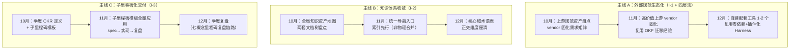

# SpecWeave 知识生态建设 Q4 规划（草案）

> **状态**：草案 v0.1，待 xinetzone 审阅后执行
> **规划目标**：把 OKF 生态建设沉淀出的「四层生态建设法」与 3 条核心洞察，推广到整个 SpecWeave 知识/Agent 生态
> **时间范围**：2026 Q4（2026-10 ~ 2026-12），3 个月（9 月可作为准备期，见第五节）
> **追溯来源**：[OKF 生态整体建设里程碑复盘报告](../../../docs/retrospective/reports/milestone/okf-ecosystem-milestone-retrospective-20260819.md)

---

## 一、规划背景与诊断

### 1.1 复盘沉淀的可复用资产

本次 OKF 生态复盘（15 天、38 提交、12 spec、5 子里程碑）沉淀出 1 个可复用模式与 3 条核心洞察，是 Q4 规划的出发点：

| 资产 | 内容 | 对应战略主线 |
|------|------|-------------|
| **模式：四层生态建设法** | 规范→固化→自建→收敛 四层递进 | 主线 A + B 的骨架 |
| **洞察 I-1** | vendor 固化是生态建设的价值转折点（而非自建工具本身） | 主线 A |
| **洞察 I-2** | 知识散落的收敛方式是「索引先行」而非「内容合并」 | 主线 B |
| **洞察 I-3** | 规模工程靠「子里程碑独立闭环」分摊风险（而非单一大 spec） | 主线 C |

### 1.2 现状诊断（推广目标域的 3 个缺口）

OKF 生态验证了上述方法论，但尚未推广到更广的知识/Agent 生态。当前 SpecWeave 生态存在 3 个与该方法论直接对应的缺口：

1. **外部规范未系统固化**（对应 I-1）：知识库已覆盖 12+ 外部规范/参考实现的 wiki 教程（AGENTS.md 标准、各类 Agent 平台、知识管理工具等），但仅 OKF 相关上游完成 vendor 固化，其余上游仍停留在「文档学习」层，未进入「固化→自建」闭环
2. **知识散落未全局收敛**（对应 I-2）：`docs/` 与 `.agents/docs/` 两套文档树并存（例如里程碑复盘报告在 `docs/retrospective/`，而规划/模式/架构在 `.agents/docs/`），全项目缺少类似 okf-topic-index.md 的**全局**统一导航入口
3. **生态建设缺子里程碑节奏**（对应 I-3）：现有生态建设多以单任务推进，未像 OKF 生态那样按「子里程碑独立 spec→实现→复盘」闭环组织，风险呈集中式分布

---

## 二、规划目标

### 2.1 量化目标（Q4 末，2026-12-31）

| 指标 | 当前值（2026-08-19 基线） | 目标值 | 衡量方式 |
|------|--------------------------|--------|---------|
| 已 vendor 固化的上游规范/参考实现 | 4 个（knowledge-catalog、awesome-okf-xs、okf-libs 等） | **≥8 个** | git submodule 清单 |
| 自建配套工具（复用四层法） | 1 个（OKF 工具链） | **≥3 个** | projects/*/tools/ 目录 |
| 全局知识导航入口 | 1 个（仅 OKF 主题） | **全项目统一导航 1 套** | 文档审计 |
| 知识资产盘点覆盖率 | 未盘点 | **100%** | 资产盘点报告 |
| 子里程碑独立闭环模板 | 仅 OKF 生态 5 个实例 | **标准化模板 + 全量应用** | 文档审计 |
| 季度 OKR 达成率 | 无 | **≥80%** | OKR 追踪 |

> 说明：量化指标的「适用场景 / 基线 / 衡量方法」三维前提已在本表给出；具体子目标在第三节各主线中进一步拆解。

### 2.2 定性目标

1. **方法论可复用**：「四层生态建设法」从 OKF 单项验证，升级为全项目生态建设的**标准范式**（有模板 + 有反模式清单）
2. **知识可达**：任意一份知识资产都能通过全局导航在 2 次点击内定位，无需记忆目录结构
3. **上游可追溯**：所有高价值外部规范均有 vendor 固化或明确的「不固化」决策记录
4. **交付可验收**：Q4 每项生态建设任务都能独立验收、独立复盘、独立回滚

---

## 三、季度路线图：三条战略主线

> 三条主线分别由复盘 I-1 / I-2 / I-3 派生，按「月份主题」并行推进，而非串行依赖。

### 主线 A：外部规范生态化（洞察 I-1 + 四层生态建设法）

**核心思路**：把「理解→固化→自建→收敛」四步法从 OKF 单项推广为标准范式，先摸清上游资产，再对高价值上游执行 vendor 固化，最后自建配套工具。**价值转折点在「固化」而非「自建」**——先锁定权威上游，再谈自建。

| # | 子里程碑 | 关键动作 | 交付物 | 优先级 |
|---|---------|---------|--------|--------|
| A1 | **上游规范资产盘点**（10月） | 扫描 `.agents/docs/knowledge/` 与 `docs/knowledge/` 全部 wiki 教程，识别其上游规范/参考实现；按「是否公开 spec、是否需本地固化、是否需自建工具」产出 vendor 固化需求矩阵 | 资产盘点报告 + vendor 优先级矩阵 | 🔴 高 |
| A2 | **高价值上游 vendor 固化**（11月） | 对矩阵中 ≥4 个高价值上游执行 git submodule 固化（复用 OKF 的 awesome-okf/knowledge-catalog 三轮迁移经验：游离状态→submodule、锁定版本、明确「第三方 vs 自建」边界） | 4+ 个 submodule 固化 + 迁移记录 | 🔴 高 |
| A3 | **自建配套工具**（12月） | 基于已固化规范，自建 1-2 个配套工具（复用 OKF 工具链架构：零运行时依赖、插件化 Harness、CLI 子命令） | 1-2 个 tools/ 子项目 | 🟡 中 |

**主线 A 验收标准**：
- [ ] vendor 固化需求矩阵覆盖 100% 已学习外部规范
- [ ] 新增 ≥4 个上游 vendor 固化，且每个有「固化决策记录」
- [ ] 新增 ≥1 个自建工具，复用四层法且有独立 spec→实现→复盘

### 主线 B：知识体系收敛（洞察 I-2）

**核心思路**：用「索引先行」而非「内容合并」治理文档树散落。不迁移物理文件，仅新建全局导航入口 + 交叉引用，低成本、可逆地完成收敛。

| # | 子里程碑 | 关键动作 | 交付物 | 优先级 |
|---|---------|---------|--------|--------|
| B1 | **全局知识资产地图**（10月） | 扫描 `docs/` 与 `.agents/docs/` 两套文档树，产出知识资产清单（分类 + 物理位置 + 是否重复 + 权威来源） | 全局知识资产清单 | 🔴 高 |
| B2 | **统一导航入口**（11月） | 类比 okf-topic-index.md，为全项目建立统一导航（按正交维度分类：格式规范 vs 工具链 等），以交叉引用收口，不做物理合并 | 全项目统一导航入口 | 🔴 高 |
| B3 | **核心域术语表**（12月） | 为核心域（协议接口 / 工具链 / 方法论）建立 glossary（≥15 核心术语），满足「专业术语首现一句话解释」要求 | 术语表 + 收敛机制 | 🟡 中 |

**主线 B 验收标准**：
- [ ] 知识资产清单覆盖两套文档树 100% 资产
- [ ] 统一导航入口上线，任意资产 2 次点击可达
- [ ] 散落/重复资产的「索引先行」收敛完成，物理迁移数 = 0

### 主线 C：子里程碑化交付（洞察 I-3）

**核心思路**：把 Q4 所有生态建设任务拆为可独立验收/复盘/回滚的子里程碑，杜绝「单一大 spec / 单次大提交」。

| # | 子里程碑 | 关键动作 | 交付物 | 优先级 |
|---|---------|---------|--------|--------|
| C1 | **季度 OKR + 模板**（10月） | 将三条主线拆为季度 OKR（O + KR）；沉淀子里程碑交付模板（spec→实现→复盘闭环，复用 OKF 生态 5 个实例） | 季度 OKR + 子里程碑模板 | 🔴 高 |
| C2 | **模板全量应用**（11月） | 强制 Q4 所有新里程碑套用子里程碑模板（每子里程碑独立闭环、独立回滚） | 新里程碑全部合规 | 🟡 中 |
| C3 | **季度复盘**（12月） | 复用七概念里程碑复盘链路（R→I→E→C）对 Q4 整体复盘，产出下季度规划输入 | 季度复盘报告 | 🟡 中 |

**主线 C 验收标准**：
- [ ] 季度 OKR 定义完成，KR 均可量化
- [ ] Q4 新增里程碑 100% 应用子里程碑模板
- [ ] 季度复盘报告产出，且质量门 G1-G4 全通过

---

## 四、风险与缓解

| 风险 | 影响 | 缓解措施 |
|------|------|---------|
| 上游规范无公开 spec 无法 vendor 固化 | 主线 A2 目标落空 | 对无法固化的上游用「明确不固化」决策记录替代，只对有公开 repo 的上游执行固化；固化是手段不是目的 |
| 全局导航投入后无人维护 | 导航陈旧失效 | 导航采用「自动生成 + 标记包裹」机制（复用 docgen-cmd 的导航表自动更新），避免手动维护 |
| 子里程碑模板流于形式 | 主线 C 空转 | 把模板绑定到 spec 三件套 checklist，通过 CI 检查合规性（复用已有 spec-consistency 检查） |
| 三条主线并行导致资源分散 | 单线进度受阻 | 按「A 固化 → B 收敛 → C 治理」的依赖关系排优先级，A 是 B 的前置（先固化才能准确收敛），C 贯穿全程 |
| 推广范围过大导致失控 | 超出 Q4 承载能力 | 严格限定「外部规范生态化 + 知识收敛 + 子里程碑化」三条主线，不扩展到平台化/社区化（留待后续季度） |

---

## 五、立即可以开始的行动（9 月准备期）

以下 5 件事在 Q4 开始前（9 月）即可启动，不依赖完整规划批准：

1. **上游资产扫描**：运行一次知识资产盘点脚本，产出 vendor 固化需求的初步清单（主线 A1 预研）
2. **复盘报告落位**：确认已有里程碑复盘报告全部在 `docs/retrospective/reports/milestone/` 有索引（主线 B 摸底）
3. **子里程碑模板草拟**：把 OKF 生态 5 个子里程碑的闭环方式提炼为通用模板（主线 C1 预研）
4. **全局导航骨架**：为全项目统一导航入口起草分类维度（格式规范 vs 工具链 vs 方法论）（主线 B2 预研）
5. **季度 OKR 草案**：以本规划三条主线定义 O + KR 的初稿（主线 C1 预研）

---

## 六、附录：现有资产盘点（可复用）

| 现有资产 | 对本规划的价值 | 需要改进 |
|---------|--------------|---------|
| OKF 工具链（`projects/xuanspace/tools/okf/`） | 零依赖 + 插件化 Harness + CLI 架构可复用为自建工具模板 | 需抽象为通用工具脚手架 |
| okf-topic-index.md | 「索引先行」收敛的成熟范例 | 需推广为全项目统一导航 |
| vendor 迁移经验（awesome-okf/knowledge-catalog 等） | 三轮迁移沉淀的固化流程 | 需固化为可复用 checklist |
| 七概念方法论（R→I→E→C） | 子里程碑复盘的标准链路 | 已成熟，直接复用 |
| docgen-cmd 导航自动生成 | 全局导航免手动维护的基础设施 | 需确认覆盖 `plans/` 等目录 |

---

## 七、待讨论问题（请 xinetzone 确认）

1. **推广边界**：本规划限定三条主线（规范生态化 / 知识收敛 / 子里程碑化），是否还需要纳入「工具链平台化、社区化」目标？还是留待 2027 年？
2. **vendor 固化的优先级判据**：哪些外部规范值得固化？建议按「是否高频引用 + 是否有公开 repo + 是否需要自建工具」三维打分，阈值待定。
3. **两套文档树的最终形态**：`docs/` 与 `.agents/docs/` 是长期并存（用索引先行收敛），还是未来统一到一套（物理合并）？本规划默认前者。
4. **子里程碑模板的强制力度**：是「CI 硬性检查」还是「最佳实践建议」？
5. **Go/No-Go 决策**：本草案是否批准执行？还是先只做第五节「立即可以开始的行动」？