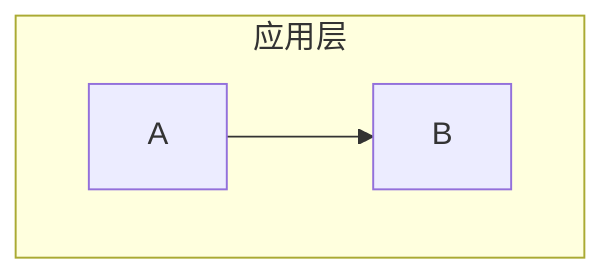

# Mermaid 语法人工修复指南

> 生成时间：2026-07-11 10:34
> 本指南列出 `mermaid-full-scan.py --fix` 自动修复后剩余的、需要人工语义判断的错误。

## 修复统计

| 类别 | 数量 | 修复方式 |
|------|------|---------|
| **subgraph 裸中文ID** | 93 | 为每个subgraph命名英文ID，保留中文标题 |
| **end 作节点ID** | 13 | 将 `end` 重命名为 `End`/`Finish`/`EndState` 等 |
| **危险HTML标签** | 1 | 审查是否需要，一般应移除 |
| **涉及文件** | 38 | — |

## 修复方法

### 1. subgraph 裸中文ID 修复

**错误写法**：


**正确写法**（`EN_ID ["中文标题"]`）：


> **注意**：如果同一文件中已有 `style 中文ID ...` 语句，需要同步更新为 `style EN_ID ...`。

### 2. end 作节点ID 修复

**错误写法**：`end((结束))` 或 `end[结束]`（`end` 是 Mermaid 保留字）

**正确写法**：`End((结束))` 或 `Finish[完成]`。注意：大写 `END` 虽被checker标记但通常可正常渲染，可视情况处理。

### 3. 危险HTML标签修复

Mermaid 图中禁止出现 `<script>`/``/`<iframe>` 等HTML标签，存在XSS风险。如果是示例代码，应放入普通 Markdown 代码块而非 Mermaid 图内。

---

## 待修复清单

### 1. [docs/knowledge/best-practices/mermaid-guide.md](../knowledge/best-practices/mermaid-guide.md)

#### end 作节点ID（1 处）

> ⚠️ 自动检测结果，包含可能的误报：大写 `END`/`End` 通常可正常渲染（Mermaid保留字是小写 `end`），`|end|` 为连线标签也无需修改。请人工判断是否需要修改。

- **L53**

```
OUTPUT --> END("结束")
```

> 如需修复：将小写 `end` 节点ID改为 `End`/`Finish`/`EndState` 等（注意同步更新引用该ID的连线和style语句）。

---

### 2. [docs/knowledge/learning/01-agent-protocols-interfaces/interface-api-abi-protocol-wiki/05-comparison.md](../knowledge/learning/01-agent-protocols-interfaces/interface-api-abi-protocol-wiki/05-comparison.md)

#### subgraph 裸中文ID（6 处）

- **L81** `应用层` — 建议ID: `AppLayer`

```diff
- subgraph 应用层
+ subgraph AppLayer ["应用层"]
```

- **L84** `语言抽象层` — 建议ID: `LangAbstraction`

```diff
- subgraph 语言抽象层
+ subgraph LangAbstraction ["语言抽象层"]
```

- **L87** `服务抽象层` — 建议ID: `ServiceAbstraction`

```diff
- subgraph 服务抽象层
+ subgraph ServiceAbstraction ["服务抽象层"]
```

- **L90** `本地二进制层` — 建议ID: `LocalBinary`

```diff
- subgraph 本地二进制层
+ subgraph LocalBinary ["本地二进制层"]
```

- **L93** `网络通信层` — 建议ID: `NetworkLayer`

```diff
- subgraph 网络通信层
+ subgraph NetworkLayer ["网络通信层"]
```

- **L96** `系统层` — 建议ID: `SystemLayer`

```diff
- subgraph 系统层
+ subgraph SystemLayer ["系统层"]
```

---

### 3. [docs/knowledge/learning/02-agent-engineering-methodology/harness-loop-engineering-article-analysis.md](../knowledge/learning/02-agent-engineering-methodology/harness-loop-engineering-article-analysis.md)

#### subgraph 裸中文ID（2 处）

- **L349** `外层循环（Meta-Loop）：优化内层搜索策略` — 需手动命名英文ID

```diff
- subgraph 外层循环（Meta-Loop）：优化内层搜索策略
+ subgraph TODO_ID ["外层循环（Meta-Loop）：优化内层搜索策略"]
```

- **L356** `内层循环（Inner Loop）：优化具体任务` — 需手动命名英文ID

```diff
- subgraph 内层循环（Inner Loop）：优化具体任务
+ subgraph TODO_ID ["内层循环（Inner Loop）：优化具体任务"]
```

---

### 4. [docs/knowledge/learning/03-agent-platforms-tools/fable5-cost-optimization-wiki/04-selection-guide.md](../knowledge/learning/03-agent-platforms-tools/fable5-cost-optimization-wiki/04-selection-guide.md)

#### end 作节点ID（1 处）

> ⚠️ 自动检测结果，包含可能的误报：大写 `END`/`End` 通常可正常渲染（Mermaid保留字是小写 `end`），`|end|` 为连线标签也无需修改。请人工判断是否需要修改。

- **L301**

```
Emergency --> End["结束"]
```

> 如需修复：将小写 `end` 节点ID改为 `End`/`Finish`/`EndState` 等（注意同步更新引用该ID的连线和style语句）。

---

### 5. [docs/knowledge/learning/03-agent-platforms-tools/mobile-use-deep-learning-analysis.md](../knowledge/learning/03-agent-platforms-tools/mobile-use-deep-learning-analysis.md)

#### end 作节点ID（1 处）

> ⚠️ 自动检测结果，包含可能的误报：大写 `END`/`End` 通常可正常渲染（Mermaid保留字是小写 `end`），`|end|` 为连线标签也无需修改。请人工判断是否需要修改。

- **L153**

```
CONV -->|end| END([END])
```

> 如需修复：将小写 `end` 节点ID改为 `End`/`Finish`/`EndState` 等（注意同步更新引用该ID的连线和style语句）。

---

### 6. [docs/knowledge/learning/07-vendor-product-learning/volcengine/volcengine-computer-use-agent-analysis.md](../knowledge/learning/07-vendor-product-learning/volcengine/volcengine-computer-use-agent-analysis.md)

#### subgraph 裸中文ID（12 处）

- **L314** `准备阶段` — 建议ID: `PrepPhase`

```diff
- subgraph 准备阶段
+ subgraph PrepPhase ["准备阶段"]
```

- **L318** `配置阶段` — 需手动命名英文ID

```diff
- subgraph 配置阶段
+ subgraph TODO_ID ["配置阶段"]
```

- **L325** `使用阶段` — 需手动命名英文ID

```diff
- subgraph 使用阶段
+ subgraph TODO_ID ["使用阶段"]
```

- **L560** `用户接入层` — 需手动命名英文ID

```diff
- subgraph 用户接入层
+ subgraph TODO_ID ["用户接入层"]
```

- **L565** `控制面` — 需手动命名英文ID

```diff
- subgraph 控制面
+ subgraph TODO_ID ["控制面"]
```

- **L573** `多模态AI能力层` — 需手动命名英文ID

```diff
- subgraph 多模态AI能力层
+ subgraph TODO_ID ["多模态AI能力层"]
```

- **L580** `执行层` — 需手动命名英文ID

```diff
- subgraph 执行层
+ subgraph TODO_ID ["执行层"]
```

- **L582** `官方云端沙箱` — 需手动命名英文ID

```diff
- subgraph 官方云端沙箱
+ subgraph TODO_ID ["官方云端沙箱"]
```

- **L588** `用户自有设备` — 需手动命名英文ID

```diff
- subgraph 用户自有设备
+ subgraph TODO_ID ["用户自有设备"]
```

- **L595** `基础设施层` — 建议ID: `InfraLayer`

```diff
- subgraph 基础设施层
+ subgraph InfraLayer ["基础设施层"]
```

- **L710** `控制面` — 需手动命名英文ID

```diff
- subgraph 控制面
+ subgraph TODO_ID ["控制面"]
```

- **L713** `执行环境[沙箱/ECS]` — 需手动命名英文ID

```diff
- subgraph 执行环境[沙箱/ECS]
+ subgraph TODO_ID ["执行环境[沙箱/ECS]"]
```

---

### 7. [docs/knowledge/learning/07-vendor-product-learning/volcengine/volcengine-eip-analysis.md](../knowledge/learning/07-vendor-product-learning/volcengine/volcengine-eip-analysis.md)

#### subgraph 裸中文ID（6 处）

- **L495** `正常状态` — 需手动命名英文ID

```diff
- subgraph 正常状态
+ subgraph TODO_ID ["正常状态"]
```

- **L500** `故障切换` — 需手动命名英文ID

```diff
- subgraph 故障切换
+ subgraph TODO_ID ["故障切换"]
```

- **L946** `安全防护层` — 需手动命名英文ID

```diff
- subgraph 安全防护层
+ subgraph TODO_ID ["安全防护层"]
```

- **L951** `公网接入层` — 需手动命名英文ID

```diff
- subgraph 公网接入层
+ subgraph TODO_ID ["公网接入层"]
```

- **L957** `网络服务层` — 需手动命名英文ID

```diff
- subgraph 网络服务层
+ subgraph TODO_ID ["网络服务层"]
```

- **L963** `计算资源层` — 需手动命名英文ID

```diff
- subgraph 计算资源层
+ subgraph TODO_ID ["计算资源层"]
```

---

### 8. [docs/knowledge/learning/CATEGORIES.md](../knowledge/learning/CATEGORIES.md)

#### subgraph 裸中文ID（2 处）

- **L79** `核心技术层["核心技术层（01→02→03 递进）"]` — 需手动命名英文ID

```diff
- subgraph 核心技术层["核心技术层（01→02→03 递进）"]
+ subgraph TODO_ID ["核心技术层["核心技术层（01→02→03 递进）"]"]
```

- **L85** `横向能力层["横向能力层（04/05 平行）"]` — 需手动命名英文ID

```diff
- subgraph 横向能力层["横向能力层（04/05 平行）"]
+ subgraph TODO_ID ["横向能力层["横向能力层（04/05 平行）"]"]
```

---

### 9. [docs/knowledge/learning/douyin-vibecoding-guide-analysis.md](../knowledge/learning/douyin-vibecoding-guide-analysis.md)

#### subgraph 裸中文ID（3 处）

- **L345** `根源["🎯 根源层（为什么必须这样做）"]` — 需手动命名英文ID

```diff
- subgraph 根源["🎯 根源层（为什么必须这样做）"]
+ subgraph TODO_ID ["根源["🎯 根源层（为什么必须这样做）"]"]
```

- **L350** `原理["💡 底层原理层（第一性原理）"]` — 需手动命名英文ID

```diff
- subgraph 原理["💡 底层原理层（第一性原理）"]
+ subgraph TODO_ID ["原理["💡 底层原理层（第一性原理）"]"]
```

- **L359** `规则["📋 表层规则层（文档中的具体建议）"]` — 需手动命名英文ID

```diff
- subgraph 规则["📋 表层规则层（文档中的具体建议）"]
+ subgraph TODO_ID ["规则["📋 表层规则层（文档中的具体建议）"]"]
```

---

### 10. [docs/knowledge/mdi-research/01-feasibility-analysis.md](../knowledge/mdi-research/01-feasibility-analysis.md)

#### subgraph 裸中文ID（2 处）

- **L64** `可行性维度` — 需手动命名英文ID

```diff
- subgraph 可行性维度
+ subgraph TODO_ID ["可行性维度"]
```

- **L71** `评分` — 需手动命名英文ID

```diff
- subgraph 评分
+ subgraph TODO_ID ["评分"]
```

---

### 11. [docs/knowledge/mdi-research/02-ecosystem-comparison.md](../knowledge/mdi-research/02-ecosystem-comparison.md)

#### subgraph 裸中文ID（3 处）

- **L34** `MDI适用["MDI适合场景"]` — 需手动命名英文ID

```diff
- subgraph MDI适用["MDI适合场景"]
+ subgraph TODO_ID ["MDI适用["MDI适合场景"]"]
```

- **L41** `重叠["可互补场景"]` — 需手动命名英文ID

```diff
- subgraph 重叠["可互补场景"]
+ subgraph TODO_ID ["重叠["可互补场景"]"]
```

- **L45** `OpenAPI适用["OpenAPI适合场景"]` — 需手动命名英文ID

```diff
- subgraph OpenAPI适用["OpenAPI适合场景"]
+ subgraph TODO_ID ["OpenAPI适用["OpenAPI适合场景"]"]
```

---

### 12. [docs/knowledge/mdi-research/03-technical-architecture.md](../knowledge/mdi-research/03-technical-architecture.md)

#### subgraph 裸中文ID（5 处）

- **L133** `基础层["基础层 (无内部依赖)"]` — 需手动命名英文ID

```diff
- subgraph 基础层["基础层 (无内部依赖)"]
+ subgraph TODO_ID ["基础层["基础层 (无内部依赖)"]"]
```

- **L137** `核心层["核心层 (依赖基础层)"]` — 需手动命名英文ID

```diff
- subgraph 核心层["核心层 (依赖基础层)"]
+ subgraph TODO_ID ["核心层["核心层 (依赖基础层)"]"]
```

- **L144** `生成器层["生成器层 (依赖核心层)"]` — 需手动命名英文ID

```diff
- subgraph 生成器层["生成器层 (依赖核心层)"]
+ subgraph TODO_ID ["生成器层["生成器层 (依赖核心层)"]"]
```

- **L155** `门面层["门面层"]` — 需手动命名英文ID

```diff
- subgraph 门面层["门面层"]
+ subgraph TODO_ID ["门面层["门面层"]"]
```

- **L161** `入口层` — 需手动命名英文ID

```diff
- subgraph 入口层
+ subgraph TODO_ID ["入口层"]
```

---

### 13. [docs/knowledge/myst-unified-ecosystem/01-idl.md](../knowledge/myst-unified-ecosystem/01-idl.md)

#### subgraph 裸中文ID（2 处）

- **L38** `痛点["没有 IDL 的世界"]` — 需手动命名英文ID

```diff
- subgraph 痛点["没有 IDL 的世界"]
+ subgraph TODO_ID ["痛点["没有 IDL 的世界"]"]
```

- **L43** `方案["IDL 的世界"]` — 需手动命名英文ID

```diff
- subgraph 方案["IDL 的世界"]
+ subgraph TODO_ID ["方案["IDL 的世界"]"]
```

---

### 14. [docs/quality/mermaid-manual-fix-guide.md](#)

#### subgraph 裸中文ID（1 处）

- **L29** `应用层` — 建议ID: `AppLayer`

```diff
- subgraph 应用层
+ subgraph AppLayer ["应用层"]
```

---

### 15. [docs/retrospective/patterns/architecture-patterns/multi-agent-closed-loop-execution.md](../retrospective/patterns/architecture-patterns/multi-agent-closed-loop-execution.md)

#### end 作节点ID（1 处）

> ⚠️ 自动检测结果，包含可能的误报：大写 `END`/`End` 通常可正常渲染（Mermaid保留字是小写 `end`），`|end|` 为连线标签也无需修改。请人工判断是否需要修改。

- **L61**

```
CONV -->|end| END(["完成"])
```

> 如需修复：将小写 `end` 节点ID改为 `End`/`Finish`/`EndState` 等（注意同步更新引用该ID的连线和style语句）。

---

### 16. [docs/retrospective/patterns/code-patterns/checklist-to-assertion-conversion.md](../retrospective/patterns/code-patterns/checklist-to-assertion-conversion.md)

#### subgraph 裸中文ID（5 处）

- **L37** `输入["文档检查清单"]` — 需手动命名英文ID

```diff
- subgraph 输入["文档检查清单"]
+ subgraph TODO_ID ["输入["文档检查清单"]"]
```

- **L40** `分类["关键词分类器"]` — 需手动命名英文ID

```diff
- subgraph 分类["关键词分类器"]
+ subgraph TODO_ID ["分类["关键词分类器"]"]
```

- **L46** `提取["专项正则提取"]` — 需手动命名英文ID

```diff
- subgraph 提取["专项正则提取"]
+ subgraph TODO_ID ["提取["专项正则提取"]"]
```

- **L51** `生成["代码生成"]` — 需手动命名英文ID

```diff
- subgraph 生成["代码生成"]
+ subgraph TODO_ID ["生成["代码生成"]"]
```

- **L57** `输出["测试文件"]` — 需手动命名英文ID

```diff
- subgraph 输出["测试文件"]
+ subgraph TODO_ID ["输出["测试文件"]"]
```

---

### 17. [docs/retrospective/patterns/code-patterns/example-driven-test-generation.md](../retrospective/patterns/code-patterns/example-driven-test-generation.md)

#### subgraph 裸中文ID（5 处）

- **L35** `文档["MDI/API文档"]` — 需手动命名英文ID

```diff
- subgraph 文档["MDI/API文档"]
+ subgraph TODO_ID ["文档["MDI/API文档"]"]
```

- **L40** `提取器["Example Extractor"]` — 需手动命名英文ID

```diff
- subgraph 提取器["Example Extractor"]
+ subgraph TODO_ID ["提取器["Example Extractor"]"]
```

- **L45** `转换器["Checklist Converter"]` — 需手动命名英文ID

```diff
- subgraph 转换器["Checklist Converter"]
+ subgraph TODO_ID ["转换器["Checklist Converter"]"]
```

- **L49** `生成器["Test Generator"]` — 需手动命名英文ID

```diff
- subgraph 生成器["Test Generator"]
+ subgraph TODO_ID ["生成器["Test Generator"]"]
```

- **L53** `输出["测试文件"]` — 需手动命名英文ID

```diff
- subgraph 输出["测试文件"]
+ subgraph TODO_ID ["输出["测试文件"]"]
```

---

### 18. [docs/retrospective/patterns/methodology-patterns/document-architecture/large-scale-duplication-elimination.md](../retrospective/patterns/methodology-patterns/document-architecture/large-scale-duplication-elimination.md)

#### end 作节点ID（1 处）

> ⚠️ 自动检测结果，包含可能的误报：大写 `END`/`End` 通常可正常渲染（Mermaid保留字是小写 `end`），`|end|` 为连线标签也无需修改。请人工判断是否需要修改。

- **L31**

```
S5 --> END["完成"]
```

> 如需修复：将小写 `end` 节点ID改为 `End`/`Finish`/`EndState` 等（注意同步更新引用该ID的连线和style语句）。

---

### 19. [docs/retrospective/patterns/methodology-patterns/governance-strategy/command-knowledge-link.md](../retrospective/patterns/methodology-patterns/governance-strategy/command-knowledge-link.md)

#### subgraph 裸中文ID（3 处）

- **L44** `公理层["公理层（Axioms）"]` — 需手动命名英文ID

```diff
- subgraph 公理层["公理层（Axioms）"]
+ subgraph TODO_ID ["公理层["公理层（Axioms）"]"]
```

- **L51** `规则层["规则层（Rules: 13条）"]` — 需手动命名英文ID

```diff
- subgraph 规则层["规则层（Rules: 13条）"]
+ subgraph TODO_ID ["规则层["规则层（Rules: 13条）"]"]
```

- **L57** `操作层["操作层（Operational）"]` — 需手动命名英文ID

```diff
- subgraph 操作层["操作层（Operational）"]
+ subgraph TODO_ID ["操作层["操作层（Operational）"]"]
```

---

### 20. [docs/retrospective/patterns/methodology-patterns/governance-strategy/commit-quality-gate-staging-inspection.md](../retrospective/patterns/methodology-patterns/governance-strategy/commit-quality-gate-staging-inspection.md)

#### end 作节点ID（1 处）

> ⚠️ 自动检测结果，包含可能的误报：大写 `END`/`End` 通常可正常渲染（Mermaid保留字是小写 `end`），`|end|` 为连线标签也无需修改。请人工判断是否需要修改。

- **L91**

```
PostVerify --> End["✅ 提交完成"]
```

> 如需修复：将小写 `end` 节点ID改为 `End`/`Finish`/`EndState` 等（注意同步更新引用该ID的连线和style语句）。

---

### 21. [docs/retrospective/patterns/methodology-patterns/governance-strategy/five-layer-governance-architecture.md](../retrospective/patterns/methodology-patterns/governance-strategy/five-layer-governance-architecture.md)

#### subgraph 裸中文ID（1 处）

- **L24** `组织保障层[L5 组织保障层 - 纵向贯穿]` — 需手动命名英文ID

```diff
- subgraph 组织保障层[L5 组织保障层 - 纵向贯穿]
+ subgraph TODO_ID ["组织保障层[L5 组织保障层 - 纵向贯穿]"]
```

---

### 22. [docs/retrospective/patterns/methodology-patterns/governance-strategy/seven-concepts-positioning-model.md](../retrospective/patterns/methodology-patterns/governance-strategy/seven-concepts-positioning-model.md)

#### subgraph 裸中文ID（5 处）

- **L115** `感知层` — 需手动命名英文ID

```diff
- subgraph 感知层
+ subgraph TODO_ID ["感知层"]
```

- **L119** `认知层` — 需手动命名英文ID

```diff
- subgraph 认知层
+ subgraph TODO_ID ["认知层"]
```

- **L127** `验证层` — 建议ID: `VerificationLayer`

```diff
- subgraph 验证层
+ subgraph VerificationLayer ["验证层"]
```

- **L131** `执行层` — 需手动命名英文ID

```diff
- subgraph 执行层
+ subgraph TODO_ID ["执行层"]
```

- **L136** `沉淀层` — 需手动命名英文ID

```diff
- subgraph 沉淀层
+ subgraph TODO_ID ["沉淀层"]
```

---

### 23. [docs/retrospective/patterns/methodology-patterns/governance-strategy/seven-concepts-quick-reference.md](../retrospective/patterns/methodology-patterns/governance-strategy/seven-concepts-quick-reference.md)

#### subgraph 裸中文ID（5 处）

- **L41** `感知层["感知层 · 客观数据接收"]` — 需手动命名英文ID

```diff
- subgraph 感知层["感知层 · 客观数据接收"]
+ subgraph TODO_ID ["感知层["感知层 · 客观数据接收"]"]
```

- **L44** `认知层["认知层 · 逻辑推导加工"]` — 需手动命名英文ID

```diff
- subgraph 认知层["认知层 · 逻辑推导加工"]
+ subgraph TODO_ID ["认知层["认知层 · 逻辑推导加工"]"]
```

- **L51** `验证层["验证层 · 证伪防御校验（横切）"]` — 需手动命名英文ID

```diff
- subgraph 验证层["验证层 · 证伪防御校验（横切）"]
+ subgraph TODO_ID ["验证层["验证层 · 证伪防御校验（横切）"]"]
```

- **L54** `执行层["执行层 · 精确行动落地"]` — 需手动命名英文ID

```diff
- subgraph 执行层["执行层 · 精确行动落地"]
+ subgraph TODO_ID ["执行层["执行层 · 精确行动落地"]"]
```

- **L58** `沉淀层["沉淀层 · 知识资产积累"]` — 需手动命名英文ID

```diff
- subgraph 沉淀层["沉淀层 · 知识资产积累"]
+ subgraph TODO_ID ["沉淀层["沉淀层 · 知识资产积累"]"]
```

---

### 24. [docs/retrospective/patterns/methodology-patterns/research-knowledge/cross-domain-semantic-drift.md](../retrospective/patterns/methodology-patterns/research-knowledge/cross-domain-semantic-drift.md)

#### end 作节点ID（1 处）

> ⚠️ 自动检测结果，包含可能的误报：大写 `END`/`End` 通常可正常渲染（Mermaid保留字是小写 `end`），`|end|` 为连线标签也无需修改。请人工判断是否需要修改。

- **L133**

```
Verify --> End(["✅ 语义一致性交付"])
```

> 如需修复：将小写 `end` 节点ID改为 `End`/`Finish`/`EndState` 等（注意同步更新引用该ID的连线和style语句）。

---

### 25. [docs/retrospective/patterns/methodology-patterns/research-knowledge/vendor-doc-info-compensation-search.md](../retrospective/patterns/methodology-patterns/research-knowledge/vendor-doc-info-compensation-search.md)

#### end 作节点ID（1 处）

> ⚠️ 自动检测结果，包含可能的误报：大写 `END`/`End` 通常可正常渲染（Mermaid保留字是小写 `end`），`|end|` 为连线标签也无需修改。请人工判断是否需要修改。

- **L62**

```
F -->|"是"| End["完成信息补偿"]
```

> 如需修复：将小写 `end` 节点ID改为 `End`/`Finish`/`EndState` 等（注意同步更新引用该ID的连线和style语句）。

---

### 26. [docs/retrospective/patterns/methodology-patterns/retrospective-knowledge/knowledge-sedimentation-workflow-sop.md](../retrospective/patterns/methodology-patterns/retrospective-knowledge/knowledge-sedimentation-workflow-sop.md)

#### end 作节点ID（1 处）

> ⚠️ 自动检测结果，包含可能的误报：大写 `END`/`End` 通常可正常渲染（Mermaid保留字是小写 `end`），`|end|` 为连线标签也无需修改。请人工判断是否需要修改。

- **L73**

```
PostCheck --> End(["✅ 知识沉淀完成"])
```

> 如需修复：将小写 `end` 节点ID改为 `End`/`Finish`/`EndState` 等（注意同步更新引用该ID的连线和style语句）。

---

### 27. [docs/retrospective/patterns/methodology-patterns/retrospective-knowledge/pre-check-duplication-layered-sedimentation.md](../retrospective/patterns/methodology-patterns/retrospective-knowledge/pre-check-duplication-layered-sedimentation.md)

#### end 作节点ID（1 处）

> ⚠️ 自动检测结果，包含可能的误报：大写 `END`/`End` 通常可正常渲染（Mermaid保留字是小写 `end`），`|end|` 为连线标签也无需修改。请人工判断是否需要修改。

- **L67**

```
S3 --> End(["完成知识沉淀<br/>存入知识库"])
```

> 如需修复：将小写 `end` 节点ID改为 `End`/`Finish`/`EndState` 等（注意同步更新引用该ID的连线和style语句）。

---

### 28. [docs/retrospective/patterns/methodology-patterns/retrospective-knowledge/triangular-source-verification.md](../retrospective/patterns/methodology-patterns/retrospective-knowledge/triangular-source-verification.md)

#### end 作节点ID（1 处）

> ⚠️ 自动检测结果，包含可能的误报：大写 `END`/`End` 通常可正常渲染（Mermaid保留字是小写 `end`），`|end|` 为连线标签也无需修改。请人工判断是否需要修改。

- **L47**

```
S6 --> END["完成信息采集"]
```

> 如需修复：将小写 `end` 节点ID改为 `End`/`Finish`/`EndState` 等（注意同步更新引用该ID的连线和style语句）。

---

### 29. [docs/retrospective/patterns/methodology-patterns/tools-automation/signal-identification-four-step.md](../retrospective/patterns/methodology-patterns/tools-automation/signal-identification-four-step.md)

#### subgraph 裸中文ID（2 处）

- **L102** `四步方法论["🔧 四步信号转化法"]` — 需手动命名英文ID

```diff
- subgraph 四步方法论["🔧 四步信号转化法"]
+ subgraph TODO_ID ["四步方法论["🔧 四步信号转化法"]"]
```

- **L114** `验证发布["✅ 验证与发布（工程实践）"]` — 需手动命名英文ID

```diff
- subgraph 验证发布["✅ 验证与发布（工程实践）"]
+ subgraph TODO_ID ["验证发布["✅ 验证与发布（工程实践）"]"]
```

---

### 30. [docs/retrospective/reports/atomization/retrospective-meta-atomization-full-chain-20260624/export-suggestions.md](../retrospective/reports/atomization/retrospective-meta-atomization-full-chain-20260624/export-suggestions.md)

#### end 作节点ID（1 处）

> ⚠️ 自动检测结果，包含可能的误报：大写 `END`/`End` 通常可正常渲染（Mermaid保留字是小写 `end`），`|end|` 为连线标签也无需修改。请人工判断是否需要修改。

- **L52**

```
LATER --> END["长期<br/>已有覆盖率达 50%+<br/>体系进入饱和收敛"]
```

> 如需修复：将小写 `end` 节点ID改为 `End`/`Finish`/`EndState` 等（注意同步更新引用该ID的连线和style语句）。

---

### 31. [docs/retrospective/reports/competitive-analysis/retrospective-viitorvoice-tts-learning-20260703/insight-extraction.md](../retrospective/reports/competitive-analysis/retrospective-specweave-contest-advantage-analysis-20260624/insight-extraction.md)

#### subgraph 裸中文ID（3 处）

- **L175** `第一次任务` — 建议ID: `FirstTask`

```diff
- subgraph 第一次任务
+ subgraph FirstTask ["第一次任务"]
```

- **L179** `第二次任务` — 建议ID: `SecondTask`

```diff
- subgraph 第二次任务
+ subgraph SecondTask ["第二次任务"]
```

- **L182** `第N次任务` — 建议ID: `NthTask`

```diff
- subgraph 第N次任务
+ subgraph NthTask ["第N次任务"]
```

---

### 32. [docs/retrospective/reports/insight-extraction/external-learning/retrospective-architecture-priority-20260629/README.md](../retrospective/reports/insight-extraction/external-learning/retrospective-architecture-priority-20260629/README.md)

#### subgraph 裸中文ID（4 处）

- **L52** `当前范式["当前架构：Human-First（面向人类阅读）…` — 需手动命名英文ID

```diff
- subgraph 当前范式["当前架构：Human-First（面向人类阅读）"]
+ subgraph TODO_ID ["当前范式["当前架构：Human-First（面向人类阅读）"]"]
```

- **L59** `目标范式["目标架构：Agent-First（面向 Agen…` — 需手动命名英文ID

```diff
- subgraph 目标范式["目标架构：Agent-First（面向 Agent 自主发现）"]
+ subgraph TODO_ID ["目标范式["目标架构：Agent-First（面向 Agent 自主发现）"]"]
```

- **L117** `新增["新增层"]` — 需手动命名英文ID

```diff
- subgraph 新增["新增层"]
+ subgraph TODO_ID ["新增["新增层"]"]
```

- **L121** `现有["现有能力（SKILL.md封装）"]` — 需手动命名英文ID

```diff
- subgraph 现有["现有能力（SKILL.md封装）"]
+ subgraph TODO_ID ["现有["现有能力（SKILL.md封装）"]"]
```

#### 危险HTML标签（1 处）

- **L123**

```
C2["scripts/ → .agents/skills/<script-name>/SKILL.md"]
```

> 请移除或移到普通代码块。

---

### 33. [docs/retrospective/reports/insight-extraction/external-learning/retrospective-firecrawl-learning-20260629/insights/insight-1-keyless.md](../retrospective/reports/insight-extraction/external-learning/retrospective-firecrawl-learning-20260629/insights/insight-1-keyless.md)

#### subgraph 裸中文ID（2 处）

- **L25** `旧范式["旧范式：Human-first API"]` — 需手动命名英文ID

```diff
- subgraph 旧范式["旧范式：Human-first API"]
+ subgraph TODO_ID ["旧范式["旧范式：Human-first API"]"]
```

- **L32** `新范式["新范式：Agent-first API"]` — 需手动命名英文ID

```diff
- subgraph 新范式["新范式：Agent-first API"]
+ subgraph TODO_ID ["新范式["新范式：Agent-first API"]"]
```

---

### 34. [docs/retrospective/reports/insight-extraction/external-learning/retrospective-skills-article-learning-20260629/export-suggestions.md](../retrospective/reports/insight-extraction/external-learning/retrospective-skills-article-learning-20260629/export-suggestions.md)

#### subgraph 裸中文ID（2 处）

- **L73** `当前架构` — 建议ID: `CurrentArch`

```diff
- subgraph 当前架构
+ subgraph CurrentArch ["当前架构"]
```

- **L78** `目标架构` — 建议ID: `TargetArch`

```diff
- subgraph 目标架构
+ subgraph TargetArch ["目标架构"]
```

---

### 35. [docs/retrospective/reports/insight-extraction/external-learning/retrospective-skills-article-learning-20260629/insight-extraction.md](../retrospective/reports/insight-extraction/external-learning/retrospective-skills-article-learning-20260629/insight-extraction.md)

#### subgraph 裸中文ID（1 处）

- **L114** `三轴模型` — 建议ID: `ThreeAxisModel`

```diff
- subgraph 三轴模型
+ subgraph ThreeAxisModel ["三轴模型"]
```

---

### 36. [docs/retrospective/reports/task-reports/2026-07-04-knowledge-sedimentation-workflow-retrospective.md](../retrospective/reports/task-reports/2026-07-04-knowledge-sedimentation-workflow-retrospective.md)

#### end 作节点ID（1 处）

> ⚠️ 自动检测结果，包含可能的误报：大写 `END`/`End` 通常可正常渲染（Mermaid保留字是小写 `end`），`|end|` 为连线标签也无需修改。请人工判断是否需要修改。

- **L325**

```
PostVerify --> End(["✅ 知识沉淀完成"])
```

> 如需修复：将小写 `end` 节点ID改为 `End`/`Finish`/`EndState` 等（注意同步更新引用该ID的连线和style语句）。

---

### 37. [docs/retrospective/reports/task-reports/retrospective-first-principles-pattern-split-20260709/02-insight-extraction.md](../retrospective/reports/task-reports/retrospective-first-principles-pattern-split-20260709/02-insight-extraction.md)

#### subgraph 裸中文ID（3 处）

- **L37** `公理层["公理层（Axioms）<br/>3-5条不可再分的…` — 需手动命名英文ID

```diff
- subgraph 公理层["公理层（Axioms）<br/>3-5条不可再分的根本前提<br/>可信度分级（🟢/🔵/🟡）"]
+ subgraph TODO_ID ["公理层["公理层（Axioms）<br/>3-5条不可再分的根本前提<br/>可信度分级（🟢/🔵/🟡）"]"]
```

- **L40** `规则层["规则层（Rules）<br/>10-20条演绎规则…` — 需手动命名英文ID

```diff
- subgraph 规则层["规则层（Rules）<br/>10-20条演绎规则<br/>每条标注公理来源"]
+ subgraph TODO_ID ["规则层["规则层（Rules）<br/>10-20条演绎规则<br/>每条标注公理来源"]"]
```

- **L43** `操作层["操作层（Operational）<br/>判定矩阵…` — 需手动命名英文ID

```diff
- subgraph 操作层["操作层（Operational）<br/>判定矩阵、检查清单、三问法"]
+ subgraph TODO_ID ["操作层["操作层（Operational）<br/>判定矩阵、检查清单、三问法"]"]
```

---

### 38. [docs/retrospective/reports/task-reports/retrospective-first-principles-pattern-split-20260709/analysis-report.md](../retrospective/reports/task-reports/retrospective-first-principles-pattern-split-20260709/analysis-report.md)

#### subgraph 裸中文ID（8 处）

- **L534** `公理层[Axiom Layer - 5条基本公理]` — 需手动命名英文ID

```diff
- subgraph 公理层[Axiom Layer - 5条基本公理]
+ subgraph TODO_ID ["公理层[Axiom Layer - 5条基本公理]"]
```

- **L541** `规则层[Rule Layer - 13条演绎规则]` — 需手动命名英文ID

```diff
- subgraph 规则层[Rule Layer - 13条演绎规则]
+ subgraph TODO_ID ["规则层[Rule Layer - 13条演绎规则]"]
```

- **L542** `判定规则[判定规则 - 何时关联]` — 需手动命名英文ID

```diff
- subgraph 判定规则[判定规则 - 何时关联]
+ subgraph TODO_ID ["判定规则[判定规则 - 何时关联]"]
```

- **L549** `内容规则[内容选择规则 - 关联什么]` — 需手动命名英文ID

```diff
- subgraph 内容规则[内容选择规则 - 关联什么]
+ subgraph TODO_ID ["内容规则[内容选择规则 - 关联什么]"]
```

- **L554** `结构规则[结构规则 - 如何组织]` — 需手动命名英文ID

```diff
- subgraph 结构规则[结构规则 - 如何组织]
+ subgraph TODO_ID ["结构规则[结构规则 - 如何组织]"]
```

- **L559** `验证规则[验证规则 - 如何验收]` — 需手动命名英文ID

```diff
- subgraph 验证规则[验证规则 - 如何验收]
+ subgraph TODO_ID ["验证规则[验证规则 - 如何验收]"]
```

- **L564** `操作层[Operational Layer - 判定矩阵]` — 需手动命名英文ID

```diff
- subgraph 操作层[Operational Layer - 判定矩阵]
+ subgraph TODO_ID ["操作层[Operational Layer - 判定矩阵]"]
```

- **L575** `验证层[Validation Layer - 案例验证]` — 需手动命名英文ID

```diff
- subgraph 验证层[Validation Layer - 案例验证]
+ subgraph TODO_ID ["验证层[Validation Layer - 案例验证]"]
```

---

## 验证方法

修复完成后，运行以下命令验证：

```bash
# 全量扫描，确认零错误
python .agents/scripts/mermaid-full-scan.py

# 对单个文件快速检查
python .agents/scripts/check-mermaid.py --path <目标目录>
```

*本指南由扫描脚本自动生成。*