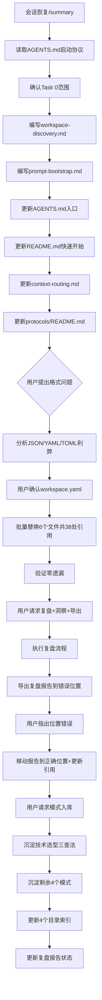

# Agent App Marketplace Task 0 — 工作区发现协议与提示词自举协议复盘报告

> **任务名称**：Task 0 - 工作区发现协议与提示词自举协议定义
> **复盘日期**：2026-07-13
> **任务周期**：2026-07-13（单会话完成）
> **报告类型**：任务结项复盘

***

## 一、项目概述

### 1.1 项目背景

Agent App Marketplace 是 SpecWeave 的四层架构智能体协作生态（L0发现层/L1包格式层/L2生命周期管理层/L3治理与适配层）。Task 0 是该项目的首个里程碑，负责定义最基础的两个协议：
- **工作区发现协议（Workspace Discovery Protocol）**：智能体进入任意目录后识别工作区类型的标准流程
- **提示词自举协议（Prompt Bootstrap Protocol）**：通过一句话提示词实现零安装装载项目的标准流程

在 Task 0 完成后，额外执行了配置文件格式决策：将 workspace manifest 从初始设计的 `workspace.json` 切换为 `workspace.yaml`。

### 1.2 项目目标

| 目标 | 验收标准 | 完成状态 |
|------|---------|---------|
| 定义工作区发现协议 | 文档完整，包含5步识别流程、根工作区零安装自举、AGENTS.md最小可行子集规范 | ✅ 已完成 |
| 定义提示词自举协议 | 文档完整，包含一句话装载、8条安全规则、环境自适应路径选择、边界情况处理 | ✅ 已完成 |
| 更新AGENTS.md入口 | 新增快速开始章节，嵌入通用引导提示词，核心规范入口表新增两个协议 | ✅ 已完成 |
| 更新README.md入口 | 添加一句话装载和git clone两种快速开始方式 | ✅ 已完成 |
| 更新路由索引 | 上下文路由表和协议索引添加新协议入口 | ✅ 已完成 |
| 配置格式决策 | 确定manifest文件格式，统一所有引用 | ✅ 已完成（workspace.yaml） |

### 1.3 交付物清单

| 类型 | 文件路径 | 行数 | 说明 |
|------|---------|------|------|
| 新增协议 | [workspace-discovery.md](../../protocols/workspace-discovery.md) | 307行 | 五步发现流程、三种工作区形态、自举序列、AGENTS.md最小可行子集、就绪报告格式、反模式清单 |
| 新增协议 | [prompt-bootstrap.md](../../protocols/prompt-bootstrap.md) | 403行 | 一句话装载原理、环境自适应5路径、8条安全规则（S1-S8）、7个边界情况（E1-E7）、通用引导模板 |
| 新增模式 | [tech-selection-three-checks.md](patterns/methodology-patterns/governance-strategy/tech-selection-three-checks.md) | 189行 | 技术选型"偏好-惯例-本质"三查法（L2） |
| 新增模式 | [triple-entry-design.md](patterns/architecture-patterns/triple-entry-design.md) | 153行 | 三层入口设计模式（L2） |
| 新增模式 | [prompt-defense-in-depth.md](patterns/architecture-patterns/prompt-defense-in-depth.md) | 196行 | 提示词分层防御安全模式（L2） |
| 新增模式 | [protocol-reference-distill-verify.md](patterns/methodology-patterns/document-architecture/protocol-reference-distill-verify.md) | 158行 | 协议文档"参考-提炼-验证"三步法（L2） |
| 新增模式 | [bulk-replace-zero-omission-verify.md](patterns/code-patterns/bulk-replace-zero-omission-verify.md) | 141行 | 批量替换零遗漏验证模式（L2） |
| 更新入口 | [AGENTS.md](../../../AGENTS.md) | - | 新增"快速开始：一句话装载"章节，核心规范入口表新增2项，Changelog更新 |
| 更新入口 | [README.md](../../../README.md) | - | 快速开始重构为"一句话装载"和"git clone"两种方式 |
| 更新路由 | [context-routing.md](../../context-routing.md) | - | 常规任务路由表新增2项 |
| 更新索引 | [protocols/README.md](../../protocols/README.md) | - | 协议清单表新增2项 |
| 更新索引 | [patterns/architecture-patterns/README.md](patterns/architecture-patterns/README.md) | - | 新增2个模式条目 |
| 更新索引 | [patterns/code-patterns/README.md](patterns/code-patterns/README.md) | - | 新增1个模式条目 |
| 更新索引 | [patterns/document-architecture/README.md](patterns/methodology-patterns/document-architecture/README.md) | - | 新增1个模式条目 |
| 格式切换 | 上述文件 + spec.md/tasks.md/checklist.md | - | workspace.json → workspace.yaml（38处引用） |

**总计**：新增2个核心协议文档（710行）+ 5个可复用模式文档（837行），更新12个文件，统一38处格式引用。

***

## 二、复盘环节

### 2.1 实施过程回顾

**关键时间线**：
1. **上下文恢复阶段**：从summary恢复任务状态，确认Task 0上一轮已完成但context丢失
2. **协议编写阶段**：参考现有协议（onboarding-protocol.md）风格，编写两个新协议文档
3. **入口更新阶段**：更新AGENTS.md/README.md/context-routing.md/protocols/README.md
4. **格式决策阶段**：用户提出workspace.json vs workspace.toml的问题，经分析推荐workspace.yaml
5. **批量替换阶段**：replace_all替换所有引用，验证零遗漏
6. **复盘导出阶段**：执行标准复盘+洞察+导出流程，首次导出到错误位置（reports/子目录）
7. **位置修正阶段**：用户指出报告位置错误，移动到docs/retrospective/根目录并更新引用
8. **模式沉淀阶段**：先完成技术选型三查法入库（L2），再批量沉淀剩余4个模式，更新所有目录索引

### 2.2 关键节点分析

| 决策节点 | 决策内容 | 决策依据 | 结果 |
|---------|---------|---------|------|
| 协议文档结构 | 参考onboarding-protocol.md的风格（协议目标→设计理念→流程→反模式） | 项目已有惯例，保持一致性 | ✅ 风格统一，符合规范 |
| AGENTS.md最小可行子集 | 定义必须包含启动协议、上下文路由表、核心规范入口表 | 基于现有AGENTS.md结构提炼最小集合 | ✅ 可验证、可落地 |
| 安全规则数量 | 8条安全规则（S1-S8） | 覆盖供应链攻击、路径确认、敏感目录、只读原则、完整性验证、错误处理、范围限定、幂等性 | ✅ 全面覆盖风险点 |
| 边界情况数量 | 7个边界情况（E1-E7） | 覆盖Git不可用、网络故障、权限不足、已安装、目标非空、跨平台、代理环境 | ✅ 覆盖主要异常场景 |
| 配置文件格式 | workspace.yaml而非workspace.json/workspace.toml | 用户偏好YAML>TOML、项目现有团队配置用YAML、复杂嵌套结构YAML表达最佳、支持注释、YAML是JSON超集可复用JSON Schema | ✅ 与项目惯例一致，符合用户偏好 |

### 2.3 执行情况与结果数据

| 指标 | 数值 | 说明 |
|------|------|------|
| 新增协议文档数 | 2个 | workspace-discovery.md + prompt-bootstrap.md |
| 新增模式文档数 | 5个 | 三查法+三层入口+分层防御+三步法+零遗漏验证 |
| 新增文档总行数 | 1547行 | 710行（协议）+ 837行（模式） |
| 更新文件数 | 12个 | 4个入口文件 + 3个spec文件（格式切换）+ 4个模式索引 + 1个复盘报告 |
| 格式替换引用数 | 38处 | workspace.json → workspace.yaml |
| 模式索引更新数 | 4个目录 | architecture-patterns(2) + code-patterns(1) + document-architecture(1) + governance-strategy(1) |
| 安全规则数 | 8条 | S1-S8 |
| 边界情况处理数 | 7个 | E1-E7 |
| 发现流程步骤 | 5步 | AGENTS.md → workspace.yaml → .agents/ → 向上递归 → 用户确认 |
| 工作区形态 | 6种 | Root/Source/Installed/Activated/Compatible/None |
| 环境自适应路径 | 5种 | 已在SpecWeave/Trae内置/空目录/已有项目/有Git无网络 |
| 防御层级 | 7层 | L1来源→L2路径→L3执行→L4完整性→L5错误→L6范围→L7幂等 |
| 验证命令执行 | 3次 | 链接检查×2 + Grep零遗漏验证×1 |

### 2.4 成功经验

1. **协议先行、入口跟进的执行顺序正确**：先定义核心协议文档，再更新所有入口文件（AGENTS.md/README.md/路由表/索引），确保协议定义完整后再进行引用更新，避免入口先于内容更新导致的断链。

2. **参考现有协议风格保证一致性**：在编写新协议前先读取onboarding-protocol.md等现有协议，保持结构（协议目标→设计理念→流程步骤→反模式→验证清单）和语言风格一致，降低新协议的认知成本。这也验证了"参考-提炼-验证"三步法的有效性。

3. **格式决策遵循"决策前三查"原则**：面对workspace.json vs workspace.toml的问题时，执行了：
   - 查权威文档（用户profile明确标注prefers YAML over TOML）
   - 查现有实例（团队配置.agents/teams/data/*.yaml都用YAML）
   - 查本质目标（复杂嵌套+注释支持+手写友好=YAML最佳）

4. **批量替换后执行零遗漏验证**：使用Grep全局搜索workspace.json确认所有引用已替换，避免遗漏。该模式已沉淀为可复用操作模式。

5. **安全规则设计全面**：8条安全规则覆盖了供应链攻击、路径遍历、敏感目录写入、脚本执行、完整性验证、错误处理、扫描范围、幂等性8个维度，形成七层防御体系，确保一句话装载过程安全可控。

6. **模式沉淀遵循入库流程**：先沉淀1个三查法模式验证入库流程正确，再批量沉淀剩余4个模式，最后统一更新各目录索引，确保模式文档格式一致、索引准确。

7. **错误及时闭环修正**：复盘报告首次导出到错误位置，用户指出后立即移动到正确位置并更新所有引用，同时将该问题记入存在问题分析，避免重复犯错。

### 2.5 存在问题

| 问题 | 根因分析 | 影响评估 | 严重程度 |
|------|---------|---------|---------|
| 初始spec选择了workspace.json而非YAML | 初始设计时未充分考虑用户偏好和项目现有惯例，JSON Schema生态成熟是主要考量，但忽略了YAML是JSON超集这一事实 | 导致后续需要批量替换38处引用，增加了返工成本 | 低（已修复，无遗留问题） |
| 上下文恢复后未立即执行格式统一检查 | 会话恢复时summary提到Task 0已完成，但未检查是否需要根据用户偏好调整格式决策 | 直到用户主动提出格式问题才触发修正，属于被动响应而非主动检查 | 低（用户主动提出后及时修复） |
| 复盘报告首次导出到错误位置 | 未先检查docs/retrospective/目录结构，误以为reports/子目录是标准位置（实际reports/是多文件拆解式复盘目录） | 报告位置错误，需移动文件并更新引用，增加了少量返工 | 低（用户指出后立即修正） |

***

## 三、洞察环节

### 3.1 关键发现

**发现1：配置文件格式选择的三维决策框架**

在workspace.json vs workspace.yaml vs workspace.toml的决策中，提炼出配置格式选择的三个关键维度：

| 维度 | 考量因素 | 权重 |
|------|---------|------|
| **惯例一致性** | 项目中现有配置文件使用什么格式？团队是否有明确偏好？ | 高 |
| **结构适配性** | 数据结构复杂度？嵌套层级？是否需要注释？ | 高 |
| **工具链兼容性** | Schema验证生态？解析库成熟度？是否有额外依赖？ | 中 |

**核心洞察**：YAML作为JSON超集这一特性经常被忽略——选择YAML并不意味着放弃JSON Schema生态，反而兼得人类可读性和机器验证能力。

**发现2：零安装自举的"双层入口"设计模式**

AGENTS.md（AI入口）+ README.md（人类入口）+ workspace.yaml（机器入口）的三层入口设计是可复用模式：
- AI智能体通过AGENTS.md的启动协议自举（面向AI）
- 人类开发者通过README.md快速开始（面向人）
- CLI工具通过workspace.yaml解析manifest（面向机器）

三种入口各司其职，互不干扰，又通过目录结构约定协同工作。

**发现3：提示词安全规则的"分层防御"设计模式**

8条安全规则形成了分层防御体系：
- **L1 来源安全**（S1）：只从官方仓库获取，防供应链攻击
- **L2 路径安全**（S2/S3）：路径确认+敏感目录防护，防路径遍历
- **L3 执行安全**（S4）：只读不执行，防恶意脚本
- **L4 完整性安全**（S5）：验证AGENTS.md存在且含关键词
- **L5 错误处理**（S6）：明确报告错误，不假装成功
- **L6 范围限定**（S7）：不扫描整个文件系统，最小权限
- **L7 幂等安全**（S8）：已在SpecWeave内则直接就绪

这种分层防御模式可复用于任何"AI自动执行文件操作"的提示词设计场景。

### 3.2 规律认知

**规律1：协议定义的"参考-提炼-验证"三步法**

1. **参考**：先读取同类协议文档，学习结构和风格
2. **提炼**：基于目标场景提炼本协议特有的流程、规则、边界情况
3. **验证**：对照验收清单检查覆盖完整性

**规律2：格式决策的"偏好-惯例-本质"三查法**

面对技术选型决策（如配置文件格式），执行三查：
1. **查用户偏好**：检查user_profile.md是否有明确偏好设置
2. **查项目惯例**：Grep搜索现有文件，看同类场景使用什么
3. **查本质需求**：分析数据结构特征和使用场景

**规律3：批量替换后的"零遗漏验证"必做**

使用replace_all批量替换后，必须用Grep全局搜索旧字符串确认零遗漏。这是一个低成本高收益的验证步骤，可以有效避免"改了90%但漏了10%"的问题。

### 3.3 潜在机会

1. **可复用模式入库**：✅ 已完成——本次提炼的5个模式全部沉淀到可复用模式库（L2成熟度），包括三层入口设计模式、提示词分层防御安全模式、技术选型三查法、协议文档三步法、批量替换零遗漏验证。

2. **workspace.yaml Schema先行**：Task 1开始实现时，应先定义workspace.yaml的JSON Schema（schemas/agent-workspace.schema.json），作为验证和文档的单一来源。

3. **一句话装载的短触发词优化**：当前在Trae环境中说"装载SpecWeave"即可触发，但提示词自举协议中可以进一步定义更短的触发词（如"/setup-specweave"），提升使用便捷性。

4. **跨智能体兼容性测试**：通用引导提示词设计为兼容任意支持工具调用的AI智能体，未来可在ChatGPT/Claude/Gemini等不同平台测试验证兼容性。

5. **批量修改检查清单**：本次复盘发现报告位置错误、批量替换需要验证等问题，可沉淀为标准化的批量修改检查清单，减少同类错误。

***

## 四、导出环节

### 4.1 改进建议

| 问题 | 改进措施 | 优先级 | 预期效果 | 状态 |
|------|---------|--------|---------|------|
| 初始设计未考虑YAML优先 | 未来技术选型时先执行"偏好-惯例-本质"三查法 | 中 | 减少格式返工成本 | 已执行（模式已入库） |
| spec中未显式记录用户偏好对技术选型的影响 | 在spec.md的Constraints章节可补充"配置文件格式优先遵循用户偏好设置" | 低 | 提升决策一致性 | 待规划 |
| 批量替换后未形成标准检查流程 | 将"全局搜索确认零遗漏"加入文档批量修改标准流程 | 中 | 防止遗漏引用 | 已执行（模式已入库） |
| 复盘报告导出位置错误 | 导出文件前先LS检查目标目录结构，确认单文件/多文件组织方式 | 低 | 防止文件放错位置 | 已识别，纳入检查清单 |

### 4.2 行动计划

| 优先级 | 改进项 | 具体措施 | 建议时间 | 状态 |
|--------|--------|---------|---------|------|
| 中 | 三查法沉淀为模式 | 将"偏好-惯例-本质"技术选型三查法沉淀到可复用模式库 | Task 1开始前 | 已完成（2026-07-13入库governance-strategy/tech-selection-three-checks.md，L2成熟度） |
| 中 | 批量替换检查清单 | 将零遗漏验证模式沉淀后，在.agents/checklists/中添加批量修改验证检查项 | 下一次批量修改前 | 模式已入库（bulk-replace-zero-omission-verify.md），checklist待创建 |
| 低 | Schema先行原则 | Task 1实现时先定义workspace.yaml JSON Schema，再写代码 | Task 1执行时 | 待规划 |

### 4.3 经验萃取

| 模式名称 | 模式类型 | 成熟度 | 触发条件 |
|---------|---------|--------|---------|
| 双层/三层入口设计模式（AGENTS.md+README+manifest） | 架构模式 | L2（已入库） | 设计面向多受众（AI/人类/机器）的项目入口时 |
| 提示词分层防御安全规则模式 | 架构/安全模式 | L2（已入库） | 设计AI自动执行文件/系统操作的提示词时 |
| 技术选型"偏好-惯例-本质"三查法 | 决策/方法论模式 | L2（已入库） | 任何技术选型决策前（配置格式/框架/库选择） |
| 协议文档"参考-提炼-验证"三步法 | 方法论模式 | L2（已入库） | 编写新协议/规范文档时 |
| 批量替换"零遗漏验证"步骤 | 代码/操作模式 | L2（已入库） | 使用replace_all批量修改文件后 |

### 4.4 后续优化方向

1. **Task 0A（Trae Skill门面）**：基于已定义的两个协议，创建Trae Skill门面，使"装载SpecWeave"在Trae环境中作为一等公民Skill触发
2. **Task 1（核心架构搭建）**：按spec.md推进L1包格式层和L2生命周期管理层实现，优先定义workspace.yaml Schema
3. **模式入库**：✅ 5个模式全部入库（L2成熟度）：三层入口设计（architecture-patterns/）、提示词分层防御安全（architecture-patterns/）、技术选型三查法（governance-strategy/）、协议文档三步法（document-architecture/）、批量替换零遗漏验证（code-patterns/）
4. **跨平台测试**：在非Trae环境（ChatGPT/Claude网页版）测试一句话装载提示词的兼容性

***

> **报告编制**：本文档基于Task 0全执行过程数据综合编制，所有数据均有事实依据支撑。报告采用Markdown格式编写，遵循"事实→分析→洞察→建议"的逻辑结构。
>
> **验证记录**：
> - [x] 已执行：关键数据用wc/Grep实际统计（新增文档行数、替换引用数等）
> - [x] 已执行：workspace.yaml替换后用Grep全局搜索确认零遗漏
> - [x] 已执行：新增协议文档链接经check-links.py验证有效
> - [x] 已执行：5个可复用模式全部入库，各目录README索引已更新
> - [x] 已执行：复盘报告从reports/子目录移动到docs/retrospective/根目录，引用已更新
> - [x] 已执行：报告全面更新（交付物清单、流程图、时间线、数据表、成功经验、存在问题、改进建议均已补充最新状态）
