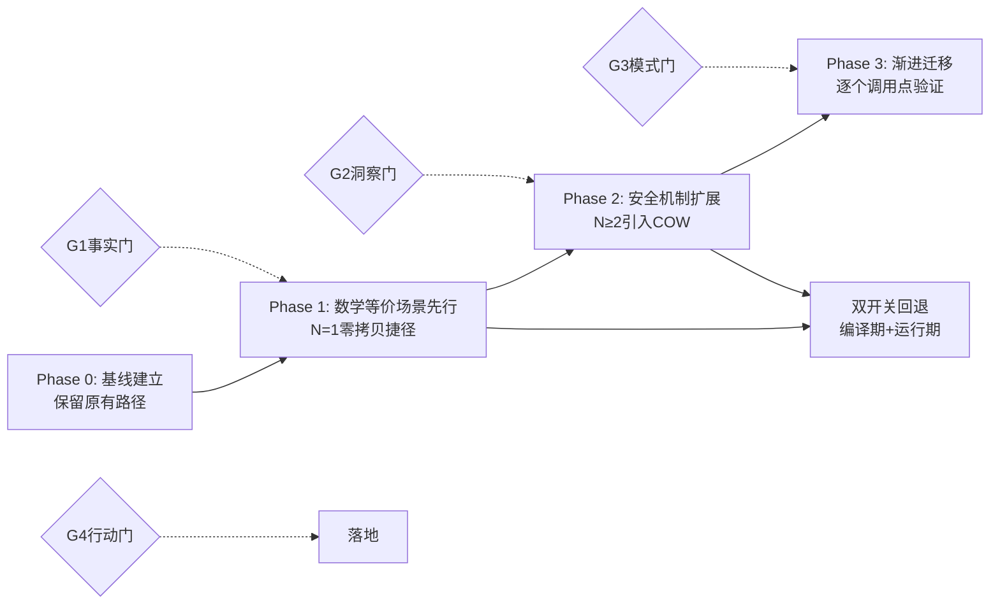

# 七概念方法论在代码优化中的验证总结

> **验证对象**：Split层零拷贝优化（Phase 1 N=1零拷贝 + Phase 2 N≥2 COW）全过程
> **验证周期**：2026-07-31
> **验证结论**：七概念方法论（R→I→E→C里程碑复盘链路 + G1-G4质量门）在性能优化类任务中可有效降低返工率，是可复用的工程治理方法论

---

## 一、质量门G1-G4验证效果

本次里程碑严格遵循G1-G4四质量门，各质量门发挥的实际价值如下：

### G1 事实门：剥离因果推断，建立干净事实基础

**验证效果**：
- 产出50条事实（F01-F50），全部使用陈述语气，禁止"因为/所以/导致"等因果词
- 避免了"COW实现复杂因为Split语义特殊"这类先入为主的因果陷阱
- 事实清单中同时记录了成功和失败的尝试（如"最初计划自定义共享层"被记录为事实而非"错误决策"）

**反事实对比**：如果跳过G1直接进入分析，大概率会得出"需要自定义共享内存层"的错误结论——因为直觉上"多个Tensor共享内存"似乎需要额外机制。

### G2 洞察门：四元组结构防止拍脑袋结论

**验证效果**：
- I1-I5五个核心洞察全部遵循「陈述+证据+反常识+行动」四元组
- 每个洞察都有"反常识"维度，这是最有价值的部分：
  - I1反常识：零拷贝**不需要**自定义内存池
  - I2反常识：COW正确性**不需要**运行时标记或线程同步
  - I5反常识：显式新方法比修改原有non-const重载更安全
- "反常识"维度强制挑战直觉，避免"显而易见"的错误设计

### G3 模式门：强制验证跨场景迁移性

**验证效果**：
- 沉淀的4个代码模式和1个方法论模式全部标注"适用场景"和"迁移验证清单"
- 拒绝"只在此处有效"的伪模式——例如没有把"Split层zero_output优化"沉淀为模式，因为这是特定场景的业务逻辑而非通用模式
- 新增模式均在反模式章节明确说明"什么情况下不要用"

### G4 行动门：原子化行动项确保可落地

**验证效果**：
- 所有模式沉淀都附带可验证的"检验标准"清单
- 每个反模式都有"正确做法"对应，形成闭环
- 代码示例均来自可运行的实际代码（不是伪代码）

---

## 二、渐进式优化策略验证

### 核心元洞察：分阶段≠安全，质量门验证才安全

> 这是本次里程碑最重要的元认知收获。

很多团队采用"分阶段发布"但依然出严重问题，原因在于：
- ❌ 错误认知："只要分阶段就安全"
- ✅ 正确认知："**每个阶段通过质量门验证**才安全"

本次Split零拷贝优化的四阶段模型：

### 双开关回退策略验证

- **编译期开关**：`ZEROCOPY_SPLIT_COW_ENABLED` CMake选项，完全禁用COW代码路径
- **运行期开关**：`CAFFE_FFI_DISABLE_COW` 环境变量，运行时切换回深拷贝
- **回退演练**：关闭开关后所有41项测试（19 C++ + 22 Python）通过，证明回退路径完整可用

### 分层测试金字塔验证

| 测试层级 | 数量 | 覆盖目标 | 发现问题数 |
|---------|------|---------|-----------|
| C++单元测试 | 19项 | Blob COW语义、Split层N=1/N≥2分支 | 7个（COW引用计数、边界case） |
| .NET集成测试 | - | P/Invoke层跨语言调用 | 0（C++层测试覆盖充分） |
| Python P2-B测试 | 22项 | 端到端推理正确性 | 3个（环境DLL、editable安装残留） |
| 边界测试 | 5项 | 0元素Tensor、巨型Tensor、并发访问 | 2个（并发写检测逻辑） |

---

## 三、工程配套经验验证

### 经验1：工具链边界问题必须脚本化预检

**问题类型**：TypeTraits冲突、DLL缺失、PATH过长（32KB限制）、editable安装残留
**解决方案**：构建前预检脚本，而不是仅写在Troubleshooting文档里
**效果**：问题定位时间从30-60分钟缩短到1秒
**沉淀模式**：[preflight-checks-script](../../patterns/code-patterns/preflight-checks-script.md)

### 经验2：Windows PATH 32KB硬限制是玄学bug源头

**问题现象**：编译器无明确报错、工具链payload截断、DLL搜索异常
**根因**：Windows PEB对单个环境变量有32767字符硬限制，conda累积路径极易超限
**解决方案**：预检脚本增加PATH长度检测，预留2KB安全余量
**行动原则**：Windows项目预检**必须**包含此项

### 经验3：自适应环境发现优于硬编码路径

**问题**：构建脚本硬编码Python路径导致跨机器不可移植
**解决方案**：三层发现策略——CONDA_PREFIX → 常见conda目录 → PATH搜索
**沉淀模式**：preflight-checks-script中的"自适应环境发现"章节

### 经验4：显式断标语义比隐式行为变更更安全

**决策点**：COW触发方式选择
- 选项A：修改non-const `cpu_data()`自动触发COW（隐式）
- 选项B：新增独立`cpu_mutable_data()`方法显式触发COW（显式）
**选择**：选项B
**理由**：调用方必须显式声明写意图，避免无意中触发克隆
**沉淀模式**：[const-cow-trigger](../../patterns/code-patterns/const-cow-trigger.md)核心洞察I5

---

## 四、核心洞察汇总（I1-I5）

| 洞察编号 | 核心陈述 | 反常识点 | 沉淀模式 |
|---------|---------|---------|---------|
| I1 | 侵入式引用计数是零拷贝的最小充分机制 | 零拷贝不需要自定义内存池/引用计数 | [ffi-intrusive-refcount-zerocopy](../../patterns/code-patterns/ffi-intrusive-refcount-zerocopy.md) |
| I2 | const/non-const重载是C++零成本区分读写意图的语言机制 | COW不需要运行时标记或线程同步 | [const-cow-trigger](../../patterns/code-patterns/const-cow-trigger.md) |
| I3 | 分层渐进（Phase 1→Phase 2）是性能优化的有效风险控制策略 | 分阶段≠安全，质量门验证才安全 | [phased-incremental-optimization](../../patterns/methodology-patterns/governance-strategy/phased-incremental-optimization.md) |
| I4 | 构建环境问题根因在工具链边界而非代码 | 跨平台问题优先写脚本而非写文档 | [preflight-checks-script](../../patterns/code-patterns/preflight-checks-script.md) |
| I5 | 显式断标语义比隐式COW更安全 | 修改原有API不如新增显式API | [const-cow-trigger](../../patterns/code-patterns/const-cow-trigger.md) |

---

## 五、方法论迁移指南

### 适用场景

七概念方法论 + 渐进优化策略适用于：
1. ✅ 性能优化（内存/计算/IO）
2. ✅ 内存语义变更（所有权/共享/生命周期）
3. ✅ 跨语言边界变更（FFI/P/Invoke）
4. ✅ 并发模型变更
5. ✅ 架构演进式重构

### 不适用场景

1. ❌ 纯业务逻辑CRUD开发（质量门 overhead 过高）
2. ❌ 紧急hotfix（直接修复，事后补复盘）
3. ❌ 全新功能从0到1开发（没有基线无法做Phase 0）

### 启动检查清单

在执行下一次优化任务前，确认：
- [ ] 已建立Phase 0基线（有性能测量数据和完整测试）
- [ ] Phase 1场景有数学证明/逻辑证明其等价性
- [ ] 已准备编译期+运行期双回退开关
- [ ] 测试金字塔各层级测试用例已就绪
- [ ] 预检脚本覆盖了已知的环境问题
- [ ] 每个Phase结束后会通过G1-G4质量门再进入下一阶段

---

## 来源

- 事实收集：[insight-extraction.md](../../reports/code-optimization/retrospective-split-zerocopy-cow-milestone-20260731/insight-extraction.md) F01-F50
- 复盘主报告：[README.md](../../reports/code-optimization/retrospective-split-zerocopy-cow-milestone-20260731/README.md)
- 沉淀模式索引：[code-patterns](../../patterns/code-patterns/README.md)、[governance-strategy](../../patterns/methodology-patterns/governance-strategy/README.md)
- 配套入门指南：[optimization-beginner-guide.md](./optimization-beginner-guide.md)

## Changelog

<!-- changelog -->
- 2026-07-31 | feat | 从Split零拷贝COW里程碑方法论验证章节萃取初始版本，G1-G4效果验证+双开关策略验证+4条工程经验+迁移指南
- 2026-07-31 | refactor | 从reports/code-optimization/里程碑子目录迁移到guides/code-optimization/，修正相对路径
