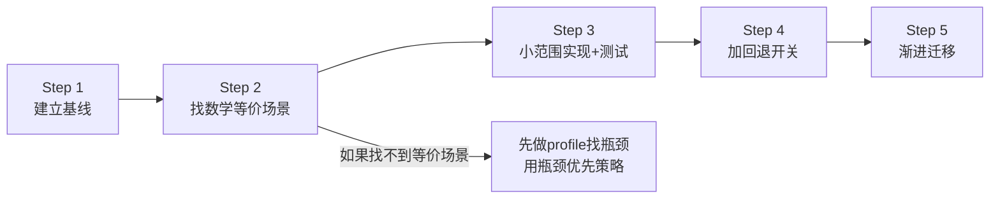

# 新成员代码优化入门指南

> 🎯 **读者**：刚加入团队、想学习如何正确做代码优化的新成员
> ⏱️ **阅读时间**：15分钟
> ✅ **读完后你能**：知道什么时候该优化、怎么安全地优化、怎么避免常见优化陷阱

---

## 第一部分：在优化之前，先问三个问题

### ❓ 问题1：真的需要优化吗？

> **Knuth原则**："过早优化是万恶之源"——但过晚优化也是。

新成员最常犯的错误有两个：
- **错误A**：看到代码就想"这个可以更高效"，然后花3天优化一个只占0.1%耗时的函数
- **错误B**：性能问题已经导致用户投诉了，还在说"先跑起来再说"

**判断标准**：用数据说话，不要凭感觉。

```python
# ❌ 错误：凭感觉优化
# "我觉得这个循环有点慢，让我优化一下"
for i in range(1000000):
    process(i)

# ✅ 正确：先profile再决定
# python -m cProfile -s cumulative my_script.py
# 结果显示 95% 时间在 IO 等待，循环只占 2% → 不要优化循环
```

### ❓ 问题2：优化目标是什么？

| 优化类型 | 目标 | 衡量方式 |
|---------|------|---------|
| 性能优化 | 降低延迟/提高吞吐量 | QPS、P99延迟、单次推理耗时 |
| 内存优化 | 减少内存占用/拷贝 | 峰值内存、memcpy次数、缓存命中率 |
| 启动优化 | 缩短启动时间 | 冷启动耗时、DLL加载时间 |

**没有量化目标的优化都是耍流氓**。"让它更快"不是目标，"将Forward延迟从50ms降到20ms"才是目标。

### ❓ 问题3：回退方案准备好了吗？

> **新手第一课**：任何优化都可能引入bug。如果不能在5分钟内回退，就不要上线。

后面会详细讲"双开关回退策略"，现在先记住：**写优化代码之前，先想好怎么退回来**。

---

## 第二部分：优化五步法（新手友好版）

这是从Split零拷贝+COW里程碑中验证过的安全优化流程，新手按这个走，出不了大问题。



### Step 1：建立基线（最容易被跳过，也最重要）

**做什么**：在优化之前，先把当前版本的性能数据和测试都保留好。

**新手Checklist**：
- [ ] 运行完整测试套件，确保当前版本是绿的
- [ ] 写一个简单的benchmark，记录优化前的数字（拍个照/存到文件里）
- [ ] **不要删除原有代码路径**，用 `if (optimized_enabled)` 包起来

**反例**：
```cpp
// ❌ 错误：直接删掉原来的实现
Tensor cpu_data() {
    return ShareData(other);  // 原来的深拷贝代码直接删了！
}

// ✅ 正确：保留原有路径
Tensor cpu_data() {
    if (zerocopy_enabled) {
        return ShareData(other);  // 新路径
    } else {
        return DeepCopy(other);   // 原有路径保留，随时能切回来
    }
}
```

### Step 2：找数学等价场景（Phase 1 安全先行）

**核心思想**：先挑"肯定不会出错"的场景优化，建立信心。

**什么是数学等价场景**？
- 场景A：Split只有1个输出 → 输出和输入是同一个Tensor → 零拷贝数学上100%正确
- 场景B：ReLU in-place → 输入和输出形状相同，且不依赖原始值 → 可以安全复用内存
- 非等价场景：Split有2个输出，且其中一个会被修改 → 需要COW机制，复杂度陡增

**新手原则**：Phase 1 只做数学等价场景，不要一上来就搞复杂机制。

### Step 3：小范围实现 + 测试先行

**做什么**：
1. 先写测试，再写优化代码
2. 优化范围控制在1-2个文件内
3. 单元测试覆盖：正常路径、边界case（空输入、巨型输入、并发访问）

**测试金字塔**（从下到上）：
```
    ┌─────────────────┐
    │  Python端到端   │  少量，验证整体功能
    ├─────────────────┤
    │  .NET集成测试   │  验证跨语言边界
    ├─────────────────┤
    │  C++单元测试    │  大量，覆盖每个分支 ← 优化代码主要靠这个
    └─────────────────┘
```

**新手建议**：优化代码的单元测试数量应该是实现代码的2-3倍。我们这次COW优化写了19个C++测试和22个Python测试，代码量比实现本身还大——这是正常的。

### Step 4：加双开关回退策略

这是老手和新手最大的区别：**老手在写优化代码时同时写回退开关**。

| 开关类型 | 怎么加 | 什么时候用 |
|---------|-------|-----------|
| **编译期开关** | CMake选项 `-DENABLE_MY_OPT=OFF` | 编译时完全禁用优化代码，验证优化本身是否导致问题 |
| **运行期开关** | 环境变量 `set MY_OPT_DISABLED=1` | 线上出问题时即时回退，不需要重编译 |

**代码模板**：
```cmake
# CMakeLists.txt
option(ENABLE_MY_OPT "Enable my optimization" ON)
if(ENABLE_MY_OPT)
    add_definitions(-DENABLE_MY_OPT=1)
endif()
```

```cpp
// 代码中
bool is_my_opt_enabled() {
    // 编译期开关优先
#ifdef ENABLE_MY_OPT
    // 运行期开关可以覆盖
    static bool disabled = getenv("MY_OPT_DISABLED") != nullptr;
    return !disabled;
#else
    return false;
#endif
}
```

**验证回退**：加完开关后，**立即测试关闭开关时代码是否正常工作**。不要等到上线出问题才发现回退路径是坏的。

### Step 5：渐进迁移（不要一次性改完所有调用点）

**新手最容易踩的坑**：新优化看起来工作了，然后批量修改10个调用点，结果某个边界case出bug，不知道是哪个调用点的问题。

**正确做法**：
1. 列一个调用点清单（"我要改哪些地方"）
2. 每个PR只改1-3个调用点
3. 改完一个，跑一次测试，确认没问题再改下一个
4. 改完所有调用点后，再考虑删除旧代码路径（至少留一个版本周期）

---

## 第三部分：新手必知的5个核心洞察

这是从实际项目中用血的教训换来的经验，记住它们能帮你少走很多弯路。

### 🔑 洞察1：优先复用框架已有的机制，不要重复造轮子

**反常识**：零拷贝优化不需要自定义内存池或引用计数！

我们一开始想：多个Tensor共享内存，那肯定要写个引用计数机制吧？结果发现TVM FFI的ObjectPtr本身就是侵入式引用计数的智能指针，直接"别名赋值"就实现了零拷贝，代码量减少80%。

**行动原则**：做优化前先问自己：底层框架/标准库是不是已经有这个机制了？
- 共享内存？先看智能指针（shared_ptr/ObjectPtr）
- 懒加载？先看std::optional或框架的Lazy机制
- COW？先看框架有没有Copy-on-Write支持

### 🔑 洞察2：C++ const正确性是零成本的读写意图区分机制

**反常识**：COW不需要运行时标记或线程同步！

很多人实现COW会加个`is_shared`标志位加锁检查，但C++的const成员函数天然保证"只读"——只要你把只读访问放在const方法里，写访问放在non-const方法里，编译器帮你保证正确性，零运行时开销。

**代码示例**：
```cpp
// ✅ 正确：用const/non-const重载区分读写
const void* cpu_data() const {  // 只读路径：不会触发COW
    return data_;
}

void* cpu_mutable_data() {      // 显式写路径：触发COW
    if (use_count_ > 1) {
        DeepCopy();  // 需要写的时候才克隆
    }
    return data_;
}
```

### 🔑 洞察3：显式API比隐式行为变更更安全

**反常识**：新增一个`cpu_mutable_data()`方法比修改原有的non-const `cpu_data()`更安全。

新手直觉："COW就是写的时候克隆，那我直接在non-const cpu_data()里加克隆逻辑不就行了？调用方不用改代码，多方便！"

但这会导致：调用方可能无意中触发克隆（比如拿到non-const指针但根本不写），性能反而下降；而且出了bug很难定位。

**行动原则**：
- ✅ 新增显式方法（`mutable_data()`）让调用方**明确声明**写意图
- ❌ 不要悄悄改变原有API的语义

### 🔑 洞察4：构建环境问题不是代码bug，优先写预检脚本

**反常识**：Windows DLL缺失、TypeTraits冲突、PATH太长这些问题，不要只写在README里让用户踩坑。

这些"工具链边界问题"有两个特点：
1. 错误信息极其晦涩（300行C++模板栈跟踪，根本看不出是DLL缺失）
2. 每个新成员都会踩一遍

**解决方案**：写个100行的Python预检脚本，构建前自动运行，有问题直接给出"哪个DLL、在哪找、怎么装"的明确提示。

**行动原则**：跨平台/跨机器的问题，**写脚本>写文档**。

### 🔑 洞察5：Windows PATH有32KB硬限制

这是Windows平台专属的玄学bug源头。conda环境装多了，PATH累积超过32767字符，就会出现：
- 编译器无报错但链接失败
- DLL明明在目录里但找不到
- 工具链行为诡异，重启电脑又好了

**预防**：在Windows预检脚本里加一行PATH长度检测：
```python
if len(os.environ.get("PATH", "")) > 30000:
    print("WARNING: PATH approaching 32KB limit, run 'conda clean --all'")
```

---

## 第四部分：7个新手必踩的反模式（不要这么做！）

| 反模式 | 为什么危险 | 正确做法 |
|-------|----------|---------|
| ❌ 不建基线直接改优化 | 改完了不知道有没有变快，也不知道是不是改慢了 | Step 1：先跑benchmark记数字 |
| ❌ 一次性改所有调用点 | 出bug二分定位要半天 | 每个PR改≤3个文件 |
| ❌ 不写回退开关 | 线上出问题只能连夜回滚版本 | 编译期+运行期双开关 |
| ❌ 隐式修改原有API语义 | 调用方无感知，隐蔽bug | 新增显式方法，旧方法保留 |
| ❌ 预检只写文档不写脚本 | 每个新人踩一遍同样的坑 | 构建前自动跑预检脚本 |
| ❌ 过度设计（自定义内存池/锁） | 代码复杂度暴增，bug比优化前还多 | 先看框架已有机制 |
| ❌ 不做回退演练 | 真要回退时发现开关坏了 | 加完开关立即测试关闭路径 |

---

## 第五部分：第一次做优化？从这里开始

如果你是第一次在项目里做优化，推荐按这个顺序练手：

### 🟢 练习1：添加性能日志（低风险）
- 给关键路径加`[PERF]`日志，记录耗时和内存使用
- 不需要改逻辑，只是加观测点
- 目的：熟悉benchmark方法，了解性能热点在哪
- **参考代码**：
  - Split层PERF日志示例：[split_layer.cpp](file:///d:/spaces/SpecWeave/projects/xuanspace/libs/caffe-ffi/src/caffe_ffi/layers/split_layer.cpp) 中搜索 `[SPLIT-PERF]`
  - Python性能trace工具：[conftest.py](file:///d:/spaces/SpecWeave/projects/xuanspace/libs/caffe-ffi/tests/python/conftest.py) 中的 `perf_trace` 函数

### 🟢 练习2：写一个预检脚本（低风险）
- 找一个团队里大家经常踩的环境坑
- 写个Python脚本自动检测，给出修复建议
- 集成到构建流程里
- 目的：熟悉工程化思维
- **参考模板（真实可用脚本）**：
  - TypeTraits冲突检测：[check_tvm_ffi_traits.py](file:///d:/spaces/SpecWeave/projects/xuanspace/libs/caffe-ffi/scripts/check_tvm_ffi_traits.py)
  - Windows DLL检测：[check_windows_dll.py](file:///d:/spaces/SpecWeave/projects/xuanspace/libs/caffe-ffi/scripts/check_windows_dll.py)
  - 完整构建预检链：[verify_build.ps1](file:///d:/spaces/SpecWeave/projects/xuanspace/libs/caffe-ffi/scripts/verify_build.ps1)（含三层Python发现+vcvars导入）

### 🟡 练习3：瓶颈优先小优化（中风险）
- 用profile找到一个独立的热点函数（占比>10%）
- 按五步法做：建基线→小范围改→加测试→加开关→验证
- 目的：完整走一遍优化流程
- **双开关代码模板参考**：
  - 编译期开关：[Options.cmake](file:///d:/spaces/SpecWeave/projects/xuanspace/libs/caffe-ffi/cmake/Options.cmake#L12-L13)（`CAFFE_FFI_ENABLE_COW`）
  - 运行时开关参考：搜索 `CAFFE_FFI_DISABLE_COW` 环境变量用法

### 🔴 练习4：跨模块内存语义优化（高风险）
- 等你成功完成2-3个练习3之后再尝试
- 必须严格遵循分层渐进策略（Phase 0→1→2→3）
- 必须有资深成员review
- **完整案例参考**：Split层零拷贝+COW优化
  - Phase 1零拷贝：[ffi-intrusive-refcount-zerocopy模式](../../patterns/code-patterns/ffi-intrusive-refcount-zerocopy.md)
  - Phase 2 COW：[const-cow-trigger模式](../../patterns/code-patterns/const-cow-trigger.md)
  - 完整实现代码：[split_layer.cpp](file:///d:/spaces/SpecWeave/projects/xuanspace/libs/caffe-ffi/src/caffe_ffi/layers/split_layer.cpp)、[blob.hpp](file:///d:/spaces/SpecWeave/projects/xuanspace/libs/caffe-ffi/include/caffe_ffi/blob.hpp)

---

## 第六部分：推荐阅读顺序

读完这份指南后，按这个顺序深入：

1. **先看对比分析**：[optimization-strategy-comparison.md](./optimization-strategy-comparison.md)
   - 了解四种优化策略的适用场景，知道什么时候用什么方法

2. **再看方法论验证**：[methodology-validation-summary.md](./methodology-validation-summary.md)
   - 了解七概念质量门怎么在实际中发挥作用

3. **需要时查模式**：
   - 做零拷贝/内存共享 → [ffi-intrusive-refcount-zerocopy](../../patterns/code-patterns/ffi-intrusive-refcount-zerocopy.md)
   - 做COW → [const-cow-trigger](../../patterns/code-patterns/const-cow-trigger.md)
   - 做CMake依赖检测 → [platform-aware-dependency-detect](../../patterns/code-patterns/platform-aware-dependency-detect.md)
   - 做构建预检 → [preflight-checks-script](../../patterns/code-patterns/preflight-checks-script.md)
   - 做渐进式重构/优化 → [phased-incremental-optimization](../../patterns/methodology-patterns/governance-strategy/phased-incremental-optimization.md)

4. **完整案例参考**：[Split零拷贝COW里程碑复盘](../../reports/code-optimization/retrospective-split-zerocopy-cow-milestone-20260731/README.md)
   - 看完整的优化过程是怎么一步步推进的

---

## 配套资源

| 资源 | 用途 |
|------|------|
| 📋 [可打印反模式Checklist](./optimization-anti-patterns-checklist.md) | A4横向打印版，贴在显示器旁，优化前快速过一遍 |
| 📝 [考核测试题](./optimization-assessment-quiz.md) | 20道单选+4道场景题，学完后自测，≥80分通过 |

---

## 新成员优化Checklist（精简版）

> 完整版见：[可打印反模式Checklist](./optimization-anti-patterns-checklist.md)（含7大反模式+提交前完整检查项）

开始优化前：
- [ ] 我有profile数据证明这是瓶颈吗？
- [ ] 我的优化目标量化了吗？（从X降到Y）
- [ ] 原有代码路径保留了吗？
- [ ] 编译期开关加了吗？
- [ ] 运行期开关加了吗？

实现过程中：
- [ ] 我先写测试再写代码了吗？
- [ ] 测试覆盖了边界case吗？（空输入、巨型输入、并发）
- [ ] 我有没有在过度设计？（框架已有机制吗？）
- [ ] API变更是显式的吗？

提交前：
- [ ] 关闭编译期开关，测试通过吗？（回退演练）
- [ ] 设置环境变量禁用，测试通过吗？
- [ ] 这个PR改动文件≤3个吗？
- [ ] PERF日志显示确实变快了吗？

---

## 来源

- 核心方法论：[phased-incremental-optimization](../../patterns/methodology-patterns/governance-strategy/phased-incremental-optimization.md)
- 策略对比：[optimization-strategy-comparison.md](./optimization-strategy-comparison.md)
- 验证案例：[Split零拷贝COW里程碑](../../reports/code-optimization/retrospective-split-zerocopy-cow-milestone-20260731/README.md)
- 方法论验证：[methodology-validation-summary.md](./methodology-validation-summary.md)

## Changelog

<!-- changelog -->
- 2026-07-31 | feat | 基于Split零拷贝COW里程碑实战经验初始版本，六部分结构：优化前三问→五步法→5个核心洞察→7个反模式→练习路径→Checklist
- 2026-07-31 | refactor | 从reports/code-optimization/迁移到guides/code-optimization/，修正相对路径
