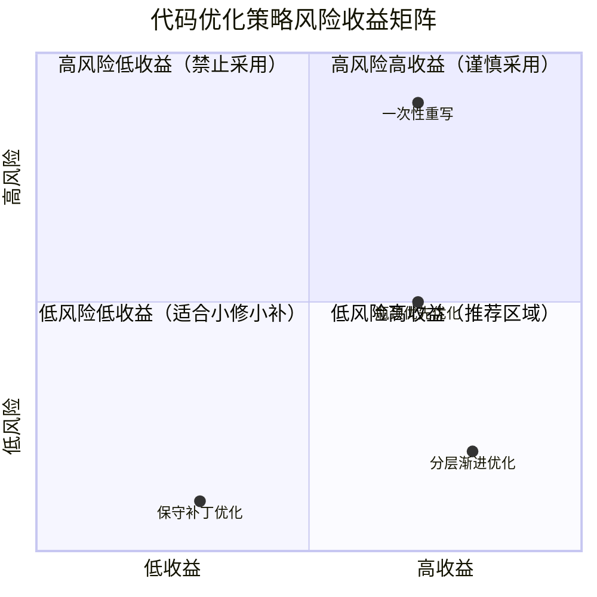
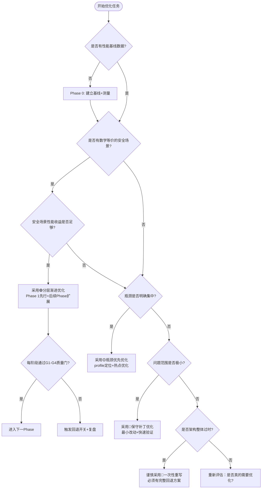

# 代码优化策略对比分析表

> 基于Split层零拷贝+COW优化里程碑（Phase 1+2）的实际验证数据，对比四种常见代码优化策略的适用场景、风险和效果。

---

## 一、核心策略多维对比

| 维度 | 🔴 一次性重写 (Big Bang Rewrite) | 🟡 瓶颈优先优化 (Bottleneck-First) | 🟢 分层渐进优化 (Phased-Incremental) | 🔵 保守补丁优化 (Conservative Patching) |
|------|-----------------------------------|--------------------------------------|----------------------------------------|-------------------------------------------|
| **核心思想** | 推翻重写，一次性引入所有优化 | 先profile找瓶颈，只优化热点 | 数学等价场景先行，复杂机制后置，双开关回退 | 最小改动，打补丁式局部优化 |
| **典型适用场景** | 全新架构迁移、技术栈更换 | 性能瓶颈明确、热点集中 | 内存语义变更、并发模型变更、跨语言边界 | 紧急性能问题、hotfix、小范围调优 |
| **风险等级** | 🔴 极高 | 🟡 中等 | 🟢 低 | 🔵 极低 |
| **回退成本** | 极高（整体回滚） | 中等（单个模块回滚） | 极低（双开关即时切换） | 极低（单点回滚） |
| **前置条件** | 完整需求冻结、充足测试覆盖 | 有profile数据、明确瓶颈点 | Phase 0基线+数学等价证明+回退开关 | 问题定位明确、影响范围可控 |
| **代码改动量** | 极大（70%+代码） | 中等（10-30%代码） | 分阶段累计（Phase 1<5%，Phase 2<15%） | 极小（<5%代码） |
| **调试复杂度** | 极高（所有变量同时变化） | 中等（热点模块变量多） | 低（单阶段变量可控，前阶段为对照组） | 低（单点改动） |
| **测试要求** | 全量回归测试 | 热点模块+集成测试 | 测试金字塔（单元→集成→端到端） | 单点测试+相关回归 |
| **性能收益预期** | 可能极高，但不确定 | 明确（profile验证） | 分阶段可量化（每阶段有PERF日志） | 有限但确定 |
| **方法论配套** | 无（靠经验） | profile驱动 | ✅ 七概念R-I-E-C+G1-G4质量门 | 无（靠经验） |
| **本次验证** | ❌ 未采用（风险过高） | ✅ 用于选择优化目标（Split是热点） | ✅ 主力策略（Phase 0→1→2→3） | ✅ 用于环境问题修复 |

---

## 二、风险收益矩阵

**结论**：分层渐进优化位于"低风险高收益"推荐区域，是性能优化类任务的首选策略。

---

## 三、决策流程：如何选择优化策略

---

## 四、分层渐进优化（推荐策略）详细参数

基于本次Split零拷贝优化的实测数据：

### 4.1 Phase划分标准

| Phase | 准入条件 | 完成标准 | 本次案例 |
|-------|---------|---------|---------|
| **Phase 0 基线建立** | 决定开始优化 | 原有路径完整保留+性能数据采集+测试全绿 | Split深拷贝版本作为基线 |
| **Phase 1 数学等价场景** | Phase 0完成+安全场景有数学证明 | 安全场景优化路径通过所有测试+PERF日志验证收益 | N=1零拷贝（Split单输出数学上等价于别名） |
| **Phase 2 安全机制扩展** | Phase 1稳定运行1周+COW/锁等机制设计完成 | 新机制通过单元测试+双开关回退验证 | N≥2 COW（const-correctness+显式mutable方法） |
| **Phase 3 渐进迁移** | Phase 2稳定运行+调用点清单就绪 | 逐个调用点迁移+每个PR<3个文件 | ReLU/Dropout等in-place操作逐个迁移 |

### 4.2 双开关回退配置

| 开关类型 | 配置方式 | 切换速度 | 适用场景 |
|---------|---------|---------|---------|
| **编译期开关** | CMake选项 `-DZEROCOPY_SPLIT_COW_ENABLED=OFF` | 需要重编译 | 正式发布前的安全网、ABI兼容性问题 |
| **运行期开关** | 环境变量 `set CAFFE_FFI_DISABLE_COW=1` | 即时生效，无需重编译 | 线上紧急回退、特定机器兼容性问题 |

### 4.3 质量门检查清单（每Phase必过）

- [ ] **G1 事实门**：输出干净的事实列表，无因果推断词
- [ ] **G2 洞察门**：核心洞察包含「陈述+证据+反常识+行动」四元组
- [ ] **G3 模式门**：沉淀的模式验证跨场景迁移性，有反模式说明
- [ ] **G4 行动门**：检验标准可执行、可验证，行动项原子化

---

## 五、反模式：这些做法会让优化必然失败

| 反模式 | 所属策略 | 后果 | 本次是否遇到 |
|-------|---------|------|-------------|
| ❌ 不建立基线直接优化 | 所有策略 | 无法证明优化有效，无法回退 | ❌ 未遇到（严格执行Phase 0） |
| ❌ 一次性修改所有调用点 | 一次性重写/瓶颈优化 | 出bug无法二分定位，回滚成本极高 | ✅ 初期差点犯（幸好Phase 1只改Split单文件） |
| ❌ 没有回退开关 | 一次性重写 | 出问题只能整体回滚，丢失所有优化 | ❌ 未遇到（双开关设计） |
| ❌ 隐式行为变更（修改原有API语义） | 瓶颈优化/补丁 | 调用方无感知，引发隐蔽bug | ✅ 决策点正确（选择新增cpu_mutable_data而非修改cpu_data） |
| ❌ 只写文档不写预检脚本 | 所有策略 | 环境问题反复踩坑，新人上手成本高 | ✅ 遇到TypeTraits冲突后立即写预检脚本 |
| ❌ 过度设计（自定义内存池/引用计数） | 一次性重写 | 代码复杂度暴增，bug率上升 | ✅ 初期过度设计风险（I1洞察纠正） |
| ❌ 不做回退演练 | 所有策略 | 真需要回退时发现回退路径失效 | ❌ 未遇到（每次加开关后立即演练回退） |

---

## 六、本次里程碑实测数据对比

| 指标 | Phase 0（基线：深拷贝） | Phase 1（N=1零拷贝） | Phase 2（N≥2 COW） |
|------|----------------------|---------------------|-------------------|
| Split层单Tensor内存拷贝 | 每次Forward一次memcpy | 零拷贝（直接别名） | 零拷贝（引用计数共享） |
| N=1场景性能开销 | 100%（基线） | ~0%（消除拷贝） | ~0%（const路径零开销） |
| N≥2场景写时克隆开销 | 100%（总是深拷贝） | 不支持 | 仅写时克隆一次，只读路径零开销 |
| 代码改动（Split相关） | - | ~80行（ShareData路径） | ~150行（COW+mutable方法） |
| C++单元测试 | 14项 | 新增19项COW测试 | 测试全部通过 |
| Python端到端测试 | - | - | 22项测试全部通过 |
| 回退演练耗时 | - | <1分钟（关开关+重编译） | <10秒（设环境变量） |
| 发现的环境问题 | - | 0（C++层纯净） | 3个（TypeTraits+DLL+editable残留） |

---

## 七、策略选择速查表

| 你的情况 | 推荐策略 | 注意事项 |
|---------|---------|---------|
| 改内存所有权/共享语义、并发模型、FFI边界 | 🟢 **分层渐进优化** | 必须有数学等价的Phase 1场景，必须有双开关 |
| profile显示某个函数占80%耗时，逻辑独立 | 🟡 **瓶颈优先优化** | 优化前后做benchmark对比，不要过度优化 |
| 线上紧急性能问题，影响用户 | 🔵 **保守补丁优化** | 先止血，事后用渐进策略重构 |
| 技术栈整体升级（Python2→3、旧框架→新框架） | 🔴 **一次性重写** | ⚠️ 高风险：必须有特性开关、灰度发布、完整回退方案 |
| 不确定要不要优化 | - | 先做Phase 0基线测量，用数据说话，不要凭感觉优化 |

---

## 来源

- 方法论模式：[phased-incremental-optimization](../../patterns/methodology-patterns/governance-strategy/phased-incremental-optimization.md)
- 配套代码模式：[ffi-intrusive-refcount-zerocopy](../../patterns/code-patterns/ffi-intrusive-refcount-zerocopy.md)、[const-cow-trigger](../../patterns/code-patterns/const-cow-trigger.md)、[preflight-checks-script](../../patterns/code-patterns/preflight-checks-script.md)、[platform-aware-dependency-detect](../../patterns/code-patterns/platform-aware-dependency-detect.md)
- 方法论验证总结：[methodology-validation-summary.md](./methodology-validation-summary.md)
- 事实基础：[insight-extraction.md](../../reports/code-optimization/retrospective-split-zerocopy-cow-milestone-20260731/insight-extraction.md) F01-F50
- 复盘主报告：[README.md](../../reports/code-optimization/retrospective-split-zerocopy-cow-milestone-20260731/README.md)
- 新成员入门指南：[optimization-beginner-guide.md](./optimization-beginner-guide.md)

## Changelog

<!-- changelog -->
- 2026-07-31 | feat | 基于Split零拷贝COW里程碑实测数据初始版本，4种策略9维度对比+风险矩阵+决策流程图+质量门清单+反模式表+实测数据表
- 2026-07-31 | refactor | 从reports/code-optimization/迁移到guides/code-optimization/，修正相对路径
