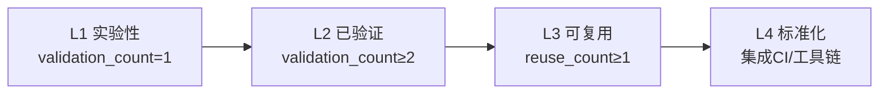

# 可复用模式库（patterns）

本目录存放经过验证的可复用模式和分析工具，按层级分为架构模式、代码模式、方法论模式三类，以及轻量级分析卡片。

## 目录结构

| 目录 | 层级 | 说明 | 入口 |
|------|------|------|------|
| architecture-patterns/ | 架构层 | 文件依赖拓扑、级联更新策略、系统结构设计 | [README.md](architecture-patterns/README.md) |
| code-patterns/ | 代码层 | 具体代码编写、文件操作、编辑策略 | [README.md](code-patterns/README.md) |
| methodology-patterns/ | 方法论层 | 按主题分为8个子目录（复盘知识/外部研究/文档架构/工具自动化/治理策略/AI协作/创意设计/产品增长） | [README.md](methodology-patterns/README.md) |
| analysis-cards/ | 分析工具层 | 轻量级分析卡片：判断矩阵、信号清单、分级模型，用于竞品分析/产品评估快速决策 | [README.md](analysis-cards/README.md) |

## 模式成熟度评估标准

### 成熟度等级定义

| 等级 | 名称 | 定义 | 量化条件 |
|------|------|------|---------|
| L1 | 实验性 | 仅 1 次成功案例，待更多验证 | `validation_count = 1` |
| L2 | 已验证 | ≥ 2 次成功案例，模式稳定 | `validation_count ≥ 2` |
| L3 | 可复用 | 已被其他任务复用，有文档化示例 | `reuse_count ≥ 1` 且 `validation_count ≥ 2` |
| L4 | 标准化 | 已纳入规范体系，有自动化验证 | 已集成至 CI/工具链 |

### 量化指标说明

| 指标 | 字段名 | 定义 | 计数方式 |
|------|--------|------|---------|
| 验证次数 | `validation_count` | 模式被成功应用并验证的次数 | 每次成功应用后 +1 |
| 复用次数 | `reuse_count` | 模式被其他任务（非原作者）复用的次数 | 每次复用后 +1 |
| 文档化程度 | `documentation_level` | 模式文档的完整性 | basic/standard/comprehensive |

### 成熟度升级路径



### 成熟度标注规范

每个模式文件的 TOML frontmatter 必须包含以下字段：

```toml
+++
id = "pattern-id"
domain = "methodology|code|architecture"
layer = "methodology|code|architecture"
maturity = "L1|L2|L3|L4"
validation_count = 1
reuse_count = 0
documentation_level = "basic|standard|comprehensive"
source = "来源文档路径"

[bindings]
rules = []
references = []
skills = []
+++
```

### 成熟度更新流程

1. **验证次数更新**：每次成功应用模式后，在模式文件 frontmatter 中 `validation_count + 1`
2. **复用次数更新**：其他任务复用模式成功后，在模式文件 frontmatter 中 `reuse_count + 1`
3. **成熟度升级**：满足升级条件后，更新 `maturity` 字段
4. **文档化升级**：补充正反例、检查清单后，更新 `documentation_level` 字段

### 🚨 L2→L3 跨场景验证触发规范（批量操作前必看）

> **⚠️ 强制触发提醒**：启动**任何≥5个对象的批量操作**前，必须先对照本Checklist检查！
>
> **背景**：L2 模式升级至 L3 标准，除满足 `validation_count ≥ 5` 外，还需**至少2次跨领域场景验证**（不能仅在单一类型任务中重复验证）。
>
> **当前待升级模式进度**：
> | 模式 | 当前validation_count | 文档类验证 | 还需非文档类验证 |
> |------|---------------------|-----------|----------------|
> | `classification-disposition-decision-tree` | 3 | 3次 ✅ | **还需2次** |
> | `phased-rollout-validation` | 3 | 3次 ✅ | **还需2次** |

#### ✅ 触发前快速自检（批量操作前4项必查）

- [ ] **本次批量操作是否属于下方4类非文档类场景之一？** 若是 → **必须**主动应用分类决策树+渐进式推广两个L2模式，并记录验证数据
- [ ] 是否已使用分类决策树对所有对象进行**五分类处置**？（轻量升级✂️ / 按SOP拆分📂 / 补全导航🔗 / 保留原状📌 / 归档封存🗄️）
- [ ] 是否规划了**P0验证→P1推广→P1.5集中校验→P2收尾**四阶段执行？N≥20时**必须**包含P1.5集中格式校验
- [ ] 是否准备了验证记录？验证完成后需在模式文档"实际案例"章节新增案例、更新validation_count

#### 🎯 四类跨场景验证触发场景（命中即触发验证）

| 图标 | 场景类型 | 触发条件（满足任一即触发） | P1.5集中校验重点 |
|:----:|---------|--------------------------|-----------------|
| 🔧 | **代码重构批量变更** | • ≥5个模块/文件同类型重构<br>• API批量重命名、接口批量迁移<br>• 跨模块代码结构一致调整 | lint/type check/test全量通过；回归测试通过率 |
| 📚 | **知识库分类归档** | • ≥5个knowledge条目批量分类/重组/归档<br>• 跨目录知识条目迁移<br>• 标签/分类体系批量调整 | 标签一致性、链接完整性、索引同步 |
| ⚙️ | **配置项批量迁移** | • ≥5个配置文件批量修改<br>• 配置格式升级、字段重命名<br>• 路径/环境变量批量迁移 | 配置语法检查、引用完整性、回滚验证 |
| 🚦 | **CI规则批量更新** | • ≥5个仓库或≥5类CI规则批量更新<br>• CI流程/门禁规则批量调整<br>• 跨仓库CI配置统一化 | 规则冲突检测、缺漏检查、单仓库试点验证 |

> **💡 快速判断技巧**：凡是"同一操作要对N个对象重复执行"且N≥5的批量任务，都应该问自己——"这是不是分类决策树和渐进式推广的新验证场景？"

#### 📋 验证完成标准（5步闭环）

完成任一跨场景验证后，按以下步骤闭环：

1. **📝 记录数据**：在对应复盘报告中记录验证数据（问题发现率、效率提升、与文档类场景的差异）
2. **🔢 更新计数**：更新两个模式文件frontmatter中的 `validation_count + 1`
3. **📖 新增案例**：在模式文档"实际案例"章节新增验证案例（必须标注场景类型：代码/配置/知识库/CI）
4. **✅ 更新Backlog**：更新对应复盘项目的行动项状态
5. **🏆 启动评审**：累计完成2次跨领域验证后，方可启动L3标准化评审

## 模式统计

| 目录 | 数量 | L1 | L2 | L3 | L4 |
|------|------|----|----|----|----|
| architecture-patterns/ | 32 | 8 | 10 | 0 | 0 |
| code-patterns/ | 49 | 4 | 5 | 0 | 2 |
| methodology-patterns/ | 299 | 69 | 45 | 11 | 2 |
| analysis-cards/ | 3 | 3 | 0 | 0 | 0 |
| **合计** | **380** | **81** | **60** | **11** | **4** |

> 注：统计数据为合并后结果，建议执行 pattern-maturity.py check-index --fix 重新生成精确数字。
> - 知乎 637007780 系统性学习与知识萃取复盘（1个L1新模式入库+1个L1→L2模式升级）：research-knowledge/`small-sample-analysis-methodology`（L1）；research-knowledge/`external-website-analysis-fallback-strategy`（L1→L2，新增知乎反爬突破案例）
> - 火山引擎方舟大模型平台入门文档分析（1个方法论模式入库+3个分析卡片入库+2个模式升级）：research-knowledge/`entry-doc-mirror-analysis`（L1）；analysis-cards/`dual-track-sdk-strategy-framework`（L1）、`default-config-values-probe`（L1）、`feature-layering-maturity-framework`（L1）；ai-collaboration/`subagent-atomic-task-template`升级（validation_count 3→4）；research-knowledge/`external-website-analysis-fallback-strategy`补充/docs/路径预判信号（validation_count 5→6）
> - 向日葵AI开发者生态Wiki系统学习（2个架构模式入库+3个方法论模式入库）：architecture-patterns/`four-layer-ai-capability-architecture`（L1）、`zero-update-client-design`（L1）；ai-collaboration/`skill-progressive-disclosure-encapsulation`（L1）、`visual-operation-closed-loop`（L1）、`skill-standardized-workflow-pattern`（L1）
> - 相对路径三类特殊踩坑案例（1个L1新模式入库）：tools-automation/`relative-path-pitfalls`（L1，replace_all子串拼接/归档目录深度误算/跨目录前缀误判三类案例）
> - 复盘模板v1.2批量标准化升级（2个L2模式第3次验证）：document-architecture/`classification-disposition-decision-tree`（validation_count 2→3，新增模板批量升级案例，119项目四分类处置精准命中61个目标，避免45%无效工作量）；governance-strategy/`phased-rollout-validation`（validation_count 2→3，新增轻量模板升级场景案例，P0(5项目)→P1(56项目子代理并行)→P1后集中格式校验→P2收尾，验证三阶段模型在非方法论落地场景同样有效，新增"子代理批量执行后需集中格式校验"实践）
> - 知识沉淀工作流元复盘（2个L1新模式入库+1个L2模式增强）：ai-collaboration/`subagent-git-three-prohibitions`（L1，子代理三不准规范）、retrospective-knowledge/`knowledge-sedimentation-workflow-sop`（L1，增强版知识沉淀SOP）；governance-strategy/`commit-quality-gate-staging-inspection`增强为暂存区卫生五步法（validation_count 2→3，补充术前检查/白名单验证/术后清理/Windows注意事项）
> - 向日葵无网远控硬件复盘（3个架构模式入库+1个方法论模式入库+5个现有模式更新）：architecture-patterns/`ipkvm-bypass-control`（L2）、`multi-mode-network-redundancy`（L2）、`usb-hid-emulation-plug-and-play`（L2）；product-growth/`hardware-price-scenario-matrix`（L1）；sunlogin-hardware-wiki-structure补充原子化变体（validation_count 4→7）、software-company-hardware-entry-framework补充第7品类案例（validation_count更新）、defuddle-web-extraction-preferred增加四步预检查法（validation_count 4→5）、multi-product-comparison-structure合并33维度KVM扩展框架（validation_count 4→5）、wiki-pre-creation-three-checks强化frontmatter 6字段校验（validation_count 4→6）
> - 向日葵智能远控鼠标MM110/BM110复盘（4个方法论模式入库+1个模式升级）：product-growth/`dual-product-matrix-portable-comfort`（L1）、product-growth/`parameter-difference-quantification`（L1）、product-growth/`saas-hardware-three-layer-funnel`（L2）、document-architecture/`sunlogin-hardware-wiki-structure`（L2）；tools-automation/`defuddle-web-extraction-preferred`增加双工具兜底机制（validation_count 3→4）
> - 向日葵P4/P1Pro智能插线板对比复盘（1个L3方法论模式）：governance-strategy/`wiki-pre-creation-three-checks`（L3，Wiki创作三查流程，4次验证3次复用）
> - 向日葵SU1摄像头wiki复盘（4个方法论模式）：product-growth/`hardware-generic-interface-service-differentiation`（L2）、product-growth/`scenario-driven-parameter-tradeoff`（L1）、ai-collaboration/`batched-creation-independent-review`（L2）、governance-strategy/`wiki-dual-track-frontmatter`（L1）
> - notebook Nuitka 构建工作区复盘（5 个模式）：code-patterns/`docker-container-session-raii`（L1）、code-patterns/`content-hash-build-cache`（L1）、architecture-patterns/`script-generator-pattern`（L1）、governance-strategy/`immutable-constraint-documentation`（L1）、ai-collaboration/`ai-agent-workspace-handbook`（L1）
> - Home Assistant 官方 Tuya 集成分析（4 个架构模式）：`iot-device-wrapper-pattern`（L1）、`iot-event-driven-state-update`（L1）、`iot-device-category-mapping`（L1）、`iot-quirks-extension-mechanism`（L1）
> - TuyaOpen 学习报告优化（4 个方法论模式）：governance-strategy/`file-creation-precheck-pattern`（L2）、governance-strategy/`spec-discoverability-guarantee`（L1）、governance-strategy/`three-layer-spec-constraint`（L2）、governance-strategy/`two-dimension-document-governance`（L2）
> - Specs 主题任务看板体系构建（3 个方法论模式）：governance-strategy/`three-tier-board-system`（L1）、governance-strategy/`progressive-requirement-clarification`（L1）、document-architecture/`mermaid-layered-visualization`（L2）
> - Ian Xiaohei 源码分析（6 个方法论模式 + 1 个架构模式）：ai-collaboration/`progressive-context-disclosure`、ai-collaboration/`output-behavior-specification`、ai-collaboration/`bilingual-prompt-engineering`、creative-design/`programmable-creativity-algorithm`、ai-collaboration/`symptom-prescription-qa`、ai-collaboration/`style-creativity-separation-control`（全部 L2）；architecture-patterns/ 新增 `dual-interface-repository`（L2）
> - 竹简悟道 Specs 分析（7 个方法论模式 + 1 个架构模式）：retrospective-knowledge/`insight-two-tier-structure`（L2）、retrospective-knowledge/`rolling-retro-eight-steps`（L3）、product-growth/`spec-nine-section-narrative`（L2）、document-architecture/`dual-audience-extraction-model`（L2）、product-growth/`three-layer-delivery-pipeline`（L3）、document-architecture/`document-entropy-three-strategies`（L3）、retrospective-knowledge/`insight-library-evolution`（L2）；architecture-patterns/ 新增 `five-layer-document-architecture`（L2）
> - Mermaid 渲染修复归档（2 个代码模式 + 1 个方法论模式更新）：code-patterns/`mermaid-safe-coding-rules`（L4）、code-patterns/`mermaid-trap-cheatsheet`（L4）；governance-strategy/`root-cause-diagnosis` 从 L1 升级为 L2，新增分层错误屏蔽概念
> - Frontmatter元数据统一复盘洞察萃取（3个模式成熟度升级）：architecture-patterns/`metadata-layering`（内容-元数据二分法）、tools-automation/`depth-reference-table`（机械心算必错原则）、governance-strategy/`spec-triple-sync`（规范悬空三缺原则）均从 L1 升级为 L2，各经3次验证（frontmatter迁移+MDI原子化+中期工具开发）
> - Frontmatter复盘实践经验沉淀（2个新模式+3个模式增强）：新增document-architecture/`bidirectional-navigation-links`（双向导航三链路，L1）、tools-automation/`shared-lib-gravity`（共享库引力定律，L2）；更新code-patterns/`cross-platform-encoding-enforcement`（补充Git commit -F UTF-8场景）、code-patterns/`gitignore-validation`（扩展为工具产出物同步治理模式）、architecture-patterns/`metadata-layering`（补充原子化frontmatter模板化案例）
> - 并发安全检查器报告原子化与数据漂移修正（2个方法论模式入库+1个模式增强）：document-architecture/`spec-narrative-separation`（技术规格与叙述报告分离原则，L2）、governance-strategy/`data-validation-four-checks`（量化数据验证四查法，L2）；ai-collaboration/`edit-verify-separation`增强为L2（补充"可复用资产自身验证"5.1章节，元层验证发现模式文件复制错误数据7→9处、2565→2334，增加放大效应风险分析）
> - 第一性原理交互式知识图谱(ACT-011)复盘（1个架构模式+2个代码模式入库）：architecture-patterns/`markdown-to-knowledge-graph`（L2，Markdown→知识图谱四层混合策略）；code-patterns/`python-script-three-layer-arch`（L2，主脚本+数据模块+模板三层架构）、`css-grid-visualization-zero-dimension`（L2，Grid/Flex可视化容器零尺寸白屏陷阱含预防模板）
> - 此前已包含全链原子化、元级复盘萃取模式，以及 methodology-analysis-report 原子化的 8 个 L1 模式。

## 使用方式

1. 根据任务类型定位模式目录（架构/代码/方法论）
2. 在目录 README.md 中查找匹配场景的模式
3. 阅读模式正文了解规则与正反例
4. 按模式规则执行操作
5. 验证成功后更新模式成熟度（若适用）

## 相关文档

| 文档 | 说明 | 入口 |
|------|------|------|
| 复盘体系总览 | 复盘流程、报告结构、模式萃取 | [docs/retrospective/README.md](../README.md) |
| 资产清单 | 可复用资产索引 | [docs/retrospective/assets/asset-inventory.md](../assets/asset-inventory.md) |
