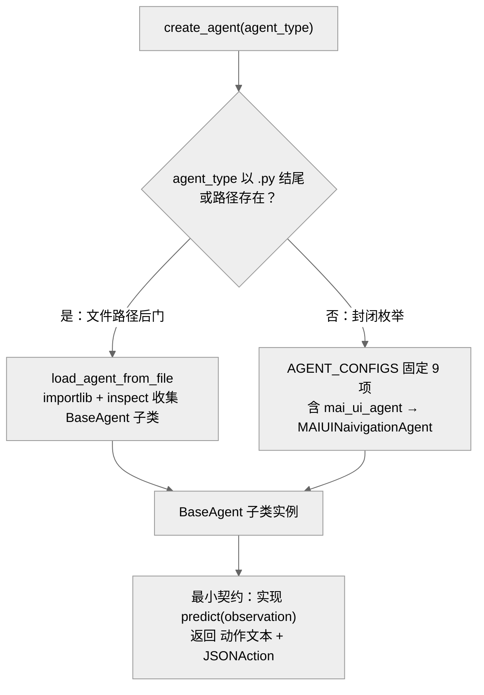

> **提炼自**：Tongyi-MAI mobile-world 评测环境复盘 —— 接入面收敛为一个抽象方法，扩展性靠"封闭枚举 + 文件路径后门"双通道而非开放插件目录

# Agent 接入面最小化——封闭注册表+文件后门（Minimal Integration Surface: Closed Registry + File Backdoor）

## 模式类型

架构模式（扩展点设计 / 插件接入 / 模型适配收敛）

## 成熟度

L1 已验证（1 次验证：2026-08-29 Tongyi-MAI mobile-world 源码学习）

## 适用场景

需要让外部实现（新 Agent、新模型、新后端）以最低成本接入系统：

- 评测/仿真框架要接入来自不同团队、使用不同模型厂商 API 的 Agent 实现
- 工具型系统要在"稳定内置集"与"实验性扩展"之间划出明确边界
- 调用入口（CLI 参数、配置字段）希望用同一形式既指内置实现又指外部脚本文件

## 问题背景

扩展点设计最常见的两种失败：

1. **一步到位建开放插件目录**：为"可扩展性"上来就做插件目录 + 自动扫描 + 动态发现——扩展面失控，加载错误难以归因，第三方代码在无契约状态下进入运行时。
2. **接入面随需求膨胀**：每来一个新需求就往抽象基类加抽象方法，或让各子类自行处理模型 API 怪癖——接入成本从"实现 1 个方法"涨到"实现 N 个方法"，怪癖散落各处，排查要遍历全部实现。

根本矛盾：**可审计性要求扩展面封闭，实验自由要求扩展面开放**——直觉上只能二选一。

## 核心设计

三原则：

1. **接入面收敛为一个抽象方法**：接入新 Agent 的最小契约只有 `predict(observation) -> tuple[str, JSONAction]`——`BaseAgent(ABC)` 的唯一抽象方法（F-007）。基类同时给出可覆写的默认物：`build_openai_client`（timeout=120s、api_key 空时用 "empty"，F-007），最小实现只需"继承 + 实现 predict"。
2. **"封闭枚举 + 文件路径后门"双通道**：默认通道是写死的固定注册表（`AGENT_CONFIGS` 共 9 项，F-011）——可枚举、可审计、无加载风险；开放通道由 `create_agent` 的文件路径分支提供：`agent_type` 以 `.py` 结尾或路径存在时走 `load_agent_from_file`（importlib 动态加载 + inspect 只收集 BaseAgent 子类，F-012/F-013）——后门保留实验自由，但类型契约不放松。
3. **跨厂商 API 怪癖单点收敛**：模型名分支集中在基类一个方法 `openai_chat_completions_create`（F-008）：含 "claude" 强制 max_tokens=64000 并删除 temperature，"gpt"/"o1" 换 max_completion_tokens，"kimi-k" 加 enable_thinking 并把 reasoning 包成 `<think>` 前缀；子类零怪癖。甚至流式响应也统一经 `_wrap_stream_with_usage_logging` 记账（F-009），不留绕过口子。

## 实施要点

| 维度 | 做法 | mobile-world 实例 |
|---|---|---|
| 抽象契约 | 接入最小面只有一个抽象方法 | `BaseAgent(ABC)` 唯一抽象 `predict(observation) -> tuple[str, JSONAction]`（F-007） |
| 默认通道 | 固定注册表，只收稳定内置项 | `AGENT_CONFIGS` 写死 9 项，含 `"mai_ui_agent": MAIUINaivigationAgent`（F-011） |
| 开放通道 | 文件路径后门，类型契约不放松 | `agent_type` 以 `.py` 结尾或路径存在 → `load_agent_from_file`（importlib + inspect 收集 BaseAgent 子类）（F-012/F-013） |
| 怪癖收敛 | 模型适配集中在基类单方法分支 | `openai_chat_completions_create` 按 claude/gpt/kimi-k 分支（F-008） |
| 记账兜底 | 流式与非流式同走统一包装 | 流式经 `_wrap_stream_with_usage_logging`（F-009） |
| 能力组合 | 新能力用组合而非新增抽象方法 | `MCPAgent(BaseAgent)` 持有 tools（F-010） |
| 入口语义 | 同一参数既收注册名也收文件路径 | `--agent-type` 双通道（F-019） |

## 不适用场景与反目标用户

### 不适用场景

- ❌ **扩展物数量预期大且第三方生态为主**：封闭枚举的前提是"内置集有限稳定"；若预期成百上千第三方扩展，带版本管理与沙箱的开放插件生态才是正解。
- ❌ **需要热插拔/运行时启停**：文件路径后门是加载时分支，不提供运行时卸载与依赖隔离。
- ❌ **接入物生命周期差异悬殊**：有状态多轮与无状态单轮成员混杂时，先解决类层级组织（生命周期差异化继承），再谈接入面尺寸。

### 反目标用户

- 追求"一切皆插件"的框架洁癖者：本模式的默认通道是写死的字典，注册表项改动要过代码评审。
- 以"动态发现数量"为扩展性指标的团队：本模式认为后门存在即可，不追求发现机制的完备。

### 适用边界与前提条件

- 扩展契约能收敛为单一抽象方法（做不到就先重新切分扩展点）。
- 注册表项数量有限且变更频率低（以代码评审管控，而非配置热更）。
- 团队接受"后门路径不走注册表审计、但源码可读可查"的取舍。

## 反模式

### 反模式1："开放插件目录万能论"

为可扩展性一步建成插件目录 + 自动扫描。后果：扩展面失控、加载错误难归因、无契约代码进入运行时。**正确做法**：默认封闭枚举注册表（F-011），动态加载只作为显式文件路径后门保留（F-012/F-013）。

### 反模式2："适配怪癖散落子类"

各子类自行处理模型 API 差异（max_tokens、temperature、thinking 开关等）。后果：同一怪癖多处实现，排查兼容性问题需遍历全部子类。**正确做法**：怪癖集中在基类单方法按模型名分支（F-008），兼容性排查先查分支表。

### 反模式3："后门无约束动态加载"

文件路径通道加载任意 .py、任意类。后果：意外/恶意代码进入运行时，多子类歧义无从裁决。**正确做法**：importlib + inspect 只收集 BaseAgent 子类（F-012/F-013），类型契约与注册表通道一致。

### 反模式4："注册表无限膨胀"

每接入一个 Agent 就往注册表加一项。后果：核心依赖面膨胀，注册表从"稳定内置清单"退化为"垃圾场"。**正确做法**：注册表只收稳定内置项，实验性实现走文件路径后门。

### 反模式5："流式响应绕过统一记账"

子类自行处理流式响应、各自计费。后果：usage 记账遗漏，计费与审计不可信。**正确做法**：流式与非流式同走统一包装（`_wrap_stream_with_usage_logging`，F-009）。

### 反模式6："最小接入面被逐步蚕食"

新需求到来就往抽象基类加抽象方法。后果：接入成本从 1 个方法涨到 N 个，老实现被迫补空实现。**正确做法**：新能力用组合/可选覆写承载（如 `MCPAgent(BaseAgent)` 持有 tools，F-010），抽象方法集合保持冻结。

## 失败案例

### 案例：按"开放插件目录"先验预期扩展机制未果（mobile-world 源码学习，2026-08-29）

**背景**：学习 AGENT_CONFIGS 时按"可扩展注册表 = 开放插件目录 + 自动扫描"的直觉预期，先寻找插件目录配置与扫描逻辑。

**发现过程**：注册表是写死的 9 项字典（F-011），其中 `"mai_ui_agent": MAIUINaivigationAgent`——MAI-UI 的 navigation Agent 未做任何改造即成为内置项；"开放扩展"实际由 `create_agent` 的文件路径分支提供（F-012/F-013：`agent_type` 以 `.py` 结尾或路径存在时走 `load_agent_from_file`，importlib + inspect 收集 BaseAgent 子类）。同轮还确认两处"集中而非散落"：模型适配怪癖全部收敛在 `openai_chat_completions_create` 单方法按模型名分支（F-008），流式响应也统一经 `_wrap_stream_with_usage_logging` 记账（F-009）。直觉预期被源码证据推翻：封闭枚举不是"没做完的插件系统"，而是与后门配套的有意设计。

**教训**：扩展机制的检索应从 `create_agent` 的实际分支语句出发，而非从"开放/封闭"的架构先验出发；"封闭枚举 + 文件路径后门"是"默认可审计、后门保实验"的组合设计——看到写死的字典不等于看到不可扩展。

## 早期预警信号

| 预警信号 | 可能问题 | 建议行动 |
|---|---|---|
| 子类中重复出现按模型名分支的 if 逻辑 | 怪癖散落（反模式2） | 上提到基类单方法集中分支（F-008） |
| 接入新 Agent 需实现的抽象方法数量增长 | 接入面被蚕食（反模式6） | 新能力走默认实现或组合（如 `MCPAgent` 持 tools，F-010），不动抽象方法集合 |
| 注册表项持续增长且无稳定性门槛 | 注册表膨胀（反模式4） | 实验性 Agent 改走文件路径后门 |
| 动态加载报错难归因或加载了非预期类型 | 后门无类型契约（反模式3） | inspect 只收集 BaseAgent 子类，收紧契约（F-012/F-013） |
| usage 记账缺失、计费对不上 | 流式响应绕过统一包装（反模式5） | 流式也经 `_wrap_stream_with_usage_logging`（F-009） |
| 使用者找不到扩展入口而直接改注册表源码 | 双通道语义未文档化 | 显式标注 `--agent-type` 既收注册名也收文件路径（F-019） |

## 实际案例

Tongyi-MAI mobile-world Agent 注册表（2026-08-29 源码学习）：

| 维度 | 做法 | 实例 |
|---|---|---|
| 抽象契约 | 唯一抽象方法承载最小接入面 | `BaseAgent(ABC)` 抽象 `predict(observation) -> tuple[str, JSONAction]`（F-007） |
| 封闭通道 | 写死的固定注册表 | `AGENT_CONFIGS` 共 9 项，含 `"mai_ui_agent": MAIUINaivigationAgent`（F-011） |
| 开放通道 | 文件路径分支动态加载 | `load_agent_from_file`（importlib + inspect 收集 BaseAgent 子类）（F-012/F-013） |
| 怪癖收敛 | 基类单方法按模型名分支 | `openai_chat_completions_create` 的 claude/gpt/kimi-k 分支（F-008） |
| 记账兜底 | 流式不例外 | `_wrap_stream_with_usage_logging`（F-009） |
| 能力组合 | 新能力不扩张抽象方法 | `MCPAgent(BaseAgent)` 持有 tools（F-010） |

## 迁移验证

- **可迁移场景**：LLM 网关接入新模型厂商（统一 chat 抽象方法 + 厂商参数怪癖集中分支）；测试框架接入自定义 runner（固定内置集 + 脚本路径后门）；CLI 工具接入新执行后端（同一入口参数双语义）。
- **先例关联**：与 [three-layer-capability-openness.md](./three-layer-capability-openness.md) 同构——"封闭枚举 + 文件路径后门"是"核心封闭 + 边缘开放"在 Agent 接入层的投影；与 [zero-config-core-enhancement.md](./zero-config-core-enhancement.md) 互补——零配置默认物（F-007）让最小接入开箱即用。

## 与其他模式的关系

| 关系模式 | 关系类型 | 说明 |
|---|---|---|
| [tool-skill-separation.md](./tool-skill-separation.md) | 分工互补 | 该模式区分"工具/技能"两类扩展物并分别治理；本模式约束接入任一扩展物所需实现面的最小尺寸 |
| [three-layer-capability-openness.md](./three-layer-capability-openness.md) | 同构思想 | "核心封闭、边缘开放"的分层开放度设计；封闭注册表对应核心层，文件路径后门对应开放边缘 |
| [lifecycle-differentiated-inheritance.md](./lifecycle-differentiated-inheritance.md) | 同源源码束 | 同批 Tongyi-MAI 学习产物；注册表中 `mai_ui_agent` 指向的 navigation Agent 即该模式的实例（F-011） |
| [zero-config-core-enhancement.md](./zero-config-core-enhancement.md) | 互补 | 零配置起步降低接入摩擦：api_key 空时用 "empty"、默认 timeout=120s（F-007），最小实现无需配置文件 |

<!-- changelog -->
- 2026-08-29 | pattern | 初始创建：从 Tongyi-MAI mobile-world 源码学习（洞察3）萃取；证据链 F-007/F-008/F-009/F-010/F-011/F-012/F-013/F-019
