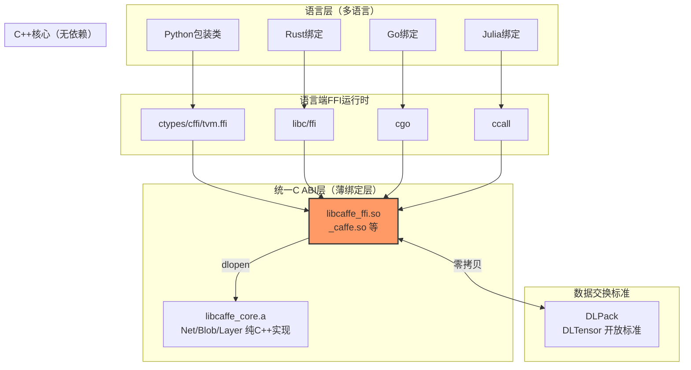

> **提炼自**：[07-caffe-cpp-slim-tvm-ffi-modernization.md](../../../knowledge/learning/caffe-architecture-wiki/07-caffe-cpp-slim-tvm-ffi-modernization.md) —— daoflows/caffe TVM FFI绑定层设计

# C ABI 动态语言绑定模式（C-ABI Dynamic Language Binding）

## 决策状态

✅ 已接受（Accepted）—— TVM FFI 在工业界广泛验证，Caffe slim核心已采用

## 模式类型

架构模式 / 跨语言互操作模式

## 成熟度

L3 可复用（TVM生态广泛使用+Caffe验证+可推广到所有需要多语言绑定的C/C++库）

## 适用场景

当C/C++库需要提供Python/Rust/Go/Julia/Java等动态语言绑定，且满足以下条件时：
- 绑定需要跨语言小版本稳定（如Python 3.10→3.11→3.12不需要重编译扩展）
- 需要支持多种语言，不想为每种语言写大量胶水代码
- 数据交换频繁，要求高性能（零拷贝）
- 二进制分发友好，用户不需要编译工具链就能安装

典型场景：
- 所有需要多语言绑定的C/C++库（ML框架、数据库驱动、多媒体处理）
- 插件系统设计（.so/.dll插件用C ABI接口而非C++类）
- 跨进程/跨语言RPC的底层传输设计
- 嵌入式SDK为上层应用提供的API设计
- 编程语言运行时的互操作层（如JVM/Python/Node.js的native扩展）

## 上下文与问题背景

C/C++库做语言绑定的常见困境：

| 绑定方案 | 问题 |
|---------|------|
| **boost::python** | 编译极慢、boost依赖重、Python小版本升级就崩溃、仅支持Python |
| **pybind11** | 头文件库稍轻，但仍深度依赖Python C API、跨版本不稳定、仅支持Python |
| **SWIG** | 生成代码质量差、调试困难、类型映射复杂、学习曲线陡 |
| **手动C API + ctypes** | 工作重复、容易出错、各语言各自封装导致API不统一 |
| **直接暴露C++类** | ABI不稳定——编译器/标准库版本不同直接崩溃，跨语言完全不可能 |

**核心矛盾**：
- C++ ABI 极不稳定（name mangling、异常处理、STL布局、vtable都随编译器/版本变化）
- 动态语言运行时各自有C API，版本之间不兼容
- 数据格式不统一，跨语言传数组需要做深拷贝

## 决策

采用 **纯C ABI + 不透明句柄 + DLPack开放张量标准** 作为跨语言绑定的唯一接口层。

### 核心结构



### 决策1：接口层只用 C ABI，绝不跨边界传C++类型

所有导出函数用 `extern "C"` 修饰，函数签名中**禁止出现**：
- ❌ `std::string`、`std::vector`、`std::shared_ptr` 等STL类型
- ❌ C++类引用或指针（除了不透明句柄）
- ❌ C++异常（跨语言throw是UB）
- ❌ 虚函数/继承关系

**只允许**：
- ✅ C基础类型（int、float、double、const char*）
- ✅ 不透明句柄（`typedef void* NetHandle;`）
- ✅ DLPack的`DLTensor*`（标准C struct，布局稳定）
- ✅ 整数错误码 + 错误查询函数

```c
// ✅ 正确：纯C ABI
#ifdef __cplusplus
extern "C" {
#endif

typedef void* NetHandle;

int NetCreate(const char* prototxt_str, const char* weights_path, NetHandle* out_handle);
int NetForward(NetHandle handle, DLTensor* input, DLTensor** output);
int NetDelete(NetHandle handle);
const char* GetLastError(void);

#ifdef __cplusplus
}
#endif
```

**为什么必须纯C ABI**：
C ABI是编程语言世界的"拉丁语"——所有系统语言都支持C ABI，且过去30年保持稳定。C++没有标准ABI，MSVC/GCC/Clang各有各的mangling，同一编译器不同版本STL布局也不同。

### 决策2：不透明句柄（Opaque Handle）模式隐藏内部类型

不在C头文件中暴露任何C++类型定义，所有内部对象用 `void*` 句柄代替：

- 句柄生命周期：Create返回→使用→Delete释放，严格RAII
- 类型安全由语言端包装类保证，不由C接口保证
- 句柄本质是类型擦除的指针，C层不解释其内部结构

```cpp
// C++侧实现（_caffe.cpp）
extern "C" int NetCreate(const char* prototxt, const char* weights, NetHandle* out) {
    try {
        auto net = std::make_unique<caffe::Net>(prototxt, weights);
        *out = static_cast<NetHandle>(net.release());
        return 0;
    } catch (const std::exception& e) {
        SetLastError(e.what());
        return -1;
    }
}
```

```python
# Python侧包装
class Net:
    def __init__(self, prototxt: str, weights: str):
        handle = NetHandle()
        ret = _lib.NetCreate(prototxt.encode(), weights.encode(), byref(handle))
        if ret != 0:
            raise RuntimeError(_lib.GetLastError().decode())
        self._handle = handle
    
    def __del__(self):
        if self._handle:
            _lib.NetDelete(self._handle)
```

### 决策3：张量/数组通过 DLPack/Arrow 开放标准零拷贝交换

不要自己设计数组结构，使用行业开放标准：

| 数据类型 | 标准 | 适用场景 |
|---------|------|---------|
| 张量（ML/数值计算） | **DLPack** | numpy/PyTorch/TVM/JAX/MLX/CuPy 零拷贝互转 |
| 表格数据 | **Apache Arrow** | 数据分析、pandas/Spark/DuckDB 零拷贝 |
| 通用内存块 | **buffer protocol (PEP 3118)** | Python生态通用 |

**DLPack DLTensor结构**（稳定C ABI）：
```c
typedef struct {
    void* data;
    DLDevice device;      // {kDLCPU/kDLCUDA/kDLROCM, device_id}
    int32_t ndim;
    DLDataType dtype;     // {kDLFloat/kDLInt/kDLUInt, bits, lanes}
    int64_t* shape;
    int64_t* strides;
    int64_t byte_offset;
} DLTensor;

typedef struct {
    DLTensor tensor;
    void* manager_ctx;
    void (*deleter)(struct DLManagedTensor* self);
} DLManagedTensor;
```

**零拷贝关键**：Python端numpy/PyTorch数组可以通过 `__dlpack__()` 协议直接拿到底层数据指针传给C++，不复制任何数据；C++端返回的Blob可以包装为DLTensor，Python端直接构造为tvm.nd.array/torch.Tensor。

### 决策4：错误处理用返回码+最后错误查询，不抛异常跨边界

```c
// 统一约定：
// 返回 0 = 成功
// 返回非0 = 错误，调用 GetLastError() 获取错误消息

// ❌ 禁止：C++异常穿过extern "C"边界
// （会导致段错误、资源泄漏、Python端无法catch）
extern "C" void BadFunc() { throw std::runtime_error("boom"); }

// ✅ 正确：内部try/catch捕获所有异常，转为错误码
extern "C" int GoodFunc() {
    try {
        // C++业务逻辑
        return 0;
    } catch (const std::bad_alloc& e) {
        SetLastError(std::string("OOM: ") + e.what());
        return ENOMEM;
    } catch (const std::exception& e) {
        SetLastError(e.what());
        return -1;
    } catch (...) {
        SetLastError("Unknown C++ exception");
        return -1;
    }
}
```

### 决策5：绑定层必须薄——只做类型转换和调用转发

C ABI层（_caffe.cpp）的职责：
1. C字符串（const char*）→ C++字符串（std::string）转换
2. 句柄（void*）→ 具体类型指针（caffe::Net*）安全转换
3. C++异常→错误码转换
4. DLTensor ↔ Blob 包装（零拷贝，只包指针不包数据）

C ABI层**不应该做**：
- ❌ 业务逻辑计算
- ❌ 内存分配/数据拷贝
- ❌ 复杂条件分支
- ❌ 除类型转换外的任何逻辑

理想情况下，每个导出函数体不超过20行。

### 决策6：各语言端提供惯用风格包装类

C ABI是给"机器"用的，语言端必须有"人"用的包装：

```python
# Python端：上下文管理器+类型注解+惯用命名
class Net:
    def __init__(self, prototxt: str | Path, weights: str | Path):
        ...
    
    def forward(self, input: np.ndarray | torch.Tensor) -> np.ndarray:
        """前向推理，支持numpy和torch输入，返回numpy数组"""
        dl_input = input.__dlpack__() if hasattr(input, '__dlpack__') else np.asarray(input)
        dl_output = DLTensorPtr()
        check_ret(_lib.NetForward(self._handle, dl_input, byref(dl_output)))
        return np.from_dlpack(dl_output)
    
    def __enter__(self): return self
    def __exit__(self, *args): self._close()
```

```rust
// Rust端：RAII+Result+类型安全
pub struct Net { handle: NetHandle }

impl Net {
    pub fn new<P: AsRef<Path>>(prototxt: P, weights: P) -> Result<Self> { ... }
    pub fn forward(&self, input: &ArrayD<f32>) -> Result<ArrayD<f32>> { ... }
}

impl Drop for Net { fn drop(&mut self) { unsafe { NetDelete(self.handle); } } }
```

## 后果与权衡

### 正面后果

✅ **一次编写，多语言可用**：C ABI层写一次，所有支持C FFI的语言都能用
✅ **跨版本稳定**：Python 3.10→3.14、Rust 1.70→1.80升级都不需要重新编译C扩展
✅ **零拷贝数据交换**：DLPack让CPU/GPU张量在不同框架间直接共享，无内存复制
✅ **分发友好**：发布一个.so/.dll/.dylib，用户pip install/cargo add/go get直接用，不需要编译工具链
✅ **调试简单**：C接口符号清晰，gdb/lldb可以直接调试；出问题可以用C调用复现
✅ **二进制兼容性强**：同一.so可以被不同编译器、不同语言、甚至不同进程加载

### 负面后果/代价

⚠️ **需要手写类型转换**：相比pybind11的全自动，需要手动写C↔C++类型转换代码
⚠️ **不透明句柄绕过类型系统**：C层void*不保证类型安全，需要语言端包装类保护
⚠️ **DLPack有学习成本**：需要理解DLManagedTensor生命周期、deleter机制
⚠️ **错误处理繁琐**：每个调用都要检查返回码，不如异常方便
⚠️ **C++类继承/虚函数需要额外设计**：如果库核心大量使用OOP多态，需要额外设计dispatch机制

### 边界条件

此模式**不适用**于：
- ❌ 纯Python库（不需要C扩展）
- ❌ 只有一个语言需要绑定且性能不敏感（用subprocess调用CLI更简单）
- ❌ 需要传递复杂C++对象图（如STL容器嵌套、自定义模板类）——应该简化接口再用本模式
- ❌ 极其简单的库（只有几个函数）——直接用ctypes加载CDLL即可，不需要封装

## 替代方案对比

| 方案 | 优点 | 缺点 | 推荐度 |
|------|------|------|--------|
| **C ABI + DLPack + 语言包装（本模式）** | 跨语言、跨版本稳定、零拷贝、分发友好 | 初始工作量稍大 | ⭐⭐⭐⭐⭐ |
| **pybind11** | 编写快，C++/Python绑定自动化 | 仅Python、跨版本不稳定、编译依赖重 | ⭐⭐⭐（仅Python且不介意重编译时可用） |
| **boost::python** | 成熟 | 依赖boost、Python升级就崩 | ❌ 不推荐 |
| **SWIG** | 多语言支持 | 生成代码质量差、调试难、类型系统弱 | ⭐⭐ |
| **gRPC/Protobuf 服务化** | 跨进程、跨机器、跨语言 | 需要运行服务、序列化开销、部署复杂 | ⭐⭐（跨进程场景用） |
| **WebAssembly** | 浏览器可用 | 性能开销、内存模型限制 | ⭐⭐（Web场景） |

## 实施检查清单

设计C ABI层时：

- [ ] 所有导出函数是否是 `extern "C"`？
- [ ] 函数签名中是否完全没有C++类型（STL/类/引用）？
- [ ] 是否所有函数返回int错误码，且有GetLastError()？
- [ ] 所有C++异常是否在extern "C"边界内被catch？
- [ ] 内部对象是否都用不透明void*句柄表示？
- [ ] 每个Create是否有对应的Delete？
- [ ] 数组/张量是否通过DLPack/Arrow等开放标准传递？
- [ ] DLTensor的deleter是否正确设置，避免内存泄漏？
- [ ] 绑定层（.cpp文件）是否"薄"（仅类型转换，无业务逻辑）？
- [ ] 语言端是否有惯用包装类（RAII/context manager/类型注解）？
- [ ] 是否提供了版本查询函数（用于版本兼容检查）？

## 反模式与陷阱

| 陷阱 | 表现 | 规避方法 |
|------|------|---------|
| **跨边界抛异常** | C++异常穿过extern "C"，Python端段错误 | 所有导出函数最外层try/catch捕获所有异常 |
| **在C头文件include C++头** | 导致C语言用户无法#include，且暴露C++ ABI | C公共头文件是纯C，只用void*和基础类型 |
| **返回栈/堆上的局部指针** | 返回局部变量地址，调用时已释放 | 返回的指针必须来自new/malloc或静态存储，由调用方或deleter释放 |
| **不透明句柄错误转换** | NetHandle传给BlobDelete，类型混淆崩溃 | 语言端用不同类型的包装类保护，不直接暴露void*给用户 |
| **手动设计私有数组结构** | 自己写Tensor结构，无法和numpy/PyTorch零拷贝 | 用DLPack，不要重复造轮子 |
| **DLTensor不设置deleter** | 内存泄漏或double free | 明确约定tensor的所有权：谁分配谁释放，或统一用deleter |
| **C接口做内存拷贝** | 输入输出都memcpy，性能损失严重 | 所有数据传递必须零拷贝，只传指针和元数据 |
| **忽略const正确性** | const char*被cast为char*，修改只读内存崩溃 | 输入参数严格const，输出参数用双指针 |
| **没有版本机制** | 升级库后旧的调用方出现难以调试的崩溃 | 提供GetVersion()函数，语言端加载后先检查版本兼容性 |

## Caffe 实际验证案例

**_caffe.cpp TVM FFI绑定**：
- C ABI导出函数约8个（NetCreate/NetForward/NetGetBlob/BlobData/BlobShape/NetDelete等）
- 所有张量通过DLTensor传递，numpy输入零拷贝
- Python 3.12→3.14升级无需重编译_caffe.so
- net.forward()支持numpy/PyTorch/TVM ndarray三种输入
- 异常统一捕获转为RuntimeError，Python端可正常catch
- 绑定层代码约300行，远少于boost::python版本的1500+行

## 与现有模式的关系

| 关联模式 | 关系 |
|---------|------|
| [dependency-shimming-layer.md](dependency-shimming-layer.md) | 裁剪完依赖的slim核心通过C ABI对外暴露，两者是连续的两阶段 |
| [declarative-op-compiler-backend.md](declarative-op-compiler-backend.md) | C ABI负责核心推理性能路径，声明式算子层负责快速扩展 |
| [python-native-extension-self-contained-wheel.md](../code-patterns/python-native-extension-self-contained-wheel.md) | 编译好的C ABI扩展可以打包为自包含wheel分发 |
| [shared-lib-symbol-dual-layer-control.md](../code-patterns/shared-lib-symbol-dual-layer-control.md) | C ABI层需要控制符号可见性，只导出公共接口 |

## 相关决策

- [dependency-shimming-layer.md](dependency-shimming-layer.md)：核心构建的前置依赖裁剪
- [declarative-op-compiler-backend.md](declarative-op-compiler-backend.md)：C++核心与Python算子层的分工
