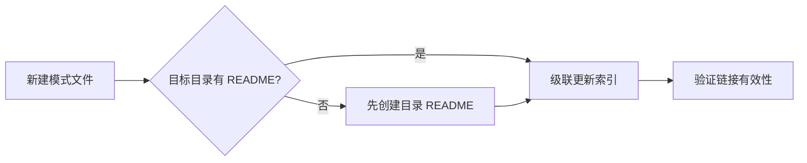
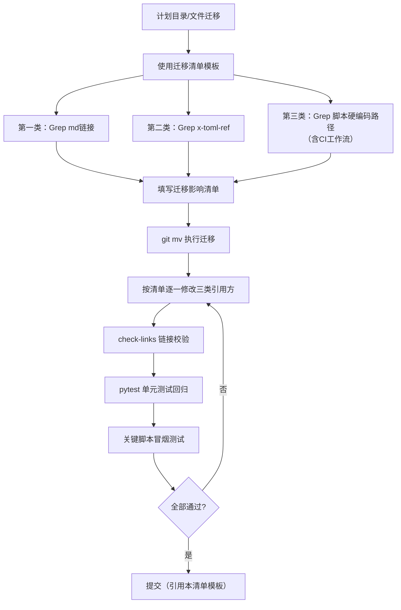

# 级联更新拓扑的前提检查（cascade-update-prerequisite-check）

## 模式类型
架构模式

## 成熟度
L2 已验证（原始模式入库场景已验证；2026-07-19 扩展至目录/文件迁移场景）

## 适用场景
1. **模式入库场景**：新建模式文件入库至 pattern 体系前，检查目标目录是否具备级联更新的前提条件（README 索引存在性）。
2. **目录/文件迁移场景**：执行目录重命名、路径迁移、根路径调整等 refactor 前，检查三类引用方（md链接/x-toml-ref/脚本硬编码路径）是否已全量扫描，避免级联遗漏。

## 问题背景
- **原始场景**：入库模式文件时发现 code-patterns/ 和 architecture-patterns/ 目录无 README.md 索引文件，导致无法完成级联更新（索引同步）。
- **迁移场景（2026-07-19 新增）**：2026-07-15 文档根路径迁移（`docs/`→`.agents/docs/`）后，docgen.py stats 统计路径未同步更新，导致核心数据连续3天显示"模式0+"（实际493个存活），16步CI质量门未覆盖统计合理性，属于典型的"迁移级联遗漏"事故。详细复盘见[retrospective-specweave-full-project-20260719](../../reports/project-reports/retrospective-specweave-full-project-20260719/README.md)。

## 规则

**在执行级联更新拓扑前，先检查目标目录是否已有索引文件（README.md）。**

### 检查清单

| 目标目录 | 检查项 | 若缺失 | 处理方式 |
|---------|--------|--------|---------|
| methodology-patterns/ | README.md 是否存在？ | — | 直接级联更新 |
| code-patterns/ | README.md 是否存在？ | 需先创建索引文件 | 先创建 README.md，再级联更新 |
| architecture-patterns/ | README.md 是否存在？ | 需先创建索引文件 | 先创建 README.md，再级联更新 |

### 操作流程

## 关键要点

1. **前提检查先于级联更新**：避免因索引文件缺失导致级联更新阻断
2. **目录 README 是级联更新的锚点**：无锚点则无法完成索引同步
3. **补全历史遗漏优先**：发现缺失立即补全，而非绕过

## 成功案例

| 任务 | 发现缺失 | 处理方式 | 结果 |
|------|---------|---------|------|
| 改进建议执行 - 模式入库 | code-patterns/、architecture-patterns/ 无 README | 先创建两个 README.md，再入库模式 | 级联更新完成，索引同步 |

## 反例警示

| 错误操作 | 后果 |
|---------|------|
| 不检查前提直接入库模式 | 索引无法同步，模式可发现性受限 |
| 发现缺失后绕过不补全 | 历史遗漏持续存在，后续入库继续受阻 |

## 与 cascade-update-topology 的关系

本模式是 `cascade-update-topology` 的前置检查模式，两者配合使用：

1. **cascade-update-prerequisite-check**：检查前提条件（目录 README 存在性）
2. **cascade-update-topology**：执行级联更新（按拓扑顺序更新索引）

---

## 扩展场景：目录/文件迁移

> 2026-07-19 新增。当执行目录重命名、路径迁移、根路径调整等 refactor 类操作时，"前提检查"的范围从"目录README存在性"扩展为"三类引用方全量扫描"。

### 三类引用方检查

迁移类操作必须在执行前完成以下三类引用方的 Grep 扫描：

| 引用方类型 | 扫描目标 | 遗漏后果 | 严重度 |
|-----------|---------|---------|--------|
| **Markdown 相对链接** | 所有 `[text](relative/path)` 跨目录引用 | 文档断链，导航失效 | 中 |
| **x-toml-ref 元数据** | frontmatter 中的 `x-toml-ref:` 字段 + `.meta/toml/` 下 TOML 文件 | TOML 双斜杠断裂错误，元数据丢失 | 中 |
| **脚本硬编码路径** | Python/Shell/PowerShell/CI 中的字符串路径构造 | 静默失效（返回0/空），污染正式档案，CI不报错 | **高** |

### 迁移清单模板

迁移类操作强制使用配套清单模板，确保不遗漏任何引用方：

**模板位置**：[migration-cascade-checklist-template.md](../../../../../.agents/templates/migration-cascade-checklist-template.md)

使用方式：
1. 迁移前：复制模板"迁移前"章节，执行三类引用方全量扫描，填写迁移影响清单
2. 迁移中：按模板"迁移中"步骤顺序执行（git mv → 修改引用方 → 删除空目录）
3. 迁移后：执行链接校验、单元测试、关键脚本冒烟测试三重验证

### 迁移场景反例（2026-07-15 事故）

| 错误操作 | 后果 | 本模式如何预防 |
|---------|------|---------------|
| 迁移 `docs/`→`.agents/docs/` 后只更新 Markdown 链接 | docgen.py 统计路径硬编码未更新，changelog连续3天显示"模式0+" | 三类引用方扫描强制包含脚本硬编码路径（第三类） |
| 路径不存在时函数静默返回0 | StatsSourceError防线缺失前，问题被掩盖 | 配套双防线机制（见 StatsSourceError + snapshot 环比校验） |
| 分三天逐步修复级联遗漏 | D1修md链接、D2修toml、D3修stats，返工成本高 | 迁移前全量扫描一次性闭环 |

### 迁移场景操作流程

**使用顺序**：先执行前提检查，再执行级联更新拓扑。