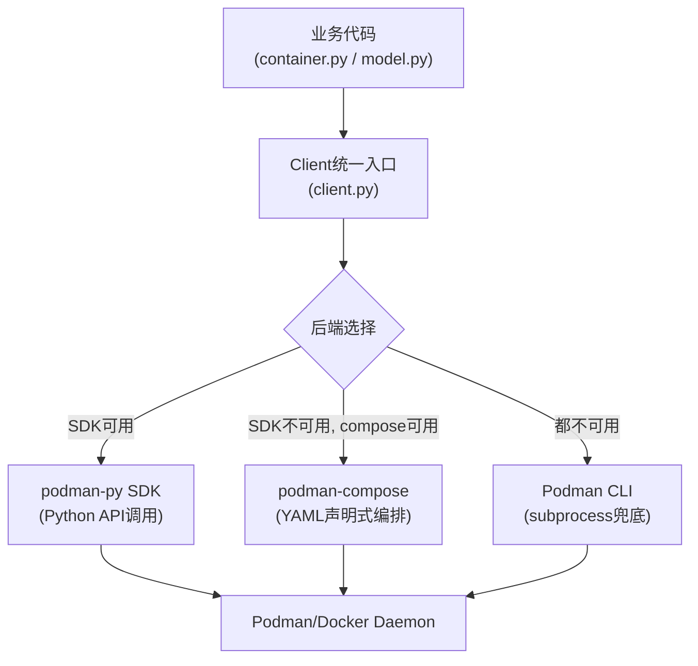

# 容器开发工具七层栈+三层后端降级架构

## 模式概述

构建容器类开发工具（容器管理CLI、开发环境、ML模型分发工具等）时，最常见的失败架构是"CLI直通"：所有功能直接通过subprocess调用容器运行时命令，没有SDK封装、没有声明式编排、没有降级机制，导致难以测试、难以扩展、环境适应性差。

本模式定义了容器开发工具的标准七层能力栈，以及核心的**三层后端降级架构**（程序化SDK → 声明式编排 → CLI兜底），上层API不可用时自动降级到下层，对业务代码完全屏蔽后端差异。

## 触发场景

- 当构建基于Docker/Podman/containerd的容器开发工具时
- 当需要同时支持程序化调用和声明式编排（compose）时
- 当工具需要在多种环境（开发机、CI、服务器、Toolbx容器）中运行时
- 当容器工具需要集成领域特定能力（ML模型分发、多容器编排等）时
- 适用于：容器CLI工具、开发环境容器、ML模型容器管理、容器化部署工具
- 不适用于：单容器简单脚本（直接docker run即可，不需要七层栈）、Kubernetes Operator（有更高层编排抽象）、生产容器编排平台（已经有compose/k8s层）

## 核心架构

### 整体七层能力栈

```
┌─────────────────────────────────────────────────────────────┐
│ 7. 构建系统层 (Build System)        — 打包、分发、wheel构建   │
├─────────────────────────────────────────────────────────────┤
│ 6. 文档层 (Documentation)           — README、AGENTS、使用指南│
├─────────────────────────────────────────────────────────────┤
│ 5. 主机互通层 (Host Interop)        — Toolbx透传、volume挂载 │
├─────────────────────────────────────────────────────────────┤
│ 4. 领域能力层 (Domain Capability)   — ML模型/业务特定工具集成 │
├─────────────────────────────────────────────────────────────┤
│ 3. 声明式编排层 (Declarative Orch.) — compose.yaml多容器编排│
├─────────────────────────────────────────────────────────────┤
│ 2. 程序化SDK层 (Programmatic SDK)   — podman-py/docker-py封装│
├─────────────────────────────────────────────────────────────┤
│ 1. 基础运行时层 (Base Runtime)      — 镜像、容器、网络基础配置│
├─────────────────────────────────────────────────────────────┤
│ 0. CLI兜底层 (CLI Fallback)         — subprocess命令调用     │
└─────────────────────────────────────────────────────────────┘
```

### 三层后端降级架构（核心）



**降级规则**：
1. 优先使用SDK层：程序化调用，类型安全，易于测试
2. SDK导入失败或连接失败时，自动降级到compose层：声明式YAML编排，适合多容器场景
3. compose也不可用时，降级到CLI层：subprocess调用命令行，通用性最强
4. 降级过程对上层业务代码**完全透明**，业务代码只调用client.py的统一接口
5. optional-dependencies按后端分组（sdk, compose, full, model），用户可按需安装

### 各层职责详解

| 层级 | 名称 | 职责 | 关键实现 | 依赖关系 |
|------|------|------|---------|---------|
| **L0** | CLI兜底层 | 通过subprocess调用容器运行时命令，所有上层的最终兜底 | `subprocess.run(["podman", "run", ...])` | 仅依赖系统安装podman/docker |
| **L1** | 基础运行时层 | 基础镜像选择、容器创建/启动/停止、网络/存储配置 | Containerfile、config/storage.conf | 依赖L0 |
| **L2** | 程序化SDK层 | SDK封装，提供面向对象的容器操作API，错误处理 | podman-py/docker-py, client.py统一封装 | 依赖L1，可选依赖podman>=5.0.0 |
| **L3** | 声明式编排层 | YAML声明式多容器编排、服务依赖、环境变量管理 | compose.yaml, compose_backend.py | 依赖L2/L0，可选依赖podman-compose>=1.0.0 |
| **L4** | 领域能力层 | 特定领域工具集成（ML模型OCI分发、ModelCar打包等） | model.py, scripts/olot_car.py, omlmd/olot集成 | 依赖L2/L3，独立于基础运行时 |
| **L5** | 主机互通层 | 开发模式透传、volume mount、Toolbx/Docker Desktop兼容 | compose.dev.yaml, 透传脚本 | 依赖L3 |
| **L6** | 文档层 | 使用文档、AGENTS.md、开发指南 | README.md, AGENTS.md | 功能稳定后同步 |
| **L7** | 构建系统层 | Python包构建、wheel打包、发布到PyPI | scikit-build-core + CMake + Ninja | 功能冻结后迁移 |

### Python项目推荐目录结构

```
<project-root>/
├── Containerfile              # L1: 基础镜像定义
├── compose.yaml               # L3: 生产环境声明式编排
├── compose.dev.yaml           # L5: 开发模式透传配置
├── pyproject.toml             # L7: 构建配置+optional-dependencies
├── .env.example               # L1: 环境变量模板
├── config/                    # L1: 运行时配置
│   ├── storage.conf
│   ├── jupyter_notebook_config.py
│   ├── sshd_config
│   └── supervisord.conf
├── tasks/                     # invoke任务包
│   ├── __init__.py            # Collection配置+命名空间
│   ├── client.py              # L2/L0: 三层后端统一客户端（核心）
│   ├── compose_backend.py     # L3: compose后端适配
│   ├── container.py           # L2: 容器操作（build/run/stop/exec）
│   ├── model.py               # L4: 领域能力（ML模型操作）
│   ├── build.py               # L7: 构建任务
│   ├── manage.py              # L2: 生命周期管理
│   ├── interact.py            # L5: 交互（shell/logs）
│   └── utils.py               # L0: CLI调用工具函数
├── scripts/                   # L4: 领域工具脚本
│   └── olot_car.py
└── CMakeLists.txt             # L7: 最小CMake配置（LANGUAGES NONE）
```

### client.py 三层降级核心实现模式

```python
class ContainerClient:
    """统一容器客户端，自动选择可用后端并降级"""

    def __init__(self):
        self._backend = None
        self._init_backend()

    def _init_backend(self):
        # 优先级1: 尝试podman-py SDK
        try:
            import podman
            self._backend = PodmanSDKBackend()
            return
        except (ImportError, ConnectionError):
            pass

        # 优先级2: 尝试podman-compose
        if self._is_compose_available():
            self._backend = ComposeBackend()
            return

        # 优先级3: CLI兜底
        self._backend = CLIBackend()

    def run(self, image: str, **kwargs):
        """统一接口：后端差异完全屏蔽"""
        return self._backend.run(image, **kwargs)

    # ... 其他统一方法（build/stop/exec/logs等）
```

### pyproject.toml 可选依赖分组

```toml
[project.optional-dependencies]
sdk = ["podman>=5.0.0"]
compose = ["podman-compose>=1.0.0"]
full = ["sdk", "compose"]  # 完整安装
model = ["omlmd>=0.2.0", "olot[oras-py]>=0.2.0"]  # 领域能力
```

## 反模式（不要这么做）

### ❌ 反模式1：跳过SDK层直接CLI调用

```python
# 错误：所有操作直接subprocess调用，没有SDK封装
def run_container(image):
    subprocess.run(["podman", "run", "-d", image], check=True)
    # 难以测试（必须mock subprocess）、错误处理粗糙、无类型安全
```
问题：丧失程序化能力，难以单元测试，参数构造易错，错误处理依赖字符串解析。

### ❌ 反模式2：不提供降级机制

```python
# 错误：强制依赖podman-py，没有fallback
import podman
client = podman.from_env()  # 环境没装podman-py直接崩溃
```
问题：环境适应性差——在没装SDK的CI/服务器/容器中（如Toolbx环境）工具完全不可用。

### ❌ 反模式3：领域能力与基础运行时耦合

```python
# 错误：ML模型逻辑和容器管理逻辑混在同一个文件
def pack_model_car(model_path, image_name):
    # 直接调用subprocess，混合了容器操作和ML模型逻辑
    subprocess.run(["podman", "build", ...], check=True)
    subprocess.run(["olot", "pack", model_path, image_name], check=True)
```
问题：基础运行时变更（如从Podman切到Docker）会波及领域代码；领域能力无法独立测试。

### ❌ 反模式4：先做构建系统迁移再做功能

```
# 错误：项目第一天就迁移构建系统，功能迭代时反复修改构建配置
R0: Migrate to scikit-build-core
R1: Add podman-py SDK (broken build, need to adjust CMake)
R2: Add compose (broken build again, fix cmake.args)
```
问题：功能快速迭代期构建配置会反复变化，提前迁移做无用功；构建问题阻塞功能开发。

### ❌ 反模式5：大爆炸式集成所有层

```
# 错误：第一次提交就包含七层所有内容
R0: Initial commit: Containerfile+SDK+compose+ML模型+文档+构建系统
# 20+文件同时修改，出问题无法定位在哪一层
```
问题：多维度同时变更，调试空间爆炸；回退必须回退所有功能。

## 检验标准

做完之后怎么知道做对了？

1. **后端透明性**：卸载podman-py后工具能自动降级到CLI模式正常工作，业务代码不需要任何修改
2. **分层测试**：可以单独mock任意一层（SDK/compose/CLI）进行单元测试，不需要真实Podman环境
3. **依赖分组**：`pip install <pkg>[sdk]`安装SDK依赖，`pip install <pkg>`最小安装仅CLI可用
4. **领域隔离**：model.py不直接import podman或调用subprocess，只通过client.py操作容器
5. **分层提交**：git log中每层对应独立的原子提交，可以通过提交信息清晰看到哪一层在哪个提交添加
6. **文档后置**：功能全部完成后文档一次性同步，文档中描述的命令均可运行验证
7. **构建稳定**：构建系统迁移后，功能迭代不再需要修改CMakeLists.txt或pyproject.toml构建配置

## 迁移示例（跨场景验证）

### 示例1：Docker开发工具（非Podman）
- L0 CLI: `subprocess.run(["docker", ...])`
- L1: Dockerfile, docker配置
- L2: docker-py SDK封装
- L3: docker-compose.yaml
- L4: 领域能力（如镜像安全扫描、镜像分层分析）
- L5: Docker Desktop for Mac/Windows兼容、volume挂载
- L6/L7: 文档+setuptools/hatch构建

### 示例2：Kubernetes开发工具（非容器运行时）
- L0 CLI: `subprocess.run(["kubectl", ...])`
- L1: kubeconfig、基础命名空间/Deployment配置
- L2: kubernetes-python-client SDK封装
- L3: Helm chart/Kustomize声明式编排
- L4: 领域能力（如Istio流量管理、ArgoCD应用管理）
- L5: 本地集群（kind/minikube）互通、port-forward
- L6/L7: 文档+构建系统

### 示例3：云服务CLI工具（非容器领域）
- L0 CLI: `subprocess.run(["aws", ...])` / boto3 core
- L1: 认证配置、区域选择、基础API封装
- L2: AWS SDK for Python（boto3）资源封装
- L3: CloudFormation/Terraform声明式编排
- L4: 领域能力（如ECS部署、S3数据处理、Lambda打包）
- L5: 本地开发环境与云端互通（LocalStack/development endpoints）
- L6/L7: 文档+构建

### 示例4：数据库管理工具（跨领域验证）
- L0 CLI: `subprocess.run(["psql", ...])`
- L1: 连接配置、认证、基础查询
- L2: psycopg2/SQLAlchemy SDK封装
- L3: Alembic数据迁移声明式配置
- L4: 领域能力（如数据备份恢复、性能分析、数据导入导出）
- L5: 本地开发数据库与生产环境互通（SSH隧道、只读副本）
- L6/L7: 文档+构建

## 边界条件与不适用场景

| 场景类型 | 为什么不适用 | 替代方案 |
|---------|-------------|---------|
| **单容器简单脚本** | 只有一个容器，不需要多容器编排，不需要SDK封装 | 直接写shell脚本或简单python subprocess调用即可 |
| **Kubernetes Operator** | K8s已经有更高层的抽象（CRD/Controller/Helm），不需要自己实现三层后端 | 使用Operator Framework/kubebuilder |
| **生产级容器编排平台** | 生产编排已经有成熟方案（K8s/Nomad/ECS），不需要自己造轮子 | 直接使用现成编排平台 |
| **一次性容器任务** | 临时跑一个容器（如`docker run --rm`），不需要复杂架构 | 直接调用CLI |
| **Windows原生容器** | Windows容器生态差异较大，compose支持有限 | 简化为SDK+CLI两层即可 |

## 与其他模式的关系

| 模式 | 关系 |
|------|------|
| [capability-stack-progressive-building](methodology-patterns/governance-strategy/capability-stack-progressive-building.md) | 方法论基础：本模式定义「做什么（七层架构）」，七层渐进构建定义「按什么顺序做」 |
| [meta-capability-inversion](meta-capability-inversion.md) | 架构原则：先实现原子能力（L0-L3）再构建上层编排，避免框架先行 |
| [zero-config-core-enhancement](zero-config-core-enhancement.md) | L0 CLI兜底是零配置核心：最小安装无需SDK/compose即可工作 |
| [docker-modular-build-orchestration](docker-modular-build-orchestration.md) | 配套模式：L7构建系统的Docker镜像模块化构建实现 |

## 来源

- 复盘报告：[retrospective-jupyter-podman-rootless-seven-rounds-20260827](../reports/build-engineering/retrospective-jupyter-podman-rootless-seven-rounds-20260827/README.md)
- 项目源码：`apps/containers/jupyter-podman-rootless/`（tasks/client.py, tasks/compose_backend.py, pyproject.toml）
- 相关洞察：I2「三层后端降级架构是容器工具集成的有效模式」

## Changelog

<!-- changelog -->
- 2026-08-27 | feat | 从Jupyter Podman Rootless七轮优化复盘萃取，L1-draft单案例待验证
