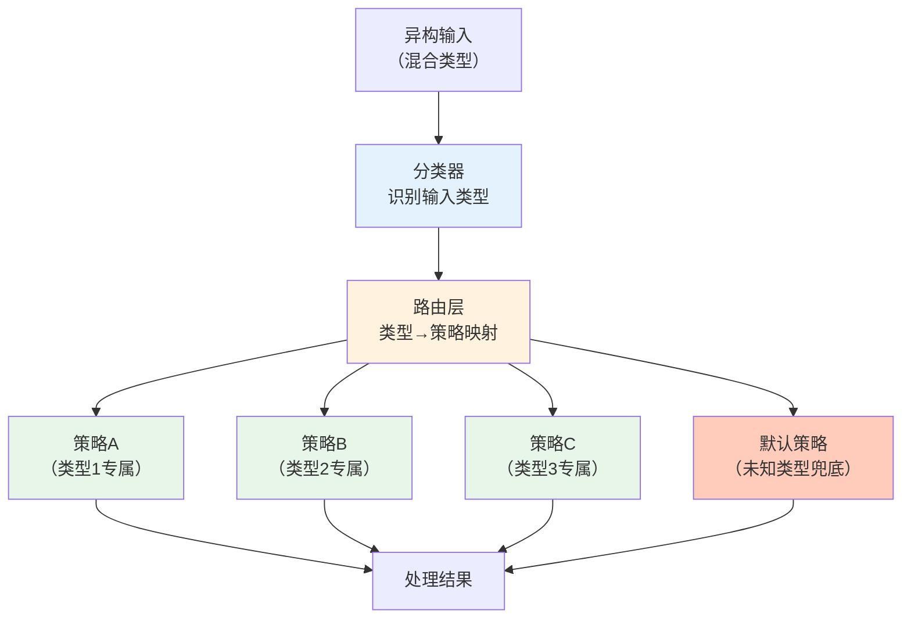

> **提炼自**：5个独立案例（Headroom上下文压缩路由、LLM模型大小路由、IoT设备分类映射、依赖四分类裁剪、数据生命周期分层）

# 内容类型路由模式（Content-Type Routing / Classify-Then-Dispatch）

## 模式类型

架构模式（异构数据处理/策略选择/可扩展设计）

## 成熟度

L2 已验证（5次验证来源：2026-07 Headroom压缩算法、2026-07 LLM模型路由、2026-06 IoT设备分类、2026-07 依赖裁剪四分类、2026-07 数据生命周期分层）

## 适用场景

需要处理多种异构输入类型，且不同类型需要不同处理策略/算法/配置的系统。适用于：

| 场景 | 适用度 | 说明 |
|------|--------|------|
| 异构数据压缩/处理 | ✅✅✅ 核心场景 | 代码/自然语言/结构化数据等需要不同压缩算法 |
| LLM模型选择路由 | ✅✅✅ 核心场景 | 简单任务用小模型、复杂任务用大模型，按任务类型路由 |
| IoT设备发现/适配 | ✅✅✅ 核心场景 | 100+设备分类映射到不同平台实体类型 |
| 依赖管理/裁剪 | ✅✅ 推荐 | 必需/可替换/可移除/可选依赖采用不同裁剪策略 |
| API网关请求路由 | ✅✅ 推荐 | 按请求类型/路径/Header路由到不同后端服务 |
| 日志/错误处理 | ✅✅ 推荐 | 不同级别/类型的日志和错误采用不同处理策略 |
| 序列化/格式化 | ✅✅ 推荐 | 不同数据类型选用最高效的序列化格式 |
| 单一类型统一处理 | ❌ 不适用 | 输入类型高度同构时，直接处理无需分类路由层 |

## 问题背景

处理混合类型输入时，"一刀切"的单一万能方案存在结构性缺陷：

1. **特征差异大**：不同类型的输入（如代码vs自然语言、简单问答vs复杂推理）特征差异巨大，单一算法必然在某些类型上表现很差
2. **维护性差**：if-else硬编码类型判断散落在代码各处，新增类型需要修改多个分支，违反开闭原则
3. **无法最优**：万能方案是"平均最优"而非"各场景最优"，整体效果被短板拖累
4. **扩展困难**：硬编码分支越多，新增类型时越容易引入回归bug

经典反例：上下文压缩用同一个摘要算法处理所有内容，结果代码被压缩到无法恢复、JSON结构被破坏、自然语言摘要尚可但丢失关键细节——每个类型都有问题。

## 核心原则：先分类，再路由，后处理



三层架构核心原则：

| 层级 | 职责 | 设计要求 |
|------|------|---------|
| **分类层（Classifier）** | 识别输入属于哪种类型 | 分类逻辑集中、可测试、支持置信度输出 |
| **路由层（Router）** | 将类型映射到对应处理策略 | 数据驱动配置（映射表/字典），而非硬编码if-else |
| **策略层（Strategies）** | 各类型的专属处理逻辑 | 策略间互相独立、符合单一职责、可独立测试优化 |

**设计铁律**：
1. 分类器只负责"是什么类型"，不负责"怎么处理"
2. 路由器只负责"类型→策略映射"，不包含业务逻辑
3. 策略只负责"该类型怎么处理最好"，不关心其他类型
4. 必须提供默认/兜底策略处理未知类型（避免崩溃）

## 核心做法：四步实现法

### 第一步：类型枚举与特征定义

明确定义所有支持的输入类型，以及分类器识别该类型的特征：

| 类型 | 识别特征 | 处理策略 |
|------|---------|---------|
| Type 1 | 特征A+B | Strategy A |
| Type 2 | 特征C或D | Strategy B |
| ... | ... | ... |
| Unknown | 无匹配特征 | Default Strategy（兜底） |

```python
# ✅ 好的做法：枚举+映射表（数据驱动）
from enum import Enum
from dataclasses import dataclass

class ContentType(Enum):
    CODE = "code"
    NATURAL_LANG = "natural_language"
    JSON = "json"
    DIALOGUE = "dialogue"
    UNKNOWN = "unknown"

# 路由表：类型→策略，新增类型只需加一行
STRATEGY_MAP: dict[ContentType, type[CompressionStrategy]] = {
    ContentType.CODE: CodeCompressor,
    ContentType.NATURAL_LANG: NLCompressor,
    ContentType.JSON: SmartCrusher,
    ContentType.DIALOGUE: DialogueCompressor,
    ContentType.UNKNOWN: GenericCompressor,  # 兜底
}
```

### 第二步：分类器实现（Classifier）

分类器负责判断输入类型，可基于规则也可基于模型：

| 分类方式 | 适用场景 | 优点 | 缺点 |
|---------|---------|------|------|
| **规则-based** | 类型特征明显（如文件扩展名、JSON格式检测、代码关键词） | 快速、可解释、无依赖 | 复杂场景规则膨胀 |
| **模型-based** | 特征模糊（如自然语言意图识别、内容分类） | 处理模糊边界能力强 | 需要训练数据、有延迟 |
| **混合式** | 先用规则快速判断明确类型，模型处理模糊边界 | 兼顾速度和准确率 | 架构稍复杂 |

分类器关键要求：
- 输出类型+置信度，低置信度可路由到默认策略或人工复核
- 纯函数无副作用，易于单元测试
- 分类错误时不崩溃，返回UNKNOWN类型走兜底逻辑

### 第三步：策略实现（Strategies）

每种类型对应一个策略实现，所有策略遵循统一接口：

```python
from abc import ABC, abstractmethod

class CompressionStrategy(ABC):
    """所有压缩策略的统一接口"""
    @abstractmethod
    def compress(self, content: str) -> str: ...
    
    @abstractmethod
    def supports(self, content_type: ContentType) -> bool: ...

# 每个类型独立实现，互不干扰
class CodeCompressor(CompressionStrategy):
    """AST感知的代码压缩：保留结构、移除注释、提取关键函数签名"""
    def compress(self, content: str) -> str:
        # 代码专属逻辑：AST解析、函数签名提取...
        ...

class SmartCrusher(CompressionStrategy):
    """JSON结构感知压缩：保留schema、移除重复字段、数组截断"""
    def compress(self, content: str) -> str:
        # JSON专属逻辑：schema提取、数组采样...
        ...
```

策略层设计原则：
1. **单一职责**：每个策略只处理一种类型，做好一件事
2. **统一接口**：所有策略实现相同接口，路由器无需关心内部差异
3. **独立优化**：每个策略可独立测试、优化、替换，不影响其他策略
4. **无状态**：策略对象尽量无状态，便于复用和并发

### 第四步：路由与兜底（Router + Fallback）

路由器根据分类结果查找策略表，执行对应处理：

```python
class CompressionRouter:
    def __init__(self, classifier: ContentClassifier, strategy_map: dict = None):
        self.classifier = classifier
        self.strategy_map = strategy_map or STRATEGY_MAP
        self._instances: dict[ContentType, CompressionStrategy] = {}
    
    def _get_strategy(self, content_type: ContentType) -> CompressionStrategy:
        if content_type not in self._instances:
            strategy_cls = self.strategy_map.get(
                content_type, 
                self.strategy_map[ContentType.UNKNOWN]  # 找不到就用兜底
            )
            self._instances[content_type] = strategy_cls()
        return self._instances[content_type]
    
    def compress(self, content: str) -> str:
        content_type, confidence = self.classifier.classify(content)
        # 低置信度走兜底策略，避免错误分类导致质量下降
        if confidence < 0.7:
            content_type = ContentType.UNKNOWN
        strategy = self._get_strategy(content_type)
        return strategy.compress(content)
```

关键设计：
- **兜底策略必须存在**：UNKNOWN类型永远有对应的策略，不允许KeyError崩溃
- **低置信度保护**：分类置信度低于阈值时走兜底，避免错误分类导致的质量问题
- **延迟实例化**：策略实例按需创建，避免启动时加载所有策略
- **可扩展**：新增类型只需：①添加枚举值 ②实现策略类 ③在映射表加一行，无需修改路由/分类核心逻辑

## 反模式

| 反模式 | 为什么错误 | 正确做法 |
|--------|----------|---------|
| 万能算法一刀切："一个算法解决所有问题" | 异构特征差异大，万能方案是平均最优而非各场景最优，必然存在短板 | 分类+路由，每个类型用最优策略 |
| 硬编码if-else链判断类型 | 新增类型需要修改多处代码，违反开闭原则；分支越多越难维护和测试 | 数据驱动的映射表（字典/配置），新增类型只需加一行配置 |
| 分类器和处理逻辑耦合 | 分类逻辑和业务逻辑搅在一起，无法单独测试分类器，也无法复用分类结果 | 三层分离：分类器纯识别类型、路由器只做映射、策略只处理业务 |
| 没有兜底策略（未知类型直接崩溃） | 遇到未见过的输入类型直接KeyError/NullPointer，系统健壮性差 | 永远提供UNKNOWN兜底策略，即使是"原样返回"或"通用保守处理" |
| 分类器100%信任（无置信度检查） | 分类错误直接路由到错误策略，比不分类更糟（如把代码当自然语言摘要到完全不可用） | 低置信度走保守兜底策略，不要盲目信任分类结果 |
| 策略间互相依赖/调用 | 策略A直接调用策略B，形成隐式耦合，修改一个策略影响其他策略 | 策略间通过路由器组合，不直接依赖；组合逻辑在路由层或上层编排 |
| 路由层包含业务逻辑 | 路由器里写"如果是类型A且长度>1000就用策略B"，路由层膨胀变复杂 | 路由层只做类型→策略的简单映射，复杂判断交给分类器或策略内部 |
| 过度分类（类型爆炸） | 为微小差异创建大量类型和策略，系统复杂度超过收益 | 类型粒度适中，能从差异化处理中获益才拆分新类型；差异小的类型共用策略 |

## 检验标准

做完之后怎么知道做对了？

1. **开闭原则验证**：新增一种输入类型，只需要：添加枚举+新建策略类+映射表加一行，核心路由/分类代码零修改
2. **策略独立测试**：每个策略可以独立单元测试，不需要其他策略参与
3. **分类器可测试**：分类器是纯函数，给定输入能稳定输出类型+置信度
4. **未知类型不崩溃**：传入训练集中没有的类型，系统走兜底策略正常返回，不抛异常
5. **性能可接受**：分类+路由的开销远小于策略处理本身的开销（分类不应该成为瓶颈）
6. **效果优于单一方案**：多策略路由的整体效果（各类型加权平均）显著优于任何单一策略

## 跨场景迁移示例

| 应用场景 | 分类器判断什么 | 策略举例 | 兜底策略 |
|---------|-------------|---------|---------|
| **AI上下文压缩** | 内容类型（代码/JSON/对话/文档） | CodeCompressor/SmartCrusher/Kompress | 通用摘要算法（保守压缩） |
| **LLM模型路由** | 任务复杂度（简单问答/推理/代码/多轮Tool调用） | 小模型（7B）/ 中模型 / 大模型（GPT-4级） | 大模型（质量优先，不猜） |
| **IoT设备发现** | 设备分类（灯/开关/传感器/摄像头...100+类） | 对应平台实体创建逻辑 | 通用传感器实体 |
| **依赖裁剪** | 依赖类型（必需/可替换/可移除/可选） | 直接链接/别名shim/空桩/条件编译 | 保留原依赖（安全优先） |
| **API网关** | 请求路径/方法/Header/租户等级 | 路由到微服务A/B/C/静态资源 | 404或默认服务 |
| **日志处理** | 日志级别（DEBUG/INFO/WARN/ERROR/FATAL） | 写文件/发告警/触发熔断/唤醒值班 | 写本地文件（不丢日志） |
| **错误重试** | 错误类型（网络超时/限流/参数错误/服务不可用） | 立即重试/退避重试/不重试直接报错/熔断 | 退避重试3次后报错（保守） |
| **序列化** | 数据特征（小对象/大数组/二进制/文本结构化） | JSON/MsgPack/Protobuf/raw bytes | JSON（兼容性最好） |

## 实际案例

### 案例1：Headroom上下文压缩——按内容类型选择压缩算法（本模式直接来源）

- **问题**：最初如果用单一摘要算法处理所有上下文，代码被压缩丢失结构、JSON被破坏、对话摘要尚可但细节丢失——每个类型都有问题
- **方案**：分类器识别6种内容类型（代码/自然语言/JSON/对话/工具调用/系统提示），路由到6种专用压缩算法（SmartCrusher/CodeCompressor/Kompress-v2等）
- **效果**：10144 tokens压缩到1260 tokens（压缩率87.6%），同时各类型质量保持可接受；新增算法只需添加策略类并注册
- **教训**：一刀切压缩在多类型场景必然有短板，内容感知路由能在每个细分场景选用最优策略

### 案例2：Demo-to-Prod LLM成本优化——按任务复杂度路由模型大小

- **问题**：Demo阶段所有请求都用大模型，上线后云账单超预算300%
- **方案**：分类器识别任务复杂度，高频简单任务（问答/分类/摘要）路由到小模型（7B/8x7B），复杂任务（推理/代码/多轮Tool调用）路由到大模型
- **效果**：成本下降≥30%，准确率下降<2%；A/B测试验证
- **教训**：不仅数据处理需要分类路由，计算资源调度也同样适用

### 案例3：IoT设备分类映射——100+设备类型自动发现

- **问题**：IoT平台有100+设备分类（灯/开关/传感器/摄像头等），硬编码if-else判断设备类型代码冗余且扩展困难
- **方案**：设备分类枚举+映射字典，分类器根据设备特征判断类型，路由器映射到对应平台实体创建逻辑
- **效果**：新增设备类型只需添加枚举值和映射条目，核心发现逻辑零修改
- **教训**：分类映射模式在大规模类型扩展场景价值最大——类型越多，硬编码的维护成本指数上升

### 案例4：依赖裁剪适配层——依赖四分类法

- **问题**：大型C++库依赖众多（如Caffe依赖10+第三方库），一刀切裁剪要么过度要么不足
- **方案**：先对依赖做四分类（必需/可替换/可移除/可选），每类对应不同shim策略（直接链接/别名替换/空桩/条件编译）
- **效果**：Caffe依赖从10个降到3个，源文件零修改
- **教训**：分类先行能避免盲目裁剪导致的编译错误或功能缺失

### 案例5：数据生命周期经济分层——按数据价值分类存储

- **问题**：所有数据统一存在高性能存储，成本高昂；或全部归档到冷存储，访问延迟不可接受
- **方案**：分类器根据访问频率/业务价值/合规要求将数据分为热/温/冷/冰四层，路由到对应存储介质（内存/SSD/对象存储/归档）
- **效果**：存储成本下降60-80%，同时热数据访问性能不受影响
- **教训**：分类+路由不仅适用于代码架构，也是系统设计中资源分配的通用模式

## 与其他模式的关系

| 关联模式 | 关系类型 | 关系说明 |
|---------|---------|---------|
| [three-layer-routing-protocol.md](three-layer-routing-protocol.md) | 同一家族 | 三层路由协议是"区域/目录级"的路由治理，本模式是"数据/内容级"的类型路由，分层思想一致但粒度不同 |
| [iot-device-category-mapping.md](iot-device-category-mapping.md) | 实例应用 | 设备分类映射是本模式在IoT设备发现场景的具体应用 |
| [dependency-shimming-layer.md](dependency-shimming-layer.md) | 实例应用 | 依赖四分类裁剪是本模式在依赖管理场景的具体应用 |
| [governance-outer-ring.md](governance-outer-ring.md) | 架构类比 | 治理外环的Gateway层工具接入路由与本模式思想一致：分类后路由到对应处理器 |
| [multi-strategy-auto-discovery.md](../code-patterns/multi-strategy-auto-discovery.md) | 实现互补 | 多策略自动发现是本模式在代码层面的实现技术：自动发现并注册策略类，无需手动维护映射表 |
| [fail-loud-over-silent-fallback.md](../methodology-patterns/governance-strategy/fail-loud-over-silent-fallback.md) | 兜底策略设计 | 默认/兜底策略的错误处理方式可结合显式报错模式：低置信度分类是显式报错还是静默走保守策略，根据场景决定 |
| Strategy Pattern (GoF) | 经典起源 | 本模式是GoF策略模式在架构层的扩展应用，增加了前置分类层和数据驱动路由层 |

## Changelog

- 2026-08-03 | create | 初始版本，从Headroom上下文压缩内容感知路由洞察+4个历史案例沉淀，L2成熟度，5次验证实例
