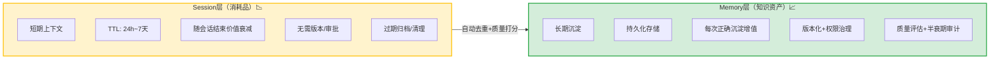

> **提炼自**：2个独立案例（火山引擎AgentKit Session/Memory拆分 + Headroom L0-L4记忆金字塔）

# 数据生命周期经济分层架构（Data Lifecycle Economic Stratification）

## 模式类型

架构模式（AI Agent记忆系统/数据存储架构/分层存储设计）

## 成熟度

L2 已验证（2次验证来源：2026-07 火山引擎AgentKit Session/Memory拆分 + 2026-08 Headroom L0-L4记忆金字塔）

## 两种分层视角：经济属性二分 vs 访问速度多级

本模式有两种互补的分层视角，适用于不同设计阶段：

| 视角 | 分层依据 | 层级数 | 适用阶段 |
|------|---------|-------|---------|
| **经济属性二分法** | 数据价值曲线和治理成本 | 2层（Session/Memory） | 早期架构设计——先区分消耗品与知识资产 |
| **访问速度金字塔** | 访问频率、速度、成本 | 3-5层（L0-L4） | 详细设计——精细控制每层内容与访问策略 |

两者不是互斥的：先做经济属性二分（大方向对），再在每层内做访问速度细分（精细优化）。

### 视角B：访问速度金字塔（L0-L4五级模型）

当需要更精细地控制Agent记忆系统的性能/成本/质量trade-off时，采用5级金字塔模型（类比CPU存储层次结构）：

```
          ┌─────────────────────────────────┐
          │  L0: 即时上下文（寄存器级）       │ ← 正在用的，直接在LLM窗口里
          │  当前对话、当前任务关键信息       │
          └──────────────┬──────────────────┘
                         │ 不够了向下取
          ┌──────────────▼──────────────────┐
          │  L1: 精简摘要（缓存级）           │ ← 压缩后的历史、摘要
          │  压缩后的历史对话、文件摘要       │
          └──────────────┬──────────────────┘
                         │ 需要细节向下取
          ┌──────────────▼──────────────────┐
          │  L2: 本地索引（内存级）           │ ← 元数据、content_id索引
          │  原始数据的元数据、索引、映射表   │
          └──────────────┬──────────────────┘
                         │ 根据索引定位
          ┌──────────────▼──────────────────┐
          │  L3: 原始数据（磁盘级）           │ ← 完整原始内容，按需取回
          │  完整的原始文件、日志、对话历史   │
          └──────────────┬──────────────────┘
                         │ 需要跨项目经验
          ┌──────────────▼──────────────────┐
          │  L4: 共享记忆（分布式存储级）     │ ← 跨Agent/跨项目经验
          │  跨Agent/跨项目的可复用经验库     │
          └─────────────────────────────────┘
```

| 层级 | 类比计算机 | 内容 | 位置 | 访问速度 | Token成本 | 访问频率 |
|------|-----------|------|------|---------|----------|---------|
| **L0: 即时上下文** | 寄存器 | 当前对话、当前任务关键信息 | LLM上下文窗口 | 即时 | 极高 | 90% |
| **L1: 精简摘要** | CPU缓存 | 压缩后的历史对话、文件摘要、关键结论 | 压缩后的上下文 | 快 | 低 | 90%（与L0共用） |
| **L2: 本地索引** | 内存 | 原始数据的元数据、索引、content_id映射 | 本地SQLite/文件 | 快（本地调用） | 0（不送LLM） | 8% |
| **L3: 原始数据** | 磁盘 | 完整的原始文件、日志、对话历史 | 本地缓存 | 较慢（按需取回） | 按需付费 | 8%（通过L2索引） |
| **L4: 共享记忆** | 网络/分布式缓存 | 跨Agent/跨项目的可复用经验 | 向量数据库 | 较慢（语义检索） | 按需付费 | 2% |

**访问频率分布**（经验值）：
- 90%的时间只用L0+L1（日常精简对话）
- 8%的时间需要L2→L3（细节回查）
- 2%的时间需要L4（跨项目经验复用）

**关键设计原则**：
1. **逐级向下访问**：优先使用上层，上层不够才向下取，不跳级
2. **原始数据不下沉到L0/L1**：完整原始数据不直接进LLM上下文，通过L2索引按需取回（与[reversibility-guarantee.md](reversibility-guarantee.md)的CCR机制一致）
3. **Token成本递增**：越往下层，访问的Token成本越高，因此必须按需取回而非全量加载
4. **经典CS复用**：这是CPU Cache层次结构（寄存器→L1/L2/L3缓存→内存→磁盘→网络）在AI记忆系统的直接映射（符合[classic-patterns-reuse-heuristic.md](../methodology-patterns/research-knowledge/classic-patterns-reuse-heuristic.md)）

## 适用场景

设计涉及多类型数据存储的系统（尤其是AI Agent记忆系统、内容管理平台、数据湖仓）时，需要根据数据的经济价值和生命周期特征制定差异化的存储与治理策略。

典型场景：
- AI Agent的会话与记忆系统设计
- 内容管理平台的草稿/已发布/归档分层
- 数据湖/数据仓库的热温冷数据分层
- 日志系统的实时/近线/归档分层
- 任何同时存在"高价值低频访问"和"低价值高频访问"数据的系统

## 问题背景

数据存储架构设计中常见的认知偏差：

1. **纯技术分层误区**：将Session/Memory（短期/长期记忆）这类拆分理解为单纯的"技术架构分层"（内存vs磁盘、缓存vs数据库），忽略了其背后的经济学本质
2. **统一存储陷阱**：为了"简化架构"将所有数据存入同一存储系统、套用同一治理流程，导致两个不可逆损失
3. **记忆污染风险**：临时对话中的错误信息未经质量校验直接进入长期知识库，污染知识资产
4. **治理成本浪费**：对低价值的临时会话数据套用高成本的长期记忆治理流程（版本管理、权限审批、质量评估），资源错配
5. **知识过时问题**：长期记忆数据没有"半衰期"管理，过时信息持续被召回导致回答错误

火山引擎AgentKit将"会话与记忆"拆分为Session和Memory两个独立子模块，揭示了数据分层的经济学本质。

## 核心思想

**数据分层不应仅基于技术特征（访问速度、存储介质），更应基于数据的经济属性——即数据随时间衰减的价值曲线和治理成本特征。将数据分为「消耗品」（Session/临时数据）与「知识资产」（Memory/持久数据）两类，二者采用完全不同的存储策略、TTL策略、质量门禁和治理流程，避免合并存储导致的记忆污染与治理成本浪费。**



## 架构设计原则

### 原则1：数据经济属性二分法

首先对所有数据进行经济属性分类：

| 属性 | Session类（消耗品） | Memory类（知识资产） |
|------|-------------------|---------------------|
| **价值曲线** | 随时间迅速衰减（会话结束即大幅贬值） | 随时间增值（每次正确召回都在验证价值） |
| **存储策略** | 高速缓存/临时存储，允许丢失 | 持久化存储，多副本备份 |
| **TTL策略** | 自动过期（24小时~7天） | 持久存储+半衰期降权 |
| **质量门禁** | 实时写入，无需审核 | 自动去重 + 人工审核/质量打分 |
| **版本管理** | 无需版本，覆盖即可 | 必须版本化，可追溯变更历史 |
| **权限治理** | 会话级隔离即可 | 需要明确写入/召回权限 |
| **治理成本** | 低（无需复杂流程） | 高（质量/权限/版本全流程） |

### 原则2：两层之间设立质量闸门

从Session到Memory的转化必须经过两道闸门：
1. **自动去重**：检测Memory中是否已有相似内容，避免重复沉淀
2. **质量评估**：
   - 高价值领域（如医疗/法律/代码）：人工审核后才能写入Memory
   - 通用领域：质量打分（置信度/完整性/准确性），低分内容自动拦截

### 原则3：检索优先级排序

知识检索（RAG）的检索优先级严格遵循：
```
当前Session上下文 > Memory长期记忆 > Knowledge知识库
```
避免Session中的临时意图被Memory中历史信息过度干扰。

### 原则4：Memory知识半衰期审计

Memory层数据必须定期执行"知识半衰期"审计：
- **3个月未召回**：自动降权（降低检索优先级）
- **6个月未召回**：转入冷存储（不再参与实时检索，需主动查询）
- **检测到冲突信息**：标记为"待验证"，人工确认后更新或归档

### 原则5：混合云场景下的存储适配

| 部署模式 | Session存储 | Memory存储 |
|---------|------------|-----------|
| Local模式 | 本地内存/本地文件 | 本地文件/SQLite，可使用mock |
| Hybrid模式 | 本地（数据合规要求） | 云端Platform服务（复用治理能力） |
| Cloud模式 | 云端Redis/缓存 | 云端持久化数据库+治理服务 |

## 实施检查清单

设计数据分层架构时对照检查：

### 数据分类阶段
- [ ] 是否识别出了系统中所有数据类型的经济属性（消耗品vs知识资产）？
- [ ] 是否明确了每类数据的价值曲线（多久后价值衰减/增值）？
- [ ] Session类数据是否设置了合理的TTL自动过期策略？
- [ ] Memory类数据是否规划了版本化和权限治理机制？

### 闸门与流转阶段
- [ ] Session→Memory转化是否有自动去重机制？
- [ ] 高价值领域是否设置了人工审核闸门？
- [ ] 通用领域是否有自动化质量打分机制？
- [ ] 是否防止了Session数据直接写入Memory的"后门"？

### 检索与审计阶段
- [ ] 检索优先级是否遵循"Session > Memory > Knowledge"顺序？
- [ ] Memory数据是否有定期半衰期审计机制？
- [ ] 过时数据是否会自动降权或转入冷存储？
- [ ] 是否有Memory数据的冲突检测机制？

### 安全与合规阶段
- [ ] 敏感场景下Session数据是否不落盘或端到端加密？
- [ ] Memory写入是否有权限控制（谁可以沉淀知识）？
- [ ] Memory召回是否有数据隔离（不同用户/租户的Memory不可互访）？

## 反模式（不要这么做）

- ❌ **反模式1：Session/Memory合并存储**：将会话数据和长期记忆存入同一套存储系统、使用同一套CRUD接口。后果：临时错误信息污染知识库、对临时数据做不必要的版本控制、治理成本指数级上升
- ❌ **反模式2：Memory无闸门写入**：任何Session数据自动进入Memory，没有去重和质量校验。后果：知识膨胀、重复信息泛滥、错误信息固化为"知识"、检索准确率持续下降
- ❌ **反模式3：Session永久存储**：为了"方便回溯"将所有Session数据永久保存不做TTL。后果：存储成本失控、敏感数据长期留存违反合规要求、历史上下文干扰当前对话
- ❌ **反模式4：检索优先级倒置**：检索时优先搜索Knowledge知识库而非当前Session。后果：Agent被历史知识"带偏"，无法正确理解用户当前意图
- ❌ **反模式5：Memory只增不改**：Memory数据一旦写入就永久保留，不做半衰期审计和冲突更新。后果：知识过时导致Agent输出错误信息、过时信息与正确信息冲突引发幻觉

## 检验标准

做完之后怎么知道做对了？

- 标准1：Session数据7天后自动清理/归档，存储占用不会无限增长
- 标准2：从Session进入Memory的数据都经过了去重和质量校验，Memory中无明显重复或错误信息
- 标准3：多轮对话中Agent不会被1周前的历史信息错误"带偏"，优先回应当前会话意图
- 标准4：Memory中超过6个月未召回的条目已被降权或转入冷存储，检索效率稳定
- 标准5：新增一类数据时，团队能清晰判断它属于Session消耗品还是Memory知识资产，并有对应的存储治理策略

## 迁移示例

这个模式还能用在什么其他场景？

- **场景1（内容管理系统）**：自动草稿（Session，TTL 7天）vs 已发布内容（Memory，版本化+审批）vs 归档内容（冷存储）
- **场景2（数据湖架构）**：实时数据流（Session，Kafka/Redis，TTL 3天）vs 数仓明细层（Memory，版本化+质量校验）vs 归档数据（冷存储，S3 Glacier）
- **场景3（日志系统）**：实时日志（Session，ELK热节点，TTL 7天）vs 审计日志（Memory，持久化+权限控制）vs 归档日志（冷存储）
- **场景4（个人知识管理）**：收件箱/快速笔记（Session，每周整理）vs 永久笔记（Memory，双向链接+定期回顾）vs 归档资料（冷存储）
- **场景5（跨领域类比）**：人类记忆——工作记忆（短期，约7±2个信息块）vs 长期记忆（经海马体巩固）vs 遗忘（无用信息自然衰减）
- **场景6（Headroom LLM上下文管理）**：L0即时上下文（窗口内）/ L1压缩摘要（压缩后送LLM）/ L2本地索引（SQLite元数据）/ L3原始数据（本地缓存按需取回）/ L4共享记忆（向量库跨项目复用），90/8/2访问分布

## 与现有模式的关系

| 相关模式 | 关系 | 说明 |
|---------|------|------|
| [metadata-layering.md](metadata-layering.md) | 思想同源 | 元数据分层是内容-元数据二分法，本模式是基于经济价值的数据二分法，分层思想相通 |
| [provenance-driven-trust.md](provenance-driven-trust.md) | 协同模式 | 来源驱动信任是Memory层数据可信度评估的具体方法 |
| [lifecycle-protocol-three-phase.md](lifecycle-protocol-three-phase.md) | 架构类比 | 生命周期协议三阶段是协议/功能的生命周期，本模式是数据的生命周期分层 |
| [reversibility-guarantee.md](reversibility-guarantee.md) | 紧密协同 | L3原始数据保留+按需取回是可逆设计在记忆系统的直接应用（CCR机制） |
| [classic-patterns-reuse-heuristic.md](../methodology-patterns/research-knowledge/classic-patterns-reuse-heuristic.md) | 经典溯源 | L0-L4金字塔是CPU Cache层次结构的经典CS思想在AI领域的复用 |
| [transparent-interceptor-middleware.md](transparent-interceptor-middleware.md) | 实现手段 | L0/L1层的压缩和注入通过透明中间件实现，不侵入业务逻辑 |
| CPU Cache Hierarchy | 经典起源 | 寄存器→L1/L2/L3缓存→内存→磁盘→网络存储的层次化设计是计算机体系结构的经典智慧 |

## Changelog

- 2026-08-03 | enhance | 补充Headroom L0-L4记忆金字塔模型（第二种分层视角），新增5级访问速度金字塔+90/8/2访问频率分布+4条设计原则+场景6，maturity L1→L2，validation_count 1→2
- 2026-07 | create | 初始版本，从火山引擎AgentKit洞察提炼，经济属性二分法+两层闸门设计，L1成熟度
