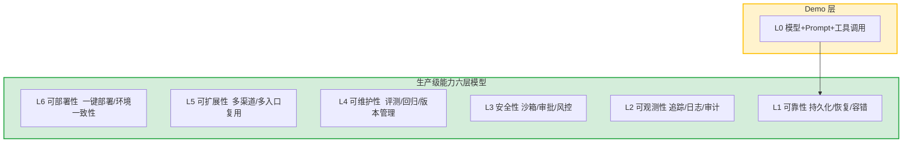

> **提炼自**：[insight-extraction.md#洞察3](../../reports/competitive-analysis/retrospective-eve-framework-learning-20260704/insight-extraction.md#洞察3) —— Vercel Eve 前端 Agent 框架学习复盘（Demo-Prod 能力鸿沟六层模型）

# Demo-Prod 六层能力模型（Demo-to-Prod Six-Layer Capability Model）

## 模式类型

架构模式（AI 应用工程化/AI Agent 生产化/技术选型评估）

## 成熟度

L1 实验性（Vercel Eve 框架生产级能力设计验证，单案例待更多场景验证）

## 适用场景

需要评估一个 AI 应用或 Agent 框架是否已具备"生产可用"能力，或对"Demo 能跑但生产没法用"的迁移路径做结构化分析时。典型场景：
- AI Agent 应用从原型（Demo）进入生产环境的架构评估
- 技术选型决策：对比多个 Agent 框架时，判断哪些生产级能力是框架内置的、哪些需要自己拼
- 技术团队能力建设评估：判断团队在可靠性/可观测性/安全性等维度是否具备生产级工程能力
- 任何新技术从"实验室/演示"走向"大规模产业应用"的成熟度评估

## 问题背景

"Demo 能跑，生产没法用"是 AI 应用（尤其是 Agent 应用）最常见的失败模式。其根因是：

1. **Demo 与生产的目标不同**：Demo 里最重要的是"能不能跑"（验证想法技术上可行），生产环境里最重要的是"能不能管"（系统长期稳定运行）。
2. **模型能力是上限，工程底座是下限**：模型/Prompt 决定了"能不能跑"的下限，而工程能力决定了"能不能大规模用"的上限。
3. **能力缺失被掩盖**：Demo 阶段只有少数 Happy Path 用例，真实生产环境暴露的可靠性、可观测性、安全性问题在 Demo 阶段完全不体现。
4. **竞争焦点转移**：当前 Agent 领域竞争正在从"谁的模型更聪明"转向"谁的工程底座更扎实"。

Vercel Eve 框架内置的 6 大生产级能力，揭示了从 Demo 到生产需要补齐的六层能力底座。

## 核心思想

**从 Demo 到生产不是"优化"，而是"补全六层能力底座"。** 任何新技术从实验室走向产业应用，都需要补齐六层非功能性能力：可靠性（L1）→ 可观测性（L2）→ 安全性（L3）→ 可维护性（L4）→ 可扩展性（L5）→ 可部署性（L6）。底层决定能否稳定运行，高层决定能否规模化应用。

### 六层能力详解

| 层级 | 能力 | 对应非功能性需求 | Eve 实现示例 |
|------|------|-----------------|-------------|
| L1 可靠性 | 持久化执行 + checkpoint | 中断恢复、容错 | durable workflow + checkpoint |
| L2 可观测性 | 执行追踪 | 可观测性 | TUI 可观测性 |
| L3 安全性 | 沙箱隔离 + 审批 | 安全边界、风险控制 | 沙箱 + needsApproval |
| L4 可维护性 | 文件化评测 | 回归测试 | eve eval |
| L5 可扩展性 | 多渠道接入 | 入口复用 | Channels |
| L6 可部署性 | 一键部署 | 环境一致性 | Vercel 一键部署 |

## 架构设计原则

### 原则1：能力分层递增，底层是上层的先决条件

六层能力存在依赖关系：没有 L1 可靠性，L2 可观测性无从谈起；没有 L3 安全性，L4 可维护性无法建立。评估任何系统时，应从底层向上逐层检查，避免"跳层"。

### 原则2：区分"框架内置"与"需要自建"

技术选型时，明确每层能力是框架内置的还是需要自己拼装。框架内置越多，越适合快速上线；自建越多，工程成本越高。

### 原则3：用六层模型评估"从 Demo 到生产的鸿沟"

当判断一个技术是否"成熟可用"时，不是看它能不能跑，而是逐层检查六层能力是否完备。缺哪层，就补哪层，而非整体推翻。

## 实施检查清单

评估一个 AI 应用/Agent 框架的生产就绪度时，对照检查：

- [ ] L1 可靠性：是否有持久化执行/断点恢复/容错机制？中断后能否恢复？
- [ ] L2 可观测性：是否有执行追踪/日志/审计能力？能否定位问题？
- [ ] L3 安全性：是否有沙箱隔离/审批/风控机制？敏感操作是否需人工确认？
- [ ] L4 可维护性：是否有评测/回归/版本管理机制？变更后能否验证无回归？
- [ ] L5 可扩展性：是否支持多渠道/多入口复用？能否扩展接入场景？
- [ ] L6 可部署性：是否支持一键部署/环境一致性？能否快速上线？

## 反模式（不要这么做）

- ❌ **反模式1：功能能跑就上线**：只验证 Demo 能跑通 Happy Path，跳过六层能力评估，生产环境可靠性和可观测性缺失导致无法定位问题。
- ❌ **反模式2：只优化模型不补底座**：把竞争焦点放在"模型更聪明"上，忽视工程底座，模型再强也撑不起大规模生产。
- ❌ **反模式3：跳层评估**：只评估能看到的表层能力（如可部署性），忽视底层可靠性/安全性，隐患在底层却未被发现。

## 检验标准

做完之后怎么知道做对了？

- 标准1：能对任意 AI 应用/框架逐层列出六层能力的现状（内置/自建/缺失）
- 标准2：能识别当前系统的"最薄弱层"，并给出补齐优先级
- 标准3：选型时能明确区分"框架内置能力"与"需自建能力"，评估工程成本

## 迁移示例

这个模式还能用在什么其他场景？

- **场景1（AI Agent 框架选型）**：对比 LangChain/CrewAI/AutoGen 等框架时，用六层能力模型逐层评估，判断哪个框架生产底座更扎实
- **场景2（技术团队能力评估）**：评估团队是否具备生产级工程能力，六层维度对应团队在可靠性/可观测性/安全/可维护/可扩展/可部署方面的能力
- **场景3（通用软件走向生产）**：任何新技术从实验室走向产业应用（如新数据库、新推理框架），用六层能力模型判断成熟度
- **场景4（跨领域类比）**：新餐厅从"试营业"到"正式营业"——试营业只需"做得出菜"（L0），正式营业需要供应链稳定（L1）、流程可追溯（L2）、食品安全（L3）、品控标准（L4）、多门店扩展（L5）、选址门店化（L6）

## 与现有模式的关系

| 相关模式 | 关系 | 说明 |
|---------|------|------|
| [governance-outer-ring.md](governance-outer-ring.md) | 框架互补 | 治理外环（Identity+Gateway+Observability+Evaluation）是六层模型在 Agent 平台的具体实现之一 |
| [P-DEMO-TO-PROD-003-demo-to-prod-checklist.md](../methodology-patterns/governance-strategy/P-DEMO-TO-PROD-003-demo-to-prod-checklist.md) | 检查清单 | 本模式定义"六层能力模型"框架，该清单提供 12 项量化检查执行细节 |