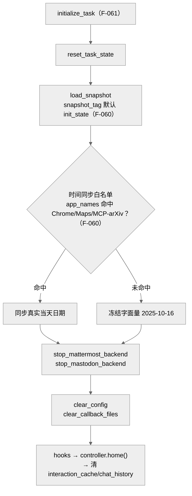

> **提炼自**：Tongyi-MAI mobile-world 复现性复盘 —— 确定性 = 快照回滚 + 冻结时钟（白名单同步）+ 后台清理的固定顺序初始化

# 确定性评测环境三件套（Deterministic Eval Environment Trio：快照+冻结时钟+后台清理）

## 模式类型

架构模式（评测环境确定性 / 状态复现 / 时间与后台状态治理）

## 成熟度

L1 已验证（1 次验证：2026-08-29 Tongyi-MAI mobile-world 初始化与 AVD 定制流程源码学习，snapshot_tag 默认值、initialize_task 序列与八步定制流程逐项核对）

## 适用场景

任务初始状态必须逐次一致的自动化评测环境：

- GUI Agent/自动化评测里环境含模拟器、浏览器、数据库等可变系统状态，需要每次从同一初始态出发
- ground truth 依赖日期/星期（"周二发消息"类任务），真实时间流动会破坏断言
- 环境里有常驻后台服务与用户可写配置，残留状态会污染下一次评测

## 问题背景

评测环境复现最常见的两种失败：

1. **只 reset 应用不还原系统状态**：每次任务前清应用数据，但模拟器系统时间继续流动、后台服务残留旧消息——同一任务两次跑出不同结果，ground truth 无从校准。
2. **把"现在几点"交给真实时钟**：断言里写"今天/明天/周二"，日期随执行日漂移，任务过几天就批量假失败。

根本矛盾：**评测要求现实变量（时间、后台进程、配置残留）恒定，而模拟环境默认让这些变量跟随真实世界流动**——确定性只能靠显式冻结获得，不会自然发生。

## 核心设计

三原则：

1. **状态快照回滚是唯一初始态**：任务初始化统一加载 `init_state` 模拟器快照（`snapshot_tag` 默认 `"init_state"`，F-060），不信任上一次运行残留的任何状态；快照不止在镜像里，还可按流程在 dev 容器内手工重制并 `docker cp` 回宿主重新构建镜像（F-073）。
2. **时间冻结 + 白名单同步**：默认日期是字面量 `"2025-10-16"`，仅当任务显式声明依赖时间敏感应用（app_names 命中 `["Chrome", "Maps", "MCP-arXiv"]`）才同步当天日期（F-060）——"现实变量"被显式白名单化，未声明的默认冻结，这让"周二发消息"类任务的 ground truth 永远稳定。
3. **后台清理固定顺序**：初始化序列强制 `reset_task_state → load_snapshot → 时间同步 → stop_mattermost_backend/stop_mastodon_backend → clear_config/clear_callback_files → hooks → controller.home() → 清 interaction_cache/chat_history`（F-061）——顺序即语义，缺一步就有残留。

## 实施要点

| 维度 | 做法 | mobile-world 实例 |
|---|---|---|
| 快照管理 | 快照标签默认化，加载即回滚 | `snapshot_tag` 默认 `"init_state"`（F-060） |
| 初始化顺序 | 步骤顺序固定且不可省略 | `initialize_task` 序列：reset → load_snapshot → 时间同步 → 双后端停止 → 配置/回调清理 → hooks → `controller.home()` → 清缓存（F-061） |
| 时间冻结 | 默认字面量日期，任务显式声明才同步 | 仅 app_names 命中 `["Chrome", "Maps", "MCP-arXiv"]` 才返回当天日期，否则字面量 `"2025-10-16"`（F-060） |
| 后台进程 | 常驻后端初始化时强制停止 | `stop_mattermost_backend` / `stop_mastodon_backend`（F-061） |
| 配置与回调 | 用户可写文件清空 | `clear_config` / `clear_callback_files`（F-061） |
| 快照重制 | 容器内手工重制后回灌镜像 | dev 容器内按流程重制并 `docker cp` 回宿主重新构建镜像（F-073） |
| 定制流程 | AVD 定制步骤编号化复刻 | 八步流程含 `adb shell su root date 101612002025.00` 定日期后 `snapshot save init_state`（F-073） |

## 不适用场景与反目标用户

### 不适用场景

- ❌ **被测对象就是时间处理逻辑本身**：若评测目标恰是系统的实时时钟/定时行为，冻结时钟会掩盖被测能力，应改为可控注入时钟而非字面量。
- ❌ **长生命周期在线评测**：需要环境跨任务持续演化（如持续学习场景）时，每次快照回滚会抹掉应有累积，快照纪律反而错误。
- ❌ **无快照能力的环境**：无法做系统级快照（纯 API SUT、外部真实服务）时，只能做数据级 reset，确定性保证退化为尽力而为。
- ❌ **探索性脏环境评测**：以"观察模型在受污染环境中的行为"为目的的评测，追求的恰是真实残留，三件套与之目标相反。

### 反目标用户

- 希望评测环境"越像真实世界越好"的仿真主义者：本模式的立场是先确定性后仿真度。
- 不愿维护白名单、想让所有任务自动跟随真实时间的团队：白名单显式声明正是本模式的纪律成本。

### 适用边界与前提条件

- 快照必须与镜像内的 AVD/应用版本配套，重制走同一八步流程（F-073）。
- 时间敏感任务必须显式维护 `apps_require_time_sync` 白名单，未声明即冻结。
- 三件套的顺序敏感：先加载快照再停后端、先清理再 `home()`，颠倒会留下中间态。
- ground truth 的稳定性以"冻结日"为参照系，跨冻结日的分数比较需注明口径。

## 反模式

### 反模式1："reset 就是清应用数据"

只清应用层缓存/数据，不动系统时间与后台进程。后果：同一任务两次结果不同，排查无从下手。**正确做法**：快照加载 + 双后端停止 + 配置清理缺一不可（F-061）。

### 反模式2："断言跟随真实时钟"

在任务断言里直接用"今天/明天/周二"。后果：执行日一变，任务批量假失败。**正确做法**：默认字面量冻结日，仅白名单任务同步（F-060）。

### 反模式3："白名单静默膨胀"

为了让某个任务过，悄悄往时间同步白名单加应用。后果：冻结承诺悄然失效，其他任务的 ground truth 开始漂移。**正确做法**：白名单显式维护并评审，自建时间敏感任务时才声明 `apps_require_time_sync`（F-060）。

### 反模式4："初始化步骤可跳过/可乱序"

把 stop 后端/clear 配置当"优化项"跳过或调换顺序。后果：残留消息/回调污染下一任务，失败呈现随机性。**正确做法**：固定顺序序列，每步都是必要项（F-061）。

### 反模式5："快照只认镜像里的那份"

以为快照不可再制，环境迭代只能重建镜像。后果：小改动也走完整镜像构建，迭代迟缓。**正确做法**：dev 容器内手工重制 + `docker cp` 回宿主重新构建镜像（F-073）。

### 反模式6："冻结日藏在代码里不写文档"

"2025-10-16"只出现在源码常量里。后果：使用者看到任务与日期相关的行为无法解释，复现口径断裂。**正确做法**：冻结日、白名单、重制流程三者在评测文档显式登记（F-060/F-073）。

## 失败案例

### 案例："模拟环境里'今天几号'应当跟随真实日期"的预期被白名单机制推翻（mobile-world 源码学习，2026-08-29）

**背景**：学习任务初始化流程时，初始预期是模拟环境的时间应尽量贴近真实时间，断言才"自然"。

**发现过程**：`_compute_current_date` 的实现显示，仅当任务声明的 app_names 命中 `["Chrome", "Maps", "MCP-arXiv"]` 才返回当天日期，否则一律返回字面量 `"2025-10-16"`（F-060）——模拟环境里"今天几号"是写死的。进一步核对 `initialize_task` 的固定顺序（F-061）发现确定性不止时间一维：快照回滚、双后端停止、配置与回调文件清理共同构成复位闭环；AVD 定制八步流程（F-073）中甚至有 `adb shell su root date 101612002025.00` 定日期后 `snapshot save init_state` 的显式步骤——冻结日是被刻意"烘焙"进快照的，且快照可在 dev 容器内手工重制后 `docker cp` 回宿主重建镜像。

**教训**：评测环境的确定性不会自然发生，必须把"现实变量"（时间、后台进程、配置残留）逐一显式治理；"默认冻结 + 显式白名单"的组合让"周二发消息"类任务的 ground truth 永远稳定，这一反直觉设计是复现性的根基而非权宜之计。

## 早期预警信号

| 预警信号 | 可能问题 | 建议行动 |
|---|---|---|
| 同一任务两次运行分数不同 | 初始化序列有步骤被跳过或乱序 | 按 F-061 序列逐项核对（快照/后端/配置清理） |
| 任务隔几天批量"假失败" | 断言依赖真实流动的时间 | 检查任务是否应走冻结日口径（F-060） |
| Mattermost/Mastodon 里有上一任务的残留消息 | 后端停止步骤缺失或顺序颠倒 | 恢复 `stop_*_backend` 在 load_snapshot 之后、清理之前（F-061） |
| mall 配置/回调文件跨任务残留 | `clear_config`/`clear_callback_files` 未执行 | 补齐清理步骤（F-061） |
| 新任务需要"今天"语义但未登记白名单 | 时间同步白名单未维护 | 显式维护 `apps_require_time_sync`（F-060） |
| 环境小迭代被迫整镜像重建 | 不知道快照可手工重制 | 走 dev 容器重制 + `docker cp` 回灌流程（F-073） |
| 修改 AVD 后快照与镜像版本错配 | 快照未随 AVD 定制同步重制 | 复刻八步流程重制 `init_state`（F-073） |

## 实际案例

Tongyi-MAI mobile-world 确定性复现（2026-08-29 源码学习）：

| 维度 | 机制 | 证据 |
|---|---|---|
| 快照 | `snapshot_tag` 默认 `"init_state"`，初始化统一加载 | F-060 |
| 冻结时钟 | 默认字面量 `"2025-10-16"`；白名单 `["Chrome", "Maps", "MCP-arXiv"]` 才同步当天 | F-060 |
| 后台清理 | 双后端停止 + `clear_config`/`clear_callback_files` + 清 interaction_cache/chat_history | F-061 |
| 初始化顺序 | reset → load_snapshot → 时间同步 → 停后端 → 清配置 → hooks → `controller.home()` → 清缓存 | F-061 |
| 快照重制 | 八步流程：`su root date 101612002025.00` 定日期 → `snapshot save init_state` → `docker cp` 回灌镜像 | F-073 |

## 迁移验证

- **可迁移场景**：Web Agent 评测（浏览器 profile 快照 + 系统时间冻结 + 临时目录清理）；数据库集成测试（事务回滚/容器快照 + 固定 `now()` 注入 + 后台 job 停启）；游戏 AI 评测（存档回滚 + 游戏内时钟冻结 + NPC 状态复位）。
- **先例关联**：与 [lifecycle-protocol-three-phase.md](./lifecycle-protocol-three-phase.md) 互补——该模式约束单次任务运行期的生命周期阶段，本模式约束任务边界处的环境复位纪律；[incremental-regression-verification.md](./incremental-regression-verification.md) 的回归可信度正依赖本模式提供的确定性起点。

## 与其他模式的关系

| 关系模式 | 关系类型 | 说明 |
|---|---|---|
| [environment-diversity-design.md](./environment-diversity-design.md) | 总纲与特例 | 该模式讨论多环境差异化设计；本模式聚焦单环境内的确定性维度（快照/时钟/后台状态） |
| [lifecycle-protocol-three-phase.md](./lifecycle-protocol-three-phase.md) | 互补 | 该模式定义单个 Agent/任务的生命周期阶段；本模式定义任务边界处的环境复位序列，衔接其前后两端 |
| [incremental-regression-verification.md](./incremental-regression-verification.md) | 依赖前置 | 增量回归的可信度建立在每次评测起点完全一致之上，本模式正是该前提的保障 |
| [docker-podman-cross-platform-container.md](../code-patterns/docker-podman-cross-platform-container.md) | 承载底座 | 快照重制的"dev 容器内重制 + `docker cp` 回宿主重建镜像"依赖跨平台容器工作流（F-073） |

<!-- changelog -->
- 2026-08-29 | pattern | 初始创建：从 Tongyi-MAI mobile-world 源码学习（洞察2）萃取；证据链 F-060/F-061/F-073
