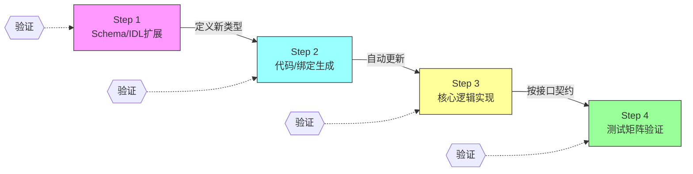

> **提炼自**：[07-caffe-cpp-slim-tvm-ffi-modernization.md](../../../knowledge/learning/caffe-architecture-wiki/07-caffe-cpp-slim-tvm-ffi-modernization.md) —— daoflows/caffe新算子扩展四步法

# 扩展四步法模式（Four-Step Extension Recipe）

## 决策状态

✅ 已接受（Accepted）—— Caffe新算子流程验证，可推广到所有可扩展框架

## 模式类型

架构模式 / 开发者体验模式 / 可扩展性设计模式

## 成熟度

L2 已验证（Caffe算子扩展+protobuf扩展验证，多个开源框架有类似实践）

## 适用场景

当框架/平台/系统需要支持用户或开发者自定义扩展（新算子、新插件、新类型、新端点），且满足以下条件时：
- 扩展涉及多个层（IDL/序列化/运行时/测试）
- 希望扩展流程标准化、可验证、低门槛
- 扩展提交需要经过自动化验证
- 希望降低第三方贡献者的学习曲线

典型场景：
- AI/ML框架添加新算子/新层类型（Caffe/PyTorch/TVM）
- IDE/编辑器插件开发流程标准化
- Web框架的自定义中间件/插件/端点开发
- 游戏引擎自定义组件/节点注册
- API框架添加新资源类型/新端点
- 构建系统添加新任务类型
- 任何有"插件系统"或"扩展点"的软件

## 上下文与问题背景

框架扩展点的常见问题：

| 问题 | 具体表现 |
|------|---------|
| **无文档流程** | 新贡献者靠"读源码+复制粘贴旧代码"摸索，贡献门槛高 |
| **步骤遗漏** | 添加了算子逻辑但忘记更新protobuf/注册/测试，运行时神秘崩溃 |
| **测试不足** | 只测核心功能，不测序列化/反序列化/兼容性/边界情况 |
| **扩展需要改核心** | 每次加新类型都要改框架核心switch-case，违反开闭原则 |
| **工具链缺失** | 代码生成（protobuf/IDL→代码）需要手动跑多个命令，容易遗漏 |
| **代码风格不一致** | 不同贡献者写的算子风格各异，维护困难 |
| **无验收标准** | PR提交后reviewer不知道该检查什么，review质量参差不齐 |

**核心矛盾**：
- 框架设计者希望扩展机制强大灵活
- 贡献者希望扩展流程简单明确
- 两者需要通过"标准化食谱（recipe）"来调和

## 决策

为每个扩展点设计标准化的**四步扩展流程**（Schema→生成→实现→测试矩阵），每个步骤有明确的输入、输出、验证方法。

### 核心四步流程



### Step 1：Schema/IDL 扩展

**目标**：在接口定义语言中声明新的扩展类型，这是"唯一真相源"。

**Caffe示例**（新算子XxxParameter）：
```protobuf
// ① 在caffe.proto末尾添加新算子的Parameter消息
message XxxParameter {
  optional float eps = 1 [default = 1e-5];
  optional bool across_spatial = 2 [default = true];
  optional FillerParameter channel_scale_filler = 3;
}

// ② 在LayerParameter中注册新字段
message LayerParameter {
  // ... 现有字段 ...
  optional XxxParameter xxx_param = <next_available_id>;  // 使用下一个可用ID
}
```

**关键规则**：
- 字段编号严格递增，不复用已删除字段的编号
- 所有字段有合理默认值，保证向后兼容
- 新类型添加在文件末尾，不重排已有定义
- 更新"next available ID"注释，防止下一个人用错ID

**验证**：protoc编译通过，无编号冲突。

### Step 2：代码/绑定生成

**目标**：运行自动化脚本，从IDL生成各语言的序列化/反序列化/类型注册代码。

**Caffe示例**：
```bash
python python/scripts/gen_proto.py
```

脚本自动完成：
1. 查找系统protoc编译器
2. 检查protoc版本与Python protobuf runtime版本兼容性
3. 执行protoc编译.proto → _pb2.py
4. 同步生成到caffeproto/和protos/两个位置（兼容旧导入路径）
5. 验证生成的Python模块可正常导入

**关键规则**：
- 生成过程完全脚本化，一条命令完成
- 脚本自带版本兼容性检查，不兼容时报错并给出解决方案
- 生成文件不要手动编辑（标有"Auto-generated, DO NOT EDIT"）
- 多输出路径自动同步（避免双份生成文件版本不一致）

**验证**：导入生成的模块，创建消息，字段默认值正确。

### Step 3：核心逻辑实现

**目标**：在框架的扩展点实现新功能，遵循框架接口契约。

**Caffe示例**（TVM Relax算子）：
```python
# python/operators/layers.py
@dataclass
class XxxLayer(nn.Module):
    # ① 参数与protobuf对应
    eps: float = 1e-5
    across_spatial: bool = True
    name: str = "xxx"
    
    scale: nn.Parameter = field(init=False, repr=False)
    
    def __post_init__(self):
        # ② 初始化可学习参数
        self.scale = nn.Parameter((self.in_channels,), name="scale")
    
    def forward(self, x: relax.Expr) -> relax.Var:
        # ③ 实现前向计算逻辑（声明式DSL）
        x_sq = _op.multiply(x, x)
        x_sum = _op.sum(x_sq, axis=self._get_reduce_axes(), keepdims=True)
        x_norm = _op.sqrt(_op.add(x_sum, self.eps))
        out = _op.divide(x, x_norm)
        out = _op.multiply(out, _op.reshape(self.scale, (1, -1, 1, 1)))
        return nn.emit(out, self.name)
    
    @staticmethod
    def from_proto(param: caffe_pb2.XxxParameter) -> "XxxLayer":
        # ④ 提供protobuf→算子的工厂方法
        return XxxLayer(eps=param.eps, across_spatial=param.across_spatial)
```

**关键规则**：
- 新类型不修改框架核心代码（开闭原则）——通过自注册/反射发现
- 参数命名与protobuf字段一一对应，有工厂方法互相转换
- 遵循代码风格约定（dataclass+nn.Module、field(repr=False)用于大数组等）
- 复杂逻辑拆分为辅助函数，forward()保持简洁
- 提供from_proto/to_proto等序列化往返方法

**验证**：
- 构造算子实例，调用forward()不报错
- 形状推断正确
- 与protobuf参数往返转换一致

### Step 4：测试矩阵验证（最关键！）

**目标**：通过多层测试确保扩展在所有维度都正确，不仅仅是"功能正常"。

**Caffe要求的5类测试**：

| 测试类型 | 测试内容 | 为什么必须有 |
|---------|---------|------------|
| **① 序列化/反序列化往返** | 创建XxxParameter→序列化→反序列化→所有字段值不变 | 防止proto字段编号错配、默认值错误 |
| **② text_format（prototxt）解析** | 从文本格式prototxt解析→字段正确 | 用户部署模型用的是文本格式 |
| **③ 默认值正确性** | 不设置可选字段→使用正确的默认值 | 旧版本模型文件没有新字段，默认值必须兼容 |
| **④ 数值正确性** | 用numpy参考实现对比，atol=1e-5 | 算法实现正确，与参考一致 |
| **⑤ 框架工具兼容性** | caffe_utils.unity_struct()能处理新类型、Net能加载包含新层的prototxt | 确保新类型不破坏现有工具链 |

**测试示例**：
```python
def test_xxx_parameter_serialization():
    """测试① 序列化往返"""
    param = caffe_pb2.XxxParameter(eps=1e-3, across_spatial=False)
    binary = param.SerializeToString()
    param2 = caffe_pb2.XxxParameter()
    param2.ParseFromString(binary)
    assert abs(param2.eps - 1e-3) < 1e-10
    assert param2.across_spatial == False

def test_xxx_parameter_defaults():
    """测试③ 默认值"""
    param = caffe_pb2.XxxParameter()
    assert param.eps == pytest.approx(1e-5)
    assert param.across_spatial == True

def test_xxx_numerical_correctness():
    """测试④ 数值正确性"""
    import numpy as np
    x = np.random.randn(1, 32, 8, 8).astype(np.float32)
    # numpy参考实现
    x_sq = x * x
    x_norm = np.sqrt(x_sq.sum(axis=(2,3), keepdims=True) + 1e-5)
    y_ref = x / x_norm * scale.reshape(1,32,1,1)
    # TVM实现
    y_tvm = xxx_layer.forward_np(x)
    np.testing.assert_allclose(y_tvm, y_ref, atol=1e-5)

def test_caffe_utils_compat():
    """测试⑤ 工具链兼容性"""
    layer = caffe_pb2.LayerParameter(type="Xxx", xxx_param=caffe_pb2.XxxParameter())
    type_name, param_dict = caffe_utils.unity_struct(layer)
    assert type_name == "Xxx"
```

**关键规则**：
- 测试必须有，不允许提交没有测试的扩展
- 测试应该快（单元测试级别，秒级完成）
- 数值测试使用确定性输入，避免随机失败
- 测试中不要依赖网络、GPU等外部资源（除特定GPU测试外）
- 错误路径也要测试（非法参数应该抛明确错误，不是崩溃）

**验证**：所有测试PASS，测试覆盖率≥90%。

## 框架侧的支持机制

四步法能工作，框架必须提供以下支撑：

| 机制 | 作用 | 反例（没有的话会怎样） |
|------|------|---------------------|
| **IDL/代码生成器** | Step1→Step2自动化 | 开发者手动复制粘贴代码生成步骤，容易遗漏 |
| **自注册/反射机制** | Step3新类型自动被框架发现 | 每加新类型要改核心工厂switch-case，违反开闭原则 |
| **类型无关工具类** | Step5工具类自动支持新类型 | caffe_utils要加if type=="Xxx"分支，每次加类型都改工具类 |
| **标准化基类/接口** | Step3新类型知道要实现什么方法 | 每个新贡献者风格各异，接口不一致 |
| **测试模板/脚手架** | Step4开发者有参考知道写哪些测试 | 贡献者只写一个"能跑"的测试，漏掉序列化/默认值等 |
| **版本检查脚本** | Step2自动检查环境版本兼容性 | 版本不兼容时报神秘编译错误，新手无法解决 |
| **文档化食谱** | 整个四步流程有文档 | 靠口头传承，新贡献者靠猜 |

## 后果与权衡

### 正面后果

✅ **贡献门槛低**：新贡献者照食谱一步步做就行，不需要理解整个框架
✅ **PR质量一致**：所有扩展都经过相同的测试矩阵，review有标准可依
✅ **自动化程度高**：代码生成、版本检查等机械步骤脚本化，减少人为错误
✅ **开闭原则得到保证**：新扩展不需要修改核心代码
✅ **回归风险低**：测试矩阵覆盖序列化/默认值/工具兼容性，不会破坏已有功能
✅ **Code Review效率高**：reviewer按四步清单检查，不用凭记忆想该查什么
✅ **文档即代码**：食谱文档本身是可执行的checklist，与代码同步更新

### 负面后果/代价

⚠️ **初始设计成本**：框架设计者需要预先设计好IDL/注册/反射/测试脚手架
⚠️ **流程刚性**：对于非常简单的扩展（加个常量），四步可能显得繁琐
⚠️ **测试维护成本**：每个扩展都要写5类测试，初始工作量比"只写功能"大
⚠️ **脚手架需要维护**：代码生成脚本、测试模板等基础设施需要持续维护
⚠️ **灵活性vs规范性平衡**：太严格的流程会让贡献者觉得束缚，需要允许"例外通道"

### 边界条件

此模式**不适用**于：
- ❌ 极小项目（<5个扩展点）——直接写代码就行，不需要过度工程
- ❌ 探索性原型——快速迭代时流程是负担，稳定后再规范化
- ❌ 完全不需要第三方贡献的内部项目——团队内部约定即可
- ❌ 扩展点极其多样无法标准化——可能你的"扩展点"设计本身有问题

## 替代方案对比

| 方案 | 优点 | 缺点 | 适用场景 |
|------|------|------|---------|
| **四步标准化食谱（本模式）** | 质量一致、门槛低、可验证、可自动化 | 初始设计成本、测试工作量大 | 有扩展点的正式框架、接受外部贡献 |
| **文档+示例** | 灵活、无强制 | 依赖贡献者自觉、质量不可控 | 小项目、内部工具 |
| **代码生成向导（Yeoman等）** | 半自动、更傻瓜化 | 工具开发维护成本高、灵活性差 | 非常固定的扩展类型 |
| **无文档（读源码学）** | 零文档维护成本 | 贡献门槛极高、PR质量参差 | 个人项目、不接受外部贡献 |
| **运行时动态扩展（无需编译）** | 最灵活、无需重启 | 类型安全差、性能开销、调试难 | 脚本引擎、插件系统、配置驱动 |

## 实施检查清单

为扩展点设计四步流程时：

- [ ] **扩展点识别**：列出框架所有公共扩展点（算子/插件/中间件/...）
- [ ] **IDL选择**：为扩展点选择合适的IDL（protobuf/JSON Schema/TypeScript interface/...）
- [ ] **生成脚本**：写一键生成脚本，包含版本检查和错误提示
- [ ] **注册机制**：新类型通过装饰器/自注册自动发现，不需要改核心代码
- [ ] **反射/遍历API**：提供类型无关的遍历/访问工具（如caffe_utils.walk_layers）
- [ ] **基类/接口契约**：定义清晰的接口（forward()/from_proto()等）
- [ ] **测试模板**：提供新扩展的测试文件模板，包含所有5类测试骨架
- [ ] **文档食谱**：写清晰的How-to文档，每步有代码示例
- [ ] **示例扩展**：在tests/中放一个最简单的"ExampleOp"作为参考实现
- [ ] **CI集成**：PR模板中包含四步检查清单，CI自动跑测试矩阵
- [ ] **错误消息**：常见错误（如忘记运行生成脚本）给出明确提示和修复命令

## 反模式与陷阱

| 陷阱 | 表现 | 规避方法 |
|------|------|---------|
| **扩展需要改核心代码** | 加新类型要改factory.py的if-else链 | 实现自注册装饰器/插件发现机制，遵守开闭原则 |
| **工具类做类型检查分支** | caffe_utils里有`if type=="Conv": special_handle()` | 用反射/多态/访问者模式，工具类对所有类型一视同仁 |
| **只测Happy Path** | 测试只验证正常输入能跑通，不测错误路径/边界值 | 错误输入要抛明确异常，边界值（空tensor/0维度等）要测 |
| **生成步骤手动执行** | 文档说"运行protoc，然后拷贝文件到..." | 写成一个脚本，一条命令搞定，脚本内做检查 |
| **没有proto往返测试** | 算子功能正常，但加载老模型时字段丢失 | 序列化往返测试是必须的，不能省 |
| **新扩展破坏现有测试** | 加了新层类型后caffe_utils测试挂了 | 新扩展PR必须跑全量测试，工具类必须类型无关 |
| **默认值不兼容** | 新字段没设默认值，老模型加载失败 | 所有optional字段必须有合理默认值，与原始Caffe行为一致 |
| **文档和代码不同步** | 文档说要5类测试，实际模板只有3类 | 文档中嵌入代码片段引用（或文档即脚本生成） |
| **要求贡献者写测试但不给工具** | 数值对比测试要手动搭pipeline | 提供assert_close等测试辅助函数 |

## Caffe 实际验证案例

**Caffe新算子扩展验证**：

- L2Norm算子作为第一个新算子完整走通四步流程
- gen_proto.py一条命令完成代码生成+版本检查
- layers.py中XxxLayer实现遵循统一@dataclass+nn.Module风格
- test_l2norm.py包含5类完整测试
- caffe_utils.py类型无关，无需修改即可处理新算子
- 6 PASS（python-module）+ 18 PASS（pycaffe）+ 11 PASS（parity）全部通过
- caffeproto/caffeproto_utils.py的walk_layers/unity_struct自动支持新层
- README中有"新算子扩展四步法"完整文档

## 与现有模式的关系

| 关联模式 | 关系 |
|---------|------|
| [declarative-op-compiler-backend.md](declarative-op-compiler-backend.md) | 声明式算子让Step3实现标准化、风格统一 |
| [codegen-triple-safety.md](../code-patterns/codegen-triple-safety.md) | Step2代码生成遵循三重安全（版本检查+验证+幂等） |
| [configurable-by-default-principle.md](../code-patterns/configurable-by-default-principle.md) | Step1 Schema字段都有默认值 |
| [dual-interface-repository.md](dual-interface-repository.md) | 文档是面向贡献者的接口，代码是面向机器的接口 |
| [five-layer-document-architecture.md](five-layer-document-architecture.md) | 四步法食谱属于How-to文档层 |

## 相关决策

- [declarative-op-compiler-backend.md](declarative-op-compiler-backend.md)：Step3核心实现的架构选择
- [c-abi-dynamic-binding.md](c-abi-dynamic-binding.md)：涉及C++扩展时的绑定方式
