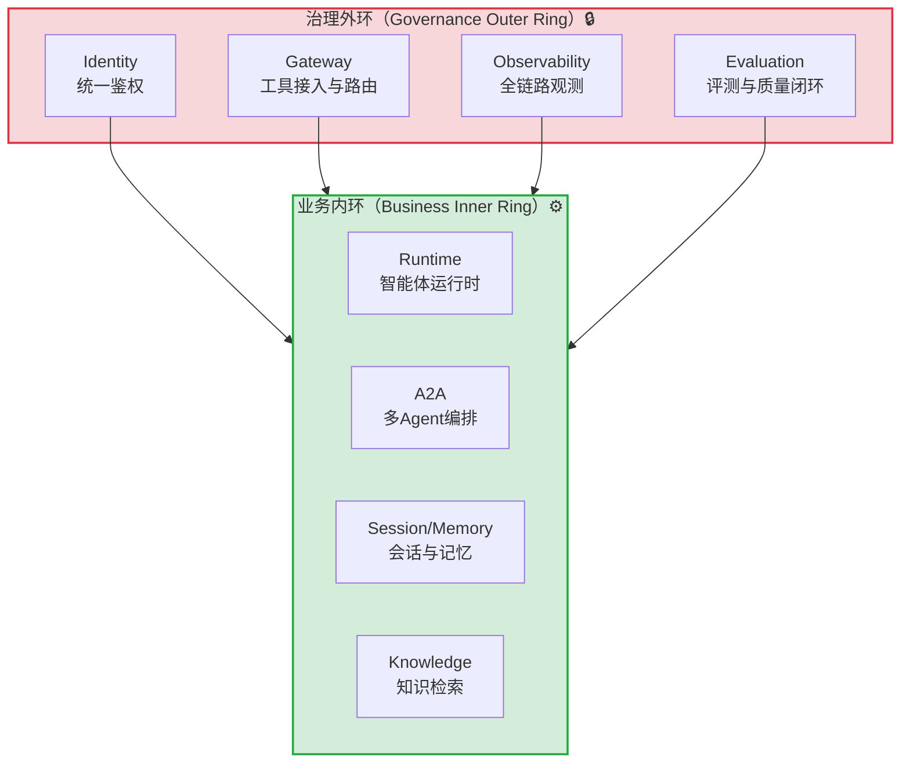

> **提炼自**：[insights.md#洞察2](../../../../../.trae/specs/volcengine-agentkit-wiki/insights.md#洞察2) —— 火山引擎AgentKit核心洞察（治理外环vs业务内环架构设计原则）

# 治理外环包裹业务内环架构（Governance Outer Ring Encircles Business Inner Ring）

## 模式类型

架构模式（企业级AI Agent平台/分布式系统设计）

## 成熟度

L1 实验性（火山引擎AgentKit 8大功能模块设计验证，单案例待更多场景验证）

## 适用场景

设计企业级生产系统（尤其是AI Agent平台、多租户SaaS平台、涉及安全合规的分布式系统）时，需要在业务能力之外构建完整的治理体系。

典型场景：
- 企业级AI Agent平台设计
- 多租户SaaS平台架构
- 涉及权限/安全/合规/质量管控的生产系统
- 从"玩具级Demo"向"企业级生产平台"演进的系统
- 需要区分"快速原型"与"生产可用"的架构决策

## 问题背景

架构设计中常见的认知偏差：

1. **业务优先直觉**：直觉上认为"业务逻辑是核心，治理（权限/监控/评测/审计）是锦上添花的辅助功能"，导致治理模块被延后或简化
2. **标配能力陷阱**：业务内环（运行时/编排/会话/知识检索）是所有Agent平台均具备的"标配能力"，无法形成差异化壁垒
3. **Demo vs 生产鸿沟**：缺少治理外环的系统只能做Demo演示，无法通过企业安全审计、无法定位线上问题、无法保障输出质量
4. **跨Agent权限穿透**：多Agent场景中若缺少Gateway统一鉴权，会出现"A Agent通过B Agent间接调用到自己无权访问的工具"的权限穿透风险

火山引擎AgentKit的8大功能模块揭示了一个反直觉架构原则：治理侧的复杂度与建设优先级高于业务侧。

## 核心思想

**企业级系统的架构应分为两层：业务内环（核心功能逻辑）与治理外环（Identity+Gateway+Observability+Evaluation安全质量边界），治理外环从四个方向包裹业务内环，治理外环的深度与完备度才是区分"玩具级Demo平台"与"企业级生产平台"的根本标志。架构设计时应先定义治理外环，再实现业务内环。**

## 架构设计原则

### 原则1：治理外环先行（Governance-First Design）

架构师设计系统时，严格遵循以下顺序：
1. **第一步**：画Identity权限矩阵（角色×工具×数据的访问边界）
2. **第二步**：列Gateway接入的工具清单与路由规则
3. **第三步**：规划Observability埋点维度与Evaluation质量指标
4. **第四步**：最后才实现Runtime中的业务逻辑

### 原则2：四大治理模块各司其职

| 治理模块 | 核心职责 | 解决的根本问题 | 企业级必要性 |
|---------|---------|---------------|-------------|
| **Identity** | 统一鉴权、身份管理 | "谁能访问什么" | ✅ 安全合规底线 |
| **Gateway** | 工具接入、路由、流量控制 | "Agent能调用什么工具" | ✅ 防止越权调用 |
| **Observability** | 全链路追踪、日志、排障 | "系统运行时发生了什么" | ✅ 可运维性保障 |
| **Evaluation** | 评测、质量评估、上线闸门 | "Agent输出质量是否达标" | ✅ 质量可持续优化 |

### 原则3：业务内环是标配，治理外环是壁垒

- **业务内环**（Runtime/A2A/Session-Memory/Knowledge）是所有同类平台都必须具备的基础能力，开源社区有大量可复用实现
- **治理外环**（Identity+Gateway+Observability+Evaluation）的深度与完备度才是真正的竞争壁垒，决定了系统能否通过企业安全审计、能否规模化落地

### 原则4：Gateway层的跨Agent权限隔离

在多Agent（A2A）场景启用前，必须先在Gateway层为每个Agent分配独立的工具调用权限，建立"权限白名单"机制，禁止未授权的跨Agent工具调用链。

## 实施检查清单

设计企业级系统时对照检查：

### 治理外环设计阶段
- [ ] 是否先定义了Identity权限矩阵（角色×工具×数据三维边界）？
- [ ] Gateway层是否为每个Agent/服务分配了独立的工具调用白名单？
- [ ] Observability是否规划了完整的链路追踪维度（调用链/耗时/错误率/输入输出）？
- [ ] Evaluation模块是否定义了核心质量指标（准确率/幻觉率/工具调用成功率）？
- [ ] 是否将Evaluation与上线闸门绑定（核心指标不达标自动拦截发布）？

### 业务内环实现阶段
- [ ] Runtime核心逻辑是否在治理外环定义完成后才开始实现？
- [ ] 业务内环是否通过Gateway统一接入外部工具，而非直接调用？
- [ ] 所有业务操作是否都经过Identity鉴权，不存在绕过鉴权的后门？
- [ ] 关键业务路径是否都有Observability埋点，可追溯全链路？

### 多Agent场景专项检查
- [ ] 每个Agent是否有独立的身份凭证和工具权限？
- [ ] 是否防止了Agent间的权限穿透（A Agent不能通过B Agent调用自己无权的工具）？
- [ ] 跨Agent调用链路是否可被Observability完整追踪？

## 反模式（不要这么做）

- ❌ **反模式1：业务先行、治理补漏**：先写完所有业务逻辑，最后"加个权限控制"和"打点日志"。后果：权限模型与业务逻辑耦合、埋点缺失关键路径、上线后无法通过安全审计
- ❌ **反模式2：治理模块形同虚设**：Identity只做简单的登录验证不做细粒度权限、Gateway只是简单转发不做权限校验、Observability只打错误日志不做链路追踪。后果：系统看起来有治理模块，实际无法起到治理作用
- ❌ **反模式3：业务内环直接对外暴露**：Runtime/A2A模块直接接收外部请求，绕过Gateway和Identity。后果：无法统一管控工具调用权限，出现安全漏洞
- ❌ **反模式4：Evaluation与发布流程解耦**：评测只在线下做，不与上线闸门绑定。后果：低质量Agent版本可以随意发布，质量无法保障
- ❌ **反模式5：多Agent共用同一身份**：所有Agent使用同一套凭证和权限。后果：一个Agent被攻破后全部工具暴露，权限隔离完全失效

## 检验标准

做完之后怎么知道做对了？

- 标准1：新开发者加入团队时，能通过Identity权限矩阵清晰了解"哪个角色能做什么"，不需要口头解释
- 标准2：线上出现问题时，能通过Observability在5分钟内定位到故障Agent、故障工具、错误输入
- 标准3：新Agent版本发布必须通过Evaluation评测集，不达标无法上线
- 标准4：安全团队审计时，能提供完整的调用链路日志和权限访问记录
- 标准5：增加新工具接入时，只需在Gateway层配置路由和权限，无需修改业务代码

## 迁移示例

这个模式还能用在什么其他场景？

- **场景1（企业微服务架构）**：API Gateway + Auth + 链路追踪 + 质量评测 构成治理外环，业务微服务构成业务内环
- **场景2（数据平台架构）**：数据权限 + 数据网关 + 数据血缘/审计 + 数据质量监控 构成治理外环，ETL/计算/查询引擎构成业务内环
- **场景3（IoT平台架构）**：设备认证 + 协议网关 + 设备状态监控 + 固件质量检测 构成治理外环，设备控制/场景联动构成业务内环
- **场景4（跨领域类比）**：城市治理体系——法律/警察/监控/质检构成治理外环，市民日常活动/商业活动构成业务内环

## 与现有模式的关系

| 相关模式 | 关系 | 说明 |
|---------|------|------|
| [scenario-based-security-matrix.md](scenario-based-security-matrix.md) | 本模式包含 | 基于场景的安全矩阵是Identity权限设计的具体方法 |
| [full-process-defense-depth.md](full-process-defense-depth.md) | 思想同源 | 全程深度防御是安全设计原则，本模式将其扩展到治理四维度 |
| [multi-agent-closed-loop-execution.md](multi-agent-closed-loop-execution.md) | 协同模式 | 多Agent闭环执行是业务内环的编排模式，依赖治理外环的权限管控 |
| [three-layer-routing-protocol.md](three-layer-routing-protocol.md) | 架构类比 | 三层路由协议是系统间路由治理，本模式是系统内功能治理 |
