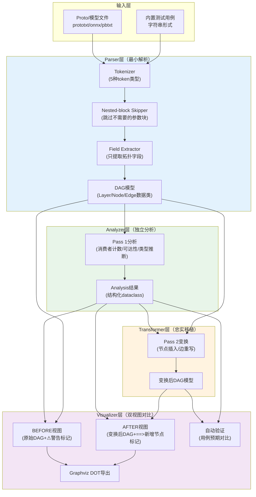

# 图变换验证工具四段式架构：Parser→Analyzer→Transformer→Visualizer

## 模式概述

需要验证一个DAG/图变换算法（如split插入、op融合、layout转换）的正确性，且目标环境运行成本高（需要编译、依赖重）时，采用"最小解析器→独立分析器→忠实变换器→双视图可视化"四段式架构，在独立轻量环境中完整复刻算法逻辑并提供before/after对比验证。

## 问题现象

验证深度学习框架/编译器中的图变换Pass时常见问题：
- 目标环境编译成本高，每次修改C++代码后重编译+运行测试循环慢
- 没有可视化工具，只能靠gdb/log调试DAG结构，无法直观看到变换前后差异
- 分析逻辑（"哪些节点需要变换"）和变换逻辑耦合，可视化显示的警告与实际变换行为不一致
- 引入完整protobuf/ONNX依赖只为解析模型拓扑，验证工具变得和原项目一样重
- 测试用例只覆盖"正常"fan-out场景，in-place链等边界case容易遗漏
- in-place计算/覆盖语义导致简单的字符串key追踪出错，移植算法时出现"看起来等价但实际错误"的简化

## 解决方案

**四段核心职责**：

### 1. 最小解析器（Parser）

- **Tokenizer**：只识别5种token类型——带引号字符串(str)、数字(num)、裸标识符(ident)、左括号`{`、右括号`}`，约70行代码
- **Nested-block Skipper**：提供`_skip_block_at(tokens, pos)`深度计数`{`/`}`对，跳过所有不需要的嵌套参数块（如`inner_product_param{...}`）
- **Field Extractor**：只提取拓扑结构必需字段——节点名/类型/输入边/输出边/权重标记，不解析任何参数值
- **输出**：强类型DAG模型（dataclass：Layer/NetSpec等）

### 2. 分析阶段独立化（Analyzer）

- 将Pass 1（消费者计数/可达性分析/类型推断等）**提取为独立函数**，返回结构化数据类（如`FanoutAnalysis`）
- 分析结果同时服务于三个下游：(1)Transformer的Pass 2输入；(2)BEFORE视图的警告标记；(3)fan-out/分析表的精确数据
- **核心不变量**：所有下游消费同一份Analysis数据对象——"看到的警告"必须与"实际变换决策"完全一致

### 3. 变换模拟（Transformer）

- **忠实移植源算法逻辑**：使用与源语言一致的索引体系（整数元组`(node_idx, output_idx)`而非字符串key追踪生产者）
- **保持命名规则一致**：新增节点/边的命名规则与源算法对齐（如Caffe的`{blob}_{producer}_{blob_idx}_split_{k}`）
- **in-place语义精确复制**：维护`blob_name → (last_producer_idx, output_idx)`映射，每遇到in-place层即时更新
- **错误处理对齐**：源算法FATAL/报错的场景（如引用不存在的blob）也对应抛异常

### 4. 双视图可视化（Visualizer）

- **BEFORE视图**：展示原始DAG + 高fan-out/需要变换的位置标记（如⚠）
- **AFTER视图**：展示变换后DAG + 自动插入/新增的节点高亮标记（如==>）
- **两张表结构完全一致**：列对齐、同一实体在两张表中名称可追溯，便于肉眼diff
- **多种输出格式**：文本表格（终端可读）+ Graphviz DOT导出（可渲染为图片）+ 自动验证（测试用例）

**关键设计约束**：
- **零第三方依赖**：仅使用标准库（argparse/sys/dataclasses/typing/textwrap等）
- **内置测试用例≥8个**，必须覆盖：
  - 线性链（无变换，边界case）
  - 单fan-out（基础场景）
  - in-place链（单层in-place）
  - 双层in-place（最容易出错的场景）
  - 显式已有变换（幂等性验证）
  - 权重/标记触发（额外消费者场景）
  - 错误引用（异常处理对齐）
  - 组合场景（多类型fan-out同时存在）
- **CLI友好**：支持`--verify`（跑所有测试）、`--case <name>`（可视化单测例）、`--all`（可视化所有用例）、`file`（分析外部文件）、`--dot`（导出DOT）、`--mode`（语义模式切换）

## 适用场景

- 深度学习框架图变换Pass验证（Caffe InsertSplits/TVM Relay Pass/ONNX优化/TensorFlow GraphDef Pass）
- 编译器IR变换验证（LLVM Pass/MLIR Rewrite Pattern）
- 工作流引擎DAG变换调试
- 任意有向图结构变换算法的可视化验证
- 目标环境编译/运行成本高，需要快速迭代验证算法逻辑

## 实际案例

**caffe-ffi InsertSplits可视化验证工具**：
- 文件：`projects/xuanspace/libs/caffe-ffi/scripts/viz_insert_splits.py`（1047行）
- 零第三方依赖，仅用Python标准库
- 10个内置测试用例全部通过，覆盖线性链/单层/双层in-place/组合场景/显式split/权重触发等
- 发现了初始Python移植用字符串key导致in-place fan-out计数错误的问题
- 文本表格+DOT双输出，before/after对齐便于diff验证
- CLI支持7个参数，既可用于CI验证也可用于手动调试

## 反模式

1. **用字符串key替代整数索引追踪图节点**：
   - 错误做法：`consumer_count[blob_name] += 1`
   - 问题：in-place计算/节点覆盖场景下，同名blob在不同时间点代表不同实体，字符串key会丢失时序语义，导致消费者计数错误累计到首个生产者
   - 正确做法：用`(node_idx, output_idx)`二元组作为生产者唯一标识，维护`blob_name → last_producer`映射随in-place更新

2. **可视化代码中独立实现简化版分析逻辑**：
   - 错误做法：表格显示时自己写一个简单的fan-out计数，Transformer用另一份逻辑
   - 问题：分析逻辑和变换逻辑使用不同数据路径，导致"显示警告说fan-out=3但实际只插入1个split"的不一致，严重误导调试
   - 正确做法：Analyzer输出单一Analysis数据对象，Transformer和Visualizer都消费它

3. **引入完整protobuf/ONNX等重依赖仅为解析拓扑**：
   - 错误做法：验证工具也要求安装完整protobuf、编译proto文件、处理版本兼容
   - 问题：验证工具本应轻量开箱即用，引入重依赖后变得和原项目一样难以运行，失去了"快速验证"的价值
   - 正确做法：手写最小解析器，只提取拓扑需要的≤5个字段，其他参数块一律跳过

4. **测试用例只覆盖"正常"fan-out场景，不覆盖in-place链**：
   - 错误做法：只测"一个blob被两个layer消费"的基础场景
   - 问题：in-place/覆盖语义是图变换算法最容易出错的地方，基础场景测不出来，双层in-place是最好的试金石
   - 正确做法：必须包含单层in-place、双层in-place、组合场景三类测试用例

## 与其他模式的关系

- 与**三层+Profile解析生成架构（three-layer-parser-generator）**互补：本模式是图变换验证领域的专用四段架构，Parser层借鉴了三层解析的分层思想但更轻量
- 使用**Protobuf文本格式最小解析器（protobuf-text-minimal-parser）**模式作为Parser层的具体实现
- 与**示例驱动测试生成（example-driven-test-generation）**配合：内置测试用例就是典型的示例驱动测试
- 相关最佳实践：[dag-graph-transform-verification.md](../../../knowledge/best-practices/dag-graph-transform-verification.md)

## 边界与选型

- 不适用于：需要完整模型语义/参数值的场景（如数值正确性验证），本模式只验证**拓扑变换正确性**
- 当图变换算法非常简单（<50行代码、无in-place/特殊语义）时，可以简化架构省略独立Analyzer层
- 当需要对比多个框架的同一种变换时，可以在Parser层增加多格式支持，但仍保持零依赖原则
- 当验证工具需要长期维护并集成到CI时，可逐步增加DOT→PNG自动渲染、HTML报告等功能，但核心四段架构保持不变
