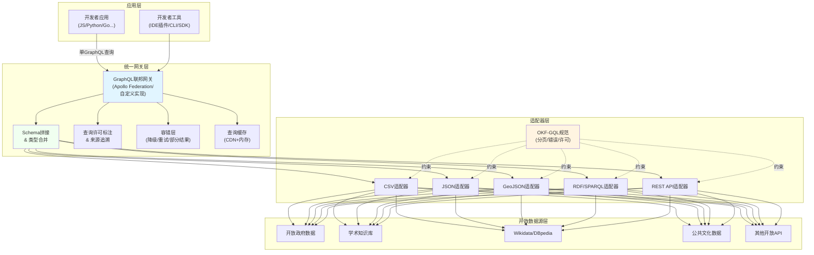

# GraphQL联邦开放知识网关：跨源开放知识的统一查询层

> ⚠️ **成熟度：L1-draft（单案例待验证）** — 本模式基于单个七概念分析会话萃取，尚未在≥2个独立项目中验证，采用前请先做小范围PoC。

## 模式概述

开放知识领域长期主推RDF/SPARQL作为语义网标准，但这是"专家友好"不是"开发者友好"——大多数工程师会GraphQL但不会SPARQL。本模式使用GraphQL Federation（联邦）能力构建**跨源开放知识的统一查询层**：多个开放数据源各自实现标准GraphQL接口，网关层自动拼接Schema，开发者用一个GraphQL查询就能跨多个开放数据集获取关联知识，无需关心数据在哪个服务器，也不需要学习SPARQL。

## 问题现象：开放数据的孤岛困境

| 问题 | 表现 | 后果 |
|------|------|------|
| **每个数据集是孤岛** | 开放政府数据、学术论文库、Wikidata各有各的API，数据格式不统一 | 开发者需要为每个数据源写单独的适配器，跨源查询需要N次API调用+手动拼接 |
| **SPARQL学习曲线高** | 语义网标准方案是RDF+SPARQL，但90%的应用开发者不会SPARQL | 开放数据只能在语义网专家小圈子里自嗨，普通开发者用不起来 |
| **无统一发现机制** | 开发者不知道有哪些开放数据集、每个数据集提供什么字段 | 需要一个一个网站找文档，发现成本极高 |
| **许可信息缺失** | 查询结果不附带许可信息，开发者不敢直接用 | 法律风险，开放数据"看起来能用实际上不敢用" |
| **错误处理不一致** | 每个数据源错误格式不同，跨源查询错误处理复杂 | 一个源出错整个查询失败，容错性差 |

## 核心反常识

> **降低查询门槛比追求语义完美更重要。OKF过去主推RDF/SPARQL作为开放知识的查询标准，但这是"专家友好"不是"开发者友好"——大多数工程师会GraphQL但不会SPARQL。GraphQL可能是开放知识大众化的关键缺失拼图。**

语义完美的方案如果没人用，价值为零；80%场景下够用但开发者愿意用的方案，价值远高于完美但只有专家会用的方案。

## 解决方案：三层网关架构

### 整体架构



### 核心组件

| 组件 | 职责 | 关键设计 |
|------|------|---------|
| **OKF-GQL接口规范** | 定义开放知识GraphQL接口的标准字段 | 每个类型必须有：`id`、`name`、`license`（许可信息）、`source`（来源URL）、`provenance`（溯源链）；分页用标准`Connection`模式；错误用标准`Error`类型 |
| **适配器层** | 将常见开放数据格式一键包装为GraphQL端点 | CSV/JSON/GeoJSON/RDF/REST 5种通用适配器，零代码或低代码接入新数据源 |
| **联邦网关** | 跨源Schema拼接+查询路由+结果合并 | 基于GraphQL Federation规范，支持跨源关联查询（如"给我所有提到XX概念的论文+相关政府统计数据"） |
| **许可标注层** | 每个字段自动携带许可信息 | 查询结果中每个对象自动标注来源URL、许可类型（CC0/CC-BY等）、引用要求 |
| **容错缓存层** | 部分失败降级+查询缓存 | 一个源超时不导致整个查询失败，返回已获取的部分结果+警告；热门查询CDN缓存降低源站压力 |

### OKF-GQL 最小规范草案

每个符合规范的GraphQL端点必须包含：

```graphql
# 标准Node接口（全局ID）
interface Node {
  id: ID!
}

# 溯源信息（每个类型必须有）
type Provenance {
  sourceUrl: String!       # 数据来源URL
  license: License!        # 许可信息
  retrievedAt: DateTime!   # 获取时间
  attribution: String      # 署名要求
}

# 许可类型
enum LicenseType {
  CC0
  CC_BY
  CC_BY_SA
  CC_BY_NC
  ODC_BY
  ODC_ODbL
  OTHER
}

type License {
  type: LicenseType!
  url: String!
  summary: String
}

# 分页标准（Relay风格Connection）
type PageInfo {
  hasNextPage: Boolean!
  endCursor: String
}

# 标准错误
type QueryError {
  message: String!
  source: String!          # 哪个数据源出错
  code: String
  retriable: Boolean!
}
```

## 核心公理

1. **开发者门槛优先公理**：能被100万普通开发者用起来的方案，比只能被1万专家用起来的完美方案价值大100倍——降低门槛比语义完美更重要
2. **单查询原则**：开发者应该能用一个GraphQL查询获取所需的所有跨源关联数据，不需要手动调用N个API再拼接
3. **许可默认携带公理**：每个查询结果必须自动携带许可和来源信息，不能让开发者自己去找"这个数据能不能用"
4. **渐进式联邦公理**：不要求所有数据源一次性接入，可以一个一个接入，接一个用一个——网关不需要覆盖所有开放数据才有价值，接入几个常用源就已经能解决很多问题
5. **容错优先公理**：部分成功比完全失败好——一个数据源超时不应该让整个查询失败，应该返回已获取的结果并标注哪些部分失败

## 反模式（不要这么做）

- ❌ **反模式1：强制所有源转换成RDF**：要求所有开放数据提供者把数据转换成RDF/SPARQL是不现实的，应该适配现有格式而不是要求别人改
- ❌ **反模式2：追求完美语义推理**：一开始就想做描述逻辑、推理、本体映射，复杂度爆炸——先解决"能查到、能关联"的问题，推理是高阶特性
- ❌ **反模式3：不处理部分失败**：一个源挂了整个查询都失败，开放数据源可用性参差不齐，必须支持部分结果返回
- ❌ **反模式4：不提供适配器只做网关**：只做网关让数据提供者自己实现GraphQL接口是鸡生蛋问题——应该提供通用适配器把现有CSV/JSON/REST自动包装成GraphQL，降低接入门槛
- ❌ **反模式5：忽略许可信息**：查询结果不带许可，开发者用了侵权都不知道，许可标注是开放数据可用的前提不是附加功能

## 适用场景

- 开放政府数据门户（跨部门数据关联查询）
- 学术知识网络（论文+作者+机构+数据集关联）
- 公共文化数据平台（博物馆+图书馆+档案馆数据互联）
- Linked Open Data生态（Wikidata等开放知识库的开发者友好接口）
- 企业内部开放数据目录（不同部门的数据通过联邦查询统一访问）

## 不适用场景

- 企业内部数据集成（有更成熟的ETL/数据仓库方案，GraphQL联邦不是最优解）
- 高并发事务性系统（跨源查询延迟高，不适合毫秒级响应的交易系统）
- 只有1-2个数据源的简单场景（直接调用REST API更简单，不需要网关）
- 需要复杂语义推理/本体推理的场景（还是用RDF/SPARQL+推理机）

## 检验标准

做完之后怎么知道做对了？
1. **Hello World简单**：一个会GraphQL的普通开发者10分钟内能写出第一个跨源查询
2. **新源接入快**：一个CSV/JSON格式的新开放数据集，用通用适配器30分钟内能接入网关
3. **许可自动附带**：任何查询返回的每个对象都有sourceUrl和license信息
4. **部分失败可用**：故意停掉一个数据源，查询还能返回其他源的数据+明确的错误提示
5. **不需要学SPARQL**：开发者全程只需要GraphQL知识，不需要知道RDF/SPARQL是什么

## 实现路径建议

PoC最小可行版本（1-2人月）：
1. 先做JSON/CSV适配器，能把静态CSV/JSON文件包装成GraphQL
2. 用Apollo Federation做最简单的网关，支持2-3个常用源（如Wikidata非官方GraphQL+1个开放政府数据集）
3. 实现标准Provenance/License类型，自动注入到查询结果
4. 做一个简单的Web Playground让开发者试试

不要一开始就做：
- 所有5种适配器（先做2种最常用的）
- 复杂的推理/本体映射（先不做）
- 分布式缓存/CDN（先不做，网关层内存缓存够用）
- 完整的SDK/IDE插件（先有Web Playground就够）

## 验证记录

| 验证项 | 状态 | 说明 |
|--------|------|------|
| 单案例分析 | ✅ | Sphinx×GraphQL×OKF七概念分析会话（sc-20260805） |
| 需求验证 | ⚠️ 部分验证 | Wikidata已有非官方GraphQL封装，证明开发者需求存在 |
| 完整实现 | ❌ 缺失 | 仅有架构设计，无参考实现 |
| 第二案例支撑 | ❌ 缺失 | 需要至少1个独立项目验证后才能升级为L2 |

## 与其他模式的关系

- **document-as-queryable-api.md**：垂直应用——文档即可查询API是本模式在技术文档领域的单源特例，本模式是多源联邦的通用架构
- **toolchain-embedded-open-metadata.md**：互补关系——工具链嵌入元数据负责数据生产端的开放属性，本模式负责数据消费端的统一查询，两者结合就是洞察4的三者全组合
- **three-layer-routing-protocol.md**：架构思想——本模式的三层架构（数据源/适配器/网关）是三层路由协议在开放数据领域的应用
- **content-type-routing.md**：路由基础——适配器层的多格式支持是内容类型路由的具体应用

## 迁移验证（跨场景示例）

本模式不仅适用于开放知识领域：
- **微服务API聚合**：企业内部多个微服务用GraphQL联邦统一网关，前端一个查询拿所有需要的数据，不用调N个API
- **电商数据聚合**：商品、库存、价格、评论在不同服务，联邦网关让前端一次查询拿到完整商品详情页数据
- **多CDN/多云管理**：不同云厂商的资源API通过GraphQL联邦统一查询，一个查询看到所有云的资源
- **AI工具集成**：多个AI服务（LLM、图像生成、语音）各自实现GraphQL接口，联邦后AI Agent用一个查询就能编排多个AI能力
