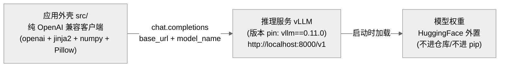

> **提炼自**：Tongyi-MAI mai-ui 源码学习复盘 —— LLM 应用仓库把模型推理彻底外置为独立服务，仓库内只保留 OpenAI 兼容 API 客户端外壳

# 推理外壳与模型底座解耦（Inference Shell / Model Base Decoupling）

## 模式类型

架构模式（LLM 应用 / 推理服务外置 / OpenAI 兼容协议边界）

## 成熟度

L1 已验证（1 次验证：2026-08-29 Tongyi-MAI mai-ui 源码学习，206 条事实采集 + 33 项 Grep 符号验证）

## 适用场景

构建或学习"以大模型为底座的应用"时，把**模型推理能力完全外置为独立服务**，应用仓库只保留协议客户端与业务编排：

- 模型权重频繁升级或多模型并行试错，应用代码不想跟权重绑定
- 应用需要跨 GPU 机器部署（服务在 GPU 节点，应用在任意节点）
- 评测/研究场景：同一套 Agent 代码要对接不同底座（本地 vLLM / 远端商用 API）
- 源码学习场景：判断一个"模型仓库"里到底有没有推理栈

## 问题背景

LLM 应用仓库最常见的两种耦合失败：

1. **推理栈内嵌**：应用代码直接 `import torch` 加载权重，导致仓库巨大、依赖地狱（torch/transformers/cuda 版本锁死）、无法在没有 GPU 的机器上做业务开发。
2. **伪解耦**：表面走 HTTP API，但把 tokenizer/后处理/坐标换算等推理相关逻辑散落在应用代码里，换底座时全部重写。

根本矛盾：应用要获得完整模型能力，又不想承担推理栈的依赖与部署复杂度。

## 核心设计

三个支柱：

1. **协议边界即唯一边界**：应用与服务之间只有 OpenAI 兼容的 `/v1/chat/completions`；Agent 构造函数只收 `llm_base_url + model_name` 两个模型相关参数，此外对推理栈一无所知。
2. **依赖清单是解耦声明**：外壳仓库的 requirements 只含客户端依赖（mai-ui 实测仅 openai/Jinja2/numpy/Pillow 4 包），**没有 torch/transformers 就意味着没有推理栈**——这是最可靠的判据信号。
3. **部署契约显式 pin**：推理服务的引擎版本（vLLM）、服务端点（`http://localhost:8000/v1`）、权重来源（HuggingFace）全部写在文档里且版本号硬 pin（"Must use VLLM=0.11.0"），作为外壳的运行前提而非可选配置。

## 实施要点

| 维度 | 做法 | mai-ui 实例 |
|---|---|---|
| 客户端依赖 | 只允许协议客户端 + 数据处理库，禁止训练/推理框架 | requirements.txt 仅 4 包，无 torch/transformers |
| 模型注入 | 构造参数传 `llm_base_url + model_name`，不传权重路径 | 两个 Agent 的 `__init__` 均如此 |
| 服务契约 | 引擎版本 + 端点 + 权重位置写进 README 并硬 pin | `vllm==0.11.0`，`http://localhost:8000/v1` |
| 环境分立 | Agent 运行环境与模型服务/评估环境分开，**版本允许不一致** | 根 4 包 vs 评估端 vllm 0.11.0 + transformers 4.57.0 + torch 2.8.0 |
| 权重治理 | 权重只存模型仓（HuggingFace），按参数规格发布 | 仅 2B/8B 已发布，不在 git 内 |

## 不适用场景与反目标用户

### 不适用场景

- ❌ **端侧/离线一体化产品**：目标形态是"单文件离线运行"（如端侧助手、离线工具）时，外置服务违背交付形态——应内嵌推理栈（llama.cpp/onnxruntime 类方案）。
- ❌ **需要改动模型本体**：做训练、微调、量化研究时，"外壳"里根本没有可改的模型代码，vLLM 只是推理引擎——这类需求应另立训练仓库。
- ❌ **超低延迟/高频调用**：每次调用都走 HTTP + vLLM 调度，对毫秒级延迟敏感的场景是额外开销（对 Agent 类秒级任务可忽略）。

### 反目标用户

- 追求"clone 即跑"的开箱体验者：本模式要求先起服务再跑应用，两步门槛不可避免。
- 不愿维护独立服务进程的个人轻量使用者：多一个 vLLM 服务就多一份显存与运维成本。

## 反模式

### 反模式1："按仓库名先验找推理代码"

仓库/项目名含"基础模型"字样，就默认仓内有权重加载与推理实现，在 src/ 里反复寻找模型相关代码。**正确做法**：先读 requirements.txt 与 README Quickstart——无 torch/transformers + 服务端点配置，即判定为纯外壳，推理栈在别处。

### 反模式2："混装 Agent 环境与模型服务环境"

为图省事在同一环境里既装根依赖（4 包）又装 vLLM/transformers/torch。后果：依赖冲突且掩盖了"外壳不依赖推理栈"的架构事实。**正确做法**：两套环境分立，文档并列说明各自用途与版本。

### 反模式3："忽略推理引擎版本 pin"

把 `Must use VLLM=0.11.0` 当普通建议，随意用其他版本起服务。后果：提示词模板、坐标解析等行为可能随引擎版本漂移，复现分数异常无从排查。**正确做法**：把引擎 pin 当部署契约硬执行，升级须走回归验证。

### 反模式4："省略 base_url 配置依赖隐式默认"

客户端不显式传 `llm_base_url`，依赖 SDK 默认指向商用 API。后果：本地 vLLM 服务根本不会被调用，且容易把密钥配置当必需品。**正确做法**：base_url + model_name 作为必填构造参数。

### 反模式5："教程从 pip install 开始而非从起服务开始"

按通用 Python 项目惯例写 Quickstart（装依赖→跑例子）。后果：读者装完 4 包后第一步就报连接失败。**正确做法**：解耦架构下 Quickstart 第一步必须是部署推理服务（起 vLLM + 下载权重），第二步才是安装外壳依赖。

## 失败案例

### 案例：按"模型仓库"先验检索推理代码未果（mai-ui 源码学习，2026-08-29）

**背景**：R 阶段事实采集初期，按仓库名"MAI-UI 基础模型家族仓库"的先验假设仓内含推理实现，沿"模型加载→推理调用→输出解析"的常规路径检索。

**发现过程**：检索模型加载代码一无所获后，转向依赖清单证据——requirements.txt 仅 4 包（Jinja2/numpy/openai/Pillow），无 torch/transformers；README 安装章节却指定 `vllm==0.11.0` 与 `http://localhost:8000/v1` 服务地址；两个 Agent 的 `__init__` 均只接 `llm_base_url + model_name`。三组证据共同推翻先验：**src 是纯 API 客户端，vLLM 才是运行时，权重在 HuggingFace（仅 2B/8B）**。进一步发现评估环境另有独立依赖（vllm 0.11.0 + transformers 4.57.0 + torch 2.8.0），与根 4 包版本不一致，证实"环境分立"是设计而非疏漏。

**教训**：源码学习中，仓库名与 README 标题是最不可信的先验；依赖清单（requirements/pyproject）是架构事实的硬证据，应作为 R 阶段第一优先采集对象——这也是上游工作流"信源先行"在架构判定层的具体化。

## 早期预警信号

| 预警信号 | 可能问题 | 建议行动 |
|---|---|---|
| README Quickstart 无"启动模型服务"步骤但应用离不开模型 | 教程按耦合假设写（反模式5） | 第一步补部署服务（引擎 pin + 端点 + 权重） |
| requirements 出现 torch/transformers 但声称"纯客户端" | 伪解耦：推理逻辑渗入外壳 | 审计 import，把推理相关逻辑移回服务侧 |
| 换了 vLLM 版本后输出格式/分数异常 | 引擎 pin 未被当作契约（反模式3） | 锁回 pinned 版本，升级前跑回归 |
| 应用报"连接被拒/401"于首次运行 | base_url 未显式配置，指向了默认商用 API（反模式4） | 构造参数显式传 base_url + model_name |
| 同机单环境装完 4 包又装 vLLM 栈后依赖冲突 | 环境未分立（反模式2） | 拆两套环境，文档并列各自用途 |
| 文档声称"离线可用"但无权重/无服务 | 外壳被误当完整产品 | 明示运行前提：服务可达 + 权重就位 |

## 实际案例

Tongyi-MAI mai-ui（2026-08-29 源码学习）：

| 维度 | 事实 |
|---|---|
| 外壳依赖 | requirements.txt 仅 Jinja2/numpy/openai/Pillow 4 包（F-003） |
| 服务契约 | `vllm==0.11.0`（"Must use"），`http://localhost:8000/v1`（F-004） |
| 模型注入 | grounding/navigation 两 Agent `__init__` 均只接 `llm_base_url + model_name`（F-019/F-026） |
| 权重治理 | HuggingFace 外置，仅 2B/8B 已发布（F-001） |
| 环境分立 | 评估环境独立 requirements：vllm 0.11.0 + transformers 4.57.0 + torch 2.8.0（F-045） |

## 迁移验证

- **可迁移场景**：GPU 服务器 + 办公机分离的团队开发；同一 Agent 对接本地 vLLM 与远端商用 API 做对比评测；模型服务由平台团队托管、应用团队只管编排的组织分工。
- **先例关联**：vLLM/OpenAI 兼容生态（sglang、ollama 同样暴露 OpenAI 兼容端点）下该模式可直接复用；TGI 等非 OpenAI 兼容引擎需加一层协议适配。

## 与其他模式的关系

| 关系模式 | 关系类型 | 说明 |
|---|---|---|
| [zero-logic-client-desktop-app.md](./zero-logic-client-desktop-app.md) | 同源思想 | "客户端永远是零逻辑薄壳"在 LLM 推理场景的投影；二者可叠加（薄壳 GUI + 外置 vLLM） |
| [thin-entry-shim.md](./thin-entry-shim.md) | 粒度差异 | thin-entry-shim 是入口层薄壳（进程内），本模式是服务边界薄壳（跨进程 HTTP） |
| [four-layer-ai-capability-architecture.md](./four-layer-ai-capability-architecture.md) | 分层互补 | 能力分层架构中"模型层"与"应用层"的物理落地方式即本模式 |
| [environment-diversity-design.md](./environment-diversity-design.md) | 配套机制 | "环境分立"要点（Agent 环境 vs 服务/评估环境）是其具体实例 |

<!-- changelog -->
- 2026-08-29 | pattern | 初始创建：从 Tongyi-MAI mai-ui 源码学习（洞察1）萃取；证据链 F-001/F-003/F-004/F-019/F-026/F-045，33 项 Grep 符号验证通过
