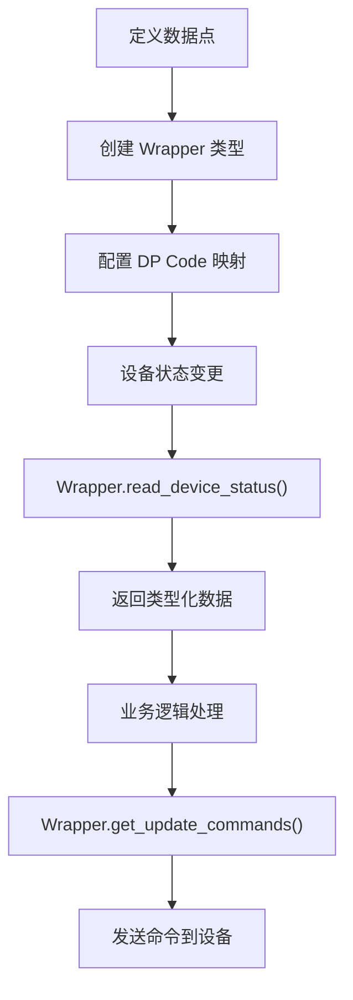

> **已原子化自**：[Home Assistant 官方 Tuya 集成洞察萃取](../../reports/insight-extraction/iot-ecosystem/retrospective-home-assistant-tuya-official-20260630/insight-extraction.md)

# IoT 设备数据包装器模式（DeviceWrapper Pattern）

## 模式类型

架构模式

## 成熟度

L1 实验性（Home Assistant Tuya 集成单次验证）

## 适用场景

IoT 设备集成开发中，需要将设备原生协议数据点（DP Code）抽象为统一的数据访问接口，实现类型安全的数据读写，屏蔽底层协议细节。

## 问题背景

IoT 设备协议通常使用数据点（Data Point）来表示设备功能，如 Tuya 的 DP Code。直接使用这些数据点存在以下问题：

- **类型不安全**：数据点返回的是原始字符串或数值，缺乏类型校验
- **协议耦合**：业务代码直接依赖协议细节，难以迁移或替换
- **接口分散**：不同数据类型的读写方法不统一，增加学习成本

## 核心规则

通过 DeviceWrapper 将数据点抽象为统一接口，按数据类型提供类型安全的读写方法。

### 规则 1：定义统一接口

每个 Wrapper 必须实现两个核心方法：

| 方法 | 用途 |
|------|------|
| `read_device_status(device)` | 读取设备状态，返回类型化数据 |
| `get_update_commands(device, value)` | 生成更新命令列表 |

### 规则 2：按数据类型实现具体 Wrapper

| Wrapper 类型 | 用途 | 示例 DP Code |
|-------------|------|-------------|
| `BooleanWrapper` | 布尔值读写 | `switch` |
| `IntegerWrapper` | 整数值读写（含范围校验） | `bright_value`, `temp` |
| `EnumWrapper` | 枚举值读写 | `work_mode` |
| `ColorDataWrapper` | 颜色数据处理 | `colour_data_hsv` |
| `ElectricityCurrentWrapper` | JSON 格式数据解析 | `cur_current` |

### 规则 3：数据映射配置化

DP Code 与 Wrapper 的映射关系应通过配置表定义，而非硬编码：

```python
WRAPPER_MAPPING = {
    DPCode.SWITCH: BooleanWrapper,
    DPCode.BRIGHT_VALUE: IntegerWrapper,
    DPCode.WORK_MODE: EnumWrapper,
}
```

### 规则 4：错误处理标准化

- 数据类型不匹配时抛出 `TypeError`
- 无效 DP Code 返回 `None` 或抛出 `KeyError`
- 超出范围值抛出 `ValueError`

## 操作流程



## 实施检查清单

- [ ] 是否定义了统一的 `read_device_status()` 和 `get_update_commands()` 接口？
- [ ] 是否按数据类型实现了具体 Wrapper？
- [ ] DP Code 与 Wrapper 的映射是否配置化而非硬编码？
- [ ] 是否实现了标准化的错误处理？
- [ ] 是否支持范围校验（如亮度 0-255）？

## 反例警示

| 错误做法 | 后果 |
|---------|------|
| 直接使用原始 DP Code 值 | 类型不安全，运行时错误难以定位 |
| 硬编码 DP Code 映射 | 设备类型变化时需修改业务代码 |
| 绕过 Wrapper 直接读写 | 协议耦合，难以迁移 |
| 忽略范围校验 | 设备收到非法值导致异常 |

## 正例

Home Assistant Tuya 集成的 Wrapper 实现：

```python
# 读取状态
wrapper.read_device_status(device)
# 返回类型化数据，而非原始字符串

# 发送更新命令
commands = wrapper.get_update_commands(device, value)
# 返回命令列表，而非直接发送
```

## 可复用场景

- IoT 设备集成开发（Tuya、小米、涂鸦等）
- 多协议设备统一接口设计
- 需要类型安全数据访问的应用
- 设备协议迁移或替换场景