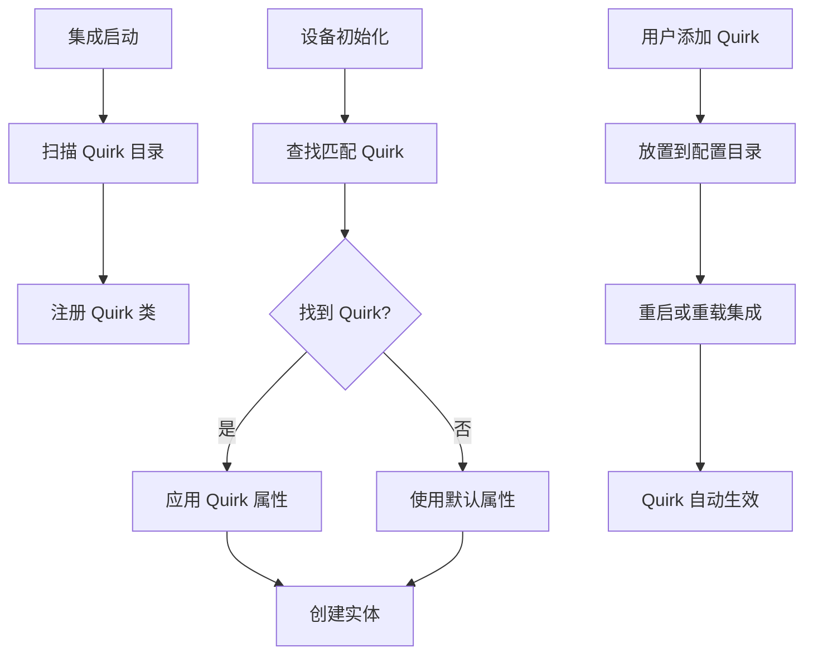

> **已原子化自**：[Home Assistant 官方 Tuya 集成洞察萃取](../../reports/insight-extraction/iot-ecosystem/retrospective-home-assistant-tuya-official-20260630/insight-extraction.md)

# IoT Quirks 扩展机制模式（Quirks Extension Mechanism）

## 模式类型

架构模式

## 成熟度

L1 实验性（Home Assistant Tuya 集成单次验证）

## 适用场景

IoT 设备集成开发中，需要为特定设备提供自定义处理逻辑，而无需修改核心代码，实现非标准设备的灵活支持。

## 问题背景

IoT 平台有大量设备，其中部分设备存在特殊情况：

- **非标准实现**：部分设备不完全遵循协议规范
- **功能覆盖**：需要修正设备制造商、型号等信息
- **定制需求**：用户需要为特定设备添加自定义功能
- **维护风险**：修改核心代码影响所有用户

## 核心规则

通过 Quirks 机制允许用户或开发者为特定设备提供自定义处理逻辑，核心代码保持不变。

### 规则 1：定义 Quirk 接口

Quirk 类定义设备特定处理逻辑：

| 属性/方法 | 用途 |
|----------|------|
| `manufacturer` | 覆盖设备制造商信息 |
| `model` | 覆盖设备型号信息 |
| `product_ids` | 匹配设备的产品 ID 列表 |
| `supported_features` | 扩展支持的功能 |

### 规则 2：Quirk 文件位置标准化

Quirk 文件放置在用户配置目录：

```
config/tuya_quirks/
├── custom_device.py
├── brand_x_quirk.py
└── ...
```

### 规则 3：启动时加载 Quirks

集成启动时扫描并注册所有 Quirk 文件：

```python
register_tuya_quirks(str(Path(hass.config.config_dir, "tuya_quirks")))
```

### 规则 4：设备匹配时应用 Quirk

设备初始化时查找并应用匹配的 Quirk：

```python
TUYA_QUIRKS_REGISTRY.initialise_device_quirk(device)

if quirk := TUYA_QUIRKS_REGISTRY.get_quirk_for_device(device):
    manufacturer = quirk.manufacturer
    model = quirk.model
```

## 操作流程



## 实施检查清单

- [ ] 是否定义了标准化的 Quirk 接口？
- [ ] Quirk 文件是否放置在指定目录？
- [ ] 启动时是否扫描并注册了 Quirk 文件？
- [ ] 设备初始化时是否查找并应用了 Quirk？
- [ ] 是否支持多个 Quirk 同时存在？

## 反例警示

| 错误做法 | 后果 |
|---------|------|
| 直接修改核心代码 | 影响所有用户，维护成本高 |
| Quirk 文件放置错误位置 | 集成无法加载 Quirk |
| Quirk 与核心代码冲突 | 版本更新后 Quirk 可能失效 |
| 不处理 Quirk 匹配失败 | 设备使用错误属性 |

## 正例

Home Assistant Tuya 集成的 Quirk 实现：

```python
# 加载自定义 quirks
register_tuya_quirks(str(Path(hass.config.config_dir, "tuya_quirks")))

# 初始化设备 quirk
TUYA_QUIRKS_REGISTRY.initialise_device_quirk(device)

# 获取 quirk 信息
if quirk := TUYA_QUIRKS_REGISTRY.get_quirk_for_device(device):
    manufacturer = quirk.manufacturer
    model = quirk.model
```

用户自定义 Quirk 示例：

```python
# config/tuya_quirks/custom_device.py
class CustomDeviceQuirk(TuyaQuirk):
    manufacturer = "Custom Brand"
    model = "Custom Model"
    product_ids = ["xxx123"]
    
    def get_device_info(self, device):
        return {
            "manufacturer": self.manufacturer,
            "model": self.model,
        }
```

## 与现有模式的关系

- `iot-device-wrapper-pattern.md`：Wrapper 模式定义核心数据访问接口，Quirks 模式允许覆盖设备信息而不修改核心代码。

## 可复用场景

- IoT 设备定制化支持（非标准设备适配）
- 用户自定义设备处理逻辑
- 设备信息修正（制造商/型号覆盖）
- 无需修改核心代码的扩展需求