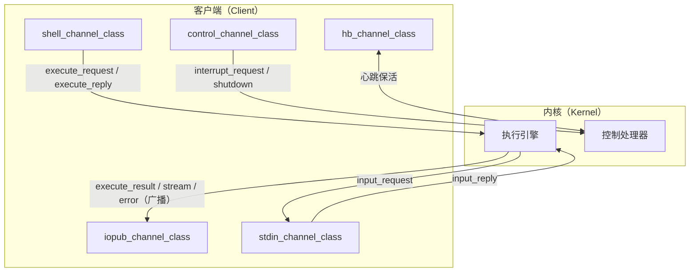

# 内核通信 ZMQ 多通道协议：职责分离的会话通道

## 模式概述

Jupyter 内核与客户端（如 Notebook/Console）之间的通信基于 **ZMQ 多通道架构**：一次内核会话同时维护五条职责不同的消息通道——`shell`（执行请求/回复）、`iopub`（执行过程广播，I/O 发布）、`stdin`（输入请求/回复）、`control`（控制指令，如中断/调试）、`hb`（心跳保活）。每条通道由独立的通道类实例化，通过 `client.py` 中五个 `*_channel_class` trait 与对应的 `connect_*` 方法装配。

这一模式把"执行请求"与"执行结果广播"、"控制指令"与"用户代码"在通道层面隔离，是 Jupyter 保证交互式执行不被控制操作阻塞、心跳不依赖业务通道的核心架构决策。

## 问题现象

设计"内核-客户端"通信协议时，常见的朴素方案是"单通道双向收发"，随之而来四个典型问题：

1. **执行阻塞控制**：长任务执行期间，用户发送中断（Interrupt）指令走同一通道，可能排队在待执行请求之后，无法及时响应。
2. **结果与请求耦合**：请求/响应与中间过程输出混在同一通道，客户端无法区分"最终结果"与"过程输出"。
3. **心跳依赖业务通道**：心跳保活与业务消息共用通道，业务拥塞时心跳被饿死，误判内核死亡。
4. **输入请求阻塞**：`input()` 类交互需要内核向客户端请求输入，单通道下输入请求与执行结果互相等待形成死锁风险。

## 解决方案

### 五通道职责划分

源码事实（`external/libs/jupyter/jupyter_client/jupyter_client/client.py`）：

- 第 101-105 行定义了五个 `Type(ChannelABC)` trait：
  `shell_channel_class` / `iopub_channel_class` / `stdin_channel_class` / `control_channel_class` / `hb_channel_class`。
- 第 358-425 行各 `connect_*` 方法用对应 class 实例化通道（如 `connect_shell` 用 `shell_channel_class`）。

### 通道职责矩阵

| 通道 | 职责 | 典型消息 | 阻塞特征 |
|------|------|---------|---------|
| shell | 代码执行请求/回复 | execute_request / execute_reply | 顺序处理，可被长任务占用 |
| iopub | 执行过程广播（多播） | execute_result / stream / error | 只读订阅，不阻塞执行 |
| stdin | 内核→客户端输入请求 | input_request / input_reply | 仅在需要输入时启用 |
| control | 控制指令（优先处理） | interrupt_request / shutdown | 独立于执行队列，可抢占 |
| hb | 心跳保活 | ping / pong | 独立轻量，不随业务拥塞 |

### 设计要点

1. **通道类即 trait 装配点**：`*_channel_class` 是类型化的 trait，客户端子类可通过覆写 trait 替换通道实现，实现"通道可插拔"。
2. **control 与 shell 分离**：中断/关机走 control 通道，不受 shell 执行队列阻塞。
3. **iopub 只广播不确认**：执行结果广播是发布/订阅模型，订阅方不参与请求-响应。
4. **hb 独立于业务通道**：心跳使用独立消息类型，业务拥塞不干扰存活探测。

## 适用场景

- ✅ Jupyter 内核/客户端通信协议阅读与二次开发
- ✅ 需要"执行/控制/广播/心跳"职责分离的交互式运行时设计
- ✅ 前端 Notebook/Console 等依赖多通道消息流的客户端
- ✅ 调试内核通信问题（先定位消息走哪个通道）

**不适用场景**：
- ❌ 单次请求-响应的简单 RPC（多通道是过度设计）
- ❌ 无中断/无心跳需求的批处理管道

## 实际案例

### 案例1：jupyter-okf-wiki-group 批量源码学习（本项目）

jupyter_client 是 Jupyter 架构层 14 个核心 bundle 之一，五通道设计作为其核心概念文档主干。Grep 验证确认 `client.py` L101-105 的五个 trait 与 L358-425 的 connect 方法存在且签名一致，facts.md 无虚构 API。

### 案例2：Jupyter 官方 Client 类家族

`BlockingKernelClient` 与 `AsyncKernelClient` 等子类通过覆写 `*_channel_class` trait 或 `connect_*` 方法，在共享五通道协议下提供同步/异步两种客户端体验——证明"通道类 trait"装配点设计的扩展价值。

## 反模式

### 反模式1：单通道承载所有消息

用一条 ZMQ 通道同时传执行请求、结果、中断、心跳。

**为什么错**：控制指令被长任务排队阻塞、心跳被业务拥塞饿死、结果与请求难以区分。

**正确做法**：按职责拆分多通道，control 优先、hb 独立。

### 反模式2：中断请求走 shell 通道

中断/关机复用 shell 执行队列。

**为什么错**：shell 通道被长任务占用时中断无法送达，违背"可抢占控制"目标。

**正确做法**：中断走 control 通道。

### 反模式3：心跳与业务共用通道

心跳 ping 与业务消息同通道发送。

**为什么错**：业务拥塞时心跳丢失，误判内核死亡触发错误重启。

**正确做法**：hb 通道独立轻量。

### 反模式4：用单一 ChannelABC 硬编码而非 trait

将通道类型硬编码在 Client 类中，不通过 `*_channel_class` trait 暴露。

**为什么错**：无法替换通道实现，破坏"通道可插拔"扩展点。

**正确做法**：暴露类型化 trait，子类可覆写。

### 反模式5：忽略 stdin 通道导致输入死锁

内核 `input()` 请求与执行结果在单一通道上互相等待。

**为什么错**：无独立 stdin 通道时输入请求与执行回复形成环形等待。

**正确做法**：stdin 通道独立承载输入请求/回复。

## 与其他模式的关系

| 相关模式 | 关系 | 说明 |
|---------|------|------|
| [jupyter-extension-registration.md](jupyter-extension-registration.md) | 同域互补 | 扩展注册决定"谁被加载"，多通道决定"加载后如何通信" |
| [io-boundary-pure-function-core.md](io-boundary-pure-function-core.md) | 思想同源 | 通道是 IO 边界，核心执行逻辑保持纯函数 |
| [zerocopy-cow-readwrite-separation.md](zerocopy-cow-readwrite-separation.md) | 类比 | 读写分离思想在多通道广播（iopub 只读）中的体现 |
| [multi-agent-parallel-execution.md](multi-agent-parallel-execution.md) | 互补 | 多通道是消息层面的并行/隔离，多 Agent 并行是任务层面 |

## 边界与选型

### 什么时候需要拆分多通道？

- 存在"可抢占控制"需求（中断/调试）→ 必须独立 control 通道
- 存在存活探测需求 → 必须独立 hb 通道
- 结果与过程输出需要分离消费 → 必须 iopub 广播通道

### 什么时候单通道就够？

- 无中断/心跳/输入需求的纯批处理管道
- 单次请求-响应 RPC，无并发控制诉求

### 通道扩展与兼容

- 新增通道需同时扩展 trait 定义与 connect_* 方法，保持命名对称
- 旧客户端可能不支持新通道消息，需按版本兼容策略渐进下发

<!-- changelog -->
