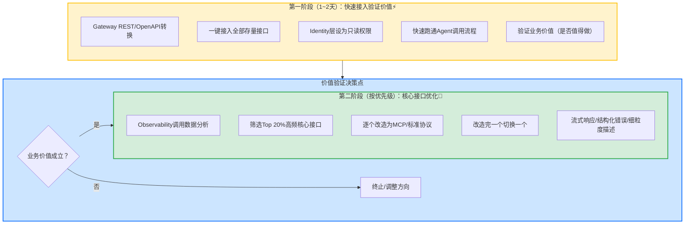

> **提炼自**：[insights.md#洞察5](../../../../../.trae/specs/volcengine-agentkit-wiki/insights.md#洞察5) —— 火山引擎AgentKit核心洞察（Gateway双轨接入与存量系统改造路径）

# 存量系统双轨接入两阶段法（Legacy System Dual-Track Integration: Quick-Win First, Optimize Later）

## 模式类型

架构模式（企业系统集成/AI Agent平台工具接入/存量系统改造）

## 成熟度

L1 实验性（火山引擎AgentKit Gateway双轨接入设计验证，单案例待更多场景验证）

## 适用场景

需要将大量存量系统（已有REST/OpenAPI接口的内部系统、第三方服务、遗留系统）接入新平台（AI Agent平台、集成平台、PaaS平台）时，面临"改造周期长 vs 业务价值验证慢"的矛盾。

典型场景：
- AI Agent平台接入企业内部存量REST/OpenAPI服务
- 微服务架构中遗留系统接入新的API网关
- 多云/混合云场景中异构系统集成
- 产业数字化转型中的旧系统对接新平台
- 任何需要"快速验证价值 vs 长期技术优化"平衡的系统集成场景

## 问题背景

存量系统接入中常见的困境：

1. **完美主义陷阱**：技术舆论中存在"MCP/标准协议是未来，不按标准接入就是技术落后"的焦虑，要求业务团队将所有内部接口重写为标准协议（如MCP Server）才能接入新平台
2. **改造成本黑洞**：企业存量系统中90%以上暴露的是REST/OpenAPI，要求全部重写为标准协议的改造成本与周期远超新平台本身的采购成本
3. **价值验证滞后**：所有接口改造完成前无法跑通业务流程验证价值，投入大量资源后才发现方向错误
4. **一刀切改造风险**：不是所有接口都需要流式响应、结构化错误码、细粒度工具描述——80%的低频简单接口用REST转换即可满足需求
5. **权限边界模糊**：快速接入过程中若未做好权限隔离，Agent误调用写操作接口（如创建订单、修改配置）可能引发生产事故

火山引擎AgentKit Gateway的双轨接入设计揭示了一个务实的产业集成策略。

## 核心思想

**存量系统接入应采用"双轨接入+两阶段推进"策略：第一阶段用"REST/OpenAPI快速转换"能力在1~2天内一键接入全部存量接口（只开放只读权限），快速跑通业务流程验证业务价值；第二阶段根据Observability模块的调用数据，筛选Top 20%高频调用/高性能要求的核心接口，逐个改造为标准协议（如MCP Server）获得最优体验。这是"先接入、再优化"的渐进路径，避免"先改造、再验证"的完美主义陷阱。**

## 架构设计原则

### 原则1：双轨接入能力并存

Gateway必须同时支持两种接入方式：

| 接入方式 | 适用场景 | 接入成本 | 体验质量 |
|---------|---------|---------|---------|
| **REST/OpenAPI快速转换** | 低频接口、简单CRUD、第一阶段快速接入 | 极低（配置化，1~2天全量接入） | 基础可用（同步调用、通用错误处理） |
| **标准协议原生接入（MCP Server）** | 高频接口、需要流式响应、复杂交互 | 较高（需开发MCP Server，单接口1~3天） | 最优体验（流式、结构化错误、细粒度工具描述） |

两种接入方式在Gateway层统一路由、统一鉴权、统一观测，业务层无感知差异。

### 原则2：第一阶段严格只读

第一阶段快速接入时，Identity层必须设置为**只读权限**：
- 只允许GET类操作，禁止POST/PUT/DELETE等写操作
- 每个Agent分配独立的REST接口白名单
- 接口级别的权限颗粒度，而非全局放开
- 关键写接口（创建订单、修改配置、删除数据）默认全部禁用

这是"安全护栏"——在业务价值未验证前，用严格的权限边界防止生产事故。

### 原则3：数据驱动的第二阶段优先级

第二阶段不搞"一刀切"改造，而是基于Observability的调用数据做优先级排序：

**MCP/标准协议改造优先级评估指标**：
1. **调用频率**：>100次/天的接口优先改造
2. **响应延迟要求**：P95 > 2s的接口优先改造为流式MCP
3. **错误处理复杂度**：需要细粒度错误码与重试策略的接口优先改造
4. **交互模式**：需要多轮交互/上下文保持的接口优先改造
5. **业务关键性**：核心业务链路接口优先于边缘接口

### 原则4：渐进式切换，无大爆炸上线

- 改造完一个接口切换一个，不集中批量切换
- 切换期间支持灰度（部分流量走MCP、部分走REST转换）
- Observability同时监控两条路径的成功率/延迟/错误率
- MCP路径稳定后再下线对应的REST转换配置

### 原则5：改造与业务迭代并行

- 第一阶段验证业务价值的同时，业务团队可以并行迭代Agent逻辑
- 第二阶段优化是"后台工作"，不阻塞前端业务验证和迭代
- 不需要等所有接口优化完成才发布业务价值

## MCP Server改造优先级矩阵

| 接口特征 | 评分 | 是否优先改造 |
|---------|------|------------|
| 日调用量 >1000次 | ⭐⭐⭐ | ✅ 最高优先级 |
| 日调用量 100~1000次 | ⭐⭐ | ✅ 高优先级 |
| 日调用量 <100次 | ⭐ | ❌ 保持REST转换即可 |
| 需要流式响应（如大模型生成） | ⭐⭐⭐ | ✅ 必须改造 |
| 需要复杂错误码/重试策略 | ⭐⭐ | ✅ 建议改造 |
| 简单CRUD查询 | ⭐ | ❌ 无需改造 |
| 写操作接口（创建/更新/删除） | ⭐⭐ | ⚠️ 价值验证后开放，按需改造 |

## 实施检查清单

存量系统接入时对照检查：

### 第一阶段准备
- [ ] Gateway是否具备REST/OpenAPI自动转换能力？
- [ ] 是否准备了Identity只读权限模板？
- [ ] 是否整理了全部存量接口清单？
- [ ] 是否识别了写操作接口并默认禁用？
- [ ] Observability是否能监控新接入接口的调用数据？

### 第一阶段执行（1~2天）
- [ ] 是否通过转换配置一键接入全部存量接口？
- [ ] 是否为每个Agent分配了独立的接口白名单？
- [ ] 是否确认所有写操作接口已被禁用？
- [ ] 是否在2天内完成了全量接入？
- [ ] 是否跑通了至少1条核心业务流程验证价值？

### 价值验证决策点
- [ ] 核心业务流程是否跑通？
- [ ] Agent调用成功率是否达到预期阈值（如>80%）？
- [ ] 业务方是否认可该流程的业务价值？
- [ ] 是否收集到了足够的调用数据（至少3天）？

### 第二阶段执行（按优先级）
- [ ] 是否基于Observability数据分析了接口调用频率/延迟/错误率？
- [ ] 是否按优先级矩阵筛选出了Top 20%核心接口？
- [ ] 是否逐个改造、逐个切换，而非批量大爆炸上线？
- [ ] 改造期间是否有灰度机制和回滚能力？
- [ ] MCP路径是否通过了充分的测试后才切换流量？

## 反模式（不要这么做）

- ❌ **反模式1：完美主义前置改造**：要求所有接口先改造成MCP/标准协议才能接入，业务团队花费2~4周做接口改造，还没验证价值就消耗了大量资源
- ❌ **反模式2：第一阶段开放写操作**：快速接入时为了"方便测试"开放全部接口权限（包括写操作），Agent误调用创建订单/删除数据接口引发生产事故
- ❌ **反模式3：一刀切全量改造**：业务价值验证后不做数据分析，要求团队把所有接口都改成标准协议，80%低频接口的改造投入没有任何体验提升
- ❌ **反模式4：大爆炸式切换**：攒够一批改造后的接口集中上线切换，出现问题无法快速定位，回滚成本高
- ❌ **反模式5：无Observation盲改造**：不基于调用数据做决策，凭"感觉"判断哪些接口需要优化，改造了错误的接口，真正的高频接口却没优化
- ❌ **反模式6：价值未验证就全面投入**：第一阶段快速接入后发现业务价值不成立，但已经投入了大量人力做MCP改造，造成沉没成本

## 检验标准

做完之后怎么知道做对了？

- 标准1：第一阶段在2天内完成全部存量接口接入，核心业务流程跑通
- 标准2：第一阶段全程无生产事故（写操作接口默认禁用+白名单机制生效）
- 标准3：业务价值验证决策点清晰，价值不成立时能快速止损（仅损失2天接入成本）
- 标准4：第二阶段改造的接口全部是基于真实调用数据筛选的Top 20%高频核心接口
- 标准5：改造完的MCP接口体验显著优于REST转换（延迟降低/错误处理更精准/Agent成功率提升）
- 标准6：80%的低频接口保持REST转换即可，无过度改造
- 标准7：接口逐个切换，可灰度、可回滚，无大爆炸上线

## 迁移示例

这个模式还能用在什么其他场景？

- **场景1（微服务API网关集成）**：第一阶段用泛化调用快速接入遗留系统接口（只读），验证新网关价值；第二阶段筛选高频接口做SDK化/协议升级
- **场景2（数据平台数据接入）**：第一阶段用数据集成工具快速接入全部业务数据库（只读副本），验证分析价值；第二阶段对核心业务域做数据仓库建模和ETL优化
- **场景3（多云迁移）**：第一阶段用VPN/专线快速打通多云网络（只读访问），验证混合云架构可行性；第二阶段对核心链路做专线优化/协议优化/数据同步
- **场景4（SaaS集成平台）**：第一阶段用通用连接器快速接入客户现有SaaS应用（OAuth只读权限），验证集成价值；第二阶段对高频集成场景做深度定制连接器
- **场景5（跨领域类比）**：新城市开设连锁店——第一阶段用快闪店/临时摊位快速验证市场需求（低投入、可快速撤出）；验证成功后第二阶段再租正式门店、做标准化装修（重投入、长期优化）

## 与现有模式的关系

| 相关模式 | 关系 | 说明 |
|---------|------|------|
| [dependency-shimming-layer.md](dependency-shimming-layer.md) | 技术实现 | 依赖裁剪适配层是REST/OpenAPI转换的技术实现手段 |
| [governance-outer-ring.md](governance-outer-ring.md) | 本模式依赖 | 治理外环的Identity+Gateway+Observability是双轨接入的架构基础 |
| [two-phase-development.md](../methodology-patterns/governance-strategy/two-phase-development.md) | 思想同源 | 两阶段开发是项目级"先验证再优化"，本模式是系统集成级"先接入再优化"，分阶段思想相通但适用场景不同 |
| [phased-rollout-validation.md](../methodology-patterns/governance-strategy/phased-rollout-validation.md) | 协同模式 | 渐进式推广验证是第二阶段接口切换的执行策略，本模式定义架构设计，该模式定义执行流程 |
