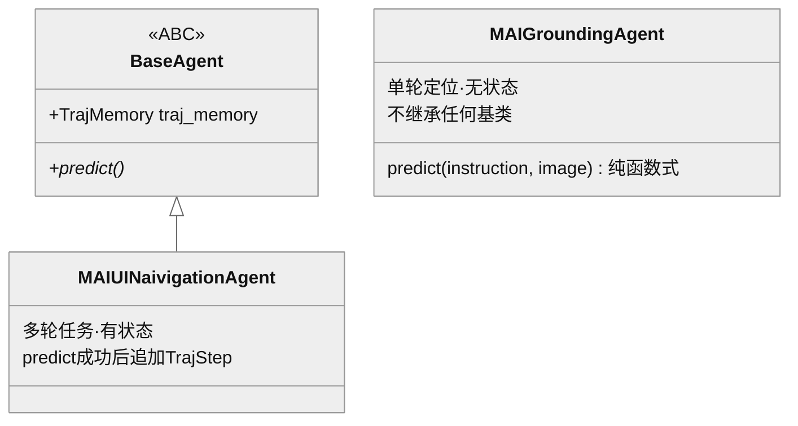

> **提炼自**：Tongyi-MAI mai-ui 双 Agent 设计复盘 —— 继承只表达生命周期承诺，不表达能力域相似

# 生命周期差异化继承（Lifecycle-Differentiated Inheritance）

## 模式类型

架构模式（类层级设计 / 有状态-无状态分治 / Agent 生命周期）

## 成熟度

L1 已验证（1 次验证：2026-08-29 Tongyi-MAI mai-ui 源码学习，33 项 Grep 符号验证）

## 适用场景

同一系统内并存多个"能力相似但生命周期不同"的组件，需要决定类层级：

- Agent 家族中部分成员无状态（单轮调用）、部分有状态（多轮记忆）
- 插件/处理器家族中有的无实例状态（纯函数）、有的持有会话/缓存/连接
- 服务层组件：无状态查询 vs 有状态会话管理

## 问题背景

类层级设计最常见的两种失败：

1. **按能力域强统基类**：两个组件同属一个模型家族/能力域（直觉上"应该"共享基类），强行抽出一个公共父类——无状态的一方被迫实现一堆与己无关的生命周期方法，产出空实现。
2. **反向污染**：为"复用"把有状态成员的记忆/会话字段塞进公共基类，无状态成员从此背上永不使用的状态初始化与销毁成本。

根本矛盾：**继承的语义是"共享生命周期承诺"，而人的直觉是"共享能力域"**——两者经常不重合。

## 核心设计

三原则：

1. **继承决策由生命周期差异驱动**：有状态（多轮 + 轨迹记忆）→ 继承携带状态初始化的基类（`BaseAgent.__init__` 统一建 `self.traj_memory = TrajMemory(...)`）；无状态（单轮）→ **有意不继承**，保持纯函数式调用（`predict(instruction, image)` 直接收 PIL 图，消息仅 system + 单条 user）。
2. **"不继承"是设计信号而非缺陷**：无状态成员游离在类层级之外，本身就是"此组件无生命周期可言"的文档化声明；强行纳入只会产生空实现。
3. **签名差异即任务差异**：`predict` 签名不同（单图 vs 多轮轨迹）是任务模型差异的诚实表达，不做签名统一。

## 实施要点

| 维度 | 做法 | mai-ui 实例 |
|---|---|---|
| 基类职责 | 只承载生命周期共享物（状态初始化、公共流程钩子） | `BaseAgent(ABC)` 的 `__init__` 初始化 `traj_memory`（F-009） |
| 有状态成员 | 继承基类，状态变更走统一写入点 | navigation 每次成功后构造 `TrajStep` 追加进 `traj_memory`（F-033） |
| 无状态成员 | 不继承，纯函数式接口，消息结构最简 | `class MAIGroundingAgent:` 无基类（F-019）；system + 单条 user、无历史图像逻辑（F-022） |
| 状态初始化 | 收敛在基类构造器，不散落 | 记忆对象只在 `BaseAgent.__init__` 创建 |
| 贯穿性拼写签名 | 跨文件一致的异常拼写是检索签名，原样保留并记录 | 类名 `MAIUINaivigationAgent`（"Naivigation"）贯穿 README/源码/notebook（F-005/F-050） |

## 不适用场景与反目标用户

### 不适用场景

- ❌ **成员间生命周期真实一致**：若家族成员全有状态（或全无状态），正常继承/平铺即可，本模式无用武之地。
- ❌ **需要多态分发**：调用方必须用统一接口遍历异构成员（注册表、工厂、插件加载器）时，多态需求压倒生命周期纯度——此时应抽**接口**而非实现基类（无状态成员实现接口、生命周期方法给默认空实现并显式文档化）。
- ❌ **状态本应外置的系统**：若"状态"本可外置为独立存储（外部会话库），成员都可无状态化后再统一——先考虑重组，再考虑分层继承。

### 反目标用户

- 追求"类图美观对称"的设计洁癖者：本模式接受的类层级天然不对称。
- 以继承深度为复用指标的团队：本模式鼓励浅继承甚至零继承。

## 反模式

### 反模式1："同家族所以共享基类"

按能力域相似性（同模型家族、同插件类型）推定继承关系。**正确做法**：先问"两者的状态与生命周期是否相同"，相同才共享基类；mai-ui 的 grounding/navigation 同属一个模型家族却分层级之外/之内两端。

### 反模式2："为统一而统一的空实现"

强行让无状态成员继承有状态基类，override 一堆空方法或 `pass` 占位。后果：接口撒谎（看似有生命周期实则没有），调用方误判可重入性。**正确做法**：无状态成员游离于类层级之外，或仅实现纯接口。

### 反模式3："给无状态组件塞生命周期状态"

为"以后可能有多轮"预埋记忆字段。后果：YAGNI + 每次调用背状态管理成本 + 语义混乱（单轮 Agent 却有 traj_memory）。**正确做法**：状态随生命周期需求引入，需求出现时再迁移层级。

### 反模式4："状态初始化散落在子类"

各子类自行创建记忆/会话对象。后果：初始化时机与配置漂移、遗漏即运行期错误。**正确做法**：基类构造器统一初始化生命周期共享物。

### 反模式5："顺手纠正贯穿性拼写签名"

发现类名/标识符拼写异常（如 `Naivigation`）就当笔误修正。后果：README/源码/notebook/外部引用全面失配，检索断链。**正确做法**：先验证拼写是否跨文件一致——一致即为检索签名，原样保留并在文档登记"非笔误待修"。

## 失败案例

### 案例：按"共享基类"先验检索类层级未果（mai-ui 源码学习，2026-08-29）

**背景**：R 阶段初期按"同一模型家族的 Agent 共享基类"的直觉预期，先检索 `MAIGroundingAgent(BaseAgent)` 形式的定义。

**发现过程**：grounding Agent 的定义是 `class MAIGroundingAgent:`（无基类，F-019），与其形成对照的是 navigation Agent `class MAIUINaivigationAgent(BaseAgent)`（F-026）。回读两 Agent 的 predict 签名与消息构造（F-020/F-022 vs F-032/F-033）后确认：单轮定位无历史可言，多轮导航才需要 TrajMemory——类层级与生命周期严格同构，直觉预期被源码证据推翻。同轮还遇到两个"看似待修实为签名"的现状：类名拼写 `Naivigation` 贯穿 README/源码/notebook 标题（F-005/F-050）、navigation 类 docstring 名为 "MAIMobileAgent" 与类名不一致（F-026）——均按"代码现状原样登记"处理，未做任何"纠正"。

**教训**：类层级的检索路径应从"实际 class 定义语句"出发而非从"预期继承关系"出发；异常拼写与名实不一致必须先做跨文件一致性验证再定性——这正是上游工作流"Grep 级 API 验证"在类层级维度的体现。

## 早期预警信号

| 预警信号 | 可能问题 | 建议行动 |
|---|---|---|
| 基类中存在空实现/`pass` 方法且有子类只 override 空实现 | 强行统一的占位继承（反模式2） | 拆分：无状态成员退出继承或仅实现接口 |
| 无状态组件的构造器里有永不读取的状态字段 | 状态预埋污染（反模式3） | 删除字段，状态引入推迟到多轮需求出现 |
| 各子类重复创建同类记忆/会话对象 | 状态初始化散落（反模式4） | 上提到基类 `__init__` 统一初始化 |
| 文档/教程把家族成员画成对称类图而源码不对称 | 文档美化掩盖设计信号 | 按源码实况重画，显式标注"不继承"的设计意图 |
| 标识符拼写异常只出现在单一文件 | 真笔误 | 修复并全链路 Grep 确认 |
| 标识符拼写异常贯穿 README/源码/notebook | 贯穿性检索签名（反模式5） | 原样保留，文档登记"非笔误待修" |

## 实际案例

Tongyi-MAI mai-ui 双 Agent（2026-08-29 源码学习）：

| 维度 | grounding Agent | navigation Agent |
|---|---|---|
| 类层级 | `class MAIGroundingAgent:` 无基类（F-019） | `class MAIUINaivigationAgent(BaseAgent)`（F-026） |
| 状态 | 无状态，单轮 | 继承即获得 `traj_memory`（F-009），成功后追加 `TrajStep`（F-033） |
| predict 签名 | `predict(instruction, image)` 单图直传 PIL（F-020） | 多轮，带轨迹历史（F-032） |
| 消息结构 | system + 单条 user，无历史图像逻辑（F-022） | 文本全量回放 + 图像滑窗（洞察3） |
| 选型含义 | 单元素定位 | 多步任务 |

## 迁移验证

- **可迁移场景**：聊天机器人家族（FAQ 单轮 vs 会话助理多轮）；数据处理管道（无状态 transform 函数 vs 有状态聚合器）；测试组件（纯断言函数 vs 带 fixture 生命周期的测试类）。
- **先例关联**：与 [io-boundary-pure-function-core.md](./io-boundary-pure-function-core.md) 同源——无状态成员的纯函数式 predict 即"纯函数核心"在 Agent 接口层的投影；有状态成员的状态写入点收敛与"IO 边界"纪律互补。

## 与其他模式的关系

| 关系模式 | 关系类型 | 说明 |
|---|---|---|
| [lifecycle-protocol-three-phase.md](./lifecycle-protocol-three-phase.md) | 互补 | 该模式定义单个 Agent 的生命周期（感知/决策/执行）；本模式决定多个 Agent 之间"谁配拥有生命周期"的类层级表达 |
| [io-boundary-pure-function-core.md](./io-boundary-pure-function-core.md) | 同源思想 | 无状态成员 = 纯函数核心（零副作用、可离线单测），有状态成员 = IO/状态边界 |
| [multi-agent-closed-loop-execution.md](./multi-agent-closed-loop-execution.md) | 场景区分 | 该模式解决"异构 Agent 编排执行"；本模式解决"异构 Agent 的类层级组织"，可叠加使用 |
| [graph-first-agent-architecture.md](./graph-first-agent-architecture.md) | 上层架构 | 图优先架构中的节点实现可分别套用有状态/无状态两种成员形态 |

<!-- changelog -->
- 2026-08-29 | pattern | 初始创建：从 Tongyi-MAI mai-ui 源码学习（洞察2）萃取；证据链 F-005/F-009/F-019/F-020/F-022/F-026/F-032/F-033/F-050，33 项 Grep 符号验证通过
