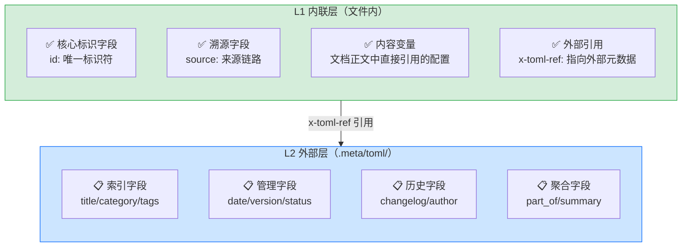

# 元数据分层模式：核心标识内联 + 复杂元数据外部化

## 模式概述

在文档/配置文件的元数据设计中，采用"核心标识字段内联存储、复杂索引元数据外部化"的双层架构：将阅读和解析时必需的核心字段直接保留在文件头部，将标签、变更日志、分类、版本等描述性/索引相关元数据存储在外部镜像目录中，通过相对路径引用关联。

这一模式解决了"元数据膨胀导致文件头部臃肿、嵌套缩进难以维护、程序化解析可靠性差"的问题，同时保持了人读体验和机器可解析性的平衡。

## 问题现象

在纯Markdown或纯配置文件方案中，元数据管理面临两难困境：

1. **全内联方案（全部字段放frontmatter）**：
   - 文件头部臃肿，一个frontmatter可能占20-50行
   - 多行缩进嵌套（tags数组、changelog列表）容易写错
   - 批量修改元数据（如统一更新tags）需要打开每个文件
   - 程序化解析复杂嵌套结构容易出错
   - 阅读正文前需要翻阅大量元数据，体验差

2. **全外部方案（所有元数据放外部文件）**：
   - 单独看一个文件无法知道它的id和来源，可移植性差
   - 移动文件时需要同时修改多个地方的路径引用
   - 没有核心标识，外部索引损坏时文件成为"孤儿"
   - 快速浏览时无法获取关键信息

3. **混合方案无明确边界**：
   - 不同人凭感觉决定哪些字段放哪里，风格不统一
   - 没有判断标准，代码评审时无法判断合规性
   - 元数据散落在多处，工具难以可靠解析

## 解决方案

采用"内容-元数据二分法"作为分层判断标准，建立清晰的职责边界：



### 核心判断标准

一个字段应该放在内联层（YAML）还是外部层（TOML），只需要问一个问题：

> **"这个字段是文档'内容的一部分'，还是'关于文档的描述信息'？"**

- 如果是**内容的一部分**（阅读正文时需要、解析时立即需要、文档正文中直接引用）→ **内联YAML**
- 如果是**关于文档的描述**（用于索引、分类、搜索、历史追溯，阅读正文时不需要）→ **外部TOML**

### 文件结构规范

**Markdown文件内YAML frontmatter（扁平、无嵌套）**：
```yaml
---
id: "document-unique-id"
source: "external: 不存在-path/to/source.md#section-anchor"
name: "content-level-config"  # 仅当是内容一部分时
x-toml-ref: "../../.meta/toml/path/to/file.toml"
---
```

**外部TOML元数据文件（镜像目录结构）**：
```
.meta/toml/
└── <mirror of project path>/
    └── <filename>.toml
```

TOML文件内容：
```toml
title = "文档标题"
category = "classification"
tags = ["tag1", "tag2", "tag3"]
date = "2026-07-02"
version = "1.0.0"
status = "stable"
changelog = [
  "2026-07-02 | initial | 初始版本",
  "2026-07-02 | docs | 补充说明"
]
```

### 目录镜像规则

外部元数据文件的路径必须镜像原文件的项目内路径：

| 原文件 | 外部元数据文件 |
|--------|---------------|
| `.agents/rules/example.md` | `.meta/toml/.agents/rules/example.toml` |
| `docs/knowledge/learning/01-syntax.md` | `.meta/toml/docs/knowledge/learning/01-syntax.toml` |
| `README.md` | `.meta/toml/README.toml` |

镜像路径的好处：
1. 从原文件路径可以1:1推导出元数据路径，无需搜索
2. 移动/重命名文件时，元数据文件可以同步移动
3. 工具可以自动发现和验证元数据存在性

## 适用场景

- ✅ **Markdown文档frontmatter管理**：本项目已验证，29个文档统一迁移成功
- ✅ **配置文件分层设计**：核心配置内联，环境特定配置外部化
- ✅ **代码注释元数据**：核心注解保留在代码中，详细元数据外部存储
- ✅ **API定义文件**：接口路径/方法内联，详细描述/示例/变更历史外部化
- ✅ **插件/扩展清单**：核心id/入口点内联，分类/标签/兼容性元数据外部化

**不适用场景**：
- ❌ 单文件自包含分发场景（需要发送单个文件给别人时）
- ❌ 元数据极少（<3个字段）的简单文件（过度设计）
- ❌ 二进制文件或不支持头部注释的文件格式

## 实际案例

### 案例1：MyST技术研究报告frontmatter统一

**问题**：29个Markdown文件的frontmatter格式不统一，部分使用TOML `+++`，部分使用复杂嵌套YAML，tags/changelog/version等字段随意放置，维护困难。

**应用模式**：
- YAML仅保留`id`、`source`、`x-toml-ref`三个核心字段，扁平无嵌套
- `tags`、`changelog`、`category`、`date`、`version`等全部移至`.meta/toml/`镜像目录
- 提供5种文档类型的模板（索引页、章节页、学习资料、规则页、特殊配置页）
- 提供深度参考表，帮助快速计算x-toml-ref相对路径层级

**效果**：
- frontmatter平均从15-20行缩减到3-5行
- 消除了多行缩进嵌套的语法错误
- 批量更新tags等元数据无需打开原文件
- 链接验证脚本可以统一检查x-toml-ref引用有效性

### 案例2：Submodule元数据外置

本项目的`submodule-metadata-externalization`模式是本模式在Git子模块场景的一个特定应用：
- 核心引用（gitlink）保留在submodule位置
- 元数据（用途、版本、许可证）移至submodule目录外的vendor/根目录
- 解决了submodule目录内创建主项目文件导致的dirty状态问题

### 案例3：原子化文档批量创建的frontmatter模板化（MDI研究报告实践）

**场景**：将819行的长文档原子化为8个独立章节文件时，每个文件都需要遵循四字段flat结构（id/title/source/x-toml-ref）。

**实践经验**：批量创建结构高度一致的原子文件时，frontmatter应优先做成模板或脚本自动生成：
1. 模板中预置固定字段顺序：id→title→source→x-toml-ref
2. 脚本根据文件路径自动计算x-toml-ref相对路径（配合depth-reference-table模式）
3. source字段从父文档自动继承，无需手动填写
4. 避免人工重复编写相同结构，减少格式错误

**效果**：8个原子文件frontmatter格式100%统一，路径计算全部正确（配合fix-x-toml-ref.py脚本）。

## 反模式

### 反模式1：YAML中多行缩进嵌套数组

```yaml
---
# ❌ 反模式：多行缩进tags数组
tags:
  -   - "myst"
  -   - "directives"
  -   - "roles"
changelog:
  -   - "2026-07-02 + initial + 初始版本"
  -   - "2026-07-02 + expanded + 新增内容"
---
```

**为什么错**：多行缩进容易写错（缩进对齐错误）、增加diff噪声、阅读正文前需要翻阅大量元数据。

**正确写法**：这些字段移至外部TOML文件，YAML中删除。

### 反模式2：所有字段都放外部，id也不保留

```yaml
---
# ❌ 反模式：空frontmatter，没有核心标识
x-toml-ref: "../../.meta/toml/..."
---
```

**为什么错**：单独看这个文件不知道它是谁，可移植性差；外部元数据丢失后文件成为无法识别的孤儿。

**正确写法**：必须保留`id`字段作为文件的唯一标识。

### 反模式3：正文中引用的配置放外部TOML

```yaml
---
id: "mcp-server-example"
# ❌ 反模式：name/version是文档内容演示的一部分，放外部导致正文无法直接引用
x-toml-ref: "..."
---
# MCP Server
name: {name}  # 无法直接引用
version: {version}
```

**为什么错**：MCP Server示例中的name/version是文档内容的一部分（读者需要看到配置示例），放外部后正文中无法直接展示，破坏了文档的自包含性。

**正确写法**：`name`、`version`、`description`等**内容配置字段**保留在YAML中，它们是内容的一部分。

## 与其他模式的关系

| 相关模式 | 关系 | 说明 |
|---------|------|------|
| submodule-metadata-externalization | 特化→泛化 | submodule元数据外置是本模式在Git子模块场景的特定应用 |
| depth-reference-table | 互补 | 本模式解决"放哪里"的问题，深度参考表解决"路径怎么算"的问题 |
| dual-interface-repository | 思想同源 | 都是"核心界面保持简洁，扩展能力外置"的架构思想 |
| cross-platform-encoding-enforcement | 配套 | Git提交中文信息时需要配合编码强制模式 |

## 边界与选型

### 什么时候应该用内联而不是外部化？

满足以下任一条件时字段保留内联：
1. 文档正文直接引用该字段的值
2. 该字段是文件存在的核心标识（如id）
3. 没有该字段，单独的文件就失去了意义（如source溯源链路）
4. 该字段是内容示例/配置演示的一部分

### 什么时候必须外部化？

满足以下任一条件时字段必须外部化：
1. 字段值是多行数组/嵌套对象（如tags数组、changelog列表）
2. 字段仅用于索引/搜索/分类，阅读正文时不需要看到
3. 该字段会被批量更新/聚合统计（如批量更新category）
4. 字段包含长文本描述（如summary、changelog条目）

### 简单标签数组的灵活处理

对于非常短的简单标签数组（2-3个短英文标签），允许例外内联为`tags: ["a", "b"]`。但如果满足以下任一条件则必须外部化：
- 标签数量 > 3个
- 标签包含中文
- 标签是长描述性文本
- 预计会频繁批量调整标签
