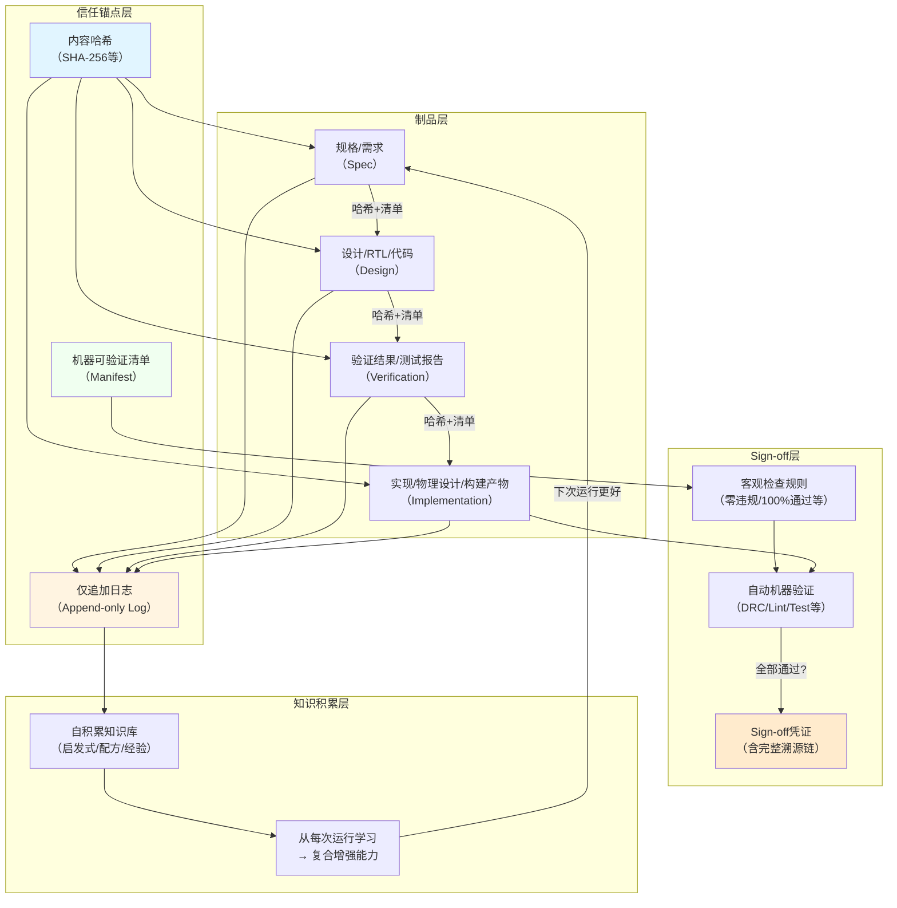

> **来源**：Agentrys AI多智能体芯片设计工作流洞察萃取（2026-07-28）——AgentCore芯片Sign-off阶段溯源清单与知识库设计分析
> **验证次数**：1次实战验证（ASAP7 7.5T工艺上AgentCore芯片100%路由完成率、零违规Sign-off）

# 溯源驱动信任：无人值守系统的机器可验证信任基础设施

## 模式概述

在设计无人值守、长时程运行的自主系统时，**信任基础不能建立在"智能体说自己做对了"之上，而必须建立在不可篡改的溯源链（Provenance Chain）和机器可验证的客观标准之上**。本模式通过三大核心机制构建信任基础设施：(1) 每个产出物附带内容校验码的机器可读溯源清单；(2) 所有决策和动作记录在仅追加（append-only）的不可篡改事件日志中；(3) 持续积累的知识库让系统从每次运行中学习并复合增强能力。Sign-off不是"智能体声明完成"，而是"所有机器可检查的客观指标全部通过"并自动生成可审计的凭证。目标函数与收敛机制解耦——编排器不需要理解具体任务逻辑，只需要维护溯源、治理迭代、根据目标评分决策，从而实现跨领域通用。

## 核心命题

| 信任基础 | 可信程度 | 可审计性 | 无人值守适用性 | 典型问题 |
|---------|---------|---------|--------------|---------|
| **机器可验证溯源（本模式）** | 高（基于密码学校验+客观指标） | 完整可追溯、可复现 | ✅ 适用——零信任，只信证据 | 每个制品有哈希、每个决策有日志、每个Sign-off是机器检查的客观状态 |
| **模型自我声明** | 极低（幻觉、自信地说错话） | 无——"我做对了"无法验证 | ❌ 完全不适用 | "测试通过了"但实际没跑测试；"修复了"但实际没改代码 |
| **人类在环审批** | 中（依赖人仔细看） | 依赖审批记录完整性 | ❌ 不适用——无人值守就是要去掉人 | 人看漏了、疲劳了、被误导签字通过 |
| **日志但可篡改** | 低（事后可以改日志掩盖错误） | 有但不可信——日志可以被篡改 | ⚠️ 风险高 | 出错后删除/修改日志，查无对证 |

**核心洞察**：人们通常认为"让智能体更聪明、更可靠"是无人值守的关键，但Agentrys证明：**长时程自主的信任基础不是模型能力，而是不可篡改的溯源链和可机器验证的制品**。没有人类在环时，"智能体自己说做对了"毫无价值——唯一可信的是：(1) 内容校验码证明制品完整性未被篡改；(2) 仅追加日志证明所有决策动作可审计；(3) 机器可检查的客观指标作为Sign-off标准，而非主观判断。溯源系统的价值不是"事后追责"，而是"运行时信任锚"——它让后续阶段智能体可以无条件信任上游制品，因为有校验和清单背书。

## 问题现象：无溯源系统的典型信任缺陷

1. **"智能体说过了"综合征**：Sign-off依赖智能体的自然语言声明（"我已经完成验证，所有测试通过"），没有机器可验证的证据
2. **制品无完整性校验**：上游产出的代码/文档/设计被下游消费时，无法验证是否被篡改、是否完整、是否是预期版本
3. **日志可删除篡改**：出错后可以修改/删除日志掩盖错误，没有不可篡改的审计轨迹
4. **每次从零开始**：系统不积累历史经验，同一个问题每次运行都重新踩坑，没有知识库复合增长
5. **Sign-off标准主观**："看起来没问题"、"代码质量不错"等主观判断作为完成标准，机器无法自动检查
6. **目标与机制耦合**：编排器硬编码了特定任务逻辑（如"芯片设计应该怎么做"），无法跨领域复用，换个任务就要重写整个系统
7. **信任传递断裂**：下游智能体无法信任上游制品，必须重复验证所有东西，效率极低且容易遗漏

## Agentrys实战案例：AgentCore芯片溯源体系

| 要素 | 内容 |
|------|------|
| 溯源清单 | 每个声明都有带校验码（checksum）的机器可读清单中的制品支撑 |
| 事件日志 | 仅追加（append-only）日志，记录每个智能体的每个决策和动作，不可删除篡改 |
| 设计文档 | 实时更新的设计文档，与制品版本绑定，可追溯到每个决策点 |
| 知识库 | 持续维护的设计知识库：微架构配方、工具特定特性、PPA收敛启发式、Sign-off经验 |
| Sign-off标准 | 机器可验证的客观指标：零路由DRC违规、零天线违规、100%路由完成率 |
| Sign-off凭证 | 自动生成溯源清单附带所有校验码、测试结果、指标数据，作为交付凭证 |
| 目标无关性 | 编排器不感知制品类型（是芯片还是软件），本次优化XLOPS/W，换为延迟/面积/其他指标收敛机制不变 |
| 自积累特性 | 工作流长期运行反复执行，每次运行为学习机会，系统能力随时间复合增强 |
| 结果 | 数小时到数天无人值守运行，零DRC/天线违规，可交付的通过Sign-off的芯片设计 |

### 信任基础设施架构

## 反模式：什么时候"相信智能体"实际上是信任灾难

| 反模式做法 | 看起来 | 实际上 | 芯片设计案例 | 软件工程类比 |
|-----------|--------|--------|-------------|-------------|
| **"智能体说完成了"就Sign-off** | "高效，不用等验证，相信AI的能力" | 幻觉+自信地说错话是LLM的固有特性，没有证据的声明毫无价值 | Agent说"DRC全部通过"但实际根本没跑DRC检查→ 流片后发现大量违规，损失数百万 | Agent说"测试全部通过"但实际测试代码有bug根本没执行→ 上线后出故障 |
| **日志可修改可删除** | "灵活，方便清理调试信息，节省空间" | 出错后可以篡改日志掩盖错误，审计时查无对证，问题根因永远找不到 | 后端优化出错后删除失败迭代的日志→ 无法分析为什么PPA不达标，下次继续踩同样的坑 | 生产事故后删除错误日志→ 无法定位根因，写不出真正的postmortem，事故反复发生 |
| **制品无内容校验码** | "内部系统不用搞这么复杂，能跑就行" | 制品可能被意外篡改、磁盘损坏、版本搞错，下游用了错误的输入还不知道 | 综合后的网表被意外覆盖成旧版本→ 后端基于旧网表优化，Sign-off时才发现不一致 | 构建时依赖被篡改→ 产出带后门的二进制，但CI全绿没人发现 |
| **每次从零开始不积累** | "通用人工智能应该每次都能解决问题，不需要记忆" | 同一个坑每次运行都踩，相同的错误反复犯，能力无法复合增长 | 每次运行都重新发现"某个标准单元库在某个条件下有bug"→ 浪费大量迭代预算 | 代码审查每次都指出同样的问题→ 不把规则写进linter，永远靠人记 |
| **Sign-off标准主观模糊** | "灵活判断，不僵化，相信工程师/Agent的判断" | 不同人/不同时间判断标准不一致，无法自动验证，必须有人在环 | "时序看起来差不多了"就Sign-off→ 流片后时序不收敛，芯片跑不到目标频率 | "代码review过了"就merge→ 没有强制门禁，人看漏了bug就进去了 |
| **目标硬编码进编排器** | "针对性优化，性能更好，更智能" | 换个任务/目标就要重写整个系统，编排器无法跨领域复用，通用性为零 | 编排器硬编码了"芯片PPA优化应该怎么做"→ 同样的架构无法用来做软件/文档/其他任务 | CI/CD系统硬编码了"Java项目应该怎么构建"→ 换Python/Go就要重写整个流水线 |
| **信任靠"熟人关系"** | "这个Agent之前表现好，这次它说过了就信它" | 历史表现不代表这次正确，一次幻觉就足以导致整个流程失败 | 前端Agent一直表现很好→ 这次它说RTL没问题就不重跑验证→ 实际上有bug流片失败 | 这个开发者之前提交质量高→ 他的代码不用review直接merge→ 引入严重bug |

## 原则与规则

### 规则1：每个制品必须附带内容校验码，成为溯源清单的一部分

- 每个产出物（需求文档、设计稿、代码、测试报告、构建产物、配置文件）在生成时立即计算内容哈希校验码（如SHA-256）
- 生成机器可读的溯源清单（Manifest）：列出所有输入制品的哈希+版本、本制品的哈希+生成时间+生成者（哪个Agent/工具）、所有参数和配置
- 下游消费制品时**首先校验哈希**：哈希不匹配立即显式报错（配合[显式报错模式](../methodology-patterns/governance-strategy/fail-loud-over-silent-fallback.md)），绝不继续
- 清单本身也要有哈希，清单的哈希进入上一级清单，形成哈希链——任何一环被篡改都能被发现

### 规则2：所有事件日志采用仅追加（append-only）存储，不可篡改删除

- 每个智能体的每个决策、每个动作、每个工具调用、每个中间结果全部记录到日志
- 日志只能追加写入，禁止修改和删除——使用append-only文件、WAL（Write-Ahead Log）、或区块链式的链式哈希结构
- 每条日志条目包含：时间戳、Agent ID、动作类型、输入哈希、输出哈希、决策理由（自然语言）、评分/结果
- 日志本身也要定期哈希校验，防止磁盘损坏或意外篡改
- 日志不是"调试用的"，而是**信任基础设施的核心**——它让任何结果都可以事后审计、复现、归因

### 规则3：Sign-off标准必须全部机器可验证，禁止主观判断

- 每个阶段的完成标准必须是机器可检查的客观指标：零lint错误、测试通过率100%、构建成功、DRC零违规、性能指标≥X、覆盖率≥Y%
- 禁止"看起来没问题"、"代码质量不错"、"差不多了"这类主观判断作为通过标准
- Sign-off时自动运行所有检查，全部通过后自动生成Sign-off凭证：包含所有检查结果、所有制品哈希、溯源清单、时间戳
- 凭证是不可篡改的文档，本身有哈希，作为交付物的一部分——不是"Agent说过了"，而是"这台机器检查过了，所有客观条件满足"

### 规则4：目标函数与收敛机制解耦，编排器保持制品无关性

- 编排器/工作流引擎**不内置任何特定任务逻辑**：它不需要理解芯片设计，也不需要理解软件工程
- 引擎只负责四件事：(1) 分层委派任务；(2) 执行有界迭代预算治理（配合[有界迭代预算模式](../methodology-patterns/governance-strategy/bounded-iteration-budget.md)）；(3) 维护溯源链和日志；(4) 接收目标函数的评分反馈，决定下一步动作
- **目标函数是用户的事，收敛机制是平台的事**：用户传入可量化的目标函数（PPA/W、代码覆盖率、bug数量、延迟、成本等），引擎负责根据反馈搜索最优解
- 顶层编排器不感知制品类型：不区分是写RTL还是写代码还是写文档，只管理子系统委派和流程控制——这是架构能跨领域通用的关键

### 规则5：建立带置信度的自积累知识库，支持纠错与衰减防止错误复合增长

- 每次运行的经验（什么做法有效、什么坑要避开、什么参数组合好、什么工具在什么条件下有问题）自动沉淀到知识库
- 知识库条目包含：触发场景、有效做法/反模式、证据（指向那次运行的哪个日志条目）、效果数据、**置信度评分**
- 置信度动态调整机制：
  - 新条目初始置信度0.5（待验证）
  - 每次成功复现+0.1（上限0.95）
  - 每次失败复现-0.2（下限0.1）
  - 连续3次失败复现→条目标记为"已证伪"，自动归档不再推荐
- 时间衰减机制：超过90天未被验证复现的条目置信度自动乘以0.8，防止过时经验误导
- 负反馈闭环：当知识库推荐的做法导致失败时，自动记录失败案例并降低对应条目置信度，不是只记录成功经验
- 人工审核入口：高风险场景（生产bug修复、芯片Sign-off相关）的知识条目必须经过人工审核置信度才能提升到0.8以上
- 知识库本身也要溯源：每条知识有来源（哪次运行、哪个迭代、结果如何、置信度变化历史），可验证可追溯，不是凭空写的规则
- 能力复合增长：运行次数越多，高置信度知识越丰富，系统越强，收敛越快，消耗预算越少——形成正向循环；同时通过置信度和纠错机制防止错误知识复合增长

### 规则6：信任是传递的，但需要可验证的背书

- 下游智能体可以**信任**上游制品，但这种信任是基于溯源清单和校验码的，不是基于"我认识上游Agent"
- 信任传递规则：如果制品A有有效Sign-off凭证且哈希匹配，那么消费A的下游阶段不需要重新验证A本身，只需要验证自己的输出
- 跨阶段修改时信任重置：如果回溯修改了上游制品（配合有界迭代预算模式的跨阶段反馈），所有下游的Sign-off凭证全部失效，必须重验证
- 零信任原则：在哈希校验通过之前，不相信任何东西——不管是哪个Agent生成的、不管它之前表现多好

### 规则7：验证工具自身必须纳入溯源体系，检查工具版本与可信度

- **"机器可验证"≠"绝对可信"**：验证工具（DRC检查器、测试框架、Lint、编译器、哈希算法）本身可能有bug、漏报、或被破解，整个信任链的根必须包括工具自身的可信度
- 每个检查工具在溯源清单中必须记录：工具名称、精确版本号、工具二进制哈希、配置文件哈希、规则集版本——确保相同版本+相同配置+相同输入才能复现相同结果
- 工具版本变更必须触发全量重验证：升级DRC工具、更新Lint规则集、更换编译器版本后，之前的Sign-off凭证全部失效，必须重跑所有检查
- 多工具交叉验证高风险阶段：硬错误检查（如Sign-off级DRC、生产部署前测试）至少使用2个独立工具/独立版本交叉验证，单一工具漏报风险由冗余覆盖
- 哈希算法 agility：支持配置哈希算法（SHA-256/BLAKE3等），定期评估算法安全性，发现漏洞时支持平滑迁移而无需重构整个溯源体系
- 已知问题黑名单：维护工具已知bug/漏报列表，当使用存在已知问题的工具版本时，必须额外增加人工审核或补充检查步骤

## 实现检查清单

在设计无人值守自主系统时，检查：

- [ ] 每个制品生成时是否计算了内容哈希校验码？
- [ ] 是否有机器可读的溯源清单列出所有输入/输出的哈希和元数据？
- [ ] 下游消费前是否先校验哈希，不匹配立即报错？
- [ ] 所有事件日志是否是仅追加（append-only）的，不可修改删除？
- [ ] 每条日志是否包含时间戳、主体、输入输出哈希、决策理由、结果？
- [ ] 日志本身是否有完整性校验，防止篡改？
- [ ] 每个阶段的Sign-off标准是否都是机器可验证的客观指标？
- [ ] Sign-off是否自动运行所有检查，通过后生成带溯源的凭证？
- [ ] 验证工具自身的名称、版本、二进制哈希是否也在溯源清单中？
- [ ] 工具版本/配置变更后是否自动触发全量重验证？
- [ ] 高风险阶段是否使用多工具交叉验证？
- [ ] 编排器是否与具体任务逻辑解耦，不硬编码特定领域知识？
- [ ] 目标函数是否作为参数传入，引擎只负责治理和收敛？
- [ ] 是否有带置信度的自积累知识库，支持纠错和衰减机制？
- [ ] 知识条目是否有来源证据、置信度评分、可验证可追溯？
- [ ] 信任传递是否基于凭证而非"熟人关系"？
- [ ] 跨阶段修改后是否自动重验证所有下游，重置信任链？

## 与其他模式的关系

| 关联模式 | 关系 | 说明 |
|---------|------|------|
| [multi-agent-closed-loop-execution.md](multi-agent-closed-loop-execution.md) | 基础支撑 | 闭环执行模式的思考链（agents_thoughts）持久化、动作结果反馈是本模式事件日志的一个具体来源；闭环执行的每个动作都需要被溯源记录，每个决策的理由都需要进入仅追加日志。本模式为闭环执行提供跨运行的长期记忆基础。 |
| [bounded-iteration-budget.md](../methodology-patterns/governance-strategy/bounded-iteration-budget.md) | 互相依赖 | 有界迭代预算的每次迭代历史、跨阶段修改记录、熔断审计信息需要溯源系统保证完整性和不可篡改性；溯源系统的Sign-off检查结果为预算熔断决策提供客观依据（"是否通过所有检查"）。两者一起构成"有界+可信"的长时程自主治理基础设施：有界迭代预算确保流程收敛不无限跑，溯源驱动信任确保结果可审计可信赖。 |
| [fail-loud-over-silent-fallback.md](../methodology-patterns/governance-strategy/fail-loud-over-silent-fallback.md) | 思想同源+具体应用 | "显式报错优于静默降级"是本模式的核心思想之一：哈希校验失败必须立即报错，Sign-off检查不通过必须显式标记失败，绝不静默跳过或降级处理。溯源系统如果静默接受哈希不匹配的制品，整个信任基础就崩塌了。 |
| [metadata-layering.md](metadata-layering.md) | 架构互补 | 元数据分层模式为本模式的溯源清单提供分层架构指导：制品内容层、元数据层、溯源层、凭证层分层设计，每层有独立的哈希和签名。 |
| [triple-entry-design.md](triple-entry-design.md) | 设计思想借鉴 | 三式记账法的"不可篡改+多方验证+冗余记录"思想与本模式的仅追加日志+哈希链+多重复核对位同源：三式记账是金融领域的信任基础设施设计，本模式是自主系统领域的信任基础设施设计。 |
| [git-hooks-three-tier-trust.md](../methodology-patterns/tools-automation/git-hooks-three-tier-trust.md) | 领域特例 | Git hooks三级信任是本模式在代码版本控制场景的一个具体实现：pre-commit/push/receive三级检查、签名验证、不可篡改历史是溯源驱动信任在Git工作流中的体现。本模式是更通用的架构原则，三级信任是其在SCM领域的应用。 |

## 推广场景

本模式适用于所有需要无人值守、结果可审计、信任可传递的自主系统，不限于芯片/EDA领域：

| 推广场景 | 无信任基础设施的问题 | 溯源驱动信任的做法 |
|---------|---------------------|-------------------|
| **AI辅助软件工程（SpecWeave类系统）** | Agent说"测试通过了"但实际没跑；代码被意外篡改没人发现；每次从零开始不积累经验；review标准主观无法门禁 | 每个代码/文档/测试报告生成时算哈希；所有Agent决策和工具调用写入append-only日志；CI门禁全部是机器可检查指标（测试100%通过、零lint错误、构建成功）；通过后自动生成带溯源的Sign-off凭证；每次代码审查发现的问题自动沉淀到linter规则知识库；编排器与具体语言/任务解耦，支持代码/文档/配置等任意制品类型 |
| **DevOps与CI/CD流水线** | 构建产物被篡改无从发现；部署失败后日志被删查无对证；"测试过了"但实际哪个测试、什么版本测的不清楚；流水线硬编码特定语言无法复用 | 每个构建产物附带SBOM（软件物料清单）+哈希；所有构建/部署步骤日志append-only写入持久存储；发布门禁是机器可验证的（测试通过率、漏洞扫描零高危、性能达标）；发布凭证包含完整溯源链（从代码commit哈希到构建日志到测试结果）；CI引擎与语言解耦，通过插件支持任意构建工具 |
| **自动化内容生成与审核** | AI生成内容说"事实准确"但实际有幻觉；生成历史可删除无法追溯；"审核通过"是主观判断无法复现；每次生成不积累风格/事实知识 | 每个生成内容片段有哈希；所有prompt/模型版本/生成参数/审核结果写入append-only日志；审核标准机器可验证（事实核查API、敏感词检测、原创度检测、格式合规）；审核通过凭证包含所有溯源信息；好的生成风格/准确事实自动沉淀到知识库，下次生成优先使用 |
| **自动化测试与Fuzzing** | 说"发现了N个bug"但没有PoC无法复现；崩溃日志可删除；"测试覆盖了"但具体覆盖了哪些行不清楚；每次Fuzzing从零开始不积累语料 | 每个崩溃/失败附带输入PoC+哈希+完整栈追溯；所有Fuzzing执行日志append-only记录；覆盖率是机器可精确度量的（不是"差不多覆盖了"）；发现的bug自动加入回归测试用例库；有趣的语料/触发路径自动沉淀到语料库，下次Fuzzing从更好的起点开始 |
| **供应链安全与SLSA框架** | 依赖被篡改无从发现；构建过程可被篡改；"可信供应商"是主观判断没有证据；出了问题无法追溯 | SLSA（Supply-chain Levels for Software Artifacts）框架正是本模式在供应链领域的标准化应用：每个制品有出处（provenance）、构建过程可重现、哈希签名验证、仅追加日志、机器可验证的构建要求——本模式是SLSA背后的通用架构原则。 |
| **AI辅助法律/合规文档生成** | AI说"合同条款合规"但实际有风险；修改历史被删除无法追溯；"审核过了"是律师主观判断；每次审查不积累条款风险知识库 | 每个文档版本有哈希；所有修改/审查意见/决策理由写入append-only审计日志；合规检查是规则引擎机器可验证的（哪些条款必须有、哪些禁止出现、管辖法律适用）；审查通过凭证附带所有检查结果；历史上发现的风险条款/合规问题自动沉淀到知识库，下次自动识别 |

### 迁移示例详解：AI辅助代码审查与自动修复系统

以SpecWeave类AI代码审查/自动修复系统为例，详细说明如何应用本模式：

1. **制品与哈希校验**：
   - 每个PR提交时，自动计算所有变更文件的SHA-256哈希
   - 生成溯源清单：包含base commit哈希、PR作者、变更文件列表+哈希、CI配置版本、使用的Agent模型版本
   - 下游Agent（审查者、修复者）开始工作前**首先校验哈希**：如果文件内容变了（比如有人force push），立即停止并报错

2. **仅追加事件日志**：
   - 记录所有事件：哪个Agent什么时候看了什么文件、提出了什么评论、为什么认为这是个bug、生成了什么patch、跑了哪些测试
   - 日志append-only写入对象存储，有独立的哈希链——即使开发者删除PR评论，日志里的记录依然存在可审计
   - 每条日志有：时间戳、Agent ID、输入哈希、输出哈希、决策自然语言理由、结果评分

3. **机器可验证Sign-off**：
   - "代码审查通过"不是Agent说"我看过了没问题"，而是：所有机器门禁全部通过（单元测试通过率100%、零lint错误、零安全漏洞、覆盖率不下降、构建成功）+ Agent审查意见为"approve"（Agent意见只是其中一项，不是全部）
   - 自动生成Merge凭证：包含所有门禁结果、所有文件哈希、所有审查意见、日志位置哈希、时间戳
   - Merge凭证本身有哈希，进入main分支的commit history，未来任何时候可以验证"这次merge当时满足了所有条件"

4. **目标-机制解耦**：
   - 工作流引擎不硬编码"Python代码应该怎么审查"或"JavaScript项目怎么构建"
   - 引擎提供通用能力：任务委派、迭代预算（比如自动修复最多试5次）、溯源维护、门禁检查
   - 目标函数可配置：可以是"零bug"（权重最高）、可以是"性能提升5%"、可以是"代码风格统一"、可以是加权多目标——引擎不关心目标是什么，只根据评分反馈优化

5. **自积累知识库**：
   - 每次审查发现的bug、每次修复的patch、每次CI失败的原因自动沉淀到知识库
   - 比如"这类空指针异常在Java项目中常见，对应修复模式是XXX"、"这个linter规则在我们代码库中误报率30%，可以降级"
   - 下次审查类似代码时，Agent先查知识库，优先推荐历史上有效的修复模式，避免重复踩坑
   - 知识库条目有来源：指向哪次PR、哪个Agent、修复效果如何（修复后测试是否全过、后续有没有回滚）——不是凭空写的规则

6. **信任传递**：
   - 如果上游"代码生成"阶段有有效Sign-off凭证且哈希匹配，下游审查阶段不需要重新验证代码是否能编译（只需要做审查）
   - 如果审查阶段提出修改建议，代码被修改后，所有下游门禁（编译、测试、安全扫描）必须重跑，之前的凭证全部失效
   - 不因为"这个Agent之前审查准确率99%"就跳过任何检查——零信任，只信哈希和机器检查结果

## Changelog

- 2026-07-28 | revise | 对抗性审查修正：(1)扩展规则5为带置信度的知识库，增加置信度动态调整、时间衰减、负反馈闭环、人工审核机制；(2)新增规则7验证工具自身溯源与可信度校验（工具版本哈希、多工具交叉验证、算法agility、已知问题黑名单）；(3)更新实现检查清单
- 2026-07-28 | create | 初始版本，从Agentrys AI芯片设计工作流洞察3+洞察4提炼，L1成熟度
