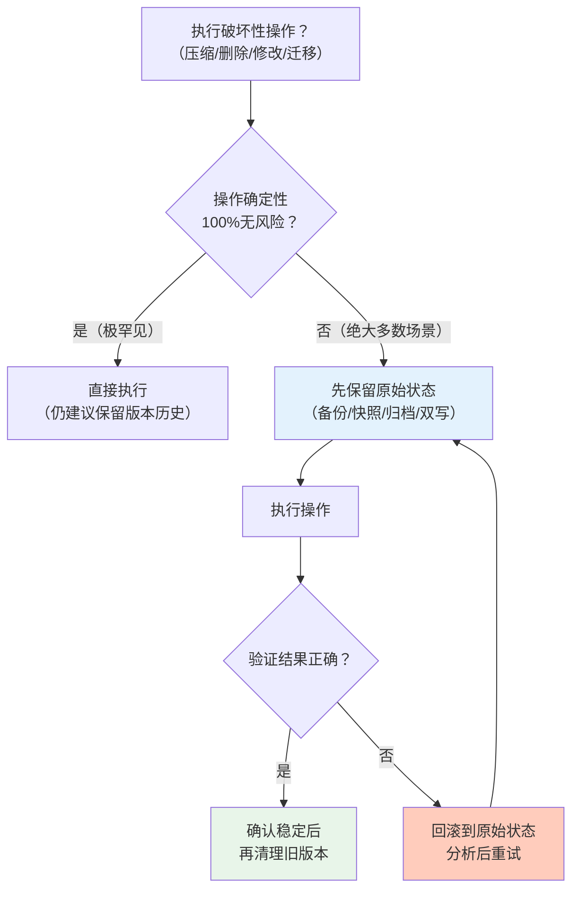

> **提炼自**：6个独立案例（Headroom CCR可逆压缩、写时复制COW、数据生命周期冷归档、旧系统双轨并行、大文件操作备份、渐进式接口扩展）

# 可逆性保障模式（Reversibility Guarantee / Preserve Rollback Capability）

## 模式类型

架构模式 / 设计原则（风险控制/安全网/系统稳健性）

## 成熟度

L2 已验证（6次验证来源：2026-08 Headroom CCR压缩、2026-06 COW写时复制、2026-07 数据冷归档、2026-06 双轨迁移、2026-07 大文件操作备份、2026-07 渐进式接口扩展）

## 适用场景

任何涉及信息压缩、数据清理、系统改造、配置变更、破坏性操作的场景。核心判断标准：**如果操作错误或结果不符合预期，是否还能恢复到之前的状态？**

| 场景 | 适用度 | 可逆设计的具体形式 |
|------|--------|------------------|
| 信息压缩/摘要/聚合 | ✅✅✅ 核心场景 | 保留原始数据，压缩结果可还原（如Headroom CCR） |
| 数据删除/清理 | ✅✅✅ 核心场景 | 软删除/回收站/冷归档，而非物理删除 |
| 系统迁移/重构/升级 | ✅✅✅ 核心场景 | 双轨并行、功能开关、可回滚部署 |
| 文件批量修改/替换 | ✅✅✅ 核心场景 | 操作前备份原文件，失败可恢复 |
| 配置变更/参数调优 | ✅✅ 推荐 | 版本化配置，保留历史版本可一键回退 |
| 数据库Schema迁移 | ✅✅ 推荐 | 升级+回滚脚本双写，迁移前备份 |
| API/接口变更 | ✅✅ 推荐 | 渐进式扩展，旧接口不立即删除 |
| 不可逆操作（如加密哈希） | ❌ 不适用 | 哈希本身不可逆，但仍可备份原始数据 |
| 经过充分验证的确定性操作 | ⚠️ 酌情 | 简单确定操作可降低可逆要求，但仍建议保留历史 |

## 问题背景

在追求效率/简洁/成本优化时，人们倾向于直接丢弃"不需要"的数据或旧版本，但这在不确定性场景下是危险的：

1. **信息损失不可逆**：一旦原始数据被删除/覆盖，无法从压缩结果/摘要/新版本中恢复
2. **判断可能错误**：你以为"不需要了"的信息，可能在后续被发现是关键的
3. **新方案可能有缺陷**：压缩算法/迁移方案/新接口在上线后才发现质量问题，但旧数据/旧版本已被删除
4. **回滚成本指数级高于备份成本**：保留原始数据的存储成本很低，但数据丢失后的重建/修复成本极高（10x-100x）

经典反例：
- 传统摘要式上下文压缩：直接丢弃"不重要"的token，后续需要细节时永久丢失
- 大爆炸式系统迁移：一次性切换到新系统，出问题无法快速回滚
- 批量SearchReplace不备份：替换错了无法恢复原始文件
- 硬删除数据：DELETE FROM 无WHERE条件或误删后无法恢复

## 核心原则：永远保留后悔权

可逆性保障的核心原则很简单：**在不确定场景下，永远保留回溯到操作前状态的能力。**



**与不可逆设计的对比**：

| 维度 | 不可逆设计（丢弃式） | 可逆设计（保留回溯） |
|------|-------------------|-------------------|
| **短期效率** | 高（一步到位，无需备份） | 稍低（需额外存储/步骤保留原始） |
| **长期稳健性** | 低（出错即永久损失） | 高（有后悔权，可回滚） |
| **错误成本** | 极高（重建/修复/解释） | 极低（回滚到备份即可） |
| **心理负担** | 高（操作时必须100%确认正确） | 低（可以先试，错了回滚） |
| **存储成本** | 低 | 稍高（保留原始+压缩双份） |
| **适用场景** | 确定性极高、验证充分的简单操作 | 所有不确定场景、生产环境、复杂操作 |

**核心权衡**：可逆设计用少量的存储/计算开销，换取巨大的稳健性和错误恢复能力。在存储成本指数下降的今天，这个trade-off几乎总是值得的。

## 核心做法：可逆设计四层级

根据场景的风险等级和可逆成本，选择合适层级的可逆保障：

### L1：备份/快照级（最简单、最通用）

操作前先备份原始状态，出问题直接恢复：

| 场景 | 备份方式 | 示例 |
|------|---------|------|
| 批量文件修改 | 操作前复制到备份目录/`.temp/` | SearchReplace > 50行前先备份 |
| 数据库操作 | 事务+备份/快照 | DELETE前先SELECT确认，迁移前全量备份 |
| 配置修改 | 保留配置文件版本历史 | 改配置前git commit，改坏了直接checkout |
| 代码重构 | Git分支+原子提交 | 每个小步一个commit，随时可revert |

```bash
# ❌ 错误做法：直接修改，无备份
sed -i 's/old/new/g' config.json

# ✅ 正确做法：先备份，再修改
cp config.json config.json.bak
sed -i 's/old/new/g' config.json
# 验证...如果错了：cp config.json.bak config.json
```

参考模式：[path-discipline.md 回滚备份规则](../methodology-patterns/tools-automation/path-discipline.md)

### L2：版本化/双写级（在线系统推荐）

新旧版本同时存在一段时间，验证新系统稳定后再下线旧版本：

| 场景 | 双写方式 | 示例 |
|------|---------|------|
| API迁移 | 旧接口保留，新接口并行 | 新增v2接口，v1标记deprecated但不立即删除 |
| 数据存储 | 新旧存储双写 | 迁移期间同时写旧库和新库，读走旧库 |
| 功能发布 | 功能开关（Feature Flag） | 新功能通过开关控制，出问题一键关闭 |
| 配置变更 | 灰度发布 | 先1%流量验证，逐步扩大，有问题立即回滚 |

```python
# ❌ 错误做法：直接替换旧接口
def get_user(user_id):
    return new_v2_api(user_id)  # v1直接删了，出问题全挂

# ✅ 正确做法：渐进式迁移，旧接口保留过渡期
def get_user(user_id, use_v2=False):
    if use_v2:
        result = new_v2_api(user_id)
        # 双读验证：v1和v2结果对比
        old_result = old_v1_api(user_id)
        if result != old_result:
            log.warning("v2 result mismatch, falling back to v1")
            return old_result
        return result
    return old_v1_api(user_id)  # v1保留直到v2完全验证
```

参考模式：[legacy-integration-dual-track.md](legacy-integration-dual-track.md)、[progressive-interface-extension.md](../code-patterns/progressive-interface-extension.md)

### L3：写时复制/不可变级（最高安全）

原始数据永远不可变，修改时创建副本而非覆盖：

| 场景 | COW方式 | 示例 |
|------|---------|------|
| 内存/数据结构修改 | 写时复制（Copy-on-Write） | 修改前先复制，修改副本不影响原始 |
| Git版本控制 | Immutable commits | 每次提交都是新对象，历史永不修改 |
| 函数式编程 | 纯函数+不可变数据 | 数据变换产生新值，不修改输入 |
| 事件溯源 | 事件日志不可变 | 所有操作追加到日志，状态可重建 |

```cpp
// ❌ 错误做法：直接修改原数据，旧值丢失
void cpu_data() {
    modify(this->data);  // 原数据被覆盖，无法恢复
}

// ✅ 正确做法：写时复制，修改前先复制
const T* cpu_data() const { return this->data; }  // const版本不触发复制
T* cpu_mutable_data() {
    if (!this->copied) {
        this->data = copy(this->original);  // 首次修改才复制
        this->copied = true;
    }
    return this->data;
}
```

参考模式：[const-cow-trigger.md](../code-patterns/const-cow-trigger.md)

### L4：可逆变换级（压缩/转换场景专用）

变换操作本身是可逆的，原始信息完整保留在变换结果中或可从旁路检索：

| 场景 | 可逆方式 | 示例 |
|------|---------|------|
| 上下文压缩 | CCR机制（压缩版+原文冷存） | Headroom：压缩结果常驻，原文本地存档按需检索 |
| 数据聚合 | 保留原始明细 | 聚合结果+原始明细归档，可下钻 |
| 序列化 | 选择可逆序列化格式 | Protobuf/JSON可逆；哈希/有损压缩不可逆，需旁路存原数据 |
| 代码编译 | 保留源码+source map | 编译产物可通过source map映射回源码 |

```
Headroom CCR机制（L4可逆压缩的典型实现）：
┌─────────────────────────────────────────────────────┐
│  原始上下文（10144 tokens）                          │
│  ├─ 压缩 → 热数据（1260 tokens，常驻上下文窗口）      │
│  └─ 存档 → 冷数据（本地SQLite+向量库，按需检索）      │
│                                                      │
│  需要细节时：从冷存储检索原始片段 → 注入上下文         │
│  永远保留"后悔权"：压缩不会导致信息永久丢失            │
└─────────────────────────────────────────────────────┘
```

参考模式：[data-lifecycle-economic-stratification.md](data-lifecycle-economic-stratification.md)

## 反模式

| 反模式 | 为什么错误 | 正确做法 |
|--------|----------|---------|
| 为了"节省空间"直接删除原始数据 | 存储成本极低（<0.01元/GB/月），数据丢失重建成本极高；你永远不知道什么时候会需要被删除的细节 | 至少保留到新方案验证稳定后，再归档到冷存储（成本几乎为零） |
| 大爆炸式切换（一次性替换） | 新方案必然有未发现的bug，一次性切换出问题无法快速回滚，影响所有用户 | 双轨并行+灰度发布+功能开关，可随时切回旧方案 |
| 修改前不备份（"就改一个字/一行/一个参数"） | 简单任务最容易因手滑/路径错/编码错导致意外覆盖，且没有备份的损失和复杂任务一样大 | 简单改动用L1备份（git commit/临时复制），10秒成本避免30分钟返工 |
| 验证完立即清理旧版本 | 很多问题在验证阶段不会暴露，上线后几小时/几天才发现；立刻清理旧版本会让回滚变得困难 | 旧版本保留至少1-2个发布周期（或按数据生命周期分层），确认稳定后再归档/清理 |
| 不可逆操作不做旁路存档 | 有些操作本身不可逆（如加密哈希、有损压缩），但这不能成为不保留原始数据的理由 | 哈希前保存原文到旁路存储；有损压缩前保留原始文件冷归档 |
| 回滚方案只写在文档里不演练 | 回滚方案没演练过等于没有——真正出问题时才发现回滚脚本有bug、权限不够、流程不清楚 | 定期演练回滚流程（如生产发布前/每季度回滚演练） |
| 功能开关永久保留 | 双轨并行的旧版本/功能开关如果永久不清理，技术债越积越多，系统复杂度爆炸 | 新方案验证稳定后有计划地清理旧版本，设置开关的过期时间 |

参考风险提醒：[simple-task-high-risk.md](../methodology-patterns/governance-strategy/simple-task-high-risk.md)

## 检验标准

做完之后怎么知道做对了？

1. **回滚可执行**：如果新方案出问题，能在可接受时间内（如5分钟内）回到之前的状态
2. **数据不丢失**：无论操作结果如何，原始数据都能完整恢复（不要求立即在线，但至少冷归档可检索）
3. **有演练记录**：回滚方案不是纸上谈兵，至少实际演练过一次（或灰度切换证明可行）
4. **备份已验证**：备份文件不是空的/损坏的——备份后应验证备份可正常恢复
5. **清理有计划**：旧版本/备份不会永久保留增加复杂度，有明确的清理时间表
6. **代价可接受**：可逆设计带来的额外存储/性能开销在可接受范围内（一般<10%）

## 跨场景迁移示例

| 应用场景 | 可逆设计方式 | 回滚方式 |
|---------|------------|---------|
| **AI上下文压缩** | L4：压缩版+原文冷存档（CCR） | 需要细节时从冷存储检索原文 |
| **Git版本控制** | L3：不可变commits，每次修改都是新对象 | git revert/git reset回到任意历史版本 |
| **数据库迁移** | L1+L2：迁移前备份+双写过渡期 | 备份恢复或回滚脚本 |
| **生产发布** | L2：功能开关+灰度+保留旧版本镜像 | 关闭开关/一键回滚到上一版本 |
| **文件批量修改** | L1：修改前备份到.temp/ | 从备份恢复原始文件 |
| **API接口升级** | L2：旧接口保留，渐进式迁移 | 流量切回旧接口即可 |
| **内存数据修改** | L3：写时复制（COW） | 保持原始数据不变，丢弃副本即可 |
| **数据清理/归档** | L1+L4：热数据删除前先归档冷存储 | 需要时从冷存储取回 |
| **配置变更** | L1：配置版本化+原子提交 | git checkout回到历史配置 |
| **代码重构** | L1：小步原子commit+特性分支 | git revert坏commit |

## 实际案例

### 案例1：Headroom CCR可逆压缩（本模式直接来源）

- **问题**：传统摘要式压缩直接丢弃"不重要"的token，一旦压缩错误或需要细节，原始信息永久丢失
- **方案**：CCR（Compress-Cache-Retrieve）机制——压缩结果作为热数据常驻上下文窗口，原始上下文完整存档在本地SQLite+向量库，需要时按需检索还原
- **效果**：10144→1260 tokens（87.6%压缩率）同时保留完整回溯能力；压缩质量问题可通过检索原文补救
- **教训**：信息压缩不等于信息丢弃——可逆压缩在效率和稳健性之间取得了更好的平衡

### 案例2：写时复制（COW）触发机制

- **问题**：直接修改const语义下的数据会导致隐式副作用，调用方以为拿到的是只读数据但实际被修改了，难以追踪bug
- **方案**：`const cpu_data()` 不触发复制，只有调用 `cpu_mutable_data()` 请求写权限时才复制原始数据
- **效果**：既保证了性能（只读路径零开销），又保证了安全性（写路径不破坏原始数据）；编译期开关可一键切回旧路径
- **教训**：修改前先复制是最安全的做法，关键是在性能和安全之间找到平衡点（延迟复制到真正需要时）

### 案例3：数据生命周期经济分层

- **问题**：为"节省成本"直接删除旧数据，或为"安全"全部存高性能存储（成本高昂）
- **方案**：热/温/冷/冰四层分层——热数据常驻内存/SSD追求速度，冷数据归档到低成本存储（不删除，只是访问慢一点）
- **效果**：存储成本下降60-80%，同时任何历史数据都可回溯（只是冷数据需要主动查询，不参与实时检索）
- **教训**："不删除"不等于"全放高性能存储"——冷归档用极低的成本保留了回溯能力

### 案例4：旧系统双轨并行迁移

- **问题**：大爆炸式切换到新AI平台，出现问题无法快速定位是哪个组件改坏了，回滚需要撤销全部工作
- **方案**：双轨并行——新旧系统同时运行，逐个接口切换，每个接口独立可灰度、可回滚
- **效果**：迁移风险大幅降低，每个接口切换是独立原子操作，出问题只影响单个接口
- **教训**：系统迁移不能跳"中间步骤"，双轨并行看似"冗余"但提供了关键的安全网

### 案例5：大文件SearchReplace回滚备份

- **问题**：多轮SearchReplace不备份，替换出错后原始文件内容丢失，无法恢复
- **方案**：>50行的SearchReplace操作前，在`.temp/`保存原始文件副本
- **效果**：替换错误时可从备份快速恢复，重新操作
- **教训**：操作前备份是最朴素也最有效的可逆保障——简单但不能省略

### 案例6：渐进式接口扩展

- **问题**：一次性修改接口签名，所有调用方必须同时修改，稍有遗漏就编译失败；回滚需要同时回滚接口和所有调用方
- **方案**：新增方法而非修改旧方法——旧方法保持不变标记deprecated，新方法独立添加，调用方逐个迁移
- **效果**：每批次独立原子commit，出问题可独立回滚；新旧接口可共存多个版本周期
- **教训**：接口设计的"开闭原则"本质上就是可逆性保障——对扩展开放，对修改关闭

## 与其他模式的关系

| 关联模式 | 关系类型 | 关系说明 |
|---------|---------|---------|
| [legacy-integration-dual-track.md](legacy-integration-dual-track.md) | L2实例应用 | 双轨并行是可逆设计在系统迁移场景的具体L2实现 |
| [const-cow-trigger.md](../code-patterns/const-cow-trigger.md) | L3实例应用 | 写时复制是可逆设计在代码/内存层面的L3实现 |
| [data-lifecycle-economic-stratification.md](data-lifecycle-economic-stratification.md) | L4实例应用 | 冷热分层是可逆设计在数据存储层面的L4实现（冷归档=不删除的备份） |
| [progressive-interface-extension.md](../code-patterns/progressive-interface-extension.md) | L2实例应用 | 渐进式接口扩展是可逆设计在API演进场景的L2实现 |
| [phased-incremental-optimization.md](../methodology-patterns/governance-strategy/phased-incremental-optimization.md) | 理念一致 | 分阶段增量优化的核心安全保障就是每步可回滚——可逆性是渐进式优化的前提 |
| [three-layer-separation-progressive-migration.md](../methodology-patterns/tools-automation/three-layer-separation-progressive-migration.md) | 理念一致 | 三层分离渐进式迁移的"每阶段独立可回滚"是可逆设计在迁移工程的具体应用 |
| [defensive-programming-first-principles.md](../methodology-patterns/governance-strategy/defensive-programming-first-principles.md) | 底层原则 | 防御式编程的操作原子性原则（要么事务回滚要么幂等）是可逆设计的编程基础 |
| [path-discipline.md](../methodology-patterns/tools-automation/path-discipline.md) | L1实例应用 | 路径纪律的回滚备份规则是可逆设计在文件操作场景的L1实现 |
| [fail-loud-over-silent-fallback.md](../methodology-patterns/governance-strategy/fail-loud-over-silent-fallback.md) | 互补关系 | 显式报错快速发现问题+可逆设计保障问题可回滚，两者结合形成完整安全网 |

## Changelog

- 2026-08-03 | create | 初始版本，从Headroom CCR可逆压缩洞察+5个历史案例沉淀，L2成熟度，6次验证实例
