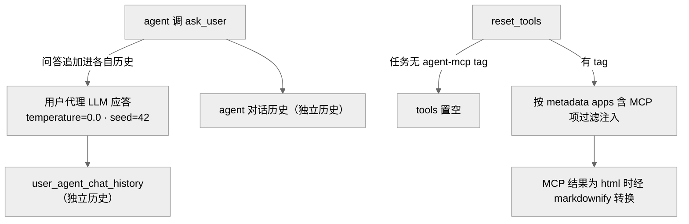

> **提炼自**：Tongyi-MAI mobile-world 评测环境复盘 —— 评测态"用户"由确定性 LLM 代理冒充（温度 0 + seed 42 + 独立历史），MCP 工具按任务元数据白名单过滤注入

# 模拟用户与按需工具注入（Simulated User & Conditional Tool Injection）

## 模式类型

架构模式（评测交互设计 / 工具能力治理 / 人机通道分离）

## 成熟度

L1 已验证（1 次验证：2026-08-29 Tongyi-MAI mobile-world 源码学习）

## 适用场景

交互式 Agent 评测中，"人"与"工具"两个不确定因素需要被确定性化：

- 评测任务包含 ask_user 类交互，真人应答不可复现、不可规模化
- 工具（如 MCP 远端服务）只应对声明了相应能力的任务生效，而非全量注入
- 调试通道需要保留真人应答与完整工具，评测通道需要可复现与最小能力

## 问题背景

评测交互设计的两种失败：

1. **真人守着答题**：ask_user 由人工应答跑评测——应答内容因人因时而异，分数不可复现，成本高到无法规模化。
2. **工具全量注入**：所有任务无差别挂载全部 MCP 服务——提示词被无关工具污染，无任务越权获得能力，评测结果不可比。

根本矛盾：**交互真实性要求"像人"、评测有效性要求"可复现"**——真人最像人但最不可复现；而"工具多=能力强"的直觉与"任务能力边界应显式声明"的评测纪律相冲突。

## 核心设计

三原则：

1. **"人"被替换为可配置的确定性 LLM 用户代理**：评测态 ask_user 由独立用户代理应答（`user_agent_answer_question`，F-051），应答参数 `temperature=0.0`、`seed=42`（F-064）；`user_sys_prompt` 注入任务 goal 与 `"Today is {self.current_date}"`——背景相关性与时间锚点由环境而非模型自由发挥（F-062）。
2. **双方独立对话历史，配置独立且可回落**：问答追加进 `user_agent_chat_history`，与 agent 历史完全分离（F-051）——计费与审计分开；无显式配置时 `ModelConfig(model_name=os.getenv("USER_AGENT_MODEL", "gpt-4o-mini"))` 回落默认（F-062）。
3. **工具默认置空 + 白名单注入，人工通道仅留调试**：任务无 `"agent-mcp"` tag 则 `reset_tools` 置空 tools，有则按 metadata apps 含 `"MCP"` 项取 `app.split("-")[-1]` 过滤（F-048）；MCP 服务固定 5 个远端（amap/stockstar 走 DashScope SSE，gitHub/jina/arXiv 走 ModelScope HTTP，F-052）；MCP 结果以 `<!DOCTYPE html>` 开头时经 markdownify 转换（F-048）；`input()` 人工应答仅存在于 test 子命令通道（F-040）。

## 实施要点

| 维度 | 做法 | mobile-world 实例 |
|---|---|---|
| 交互开关 | 两组开关显式改变任务集合 | `--enable-user-interaction` / `--enable-mcp`：`get_suite_task_list` 按 `"agent-mcp"`/`"agent-user-interaction"` tag 过滤（F-047） |
| 用户代理配置 | 零配置回落 + 环境变量覆盖 | `ModelConfig(model_name=os.getenv("USER_AGENT_MODEL", "gpt-4o-mini"))`，user_sys_prompt 含 goal 与当天日期（F-062） |
| 确定性三件套 | 温度 0 + 固定 seed + 独立历史 | 应答参数 `temperature=0.0, ..., seed=42`（F-064）；问答追加进 `user_agent_chat_history`（F-051） |
| 工具注入 | 默认置空 + tag/apps 白名单 | 任务无 `"agent-mcp"` tag 置空 tools；有则按 metadata apps 含 "MCP" 过滤（F-048） |
| 结果清洗 | HTML 转 Markdown 再入上下文 | MCP 结果以 `<!DOCTYPE html>` 开头经 markdownify 转换（F-048） |
| 工具目录 | 固定远端服务清单 | `MCP_CONFIG` 5 项：amap/stockstar（DashScope SSE）+ gitHub/jina/arXiv（ModelScope HTTP）（F-052） |
| 密钥管理 | 服务商双 key 显式声明 | DASHSCOPE/MODELSCOPE 双 key（F-076/F-025） |
| 人工通道 | 仅调试保留 | `_ask_user_interactive` 用 `input()`，仅 test 子命令（F-040） |

## 不适用场景与反目标用户

### 不适用场景

- ❌ **产品形态就是人机协作**：真实用户在环是需求本身（客服质检、人在环标注），确定性模拟反而抹掉被测变量。
- ❌ **评测目标是"拟人度"**：若被测对象正是用户代理的自然度，温度 0 + seed 42 的确定性设定与目标相悖。
- ❌ **任务能力边界无法用元数据声明**：tag/apps 字段缺失或不可信时，白名单过滤失去依据——先补元数据治理。

### 反目标用户

- 追求"用户代理越聪明越好"的团队：用户代理是环境的一部分，不是被测对象，越确定越好。
- 把工具挂载数量当能力指标的团队：本模式认为默认置空才是纪律。

### 适用边界与前提条件

- 评测可复现性优先于交互真实性（两者冲突时选前者）。
- 任务元数据含可靠的 tag/apps 字段（F-047/F-048 的过滤以元数据可信为前提）。
- 用户代理模型配置（USER_AGENT_MODEL 等）显式可记录——复现分数必须注明（F-062）。
- MCP 服务商与密钥双 key（DASHSCOPE/MODELSCOPE，F-076/F-025）在评测环境预先就绪。

## 反模式

### 反模式1："评测里真人守着答题"

ask_user 由人工应答跑评测。后果：不可复现、成本高、无法规模化。**正确做法**：评测态用确定性用户代理（temperature=0.0 + seed=42，F-064），人工通道仅留 test 子命令（F-040）。

### 反模式2："用户代理与 agent 共享对话历史"

偷懒共用一个 history。后果：角色混乱、上下文互相泄漏，审计无法区分两方。**正确做法**：独立 `user_agent_chat_history`（F-051）。

### 反模式3："工具全量注入"

所有任务挂载全部 MCP 服务。后果：提示词污染、无任务越权获得能力、评测结果不可比。**正确做法**：默认置空，按 tag/apps 白名单过滤（F-048）。

### 反模式4："无 tag 任务默认带工具"

把"没说禁"当"允许"。后果：无 `"agent-mcp"` tag 的任务意外获得工具，分数与带工具任务不可比。**正确做法**：无 tag 即置空（F-048），能力扩张必须显式声明。

### 反模式5："agent 自写交互回执"

让 agent 负责把用户回答/MCP 结果写进自己的轨迹。后果：字段来源不可信，单仓库看不出完整回路。**正确做法**：`TrajStep` 的 ask_user_response/mcp_response 由外部 runtime 回填（[MUI] F-033 + [MW] F-038 观测键含 `ask_user_response`），agent 与"用户"各持独立历史。

### 反模式6："MCP 结果原样透传"

HTML 全文直接塞给模型。后果：上下文爆炸、模型读不懂结构化页面。**正确做法**：以 `<!DOCTYPE html>` 开头的结果经 markdownify 转换（F-048）。

## 失败案例

### 案例：按"人工在环"先验追踪 ask_user 回路，跨仓对齐后才见全貌（mobile-world 源码学习，2026-08-29）

**背景**：看到 ask_user 工具名与"用户交互"开关时，按"人工在环（human-in-the-loop）"的直觉预期，寻找等待真人输入的阻塞逻辑。

**发现过程**：评测态 ask_user 实际调 `user_agent_answer_question`（F-051），应答方是 `temperature=0.0`、`seed=42` 的独立用户代理 LLM（F-064），`user_sys_prompt` 注入任务 goal 与 `"Today is {self.current_date}"`，无配置时回落 gpt-4o-mini（F-062）；`input()` 人工应答仅存在于 test 子命令通道（F-040）。进一步追踪 `TrajStep` 的 ask_user_response/mcp_response 字段时发现其由外部 runtime 回填而非 agent 自写（[MUI] F-033 + [MW] F-038 观测键含 `ask_user_response`）——单看任一仓库都看不出完整回路，跨仓对齐后"用户代理应答 → runtime 回填轨迹"的闭环才成立。

**教训**：接口命名（ask_user）不等于运行时语义——评测组件的完整回路必须跨仓库对齐观测键与轨迹字段后才能定性；"人"这一最不可复现的变量被有意替换为确定性 LLM，是评测纪律对交互直觉的胜利而非妥协。

## 早期预警信号

| 预警信号 | 可能问题 | 建议行动 |
|---|---|---|
| 评测分数随时间或执行人员波动 | 用户应答不确定性未消除 | 用户代理 temperature=0.0 + seed=42（F-064）并记录模型配置（F-062） |
| 两方上下文互相串话、角色混乱 | 共享对话历史（反模式2） | 独立 `user_agent_chat_history`（F-051） |
| 账单无法区分 agent 与"用户"花费 | 历史与调用未分离审计 | 双方独立历史 + 独立 ModelConfig（F-051/F-062） |
| 无 MCP tag 的任务也带了工具 | 默认作用域未收窄（反模式4） | 无 `"agent-mcp"` tag 即置空 tools（F-048） |
| 模型上下文被工具结果撑爆 | HTML 原样透传（反模式6） | DOCTYPE 开头结果经 markdownify 转换（F-048） |
| 轨迹里 ask_user_response 来源不明 | 字段由 agent 自写或缺失（反模式5） | 外部 runtime 回填（[MUI] F-033 + [MW] F-038） |
| 复现分数对不齐 | 用户代理模型配置未记录 | 注明 `USER_AGENT_MODEL` 等配置后再复跑（F-062） |

## 实际案例

Tongyi-MAI mobile-world 交互与工具注入（2026-08-29 源码学习）：

| 维度 | 评测态默认 | 实例 |
|---|---|---|
| ask_user 应答方 | 确定性用户代理 LLM | `user_agent_answer_question`（F-051）、`temperature=0.0`/`seed=42`（F-064） |
| 用户代理配置 | 零配置回落 + 环境变量覆盖 | `os.getenv("USER_AGENT_MODEL", "gpt-4o-mini")`、sys prompt 含 goal 与当天日期（F-062） |
| 对话历史 | 双方独立 | 问答追加进 `user_agent_chat_history`（F-051） |
| 工具注入 | 默认置空 + tag/apps 白名单 | `reset_tools` 按 `"agent-mcp"` tag 与 metadata apps 过滤（F-048） |
| 工具目录 | 固定远端服务 | `MCP_CONFIG` 5 项：amap/stockstar（DashScope SSE）+ gitHub/jina/arXiv（ModelScope HTTP）（F-052） |
| 人工通道 | 仅调试保留 | `_ask_user_interactive` 用 `input()`，仅 test 子命令（F-040） |

## 迁移验证

- **可迁移场景**：对话系统评测（确定性模拟用户替代真人应答）；RAG 评测按用例注入检索工具（默认无工具、按用例白名单开启）；游戏/仿真中的 NPC 化用户行为（固定 seed 的脚本化"玩家"）。
- **先例关联**：与 [default-scope-explicit-expansion.md](./default-scope-explicit-expansion.md) 同构——tools 默认置空、按 tag/apps 显式扩张（F-048）是该模式"默认作用域 + 显式扩张"在工具能力维度的投影；与 [zero-config-core-enhancement.md](./zero-config-core-enhancement.md) 互补——用户代理配置零成本回落（F-062）。

## 与其他模式的关系

| 关系模式 | 关系类型 | 说明 |
|---|---|---|
| [default-scope-explicit-expansion.md](./default-scope-explicit-expansion.md) | 同构思想 | 无 tag 即置空、有 tag 按白名单扩张（F-048）是"默认作用域 + 显式扩张"在工具注入层的实现 |
| [zero-config-core-enhancement.md](./zero-config-core-enhancement.md) | 互补 | 用户代理零配置回落 `USER_AGENT_MODEL`/gpt-4o-mini（F-062），评测开箱即跑 |
| [multi-agent-closed-loop-execution.md](./multi-agent-closed-loop-execution.md) | 闭环配套 | ask_user_response/mcp_response 由外部 runtime 回填（[MUI] F-033 + [MW] F-038），保证轨迹闭环字段来源可信 |
| [lifecycle-differentiated-inheritance.md](./lifecycle-differentiated-inheritance.md) | 同源源码束 | 同批 Tongyi-MAI 学习产物；用户代理与 agent 状态隔离与该模式"状态写入点收敛"的纪律互补 |

<!-- changelog -->
- 2026-08-29 | pattern | 初始创建：从 Tongyi-MAI mobile-world 源码学习（洞察5）萃取；证据链 F-025/F-040/F-047/F-048/F-051/F-052/F-062/F-064/F-076，交叉引用 [MUI] F-033