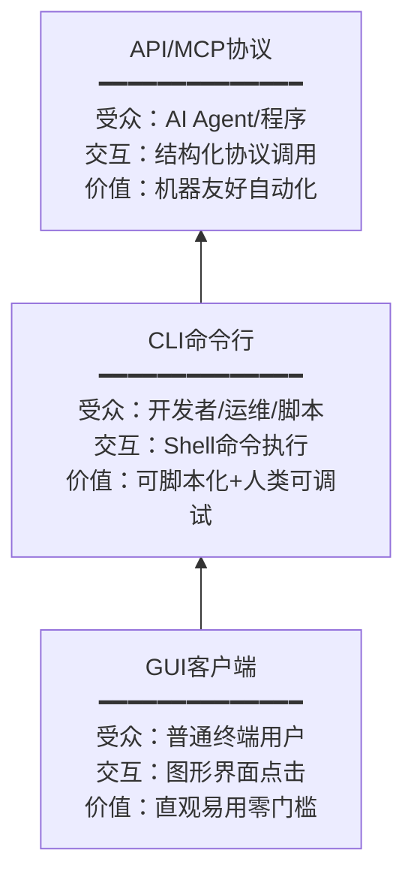

> **来源**：从向日葵AI产品矩阵（MCP+CLI+GUI）复盘萃取，经向日葵远程控制产品验证

# 三层能力开放体系模式（Three-Layer Capability Openness Pattern）

## 模式类型

架构模式（平台产品能力分层架构）

## 成熟度

L1 首次萃取（向日葵AI产品矩阵验证）

## 适用场景

构建平台型产品，需要同时服务多类受众：
- SaaS产品需要同时服务终端用户、开发者、AI Agent
- 开发者工具/API平台需要构建完整生态
- 远程控制/运维类产品需要覆盖GUI用户、脚本自动化、AI集成三种使用方式
- 提供开放能力的平台型产品

## 问题背景

很多工具厂商在能力开放上存在两个极端：
1. **只提供GUI**：普通用户体验好，但开发者无法集成、无法自动化、AI Agent无法调用
2. **只提供API**：开发者友好，但普通用户需要自己写代码才能使用，门槛高

缺少中间层导致的问题：
- 开发者需要用GUI做自动化测试（Selenium/Puppeteer等UI自动化方案脆弱且复杂）
- AI Agent无法获得结构化的工具调用接口，只能通过屏幕截图+视觉识别操作GUI
- API无法被人类直接调试（需要Postman/curl等工具，体验差）
- 调试API时缺少一个"人类可交互"的中间层

## 核心规则

三层能力开放体系通过构建"GUI→CLI→API/MCP"三层金字塔，每层基于相同的底层能力，向上封装为不同的交互范式，分层覆盖不同用户群。

**核心公式**：
```
三层能力开放 = GUI（图形界面，终端用户）⊕ CLI（命令行，开发者/脚本）⊕ API/MCP（协议接口，AI Agent/程序）
共享核心：所有层基于相同的底层能力/API
关键桥梁：CLI层是连接人类可调试性和机器可调用性的关键
```

### 三层架构



### 各层职责与特征

| 层级 | 受众 | 交互方式 | 核心价值 | 设计特征 |
|------|------|---------|---------|---------|
| **GUI层** | 普通终端用户 | 图形界面点击/拖拽 | 直观易用、零门槛、可视化反馈 | 面向人类认知优化，可视化操作，所见即所得 |
| **CLI层** | 开发者/运维/脚本 | Shell命令执行 | 可脚本化、人类可调试、SSH可用 | 遵循cli-as-api-design模式，多格式输出，可组合管道 |
| **API/MCP层** | AI Agent/程序集成 | 结构化协议调用 | 机器友好、可编排、自动化 | 遵循MCP/OpenAPI等标准协议，结构化输入输出 |

### 层间关系关键洞察

1. **CLI层的关键桥梁作用**：CLI不是"GUI的附属品"，而是连接API/MCP和GUI的关键桥梁
   - 对人类：CLI是"可敲命令调试的API"——开发者可以先用CLI验证API行为，再写代码
   - 对AI Agent：AI可以通过Shell调用CLI，间接获得完整能力（不需要等MCP支持）
   - 对脚本：CLI是最容易集成的接口（几乎所有语言都能执行shell命令）

2. **底层能力共享**：三层不是三套独立实现，而是同一套核心能力的三种封装
   - GUI调用CLI，CLI调用API（严格分层）
   - 或者三层共享同一个核心库，各自封装为不同交互范式

3. **缺失CLI层的代价**：如果只有GUI+API两层：
   - API调试必须用Postman等工具，无法像CLI那样直接在终端敲命令快速验证
   - CI/CD集成需要写HTTP请求代码，比直接调用CLI复杂
   - AI Agent要么直接调用MCP（需要专门支持），要么用视觉+操作GUI（脆弱）

## 反模式（应避免）

- ❌ 只提供GUI，不提供任何API/CLI（无法集成，无法自动化）
- ❌ 只提供API，不提供GUI和CLI（普通用户无法使用，调试困难）
- ❌ 三层各自独立实现（功能不一致，bug修了一层另一层还在）
- ❌ CLI只是GUI的命令行开关（不提供完整能力，缺少脚本友好设计）
- ❌ MCP/API与CLI能力不等价（有些功能CLI有但MCP没有，反之亦然）

## 与相关模式的关系

- **cli-as-api-design**：本模式的CLI层应遵循CLI即API设计模式
- **four-layer-ai-capability-architecture**：四层AI能力架构是更宏观的AI能力分层，本模式聚焦于"能力开放入口"的三层设计
- **vertical-saas-mcp-capability-exposure**：垂直SaaS的MCP能力暴露是本模式API/MCP层的具体实践

## 验证清单

- [ ] 三层都能访问完整核心能力（功能对等）
- [ ] GUI面向普通用户优化，零代码即可使用
- [ ] CLI遵循cli-as-api-design，支持多格式输出和脚本集成
- [ ] API/MCP提供标准化的结构化协议接口
- [ ] CLI可以作为API的"人类可调试接口"
- [ ] AI Agent可以通过MCP直接调用，也可以通过Shell调用CLI
- [ ] 三层共享底层实现，避免功能不一致
