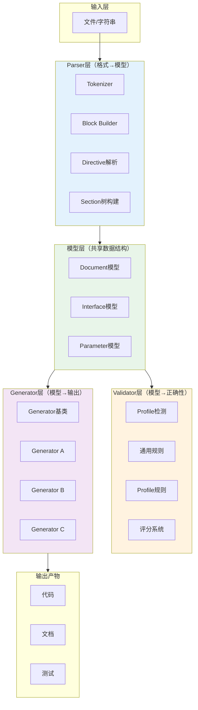

# 三层+Profile解析生成架构：Parser→Validator→Generator的IDL工具设计模式

## 模式概述
设计接口定义语言（IDL）或标记语言解析工具时，采用"解析→验证→生成"三层分离架构，并通过Profile机制支持多种文档变体。每层职责单一、独立演进，Profile作为横切关注点在各层插入特定逻辑，实现高内聚低耦合。

## 问题现象
构建Markdown/DSL解析器和代码生成器时，常见问题包括：
- 解析逻辑与验证逻辑耦合，新增一种文档类型需要修改核心解析器
- 生成器与解析器紧耦合，新增输出格式需要理解全部解析细节
- 缺少统一的模型层，各层之间传递原始字典/列表，缺乏类型约束
- 多种文档变体（如API文档/Skill文档/CLI文档）的差异处理散落在各处，用if-else拼凑

## 解决方案

**核心原则**：

1. **模型层居中**：所有层共享强类型数据模型（dataclass/pydantic），Parser输出模型、Validator消费模型、Generator消费模型，层间不传递原始数据结构
2. **Parser只负责格式→模型**：不做任何语义验证，只关心语法结构，输出"尽力解析"的结果（即使有问题也输出模型+问题列表）
3. **Validator独立于Parser和Generator**：接收模型做语义检查，按Profile组织规则集，输出验证报告（错误/警告/分数）
4. **Generator只消费模型**：不关心模型是如何解析出来的，通过基类定义统一接口，新增输出格式只需实现基类
5. **Profile是横切关注点**：在Parser层做特征检测、在Validator层注入规则集、在Generator层选择模板——通过Profile对象协调三层，而非在各处if-else

**MDI中的实际代码结构**：

| 层 | 文件 | 职责 |
|---|---|---|
| 模型层 | `models.py` | MDIDocument/Interface/Parameter/Response/ErrorCode dataclass |
| Parser层 | `parser.py` | markdown-it-py tokenizer→Block→Section树→模型 |
| Validator层 | `validator.py` + `profiles/*.py` | Profile检测+12项通用规则+Profile特定规则+评分 |
| Generator层 | `generators/base.py` + `generators/*_gen.py` | 9个生成器实现统一的generate()接口 |

## 适用场景

- 构建DSL/Markdown/YAML等标记语言的解析和代码生成工具
- 需要支持多种文档类型（Profile）的解析器
- 计划持续新增输出格式的代码生成器
- 需要验证层独立演进（规则增删不影响解析/生成）

## 实际案例

**MDI项目**：
- Parser层独立：新增`{command}` directive支持CLI文档时，只修改parser.py，不影响validator和generator
- Validator层独立：新增clitool profile规则时，只修改profiles/cli.py和validator.py
- Generator层独立：新增versioning.py模块（diff功能）时，直接复用Parser输出的MDIDocument模型，不需要修改三层中的任何一层
- 新增9种输出格式（Python/TS/OpenAPI/MCP/Markdown/CLI/pytest/Jest/文档），每个generator独立文件，不影响其他层

## 反模式

1. **Parser中嵌入验证逻辑**：在解析阶段就判断"这个参数类型不合法"并抛出异常，导致无法"尽力解析"获取部分结果
2. **Generator直接访问原始token**：生成器回溯到Parser的token流获取信息，导致Parser数据结构变更时所有Generator都要改
3. **if-else处理Profile**：在Parser/Validator/Generator各处用`if profile == "webapi"`分支处理差异，而非Profile对象封装
4. **层间传递字典**：不使用强类型模型，层间传递dict导致字段名拼写错误无法被类型检查捕获

## 与其他模式的关系

- 与**渐进式披露三层架构（progressive-disclosure-architecture）**互补：三层+Profile是代码层面的分层实现，渐进式披露是文档/能力层面的分层策略
- 被**示例驱动测试生成（example-driven-test-generation）**模式使用：测试生成器作为Generator层的一个实现
- 被**结构化文档diff（structured-doc-diff-semver）**模式使用：diff工具消费Parser输出的模型

## 边界与选型

- 不适用于简单配置文件解析（如单个JSON/YAML配置读取），直接用标准库即可
- 当输出格式只有1-2种且不会新增时，可以简化Generator层不需要基类抽象
- 当文档类型只有1种时，Profile机制可以省略，直接在Validator中硬编码规则
