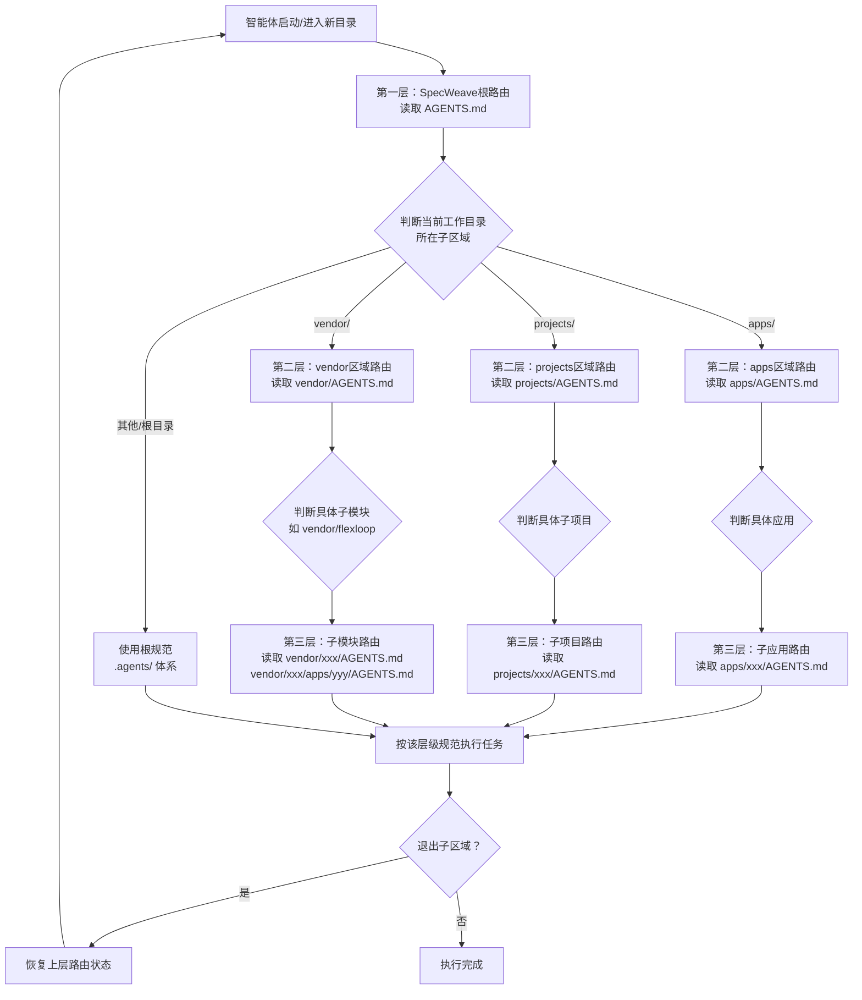

# 三层路由协议（Three-Layer Routing Protocol）

## 模式类型
架构模式（路由设计/上下文管理/嵌套结构）

## 成熟度
L3 可复用级（已在四区域路由体系建立任务中验证，可直接复用）

## 问题陈述

多层嵌套的工作区结构面临路由困境：

| 痛点 | 硬编码条件分支 | 数据驱动三层路由 |
|------|---------------|-----------------|
| 新增区域 | O(N)改动：修改N处if-else | O(1)改动：路由表加一行 |
| 架构对称性 | 容易遗漏某个区域 | 所有区域一视同仁 |
| 判断顺序 | 隐含优先级，容易出错 | 固定顺序遍历，可预测 |
| 可维护性 | 分支越多越难理解 | 路由表就是活文档 |
| 可审计性 | 逻辑散落在代码/文档中 | 路由表单一事实来源 |

**典型失败场景**：
1. 启动协议只判断 `if (in vendor/)`，在 `apps/` 或 `projects/` 下工作时无法正确路由
2. 新增第五个顶层目录时，忘记更新启动协议的判断逻辑
3. 不同智能体对路由顺序的理解不一致，导致行为差异

## 解决方案

建立统一的三层路由判断流程，从声明式路由表数据中派生路由逻辑，而非硬编码条件分支。



### 三层路由定义

| 层级 | 位置 | 职责 | 核心内容 |
|------|------|------|----------|
| **第一层：根路由** | 项目根目录 `AGENTS.md` | 判断工作目录所在子区域，分发到对应区域入口 | 启动协议、四大区域对比表、子区域路由判断逻辑 |
| **第二层：区域路由** | `<region>/AGENTS.md` | 区域边界声明、子模块路由表、跨子模块调用规范 | 区域性质说明、子模块路由表、边界声明、默认规范指引 |
| **第三层：子模块路由** | `<region>/<submodule>/AGENTS.md` | 该子模块的完整规范体系入口 | （可选）roles/rules/workflows/skills 等完整规范 |

### 数据驱动路由表设计

**第一层（根）路由表示例**：
```markdown
| 目录 | 用途 | 管理方式 | 版本控制 | 是否可直接修改 | AGENTS.md入口 |
|---|---|---|---|---|---|
| `.agents/` | AI 智能体规范容器 | 主权区直接维护 | 直接纳入版本控制 | ✅ 可修改 | [.agents/README.md](.agents/README.md) |
| `apps/` | 主仓库内置应用开发工作空间 | 同仓库直接管理 | 直接纳入版本控制 | ✅ 可修改 | [apps/AGENTS.md](apps/AGENTS.md) |
| `projects/` | 第一方自有子项目 | git submodule 管理 | 通过 gitlink 追踪 | ❌ 不可直接修改 | [projects/AGENTS.md](projects/AGENTS.md) |
| `vendor/` | 第三方依赖 | git submodule 管理 | 通过 gitlink 追踪 | ❌ 禁止本地修改 | [vendor/AGENTS.md](vendor/AGENTS.md) |
```

**第二层（区域）路由表示例**（以 apps/ 为例）：
```markdown
| 应用 | AGENTS.md 入口 | .agents/ | 说明 |
|------|---------------|:---:|------|
| docker-ssh-dind | [docker-ssh-dind/AGENTS.md](docker-ssh-dind/AGENTS.md) | ✅ 有 | Docker SSH DinD环境 |
| zhujian-wudao | [zhujian-wudao/AGENTS.md](zhujian-wudao/AGENTS.md) | ✅ 有 | 竹简悟道——道家哲学AI洞察项目 |
| ai-code-assistant | —（遵循根规范） | ❌ 无 | AI代码助手Web应用 |
| ... | ... | ... | ... |
```

### 路由判断核心规则

1. **遍历顺序固定**：按 `apps → projects → vendor` 顺序检查，顺序本身就是约定的一部分
2. **最长前缀匹配**：优先匹配更深层的路由（如在 `vendor/flexloop/apps/chaos/` 下，匹配到 vendor→flexloop→chaos 第三层，而非停在 vendor 层）
3. **状态恢复**：退出子区域后必须恢复上层路由状态，避免路由状态污染
4. **默认行为**：如果子模块没有自己的 AGENTS.md，默认遵循上一层规范（不是报错）
5. **单一事实来源**：路由判断逻辑只从路由表数据派生，不硬编码任何特定区域的名称

### 启动协议中的路由判断实现

```markdown
> **步骤 2.1**（子区域嵌套·条件触发）：按以下顺序判断工作目录所在区域，进入对应区域的 AGENTS.md 路由体系，遵循"嵌套优先"规则；退出子区域后恢复 SpecWeave 路由：
>   - 若在 `apps/` 内 → 读取 [apps/AGENTS.md](apps/AGENTS.md)（应用区入口路由），再按其「应用路由表」进入对应应用
>   - 若在 `projects/` 内 → 读取 [projects/AGENTS.md](projects/AGENTS.md)（第一方子项目入口路由），再按其「子项目路由表」进入对应子项目
>   - 若在 `vendor/` 内 → 读取 [vendor/AGENTS.md](vendor/AGENTS.md)（第三方依赖入口路由），再按其「子模块路由表」进入对应子模块
>   - 三层路由体系：SpecWeave（主权区）→ 子区域（apps/projects/vendor）→ 子应用/子项目/子模块
```

## 适用场景

| 场景 | 适用度 | 说明 |
|------|--------|------|
| 多层嵌套monorepo工作区 | 核心场景 | 本次验证场景（apps/projects/vendor三区域），完美匹配 |
| AI智能体上下文路由 | 核心场景 | 智能体根据CWD动态切换规范上下文 |
| Git submodule + 主仓库混合结构 | 核心场景 | 区分可直接修改目录和submodule目录 |
| 插件/扩展系统架构 | 推荐 | 插件注册表驱动的加载机制 |
| 多环境配置管理 | 适用 | dev/staging/prod多环境路由 |
| 微服务文档体系 | 适用 | 服务→模块→组件三层文档路由 |
| 单目录扁平项目 | 不适用 | 简单项目不需要三层路由 |

## 反模式警示

| 错误做法 | 后果 | 正确做法 |
|---------|------|---------|
| `if (vendor) { ... } else if (projects) { ... }` 硬编码 | 新增apps时忘记加else if，路由失效 | 遍历固定顺序的路由表，每个区域一视同仁 |
| 有的区域有AGENTS.md，有的没有 | 架构不对称，智能体无法预测入口位置 | 所有区域必须有最小AGENTS.md入口（参见对称目录结构模式） |
| 子区域判断后不保存上层状态 | 退出子区域后无法恢复根路由 | 显式记录路由栈，退出时逐层恢复 |
| 路由表只在README里，不在启动协议中 | 智能体不知道要读路由表 | 启动协议明确说明路由表位置和判断顺序 |
| 子模块没有AGENTS.md时报错 | 简单子模块被强制要求建立完整规范 | 默认遵循上一层规范，AGENTS.md是可选增强 |
| 在多个地方维护路由信息 | 多处不同步，有的更新有的没更新 | 路由表是单一事实来源，其他位置引用它 |

## 实现检查清单

实现三层路由时，逐项确认：

- [ ] 根 AGENTS.md 是否包含统一的子区域判断步骤（步骤2.1）？
- [ ] 每个子区域（apps/projects/vendor）是否都有自己的 AGENTS.md？
- [ ] 每个区域 AGENTS.md 是否包含子模块路由表？
- [ ] 路由判断顺序是否固定且文档化？
- [ ] 退出子区域后是否有状态恢复机制说明？
- [ ] 没有自己 AGENTS.md 的子模块是否有默认规范说明？
- [ ] 顶层对比表是否清晰标注各区域"是否可直接修改"？
- [ ] context-routing.md 是否已注册所有区域入口？

## 验证来源

- **验证1：四区域路由体系建立任务（2026-07-24）**：重构根AGENTS.md启动协议，从仅覆盖vendor扩展为apps/projects/vendor全覆盖；新建apps/AGENTS.md补齐结构对称性；通过64项检查点验证
- **验证2：vendor flexloop嵌套路由**：vendor→flexloop→apps/chaos多层嵌套路由已稳定运行，为三层路由协议提供了实践基础

## 关联资源

- 关联模式：[triple-entry-design.md](triple-entry-design.md)（三层入口设计）
- 关联模式：[symmetric-directory-structure.md](../methodology-patterns/governance-strategy/symmetric-directory-structure.md)（对称目录结构设计）
- 关联模式：[entry-comparison-table.md](../methodology-patterns/document-architecture/entry-comparison-table.md)（入口对比表模式）
- 关联模式：[cascade-update-topology.md](cascade-update-topology.md)（级联更新拓扑）
- 验证来源：[retrospective-establish-four-region-routing-system-20260724](../../reports/project-governance/documentation-governance/retrospective-establish-four-region-routing-system-20260724/README.md)（复盘报告）
