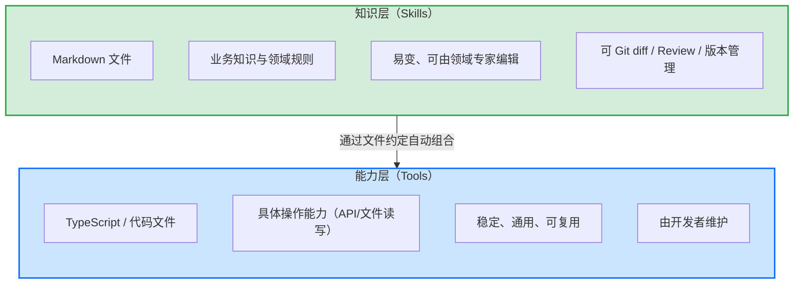

> **提炼自**：[insight-extraction.md#洞察2](../../reports/competitive-analysis/retrospective-eve-framework-learning-20260704/insight-extraction.md#洞察2) —— Vercel Eve 前端 Agent 框架学习复盘（工具与 Skill 职责分离）

# 工具与 Skill 职责分离（Tool-Skill Separation: "能做什么" vs "知道什么"）

## 模式类型

架构模式（Agent 架构设计/知识管理系统/能力与知识分层）

## 成熟度

L1 实验性（Vercel Eve 框架设计验证，单案例待更多场景验证）

## 适用场景

设计 Agent 系统、工具库、知识管理系统的架构时，需要区分"能力"与"知识"两类资产。典型场景：
- Agent 框架设计：如何组织工具（能力）与 Skill（知识/规则）
- 软件架构中"能力层"与"知识层"的分离设计
- 知识管理系统：区分"稳定通用能力"与"易变业务知识"
- 任何需要让"变化频率不同的东西以不同节奏演进"的系统设计

## 问题背景

传统 Agent 框架将知识硬编码在工具实现或 Prompt 中，导致一系列问题：

1. **知识更新需要改代码、重新部署**：业务知识变更频繁，每次都要改工具实现并部署。
2. **领域专家无法直接编辑知识**：知识写死在代码里，必须懂编程才能改。
3. **知识无法 Git diff、Review、版本管理**：硬编码在代码中的知识无法独立追踪变更。
4. **工具复用性差**：工具绑定特定业务知识，无法跨场景复用。

Vercel Eve 采用 Tools（TypeScript 文件，实现具体操作能力）与 Skills（Markdown 文件，承载业务知识与领域规则）分离的设计，明确"工具管能做什么，Skill 管知道什么"。

## 核心思想

**这是"能力与知识分离"架构原则在 Agent 领域的具象化**，与软件工程中"代码与配置分离""逻辑与数据分离""机制与策略分离"是同一个思想的不同应用。深层价值是：**让变化频率不同的东西以不同的节奏演进**——工具作为稳定的能力基座缓慢迭代，业务知识作为易变的上层建筑快速迭代。

### 能力层与知识层对比

| 维度 | Tools（能力层） | Skills（知识层） |
|------|----------------|-----------------|
| 载体 | 代码文件（TypeScript） | Markdown 文件 |
| 职责 | 能做什么（API 调用、文件读写） | 知道什么（业务知识、领域规则） |
| 变化频率 | 慢（稳定基座） | 快（易变上层建筑） |
| 维护者 | 开发者 | 领域专家（可直接编辑 Markdown） |
| 版本管理 | 代码托管 | 可 Git diff / Review / 版本管理 |
| 复用性 | 高（通用、跨场景） | 场景相关（绑定业务） |

## 架构设计原则

### 原则1：能力与知识分离

将"能力"（稳定、通用、可复用）与"知识"（易变、业务相关）分离，避免知识硬编码在工具实现或 Prompt 中。

### 原则2：变化频率隔离

让变化频率不同的东西以不同节奏演进：工具缓慢迭代，业务知识快速迭代，互不阻塞。

### 原则3：低门槛知识编辑

知识层用 Markdown 等人类可读格式表达，让领域专家可直接编辑，无需懂编程。

### 原则4：自动组合，零胶水代码

能力层与知识层通过文件约定自动组合，无需胶水代码，降低维护成本。

## 实施检查清单

设计 Agent/知识系统时对照检查：

- [ ] 是否区分了"能力"与"知识"两类资产？
- [ ] 能力层是否稳定、通用、可复用，由开发者维护？
- [ ] 知识层是否易变、业务相关，可由领域专家直接编辑？
- [ ] 知识是否可 Git diff / Review / 版本管理？
- [ ] 能力层与知识层是否通过文件约定自动组合，无胶水代码？

## 反模式（不要这么做）

- ❌ **反模式1：知识硬编码在工具中**：工具实现绑定特定业务知识，知识更新需改代码部署，工具无法复用。
- ❌ **反模式2：知识硬编码在 Prompt 中**：知识写在 Prompt 里，无法版本管理、无法让领域专家编辑。
- ❌ **反模式3：能力与知识混在一起**：没有分离，稳定能力与易变知识耦合，任一方变更都影响整体。

## 检验标准

做完之后怎么知道做对了？

- 标准1：业务知识更新无需改代码、无需重新部署（领域专家直接编辑）
- 标准2：知识可 Git diff / Review / 版本管理
- 标准3：工具可跨场景复用，不绑定特定业务知识
- 标准4：能力层与知识层自动组合，无胶水代码

## 迁移示例

这个模式还能用在什么其他场景？

- **场景1（通用软件架构）**：代码与配置分离、逻辑与数据分离、机制与策略分离——所有"变化频率隔离"的架构设计
- **场景2（知识管理系统设计）**：区分"稳定通用能力"与"易变业务知识"，让知识库快速演进而不影响核心系统
- **场景3（跨领域类比）**：餐厅的"厨房设备（能力）"与"菜单（知识）"分离——设备稳定可复用，菜单可随时由主厨调整，互不阻塞

## 与现有模式的关系

| 相关模式 | 关系 | 说明 |
|---------|------|------|
| [metadata-layering.md](metadata-layering.md) | 思想同源 | 元数据分层（核心内联+复杂外置）与"能力/知识分离"同属"变化频率隔离"思想 |
| [skill-three-part-structure.md](../code-patterns/skill-three-part-structure.md) | 互补 | Skill 三分结构（SKILL/references/scripts）是"知识层"内部的组织方式，本模式定义"能力层与知识层"的宏观分离 |
| [skill-five-elements-model.md](../methodology-patterns/ai-collaboration/skill-five-elements-model.md) | 互补 | Skill 五要素模型定义 Skill 自身结构，本模式定义 Skill（知识）与 Tool（能力）在 Agent 系统中的边界 |