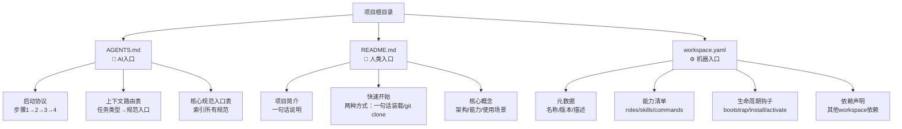

# 三层入口设计模式（Triple-Entry Design Pattern）

## 模式类型
架构模式（入口设计/关注点分离）

## 成熟度
L2 验证级（2次验证：SpecWeave AGENTS.md/README.md/workspace.yaml体系 + Task 0协议定义）

## 问题陈述

项目入口设计面临三类受众的不同需求：

| 受众 | 核心需求 | 典型交互方式 |
|------|---------|-------------|
| **AI智能体** | 需要明确的启动协议、上下文路由表、规范入口、安全规则 | 读取文件→按协议自举→执行任务 |
| **人类开发者** | 需要快速开始、安装说明、核心概念、使用示例 | 浏览文档→复制命令→开始使用 |
| **CLI/机器工具** | 需要结构化元数据、依赖声明、能力清单、钩子配置 | 解析manifest→验证→执行生命周期操作 |

如果用单一入口文件（如README.md）试图同时满足三类受众：
- AI需要的启动协议会干扰人类阅读体验
- 人类需要的教程示例对机器解析是噪音
- 机器需要的结构化数据散落在自然语言中难以提取
- 任何一类受众的需求变更都可能影响其他受众

## 解决方案

在项目根目录放置三个独立的入口文件，各司其职，通过目录结构约定协同工作：



### 三层入口职责矩阵

| 入口文件 | 面向受众 | 核心内容 | 风格特征 | 解析方式 |
|---------|---------|---------|---------|---------|
| **AGENTS.md** | AI智能体 | 启动协议、上下文路由表、规范入口索引、快速开始提示词 | 结构化Markdown+明确的步骤指令+表格索引 | 按启动协议顺序读取 |
| **README.md** | 人类开发者 | 项目简介、快速开始、核心概念、使用示例 | 友好的自然语言+代码示例+截图 | 人类浏览阅读 |
| **workspace.yaml** | CLI/机器工具 | 元数据、能力声明、依赖、钩子、Schema验证 | YAML结构化数据+JSON Schema验证 | YAML解析器读取 |

### 入口间关系

1. **互不重复**：每个文件只包含目标受众需要的内容，其他入口的信息不重复
2. **互相引用**：必要时通过相对链接引用（AGENTS.md引用README.md快速开始章节、README.md引用AGENTS.md了解AI协作）
3. **协同自举**：AI通过AGENTS.md发现workspace.yaml解析能力清单；人类通过README.md了解项目后可能触发AI自举；CLI通过workspace.yaml发现AGENTS.md位置

### AGENTS.md最小可行子集（AI入口）

必须包含的核心区块：
1. **启动协议**（优先级最高）：明确的步骤指令，引导AI读取必要规范
2. **上下文路由表**：任务类型→必读规范的映射
3. **核心规范入口表**：所有规范入口的索引表格
4. **快速开始**（可选但推荐）：一句话装载提示词嵌入

### workspace.yaml核心字段（机器入口）

```yaml
schema_version: "1.0.0"
id: "workspace-unique-id"
name: "Workspace名称"
version: "1.0.0"
description: "一句话描述"
entry:
  agents_md: "./AGENTS.md"
  readme: "./README.md"
roles: []      # 角色清单
skills: []     # 技能清单
commands: []   # 指令集清单
hooks: {}      # 生命周期钩子
dependencies: [] # 依赖的其他workspace
```

## 适用场景

| 场景 | 适用度 | 说明 |
|------|--------|------|
| AI协作型开源项目 | 核心场景 | 需要AI智能体零安装自举协作 |
| Agent Workspace Hub工作区 | 核心场景 | 本次验证场景，完美匹配 |
| 需要CLI工具管理的项目 | 核心场景 | 需要结构化manifest进行生命周期管理 |
| 普通开源项目 | 推荐 | 即使不深度使用AI协作，AGENTS.md作为AI入口也能降低协作门槛 |
| 内部私有项目 | 适用 | AI入口可以帮助新成员快速理解项目结构 |
| 单文件脚本/小工具 | 不适用 | 过于复杂，单一README足够 |

## 反模式警示

| 错误做法 | 后果 | 正确做法 |
|---------|------|---------|
| 在README.md中混入AI启动协议 | 人类开发者看到长篇协议指令困惑，AI从自然语言提取协议不稳定 | AI协议放入AGENTS.md，README只保留人类需要的信息 |
| 在AGENTS.md中重复README的安装教程 | 冗余维护，两边容易不同步 | AGENTS.md引用README的快速开始章节，不重复 |
| workspace.yaml中嵌入自然语言文档 | 机器解析困难，失去结构化优势 | workspace.yaml只放结构化数据，文档用Markdown |
| 三个入口互相依赖形成循环 | AI/人/工具都无法从任一入口开始 | 每个入口都能独立完成基础自举，交叉引用是可选增强 |
| 只有AGENTS.md没有workspace.yaml | CLI工具无法自动化管理 | 需要机器操作的场景必须提供workspace.yaml |

## 与内容-入口-索引三位一体模式的关系

本模式是 content-entry-index-trinity（内容-入口-索引三位一体）在多受众场景下的特化：
- AGENTS.md = AI受众的入口
- README.md = 人类受众的入口
- workspace.yaml = 机器受众的入口+索引

当项目只有单一受众时，使用通用的三位一体模式即可；当项目需要同时服务三类受众时，使用本三层入口模式。

## 验证来源

- **验证1：SpecWeave项目本身**：AGENTS.md（AI入口，含启动协议/路由表/规范入口）+ README.md（人类入口，含快速开始/核心概念）+ .agents/体系（workspace.yaml待实现），自举运行稳定
- **验证2：Task 0协议定义**（2026-07-13）：工作区发现协议明确定义AGENTS.md为AI入口、workspace.yaml为Source Workspace标识，三层入口设计成为协议标准

## 关联资源

- 关联模式：[content-entry-index-trinity.md](../methodology-patterns/document-architecture/content-entry-index-trinity.md)（通用入口-内容-索引模式）
- 关联模式：[five-layer-document-architecture.md](five-layer-document-architecture.md)（五层文档架构）
- 关联模式：[spec-discoverability-guarantee.md](../methodology-patterns/governance-strategy/spec-discoverability-guarantee.md)（规范可发现性保证）
- 验证来源：[2026-07-13-task0-workspace-protocols.md](../../2026-07-13-task0-workspace-protocols.md)（复盘报告）
